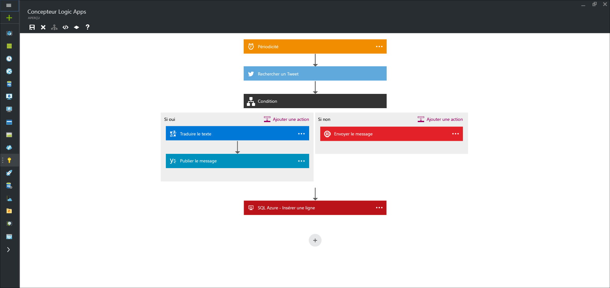

<properties 
	pageTitle="Qu'est-ce qu'une application logique ?" 
	description="En savoir plus sur les applications logiques App Service" 
	authors="kevinlam1" 
	manager="dwrede" 
	editor="" 
	services="app-service\logic" 
	documentationCenter=""/>

<tags
	ms.service="logic-apps"
	ms.workload="na"
	ms.tgt_pltfrm="na"
	ms.devlang="na"
	ms.topic="hero-article" 
	ms.date="07/12/2016"
	ms.author="klam"/>

#Qu'est-ce qu'une application logique ?

Logic Apps offre un moyen de simplifier et d’implémenter des intégrations et des workflows évolutifs dans le cloud. Son concepteur visuel modélise et automatise votre processus sous la forme d’une série d’étapes appelée workflow. De [nombreux connecteurs](../connectors/apis-list.md) sont disponibles dans le cloud et sur site pour accélérer l’intégration dans différents services et protocoles. Une application logique commence par un déclencheur (tel que « Lorsqu’un compte est ajouté à Dynamics CRM »), et après le déclenchement, peut initialiser de nombreuses actions de combinaison, des conversions et une logique de condition.

Les avantages de Logic Apps sont les suivants :

- Gain de temps en créant des processus complexes à l’aide d’outils de conception faciles à comprendre
- Implémentation transparente de modèles et de workflows qui seraient sans cela difficiles à mettre en œuvre dans le code
- Mise en route rapide à partir de modèles
- Personnalisation de votre application logique avec vos propres API, lignes de code et actions personnalisées
- Connexion et synchronisation de systèmes disparates sur site et dans le cloud
- Exploitation du serveur BizTalk, de Gestion des API, d’Azure Functions et d’Azure Service Bus avec la prise en charge d’une intégration de premier plan

Logic Apps est une fonctionnalité iPaaS (integration platform as a service) entièrement gérée, qui évite aux développeurs l’obligation d’assurer l’hébergement, l’évolutivité, la disponibilité et la gestion. Logic Apps monte en puissance automatiquement pour répondre à la demande.

Comme indiqué, Logic Apps vous permet d’automatiser vos processus métier. Voici quelques exemples :
 
* Déplacement de fichiers chargés sur un serveur FTP dans Azure Storage
* Traitement et routage de commandes sur différents systèmes locaux et systèmes cloud
* Surveillance de tous les tweets sur un sujet donné, analyse du sentiment et création d’alertes et de tâches pour les éléments nécessitant un suivi

Ces types de scénarios peuvent être configurés à partir du concepteur visuel, sans la moindre ligne de code. Commencez dès maintenant à [générer votre application logique][create]. Une fois écrite, une application logique peut être [rapidement déployée et reconfigurée](app-service-logic-create-deploy-template.md) dans plusieurs environnements et régions.

## Pourquoi des applications logiques ?

Logic Apps confère rapidité et évolutivité à l’espace d’intégration d’entreprise. Grâce à la facilité d’utilisation du concepteur, à la diversité des déclencheurs et des actions disponibles, ainsi qu’à la puissance des outils de gestion, la centralisation de vos API constitue désormais un jeu d’enfant. À mesure que les entreprises évoluent vers la numérisation, Logic Apps vous permet de connecter des systèmes hérités à des systèmes à la pointe de la technologie.

En outre, avec notre [compte d’intégration d’entreprise][biztalk], vous pouvez évoluer vers des scénarios d’intégration matures grâce à la puissance d’une [messagerie XML][xml], la [gestion des partenaires commerciaux][tpm], etc.

- **Outils de conception faciles à utiliser** : Logic Apps peut être conçu de bout en bout dans le navigateur ou avec les outils Visual Studio. Commencez par un déclencheur, par exemple un simple calendrier ou l’apparition d’un problème GitHub. Ensuite, orchestrez des actions à l'aide de la galerie de connecteurs enrichie.

- **Simplicité de connexion des API** : même les tâches de composition qui sont faciles à décrire sont difficiles à implémenter dans le code. Logic Apps facilite la connexion de systèmes disparates. Vous souhaitez connecter votre solution de marketing cloud à votre système de facturation local ? Vous souhaitez centraliser la messagerie de l’ensemble des API et des systèmes avec un bus de services d’entreprise ? Les applications logiques constituent le moyen le plus rapide et le plus fiable de fournir des solutions à ces problèmes.

- **Prise en main rapide à partir de modèles** : pour vous aider à démarrer, nous vous proposons une [galerie de modèles][templates] qui vous permettent de créer rapidement des solutions courantes. De la connectivité SaaS simple aux solutions B2B les plus sophistiquées, en passant par certains modèles uniquement conçus pour s’amuser, la galerie est le moyen le plus rapide de découvrir toute la puissance de Logic Apps.

- **Extensibilité intégrée** : vous ne trouvez pas le connecteur dont vous avez besoin ? Logic Apps est conçu pour fonctionner avec vos propres API et chaînes de code ; vous pouvez facilement créer votre propre application API à utiliser en tant que connecteur personnalisé, ou appeler une [fonction Azure](https://functions.azure.com) pour exécuter des extraits de code à la demande.

- **Une réelle puissance d’intégration** : commencez en douceur et évoluez selon vos besoins. Les applications logiques peuvent facilement exploiter toute la puissance de BizTalk, solution d'intégration Microsoft bien connue, pour permettre aux professionnels de l'intégration de créer les solutions dont ils ont besoin. Apprenez-en davantage sur [Enterprise Integration Pack](./app-service-logic-enterprise-integration-overview.md).

## Concepts d'application logique

Voici quelques-uns des éléments clés qui composent l'expérience d'application logique.

- **Flux de travail** : les applications logiques offrent un moyen graphique de modéliser vos processus d’entreprise sous la forme d’une série d’étapes ou d’un flux de travail.
- **Connecteurs gérés** : vos applications logiques ont besoin d’un accès aux données et aux services. Les connecteurs gérés sont créés pour vous aider à vous connecter à des données et à les utiliser. Consultez la liste des connecteurs disponibles dans l’article répertoriant les [connecteurs gérés][managedapis].
- **Déclencheurs** : certains connecteurs gérés peuvent également se comporter comme des déclencheurs. Un déclencheur démarre une nouvelle instance d'un flux de travail suite à un événement spécifique, comme l'arrivée d'un message électronique ou une modification de votre compte Azure Storage.
-  **Actions** : chaque étape après le déclencheur dans un flux de travail est appelée une action. Chaque action correspond généralement à une opération sur votre connecteur géré ou vos applications API personnalisées.
- **Enterprise Integration Pack** : pour les scénarios d’intégration plus élaborés, Logic Apps intègre des fonctionnalités de BizTalk. BizTalk est la plateforme d’intégration de Microsoft, leader sur le marché. Les connecteurs Enterprise Integration Pack vous permettent d’inclure facilement la validation, la transformation et bien plus encore dans vos flux de travail d’application logique.

## Mise en route  

- Pour vous familiariser avec les applications logiques, effectuez le didacticiel [Créer une application logique][create].
- [Afficher des exemples et des scénarios courants](app-service-logic-examples-and-scenarios.md)
- [Logic Apps vous permet d’automatiser vos processus métiers](http://channel9.msdn.com/Events/Build/2016/T694)
- [Apprenez à intégrer vos systèmes avec Logic Apps](http://channel9.msdn.com/Events/Build/2016/P462)

[biztalk]: app-service-logic-enterprise-integration-accounts.md
[appservice]: ../app-service/app-service-value-prop-what-is.md
[create]: app-service-logic-create-a-logic-app.md
[managedapis]: ../connectors/apis-list.md
[tpm]: app-service-logic-enterprise-integration-accounts.md
[xml]: app-service-logic-enterprise-integration-b2b.md
[templates]: app-service-logic-use-logic-app-templates.md

<!---HONumber=AcomDC_0727_2016-->