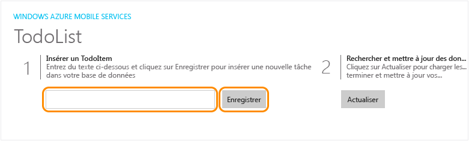
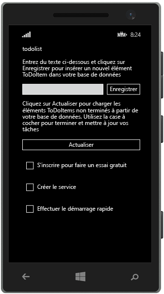

<properties
	pageTitle="Créer une application universelle Windows Runtime 8.1 sur Azure App Service Mobile Apps | Microsoft Azure"
	description="Suivez ce didacticiel pour commencer à utiliser des backends d'applications mobiles Azure pour le développement d'applications Windows Store en C#, Visual Basic ou JavaScript."
	services="app-service\mobile"
	documentationCenter="windows"
	authors="ggailey777"
	manager="dwrede"
	editor=""/>

<tags
	ms.service="app-service-mobile"
	ms.workload="mobile"
	ms.tgt_pltfrm="mobile-windows"
	ms.devlang="dotnet"
	ms.topic="hero-article"
	ms.date="08/14/2015"
	ms.author="glenga"/>

#Créer une application Windows

[AZURE.INCLUDE [app-service-mobile-selector-get-started-preview](../../includes/app-service-mobile-selector-get-started-preview.md)]
&nbsp;  
[AZURE.INCLUDE [app-service-mobile-note-mobile-services-preview](../../includes/app-service-mobile-note-mobile-services-preview.md)]

##Vue d’ensemble

Ce didacticiel montre comment ajouter un backend cloud à une application universelle Windows Runtime 8.1 à l'aide d'un backend d'applications mobiles Azure. Les solutions d'application Windows universelles incluent des projets pour Windows Store 8.1 et Windows Phone Store 8.1, en plus d'un projet partagé commun.

[AZURE.INCLUDE [app-service-mobile-windows-universal-get-started-preview](../../includes/app-service-mobile-windows-universal-get-started-preview.md)]

##Composants requis

Pour réaliser ce didacticiel, vous avez besoin des éléments suivants :

* Un compte Azure actif. Si vous n'avez pas de compte, vous pouvez vous inscrire pour une évaluation d'Azure et obtenir jusqu'à 10 applications mobiles gratuites que vous pourrez conserver après l'expiration de votre période d'évaluation. Pour plus d'informations, consultez la page [Version d'évaluation gratuite d'Azure](http://azure.microsoft.com/pricing/free-trial/).

* [Visual Studio Community 2013] ou version ultérieure.

>[AZURE.NOTE]Si vous souhaitez commencer à utiliser Azure App Service avant d’ouvrir un compte Azure, accédez à [Essayer App Service](http://go.microsoft.com/fwlink/?LinkId=523751&appServiceName=mobile). Là, vous pouvez créer immédiatement une application de départ temporaire dans App Service. Aucune carte de crédit n’est requise ni aucun engagement.

##Créer un serveur principal d'applications mobiles Azure

[AZURE.INCLUDE [app-service-mobile-dotnet-backend-create-new-service-preview](../../includes/app-service-mobile-dotnet-backend-create-new-service-preview.md)]

## Télécharger le projet de serveur

1. Dans le [portail Azure], cliquez sur **Parcourir tout** > **Web Apps**, puis cliquez sur le backend Mobile App que vous venez de créer.

2. Dans le backend Mobile App, cliquez sur **Tous les paramètres**, puis sous **Mobile App** cliquez sur **Démarrage rapide** > **Windows (C#)**.

3. Sous **Télécharger et exécuter votre projet de serveur** dans **Création d'une application**, cliquez sur **Télécharger**, extrayez les fichiers du projet compressés sur votre ordinateur local et ouvrez la solution dans Visual Studio.

4. Développez le projet pour restaurer les packages NuGet.

##Publier le projet de serveur sur Azure

[AZURE.INCLUDE [app-service-mobile-dotnet-backend-publish-service-preview](../../includes/app-service-mobile-dotnet-backend-publish-service-preview.md)]

##Télécharger et exécuter le projet client

Une fois que vous avez créé votre backend d'application mobile, vous pouvez suivre un Démarrage rapide facile dans le portail Azure pour créer une application ou modifier une application existante à connecter à votre backend d'application mobile.

Dans cette section, vous téléchargez un projet de modèle d’application Windows universelle, personnalisé pour se connecter à votre backend Azure Mobile App.

1. Revenez dans le panneau de votre backend Mobile App, cliquez sur **Tous les paramètres**, puis sous **Mobile App** cliquez sur **Démarrage rapide** > **Windows (C#)**.

2.  Sous **Télécharger et exécuter votre projet Windows** dans **Création d'une application**, cliquez sur **Télécharger**, et extrayez les fichiers du projet compressés sur votre ordinateur local.

3. (Facultatif) Ajoutez le projet d'application Windows universelle à la solution avec le projet de serveur. Cela rend plus facile le débogage et les tests de l'application et du backend dans la même solution Visual Studio, si vous choisissez de le faire.

4. Une fois l’application Windows Store définie comme projet de démarrage, appuyez sur la touche F5 pour régénérer le projet et démarrer l’application Windows Store.

5. Dans l'application, tapez un texte explicite, comme *Suivre le didacticiel*, dans la zone de texte **Insérer un TodoItem**, puis cliquez sur **Enregistrer**.

	

	Ceci envoie une demande POST vers le nouveau backend d'application mobile qui est hébergé dans Azure.

6. Arrêtez le débogage, cliquez avec le bouton droit sur le projet `<your app name>.WindowsPhone`, cliquez sur **Définir comme projet de démarrage**, puis appuyez de nouveau sur F5.

	

	Notez que les données enregistrées à l’étape précédente sont chargées à partir de l’application mobile après le démarrage de l’application Windows.

##Étapes suivantes

* [Ajouter l'authentification à votre application](app-service-mobile-dotnet-backend-windows-store-dotnet-get-started-users-preview.md)  Découvrez comment authentifier les utilisateurs de votre application avec un fournisseur d'identité.

* [Ajouter les notifications push à votre application](app-service-mobile-dotnet-backend-windows-store-dotnet-get-started-push-preview.md)  En savoir plus sur l’envoi d’une notification Push très basique à votre application.

<!-- Anchors. -->
<!-- Images. -->
<!-- URLs. -->
[Get started with authentication]: app-service-mobile-dotnet-backend-windows-store-dotnet-get-started-users-preview.md
[Mobile App SDK]: http://go.microsoft.com/fwlink/?LinkId=257545
[portail Azure]: https://portal.azure.com/
[Visual Studio Community 2013]: https://go.microsoft.com/fwLink/p/?LinkID=534203

<!-----HONumber=Oct15_HO3-->