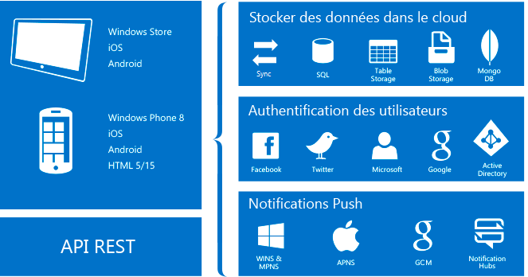

<properties
	pageTitle="Que sont les applications Mobile Apps ?"
	description="Découvrez les avantages qu'App Service apporte à vos applications mobiles d'entreprise."
	services="app-service\mobile"
	documentationCenter=""
	authors="adrianhall"
	manager="dwrede"
	editor=""/>

<tags
	ms.service="app-service-mobile"
	ms.workload="na"
	ms.tgt_pltfrm="mobile-multiple"
	ms.devlang="na"
	ms.topic="hero-article"
	ms.date="05/03/2016"
	ms.author="glennga"/>

# Qu’est ce que la fonctionnalité Mobile Apps ?

Azure App Service est une offre [PaaS (Platform as a Service)](https://azure.microsoft.com/overview/what-is-paas/) entièrement gérée, destinée aux développeurs professionnels, qui permet de bénéficier d’un ensemble complet de fonctionnalités pour les scénarios web, mobiles et d’intégration. La fonctionnalité *Mobile Apps* dans *Azure App Service* offre une plateforme de développement d’applications mobiles hautement évolutive pour les développeurs d’entreprise et les intégrateurs système. Disponible pour tous, elle fournit un ensemble complet de fonctionnalités pour les développeurs d’applications mobiles.

##Pourquoi Mobile Apps ?
La fonctionnalité *Mobile Apps* dans *Azure App Service* offre une plateforme de développement d’applications mobiles hautement évolutive pour les développeurs d’entreprise et les intégrateurs système. Disponible pour tous, elle fournit un ensemble complet de fonctionnalités pour les développeurs d’applications mobiles. Mobile Apps vous permet d'effectuer les opérations suivantes :

- **Générer des applications natives et multiplateformes** : que vous génériez des applications natives iOS, Android et Windows ou des applications multiplateformes Xamarin ou Cordova (Phonegap), vous pouvez tirer parti d'App Service à l'aide de Kits de développement logiciel (SDK) natifs.
- **Se connecter aux systèmes de votre entreprise** : la fonctionnalité Applications mobiles vous permet d'ajouter une authentification d'entreprise en quelques minutes et de vous connecter à vos ressources locales et cloud de votre entreprise.
- **Créer des applications disponibles hors connexion avec la synchronisation des données** : augmentez la productivité de votre personnel mobile en créant des applications qui fonctionnent hors connexion et qui utilisent la fonctionnalité Applications mobiles pour synchroniser les données en arrière-plan quand la connexion est établie avec l’une de vos sources de données d’entreprise ou API SaaS.
- **Notifications push pour des millions de personnes en quelques secondes** : fidélisez vos clients en leur envoyant en temps opportun des notifications push instantanées, adaptées à leurs besoins, sur n'importe quel appareil.

## Fonctionnalités Mobile Apps
Les fonctions qui suivent sont importantes pour le développement mobile Cloud :

- **Authentification et autorisation** : bénéficiez d’une liste toujours plus longue de fournisseurs d’identité, dont Azure Active Directory pour l’authentification d’entreprise, et de fournisseurs de médias sociaux tels que Facebook, Google, Twitter et le compte Microsoft. Azure Mobile Apps fournit un service OAuth 2.0 pour chaque fournisseur. Vous pouvez également intégrer le kit de développement logiciel du fournisseur d’identité pour la fonctionnalité spécifique du fournisseur.

  Apprenez-en davantage sur nos [fonctionnalités d’authentification].

- **Accès aux données** : Azure Mobile Apps offre une source de données OData v3 compatible avec les mobiles liée à SQL Azure ou à un serveur SQL Server local. Ce service peut être développé à partir d’Entity Framework, ce qui vous permet de l’intégrer facilement à d’autres fournisseurs de données NoSQL et SQL, et notamment [Stockage de tables Azure], MongoDB, [DocumentDB] et fournisseurs d’API SaaS comme Office 365 et Salesforce.com.
- **Synchronisation hors connexion** : nos Kits de développement logiciel (SDK) clients facilitent la création d’applications mobiles solides et réactives qui fonctionnent avec un ensemble de données hors connexion pouvant être automatiquement synchronisé avec les données de serveur principal, et notamment la prise en charge de la résolution des conflits.

  Apprenez-en davantage sur nos [fonctionnalités de données].

- **Notifications Push** : nos Kits de développement logiciel (SDK) clients s’intègrent de façon transparente aux fonctionnalités d’inscription d’Azure Notification Hubs, ce qui vous permet d’envoyer des notifications Push à des millions d’utilisateurs simultanément.

  Apprenez-en davantage sur nos [fonctionnalités de notification Push].

- **Kits de développement logiciel clients** : nous fournissons un ensemble complet de Kits de développement logiciel clients qui concernent le développement natif ([iOS], [Android] et [Windows]), le développement multiplateforme ([Xamarin pour iOS et Android], [Formulaires Xamarin]) et développement d’application hybride ([Apache Cordova]). Chaque kit de développement logiciel client est disponible avec une licence MIT et open source.

## Fonctionnalités d’Azure App Service
Les fonctionnalités suivantes de la plate-forme sont généralement utiles aux sites de production mobile.

- **Mise à l'échelle automatique** : App Service vous permet d'augmenter rapidement la taille ou le nombre de vos machines virtuelles pour vous adapter à n'importe quelle charge cliente entrante. Sélectionnez manuellement le nombre et la taille des machines virtuelles, ou configurez la mise à l'échelle automatique pour dimensionner votre backend d'application mobile en fonction de la charge ou d'une planification.

  Apprenez-en davantage sur la [mise à l’échelle automatique].

- **Environnements intermédiaires** : App Service peut exécuter plusieurs versions de votre site, ce qui vous permet d’effectuer des tests A/B, de procéder à des tests en production dans le cadre d’un plan DevOps plus étendu et d’effectuer la préproduction sur place d’un nouveau serveur principal.

  Apprenez-en davantage sur les [environnements intermédiaires].

- **Déploiement continu** : App Service peut s’intégrer aux systèmes SCM courants, ce qui vous permet de déployer automatiquement une nouvelle version de votre serveur principal en le transférant vers une branche de votre système SCM.

  Apprenez-en davantage sur les [options de déploiement].

- **Mise en réseau virtuelle** : App Service peut se connecter à des ressources sur site à l’aide de connexions réseau virtuel, ExpressRoute ou hybrides.

  Apprenez-en davantage sur les [connexions hybrides], [les réseaux virtuels] et [ExpressRoute].

- **Environnements isolés/dédiés** : App Service peut être exécuté dans un environnement totalement isolé et dédié pour exécuter en toute sécurité des applications Azure App Service à grande échelle. Cela est idéal pour des charges de travail nécessitant un accès à très grande échelle, isolé ou avec réseau sécurisé.

  Apprenez-en davantage sur les [environnements App Service].

## Mise en route ##
Pour prendre en main la fonctionnalité Applications mobiles, suivez le didacticiel [Prise en main]. Ceci permet de couvrir les notions de base de la création d’un serveur principal mobile et le client de votre choix, puis d’intégrer l’authentification, la synchronisation hors connexion et des notifications push. Vous pouvez suivre le didacticiel [Prise en main] plusieurs fois : une fois pour chaque application cliente.

Pour plus d’informations sur Azure Mobile Apps, voir notre [parcours d’apprentissage]. Pour plus d’informations sur la plateforme Azure App Service, voir [Azure App Service].

>[AZURE.NOTE] Si vous voulez vous familiariser avec Azure App Service avant d’ouvrir un compte Azure, accédez à la page [Essayer App Service](https://tryappservice.azure.com/?appServiceName=mobile), où vous pourrez créer immédiatement une application web temporaire dans App Service. Aucune carte de crédit n’est requise ; vous ne prenez aucun engagement.

<!-- URLs. -->
[Migrate your Mobile Service to App Service]: app-service-mobile-migrating-from-mobile-services.md
[Azure App Service]: ../app-service/app-service-value-prop-what-is.md
[Prise en main]: app-service-mobile-ios-get-started.md
[Stockage de tables Azure]: ../storage/storage-getting-started-guide.md
[DocumentDB]: ../documentdb/documentdb-get-started.md
[fonctionnalités d’authentification]: ./app-service-mobile-auth.md
[fonctionnalités de données]: ./app-service-mobile-offline-data-sync.md
[fonctionnalités de notification Push]: ../notification-hubs/notification-hubs-push-notification-overview.md
[iOS]: ./app-service-mobile-ios-how-to-use-client-library.md
[Android]: ./app-service-mobile-android-how-to-use-client-library.md
[Windows]: ./app-service-mobile-dotnet-how-to-use-client-library.md
[Xamarin pour iOS et Android]: ./app-service-mobile-dotnet-how-to-use-client-library.md
[Formulaires Xamarin]: ./app-service-mobile-xamarin-forms-get-started.md
[Apache Cordova]: ./app-service-mobile-cordova-how-to-use-client-library.md
[mise à l’échelle automatique]: ../app-service-web/web-sites-scale.md
[environnements intermédiaires]: ../app-service-web/web-sites-staged-publishing.md
[options de déploiement]: ../app-service-web/web-sites-deploy.md
[connexions hybrides]: ../app-service-web/web-sites-hybrid-connection-get-started.md
[les réseaux virtuels]: ../app-service-web/web-sites-integrate-with-vnet.md
[ExpressRoute]: ../app-service/app-service-app-service-environment-network-configuration-expressroute.md
[environnements App Service]: ../app-service-web/app-service-app-service-environment-intro.md
[parcours d’apprentissage]: https://azure.microsoft.com/documentation/learning-paths/appservice-mobileapps/

<!---HONumber=AcomDC_0921_2016-->