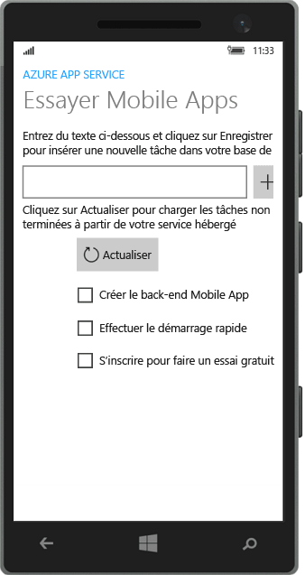

<properties
	pageTitle="Créer une application de plateforme Windows universelle (UWP) sur Azure App Service Mobile Apps | Microsoft Azure"
	description="Suivez ce didacticiel pour commencer à utiliser des services principaux d’applications mobiles Azure pour le développement d’applications UWP en C#, Visual Basic ou JavaScript."
	services="app-service\mobile"
	documentationCenter="windows"
	authors="ggailey777"
	manager="erikre"
	editor=""/>

<tags
	ms.service="app-service-mobile"
	ms.workload="mobile"
	ms.tgt_pltfrm="mobile-windows"
	ms.devlang="dotnet"
	ms.topic="hero-article"
	ms.date="05/03/2016"
	ms.author="glenga"/>

#Créer une application Windows

[AZURE.INCLUDE [app-service-mobile-selector-get-started](../../includes/app-service-mobile-selector-get-started.md)]

##Vue d'ensemble

Ce didacticiel présente l’ajout d’un service principal cloud à une application de plateforme Windows universelle (UWP). Pour plus d’informations, consultez [Que sont les applications Mobile Apps ?](app-service-mobile-value-prop.md). Voici les captures d’écran générées à partir de l’application terminée :

 En cours d’exécution sur un ordinateur de bureau.

 En cours d’exécution sur un téléphone

Vous devez suivre ce didacticiel avant de pouvoir suivre les autres didacticiels Mobile App pour les applications UWP.

##Composants requis

Pour réaliser ce didacticiel, vous avez besoin des éléments suivants :

* Un compte Azure actif. Si vous n'avez pas de compte, vous pouvez vous inscrire pour une évaluation d'Azure et obtenir jusqu'à 10 applications mobiles gratuites que vous pourrez conserver après l'expiration de votre période d'évaluation. Pour plus d'informations, consultez la page [Version d'évaluation gratuite d'Azure](https://azure.microsoft.com/pricing/free-trial/).

* [Visual Studio Community 2015] ou version ultérieure.

>[AZURE.NOTE] Si vous souhaitez commencer à utiliser Azure App Service avant d’ouvrir un compte Azure, accédez à [Essayer App Service](https://tryappservice.azure.com/?appServiceName=mobile). Là, vous pouvez créer immédiatement une application de départ temporaire dans App Service. Aucune carte de crédit n’est requise ni aucun engagement.

##Créer un serveur principal d'applications mobiles Azure

Suivez ces étapes pour créer un serveur principal d’application mobile.

[AZURE.INCLUDE [app-service-mobile-dotnet-backend-create-new-service](../../includes/app-service-mobile-dotnet-backend-create-new-service.md)]

Vous avez maintenant configuré un serveur principal d’application mobile Azure qui peut être utilisé par vos applications clientes mobiles. Vous allez ensuite télécharger un projet de serveur pour un serveur principal « todo list » simple et le publier dans Azure.

## Configurer le projet de serveur

[AZURE.INCLUDE [app-service-mobile-Configure-New-backend.md](../../includes/app-service-mobile-configure-new-backend.md)]

##Télécharger et exécuter le projet client

Une fois que vous avez configuré le serveur principal de votre application Mobile App, vous pouvez créer une application cliente ou modifier une application existante pour se connecter à Azure. Dans cette section, vous téléchargez un projet de modèle d’application UWP, personnalisé pour se connecter à votre serveur principal Mobile App.

1. De retour dans le panneau **Démarrage rapide** pour votre serveur principal Mobile App, cliquez sur **Créer une application** > **Télécharger**, puis extrayez les fichiers de projet compressés sur votre ordinateur local.

	

3. (Facultatif) Ajoutez le projet d’application UWP à la solution avec le projet de serveur. Cela rend plus facile le débogage et les tests de l'application et du backend dans la même solution Visual Studio, si vous choisissez de le faire. Pour ajouter un projet d’application UWP à la solution, vous devez utiliser Visual Studio 2015 ou une version ultérieure.

4. Avec l’application UWP comme projet de démarrage, appuyez sur la touche F5 pour déployer et exécuter l’application.

5. Dans l’application, tapez un texte explicite, comme *Suivre le didacticiel*, dans la zone de texte **Insérer un TodoItem**, puis cliquez sur **Enregistrer**.

	

	Ceci envoie une demande POST vers le nouveau backend d'application mobile qui est hébergé dans Azure.

6. (Facultatif) Arrêtez l’application et redémarrez-la sur un autre périphérique ou un émulateur mobile.

	

	Notez que les données enregistrées à l’étape précédente sont chargées à partir d’Azure après le démarrage de l’application UWP.

##Étapes suivantes

* [Ajouter l’authentification à votre application](app-service-mobile-windows-store-dotnet-get-started-users.md) Découvrez comment authentifier les utilisateurs de votre application avec un fournisseur d’identité.

* [Ajouter des notifications Push à votre application Android](app-service-mobile-windows-store-dotnet-get-started-push.md) Apprenez à ajouter la prise en charge des notifications Push à votre application et à configurer le serveur principal d’applications mobiles pour utiliser Azure Notification Hubs afin d’envoyer des notifications Push.

* [Activation de la synchronisation hors connexion pour votre application Windows](app-service-mobile-windows-store-dotnet-get-started-offline-data.md) Apprenez à ajouter une prise en charge hors connexion à votre application à l'aide d'un backend d'application mobile. La synchronisation hors connexion permet aux utilisateurs finaux d'interagir avec une application mobile pour afficher, ajouter ou modifier des données, même lorsqu'il n'existe aucune connexion réseau.

<!-- Anchors. -->
<!-- Images. -->
<!-- URLs. -->
[Mobile App SDK]: http://go.microsoft.com/fwlink/?LinkId=257545
[Azure portal]: https://portal.azure.com/
[Visual Studio Community 2015]: https://go.microsoft.com/fwLink/p/?LinkID=534203

<!-----HONumber=AcomDC_0525_2016-->