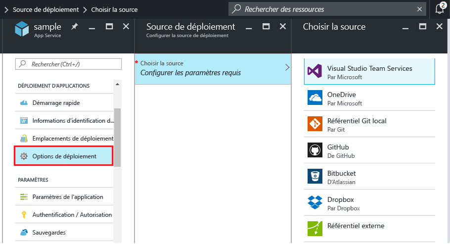
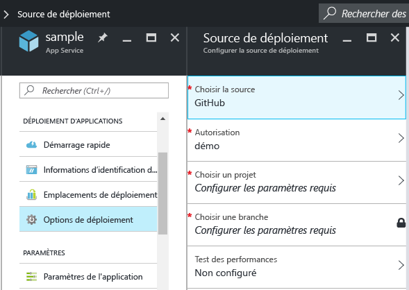
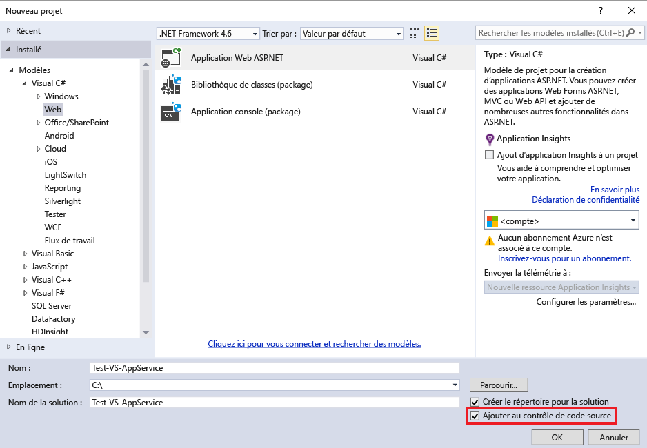
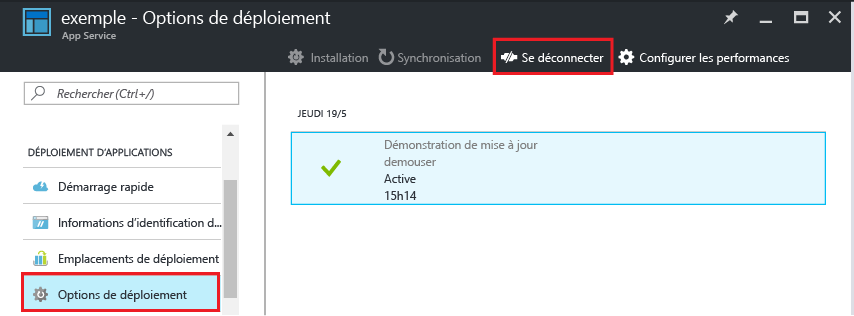

<properties
	pageTitle="Déploiement continu vers Azure App Service"
	description="Découvrez comment activer le déploiement continu vers Azure App Service"
	services="app-service"
	documentationCenter=""
	authors="dariagrigoriu"
	manager="wpickett"
	editor="mollybos"/>

<tags
	ms.service="app-service"
	ms.workload="na"
	ms.tgt_pltfrm="na"
	ms.devlang="na"
	ms.topic="article"
	ms.date="07/23/2016"
	ms.author="dariagrigoriu"/>
    
# Déploiement continu vers Azure App Service

Ce didacticiel vous montre comment configurer un flux de travail de déploiement continu pour votre application [Azure App Service]. L’intégration d’App Service à BitBucket, GitHub et Visual Studio Team Services (VSTS) permet un workflow de déploiement continu au cours duquel Azure extrait les mises à jour les plus récentes de votre projet publié sur l’un de ces services. Le déploiement continu est une option intéressante pour les projets auxquels plusieurs contributions fréquentes sont intégrées.

## Activer le déploiement continu

Pour activer le déploiement continu,

1. Publiez le contenu de votre application dans le référentiel qui sera utilisé pour le déploiement continu. Pour plus d’informations sur la publication de votre projet sur ces services, consultez [Création d’un référentiel (GitHub)], [Création d’un référentiel (BitBucket)] et [Prise en main de VSTS].

2. Dans le [portail Azure], dans le panneau de votre application, cliquez sur **Paramètres > Source du déploiement**. Cliquez sur **Choisir une source**, puis sur **GitHub** par exemple.

	
	
    > [AZURE.NOTE] Pour configurer un compte VSTS pour un déploiement App Service, consultez ce [didacticiel](https://github.com/projectkudu/kudu/wiki/Setting-up-a-VSTS-account-so-it-can-deploy-to-a-Web-App).
    
3. Effectuez le workflow d’autorisation.

4. Dans le panneau **Source du déploiement**, sélectionnez le projet et la branche à partir desquels effectuer le déploiement. Quand vous avez terminé, cliquez sur **OK**.
  
	

	> [AZURE.NOTE] Lors de l’activation du déploiement continu avec GitHub ou BitBucket, les projets publics et privés sont tous deux affichés.

    App Service crée une association avec le référentiel sélectionné, extrait les fichiers à partir de la branche spécifiée et conserve un clone de votre référentiel pour votre application App Service. Quand vous configurez le déploiement continu VSTS à partir du portail Azure, l’intégration utilise le [moteur de déploiement Kudu](https://github.com/projectkudu/kudu/wiki) d’App Service, qui automatise les tâches de génération et de déploiement avec chaque `git push`. Il n’est pas nécessaire de configurer séparément le déploiement continu dans VSTS. À l’issue de cette procédure, la section **Déploiement** du panneau de votre application affiche le message **Déploiement actif** qui indique la réussite du déploiement.

5. Pour vérifier que l’application a bien été déployée, cliquez sur l**’URL** en haut du panneau de l’application dans le portail Azure.

6. Pour vérifier que le déploiement continu s’effectue à partir du référentiel de votre choix, envoyez une modification vers le référentiel par le biais d’une transmission de type push. Votre application doit se mettre à jour pour prendre en compte les modifications, peu de temps après la transmission de type push vers le référentiel. Vous pouvez vérifier que la mise à jour a été récupérée dans le panneau **Déploiements** de votre application.

## Déploiement continu avec une solution Visual Studio 

La transmission de type push d’une solution Visual Studio vers Azure App Service est aussi simple que celle d’un fichier index.html. Le processus de déploiement App Service simplifie tous les détails, notamment la restauration des dépendances NuGet et la génération des fichiers binaires de l’application. Vous pouvez suivre les meilleures pratiques de contrôle de code source pour la maintenance du code seulement dans votre référentiel Git et laisser le déploiement App Service s’occuper du reste.

Les étapes pour envoyer votre solution Visual Studio vers App Service sont les mêmes que celles de la [section précédente](#overview), à condition de configurer votre solution et votre référentiel de la façon suivante :

-	Utilisez l’option de contrôle de code source Visual Studio pour générer un fichier `.gitignore` comme dans l’image ci-dessous ou ajoutez manuellement un fichier `.gitignore` à la racine du référentiel avec un contenu similaire à cet [exemple .gitignore](https://github.com/github/gitignore/blob/master/VisualStudio.gitignore).

    
 
-	Ajoutez l’arborescence des répertoires de toute la solution à votre référentiel, avec le fichier .sln dans la racine du référentiel.

Une fois que vous avez configuré votre référentiel comme indiqué, ainsi que votre application dans Azure pour la publication en continu depuis l’un des référentiels Git en ligne, vous pouvez développer votre application ASP.NET localement dans Visual Studio et déployer en continu votre code, en envoyant les modifications apportées à votre référentiel Git en ligne par une transmission de type push.

## Désactiver le déploiement continu

Pour désactiver le déploiement continu :

1. Dans le [portail Azure], dans le panneau de votre application, cliquez sur **Paramètres > Source du déploiement**. Ensuite, cliquez sur **Déconnexion** dans le panneau **Déploiements**.

    

2. Après avoir répondu **Oui** au message de confirmation, vous pouvez revenir au panneau de votre application et cliquer sur **Paramètre > Source du déploiement** si vous voulez configurer la publication à partir d’une autre source.

## Ressources supplémentaires

* [How to investigate common issues with continuous deployment (Examen des problèmes courants liés au déploiement continu)](https://github.com/projectkudu/kudu/wiki/Investigating-continuous-deployment)
* [Comment utiliser PowerShell pour Azure]
* [Utilisation des outils en ligne de commande Azure pour Mac et Linux]
* [Documentation Git]
* [Project Kudu](https://github.com/projectkudu/kudu/wiki)

>[AZURE.NOTE] Si vous voulez vous familiariser avec Azure App Service avant d’ouvrir un compte Azure, accédez à la page [Essayer App Service](http://go.microsoft.com/fwlink/?LinkId=523751). Vous pourrez créer immédiatement et gratuitement une application de départ temporaire dans App Service. Aucune carte de crédit n’est requise ; vous ne prenez aucun engagement.

[Azure App Service]: https://azure.microsoft.com/fr-FR/documentation/articles/app-service-changes-existing-services/
[portail Azure]: https://portal.azure.com
[VSTS Portal]: https://www.visualstudio.com/fr-FR/products/visual-studio-team-services-vs.aspx
[Installing Git]: http://git-scm.com/book/en/Getting-Started-Installing-Git
[Comment utiliser PowerShell pour Azure]: ../articles/powershell-install-configure.md
[Utilisation des outils en ligne de commande Azure pour Mac et Linux]: ../articles/xplat-cli-install.md
[Documentation Git]: http://git-scm.com/documentation

[Création d’un référentiel (GitHub)]: https://help.github.com/articles/create-a-repo
[Création d’un référentiel (BitBucket)]: https://confluence.atlassian.com/display/BITBUCKET/Create+an+Account+and+a+Git+Repo
[Prise en main de VSTS]: https://www.visualstudio.com/get-started/overview-of-get-started-tasks-vs
[Continuous delivery to Azure using Visual Studio Team Services]: ../articles/cloud-services/cloud-services-continuous-delivery-use-vso.md

<!---HONumber=AcomDC_0803_2016-->