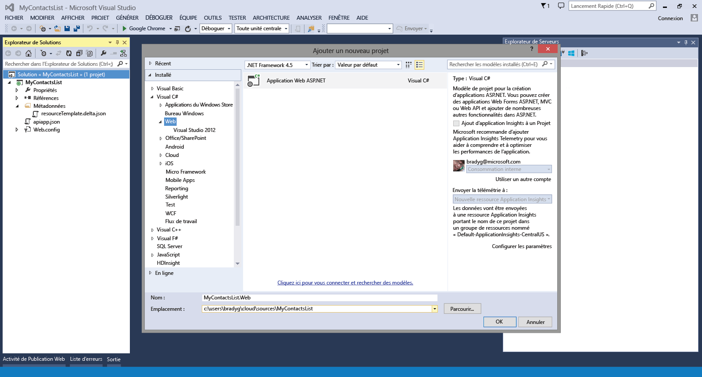
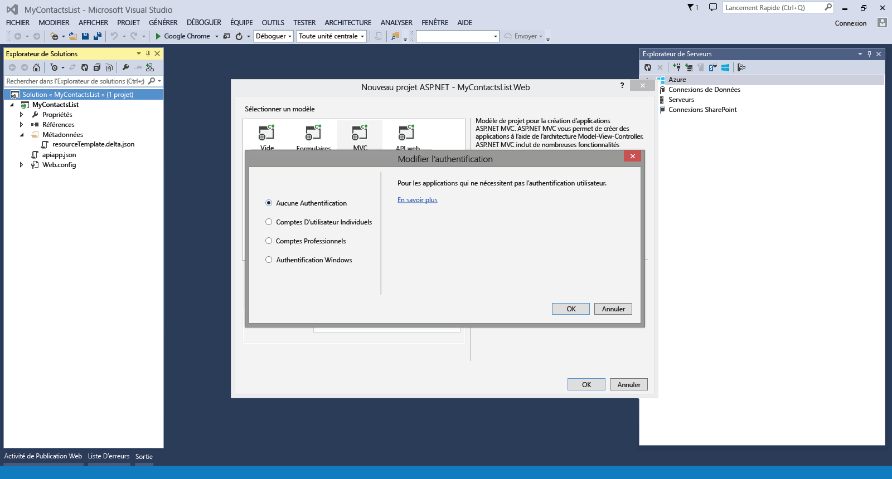
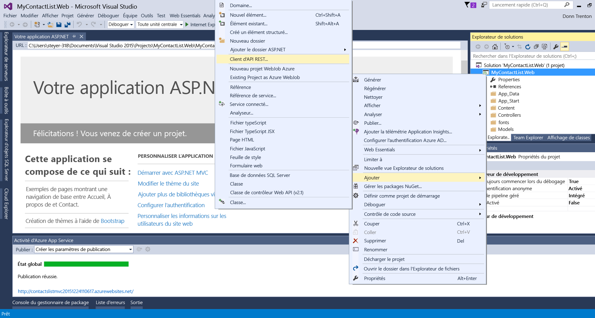
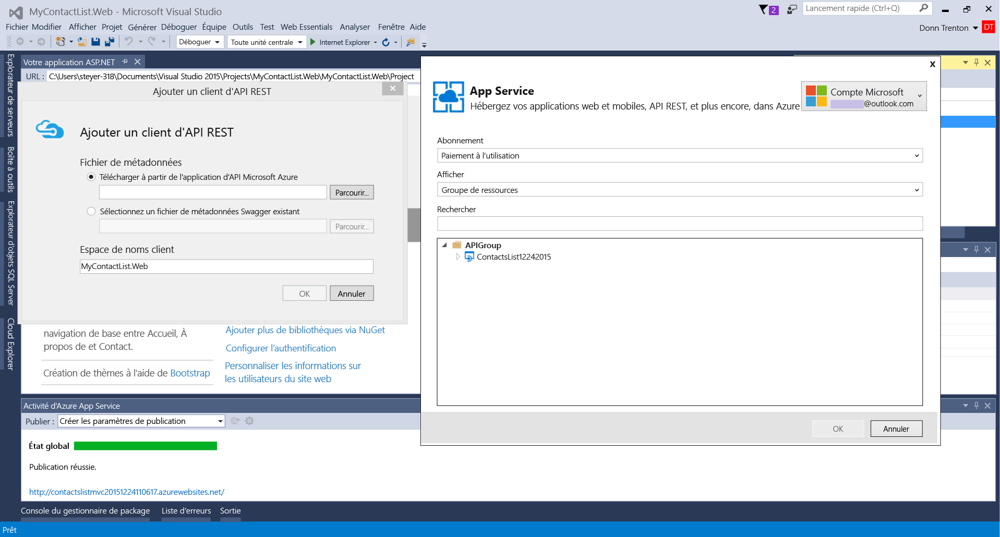
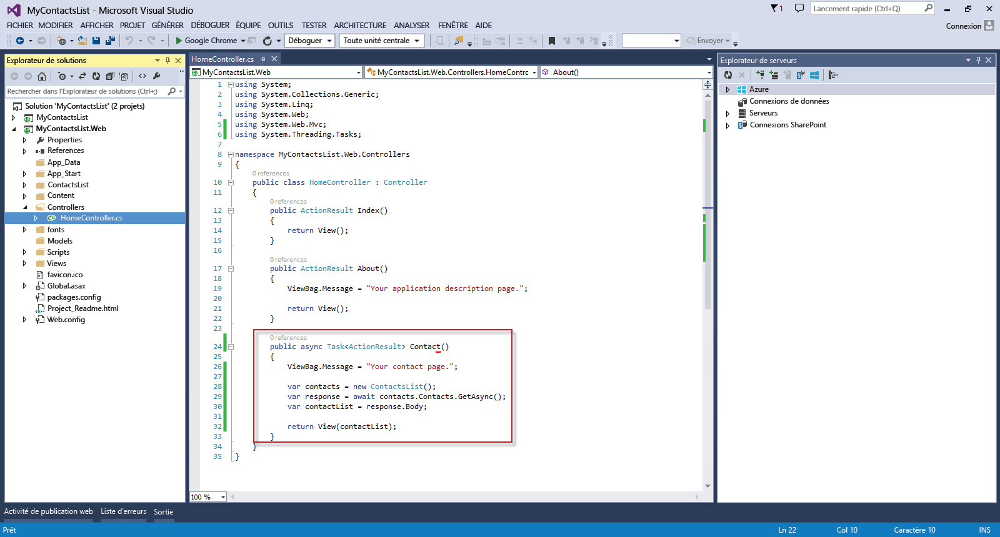
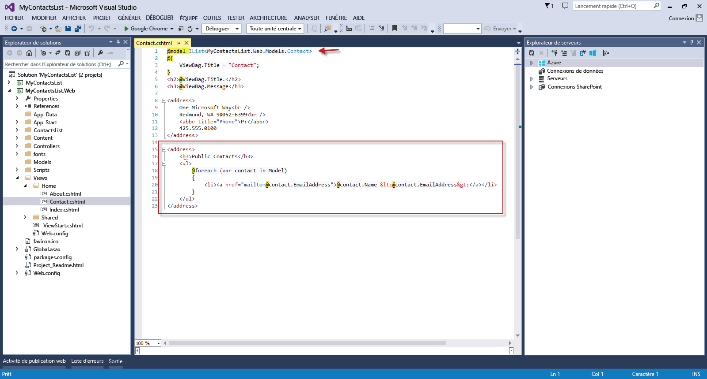

<properties 
	pageTitle="Connexion d’une application web à une application API dans Azure App Service" 
	description="Ce didacticiel montre comment utiliser une application API depuis une application web ASP.NET hébergée dans Azure App Service." 
	services="app-service" 
	documentationCenter=".net" 
	authors="syntaxc4" 
	manager="yochayk" 
	editor="jimbe"/>

<tags
	ms.service="app-service"
	ms.devlang="dotnet"
	ms.topic="article"
	ms.tgt_pltfrm="na"
	ms.workload="na" 
	ms.date="09/15/2015"
	ms.author="cfowler"/>

# Connexion d’une application web à une application API dans Azure App Service

Ce didacticiel montre comment utiliser une application API depuis une application web ASP.NET hébergée dans [App Service](../app-service.md).

## Configuration requise

Ce didacticiel s'appuie sur la série de didacticiels sur les applications API :

1. [Créer une application API Azure](../app-service-dotnet-create-api-app)
3. [Déployer une application API Azure](../app-service-dotnet-deploy-api-app)
4. [Déboguer une application API Azure](../app-service-dotnet-remotely-debug-api-app)

## Rendre l'application API accessible au public

Dans le [portail Azure en version préliminaire](http://go.microsoft.com/fwlink/?LinkId=529715), sélectionnez l’application API. Cliquez sur le bouton **Paramètres** dans la barre de commandes. Dans le panneau **Paramètres de l’application**, définissez **Niveau d’accès** sur **Public (anonyme)**.

## Créer une application ASP.NET MVC dans Visual Studio

1. Ouvrez Visual Studio. Dans la boîte de dialogue **Nouveau projet**, ajoutez une nouvelle **Application web ASP.NET**. Cliquez sur **OK**.

	

1. Sélectionnez le modèle **MVC**. Cliquez sur **Modifier l’authentification**. Sélectionnez **Aucune authentification**, puis cliquez deux fois sur **OK**.

	

1. Dans l’Explorateur de solutions, cliquez sur le projet d’application web que vous venez de créer, puis sélectionnez **Ajouter une référence d’application Azure**.

	

1. Dans la liste déroulante **Applications API existantes**, sélectionnez l’application API à laquelle vous voulez vous connecter.

	

	>[AZURE.NOTE]Le code client pour se connecter à l'application API sera automatiquement généré à partir d'un point de terminaison de l'API Swagger.

1. Pour utiliser le code d’API généré, ouvrez le fichier HomeController.cs, puis remplacez l’action `Contact` par les éléments suivants :

	    public async Task<ActionResult> Contact()
	    {
	        ViewBag.Message = "Your contact page.";
	
	        var contacts = new ContactsList();
	        var response = await contacts.Contacts.GetAsync();
	        var contactList = response.Body;
	
	        return View(contactList);
	    }

	

1. Mettez à jour la vue `Contact` pour refléter la liste dynamique de contacts à l'aide du code suivant :
	<pre>// Add to the very top of the view file
@model IList&lt;MyContactsList.Web.Models.Contact>

// Replace the default email addresses with the following
&lt;h3>Public Contacts&lt;/h3>
&lt;ul>
    @foreach (var contact in Model)
    {
        &lt;li>&lt;a href="mailto:@contact.EmailAddress">@contact.Name &amp;lt;@contact.EmailAddress&amp;gt;&lt;/a>&lt;/li>
    }
&lt;/ul> 
	</pre>

	

## Déployer l'application web vers Web Apps dans App Service

Suivez les instructions fournies dans [Comment déployer une application web Azure](web-sites-deploy.md).

>[AZURE.NOTE]Si vous voulez vous familiariser avec Azure App Service avant d’ouvrir un compte Azure, accédez à la page [Essayer App Service](http://go.microsoft.com/fwlink/?LinkId=523751). Vous pourrez créer immédiatement et gratuitement une application de départ temporaire dans App Service. Aucune carte de crédit n’est requise ; vous ne prenez aucun engagement.

## Changements apportés
* Pour obtenir un guide présentant les modifications apportées dans le cadre de la transition entre Sites Web et App Service, consultez la page [Azure App Service et les services Azure existants](http://go.microsoft.com/fwlink/?LinkId=529714).
* Pour obtenir un guide présentant les modifications apportées dans le cadre de la transition entre l’ancien et le nouveau portail, consultez : [Références sur la navigation dans le portail Azure](http://go.microsoft.com/fwlink/?LinkId=529715)
 

<!---HONumber=Oct15_HO1-->