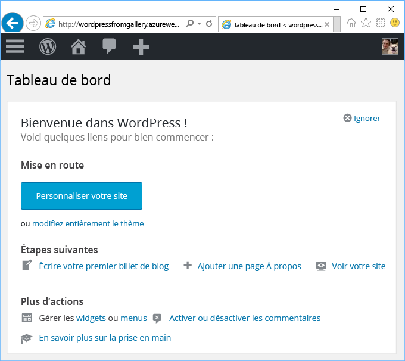

# Créer une application web à partir d’Azure Marketplace
<!-- Note: This article replaces web-sites-php-web-site-gallery.md -->

[!INCLUDE [tabs](../../includes/app-service-web-get-started-nav-tabs.md)]

Azure Marketplace offre une large gamme d’applications web populaires développées par des communautés de logiciels open source, par exemple WordPress et Umbraco CMS. Dans ce didacticiel, vous allez apprendre à créer une application WordPress à partir d’Azure Marketplace.
qui crée une application web Azure et une base de données MySQL. 

## Avant de commencer 

Si vous n’avez pas d’abonnement Azure, créez un [compte gratuit](https://azure.microsoft.com/free/?WT.mc_id=A261C142F) avant de commencer.

## Déployer à partir d’Azure Marketplace
Suivez les étapes ci-dessous pour déployer WordPress à partir d’Azure Marketplace.

### Connexion à Azure
Connectez-vous au [portail Azure](https://portal.azure.com).

### Déployer un modèle WordPress
Azure Marketplace fournit des modèles de configuration de ressources, configurez le modèle [WordPress](https://portal.azure.com/#create/WordPress.WordPress) pour commencer.
   
Entrez les informations suivantes pour déployer l’application WordPress et ses ressources.

  

| Champ         | Valeur suggérée           | Description  |
| ------------- |-------------------------|-------------|
| Nom de l'application      | mywordpressapp          | Entrez un nom d’application unique pour votre **nom d’application Web**. Ce nom sera utilisé en partie dans le nom DNS par défaut de votre application `<app_name>.azurewebsites.net` et doit donc être unique sur l’ensemble des applications dans Azure. Vous pouvez ultérieurement mapper un nom de domaine personnalisé vers votre application web avant de l’exposer à vos utilisateurs |
| Abonnement  | Pay-As-You-Go             | Sélectionnez un **Abonnement**. Si vous avez plusieurs abonnements, sélectionnez l’abonnement approprié. |
| Groupe de ressources| mywordpressappgroup                 |    Entrez un **groupe de ressources**. Un groupe de ressources est un conteneur logique dans lequel les ressources Azure comme les applications web, les bases de données, sont déployées et gérées. Vous pouvez créer un groupe de ressources ou utiliser un groupe existant |
| Plan App Service | myappplan          | Les plans App Service représentent la collection des ressources physiques utilisées pour héberger vos applications. Sélectionnez l’**Emplacement** et le **Niveau de tarification**. Pour plus d’informations sur la tarification, consultez [Niveau de tarification d’App Service](https://azure.microsoft.com/pricing/details/app-service/) |
| Base de données      | mywordpressapp          | Sélectionnez le fournisseur de base de données approprié pour MySQL. Web Apps prend en charge **ClearDB**, **Base de données Azure pour MySQL** et **MySQL dans l’application**. Pour plus d’informations, consultez la section [Configuration de la base de données](#database-config) ci-dessous. |
| Application Insights | ON ou OFF          | Cette étape est facultative. [Application Insights](https://azure.microsoft.com/en-us/services/application-insights/) fournit des services de surveillance de votre application web en cliquant sur **ON**.|

### Configuration de la base de données
Suivez les étapes ci-dessous en fonction de votre choix de fournisseur de base de données MySQL.  Il est recommandé que l’application web et la base de données MySQL se trouvent au même emplacement.

#### ClearDB 
[ClearDB](https://azuremarketplace.microsoft.com/en-us/marketplace/apps/SuccessBricksInc.ClearDBMySQLDatabase?tab=Overview) est une solution tierce pour un service MySQL entièrement intégré dans Azure. Pour utiliser des bases de données ClearDB, vous devez associer une carte de crédit à votre [compte Azure](http://account.windowsazure.com/subscriptions). Si vous avez sélectionné le fournisseur de base de données ClearDB, vous pouvez afficher une liste des bases de données existantes parmi lesquelles choisir ou cliquer sur **Créer** pour créer une base de données.

#### Base de données Azure pour MySQL (Version préliminaire)
[Base de données Azure pour MySQL](https://azure.microsoft.com/en-us/services/mysql) fournit un service de base de données managé pour le développement et le déploiement d’applications. Celui-ci vous permet de configurer une base de données MySQL en quelques minutes et de bénéficier d’une évolutivité immédiate sur le cloud dans lequel vous avez entièrement confiance. Avec des modèles de tarification tout compris, vous avez accès à toutes les fonctionnalités souhaitées, comme la haute disponibilité, la sécurité et la récupération, sans coût supplémentaire. Cliquez sur **Niveau de tarification** pour choisir un autre [niveau de tarification](https://azure.microsoft.com/pricing/details/mysql). Pour utiliser une base de données existante ou un serveur MySQL existant, utilisez un groupe de ressources existant dans lequel réside le serveur. 

> [!NOTE]
>  Base de données Azure pour MySQL (Version préliminaire) et l’application Web sur Linux (Version préliminaire) ne sont pas disponibles dans toutes les régions. Pour en savoir plus sur les limitations de [Base de données Azure pour MySQL (Version préliminaire)](https://docs.microsoft.com/en-us/azure/mysql) et de l’[application Web sur Linux](./app-service-linux-intro.md). 

#### MySQL dans l’application
[MySQL dans l’application](https://blogs.msdn.microsoft.com/appserviceteam/2017/03/06/announcing-general-availability-for-mysql-in-app) est une fonctionnalité d’App Service qui permet d’exécuter en mode natif MySql sur la plateforme. La fonction principale prise en charge avec la version de la fonctionnalité est la suivante :

- Exécution du serveur MySQL côte à côte sur la même instance que votre serveur web hébergeant le site. Les performances de votre application sont améliorées.
- Le stockage est partagé vos fichiers MySQL et d’application web. Notez qu’avec les plans Gratuit et Partagé, que pouvez atteindre nos limites de quota d’utilisation du site en fonction des actions que vous effectuez. Consultez les [limitations de quota](https://azure.microsoft.com/en-us/pricing/details/app-service/plans/) des plans Gratuit et Partagé.
- Vous pouvez activer la journalisation des requêtes lentes et la journalisation générale pour MySQL. Notez que ceci peut affecter les performances du site et ne doit PAS toujours être activé. La fonctionnalité de journalisation permet d’examiner les problèmes de l’application. 

Pour plus de détails, consultez cet [article](https://blogs.msdn.microsoft.com/appserviceteam/2016/08/18/announcing-mysql-in-app-preview-for-web-apps/ )

Vous pouvez surveiller la progression en cliquant sur l’icône en forme de cloche en haut de la page du portail pendant le déploiement de l’application WordPress.    

## Gérer votre nouvelle application web Azure

Accédez au portail Azure pour voir l’application web que vous venez de créer.

Pour ce faire, connectez-vous au portail : [https://portal.azure.com](https://portal.azure.com).

Dans le menu de gauche, cliquez sur **App Services**, puis cliquez sur le nom de votre application web Azure.

Vous accédez au _panneau_ de votre application web (une page du portail qui s’ouvre horizontalement).

Par défaut, le panneau de votre application web affiche la page **Présentation**. Cette page propose un aperçu de votre application. Ici, vous pouvez également effectuer des tâches de gestion de base (parcourir, arrêter, démarrer, redémarrer et supprimer des éléments, par exemple). Les onglets figurant sur le côté gauche du panneau affichent les différentes pages de configuration que vous pouvez ouvrir.

Ces onglets affichent les nombreuses fonctionnalités exceptionnelles que vous pouvez ajouter à votre application web. La liste suivante fournit quelques exemples des possibilités :

* Mapper un nom DNS personnalisé
* Lier un certificat SSL personnalisé
* Configurer le déploiement continu
* Montée en puissance et augmentation de la taille des instances
* Ajouter une authentification utilisateur

Suivez l’Assistant d’installation de WordPress de 5 minutes pour que l’application WordPress soit opérationnelle. Consultez la [documentation WordPress](https://codex.WordPress.org/) pour développer votre application web.

## Configuration de votre application 
Plusieurs étapes sont impliquées dans la gestion de votre application WordPress avant qu’elle soit prête à être utilisée en production. Procédez comme suit pour configurer et gérer votre application WordPress :

| Action à réaliser... | Élément à utiliser... |
| --- | --- |
| **Téléchargement ou stockage de fichiers volumineux** |[Plug-in WordPress pour l’utilisation du Stockage Blob](https://wordpress.org/plugins/windows-azure-storage/)|
| **Envoi d’e-mail** |Achat du service de messagerie [SendGrid](https://azuremarketplace.microsoft.com/en-us/marketplace/apps/SendGrid.SendGrid?tab=Overview) et utilisation du [plug-in WordPress pour l’utilisation de SendGrid](https://wordpress.org/plugins/sendgrid-email-delivery-simplified/) pour le configurer|
| **Noms de domaines personnalisés** |[Configuration d’un nom de domaine personnalisé dans Azure App Service](app-service-web-tutorial-custom-domain.md) |
| **HTTPS** |[Activation du protocole HTTPS pour une application web dans Azure App Service](app-service-web-tutorial-custom-ssl.md) |
| **Validation de pré-production** |[Configuration des environnements intermédiaires et de développement pour les applications web dans Azure App Service](web-sites-staged-publishing.md)|
| **Surveillance et résolution de problèmes** |[Activation de la journalisation des diagnostics pour les applications web dans Azure App Service](web-sites-enable-diagnostic-log.md) et [Surveillance des applications web dans Azure App Service](app-service-web-tutorial-monitoring.md) |
| **Déploiement de votre site** |[Déploiement d’une application web dans Azure App Service](app-service-deploy-local-git.md) |

## Sécuriser votre application 
Plusieurs étapes sont impliquées dans la gestion de votre application WordPress avant qu’elle soit prête à être utilisée en production. Procédez comme suit pour configurer et gérer votre application WordPress :

| Action à réaliser... | Élément à utiliser... |
| --- | --- |
| **Nom d’utilisateur et mot de passe forts**|  Modifiez le mot de passe fréquemment. N’utilisez pas de noms d’utilisateur couramment utilisés comme *admin* ou *wordpress*, etc. Forcez tous les utilisateurs de WordPress à utiliser un nom d’utilisateur unique et des mots de passe forts. |
| **Rester à jour** | Tenez vos base, thèmes, plug-ins WordPress à jour. Utiliser la dernière exécution PHP disponible dans Azure App service |
| **Mettre à jour les clés de sécurité WordPress** | Mettez à jour la [clé de sécurité WordPress](https://codex.wordpress.org/Editing_wp-config.php#Security_Keys) pour améliorer le chiffrement stocké dans des cookies|

## Améliorer les performances
Le système améliore les performances dans le cloud en tirant parti de deux technologies principales : la mise en cache et l’augmentation de la taille des instances. Toutefois, la mémoire, la bande passante et d’autres attributs d’hébergement Web Apps doivent être pris en compte.

| Action à réaliser... | Élément à utiliser... |
| --- | --- |
| **Compréhension des capacités des instances App Service** |[Détails sur la tarification, y compris les capacités des niveaux App Service](https://azure.microsoft.com/en-us/pricing/details/app-service/)|
| **Ressources de cache** |Utilisez le [cache Redis Azure](https://azure.microsoft.com/en-us/services/cache/) ou l’une des autres offres de mise en cache d’[Azure Store](https://azuremarketplace.microsoft.com) |
| **Mise en échelle de votre application** |Vous devez mettre à l’échelle [l’application web dans Azure App Service](web-sites-scale.md) et/ou la base de données MySQL. MySQL dans l’application ne prend pas en charge la montée en puissance parallèle, choisissez donc ClearDB ou Base de données Azure pour MySQL (Version préliminaire). [Mise à l’échelle de Base de données Azure pour MySQL (Version préliminaire)](https://azure.microsoft.com/en-us/pricing/details/mysql/) ou si vous utilisez [ClearDB haute disponibilité](http://w2.cleardb.net/faqs/) pour monter votre base de données en puissance |

## Disponibilité et récupération d’urgence
La haute disponibilité inclut la récupération d’urgence pour maintenir la continuité des activités. La planification des pannes et des sinistres dans le cloud nécessite une identification rapide des dysfonctionnements. Ces solutions aident à implémenter une stratégie pour la haute disponibilité.

| Action à réaliser... | Élément à utiliser... |
| --- | --- |
| **Sites d’équilibrage de charge** ou **sites de géo-distribution** |[Router le trafic avec Azure Traffic Manager](https://azure.microsoft.com/en-us/services/traffic-manager/) |
| **Sauvegarder et restaurer** |[Sauvegarde d’une application web dans Azure App Service](web-sites-backup.md) et [Restauration d’une application web dans Azure App Service](web-sites-restore.md) |

## Étapes suivantes
En savoir plus sur les différentes fonctionnalités d’[App Service pour développer et mettre à l’échelle](/app-service-web/).
