<properties 
	pageTitle="Prise en main des applications web dans Azure App Service, 2e partie." 
	description="Ajoutez des capacités opérationnelles essentielles à votre application web en quelques clics dans App Service." 
	services="app-service\web"
	documentationCenter=""
	authors="cephalin" 
	manager="wpickett" 
	editor="" 
/>

<tags 
	ms.service="app-service-web" 
	ms.workload="web" 
	ms.tgt_pltfrm="na" 
	ms.devlang="na" 
	ms.topic="hero-article"
	ms.date="03/14/2016" 
	ms.author="cephalin"
/>

# Prise en main d’Azure App Services, 2e partie

Dans [Prise en main d’Azure App Service](app-service-web-get-started.md), vous avez déployé une application web vers Azure App Service et pouvez à présent installer des mises à jour rapidement et facilement. Cet article vous montrera comment ajouter des fonctionnalités essentielles au bon fonctionnement de votre application déployée. Vous découvrirez ainsi que le service App Service est bien plus qu’un simple hébergeur de sites web. Il apporte des fonctionnalités de niveau professionnel à votre application ; cela vous permet de consacrer votre énergie créative à l’amélioration de l’expérience de vos utilisateurs, au lieu d’avoir à affronter des exigences en matière de sécurité, d’évolutivité, de performances et de gestion, etc.

En quelques clics, vous apprendrez à :

- appliquer l’authentification aux utilisateurs ;
- appliquer la mise à l’échelle automatique de votre application ;
- recevoir des alertes sur les performances de votre application.

Vous pouvez suivre les étapes ci-dessous quel que soit l’exemple d’application que vous avez déployé dans l’article précédent.

## Authentifiez vos utilisateurs

À présent, découvrez la facilité avec laquelle vous pouvez ajouter des authentifications à votre application.

1. Dans le panneau de votre application, que vous venez d’ouvrir, cliquez sur **Paramètres** > **Authentification / Autorisation**. 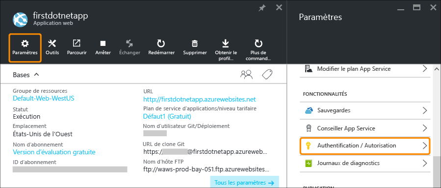
    
2. Cliquez sur **Activé** pour activer l’authentification. 
    
4. Sous **Fournisseurs d’authentification**, cliquez sur **Azure Active Directory**. 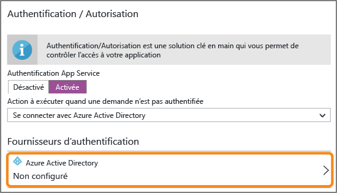

5. Dans le panneau **Paramètres Azure Active Directory**, cliquez sur **Express**, puis sur **OK**. Les paramètres par défaut créent une nouvelle application Azure AD dans votre répertoire par défaut. 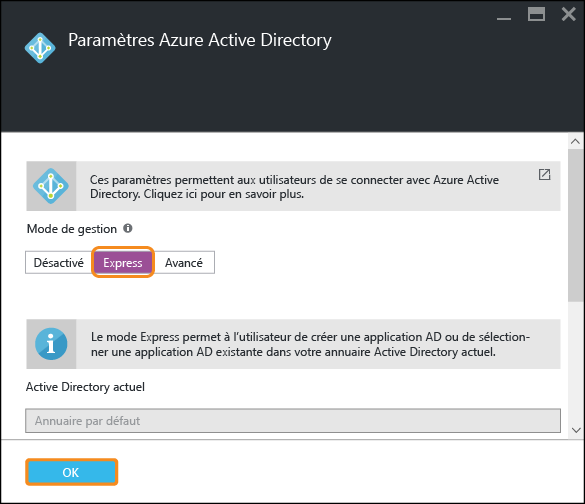

6. Cliquez sur **Save**. 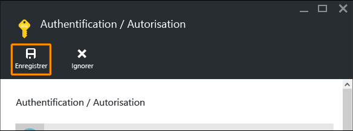

    Une fois que la modification a réussi, la cloche de notification devient verte, et un message positif s’affiche.

7. Revenez au panneau principal de votre application, puis cliquez sur le lien **URL** (ou sur **Parcourir** dans la barre de menus). Notez que le lien est une adresse HTTP. 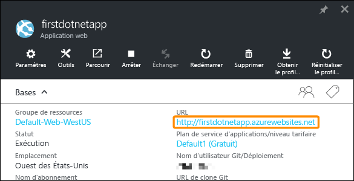 Lorsque celle-ci ouvre l’application dans un nouvel onglet, la zone URL effectue plusieurs redirections avant d’ouvrir votre application avec une adresse HTTPS. Vous pouvez voir que vous êtes déjà connecté à votre compte Microsoft associé à votre abonnement Azure, et que celui-ci vous connecte automatiquement à l’application. 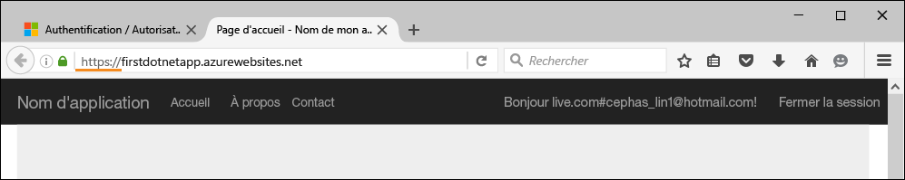 Donc, si vous ouvrez maintenant un autre navigateur (afin de vous assurer que vous n’êtes pas déjà connecté), une page de connexion s’affiche lorsque vous accédez à l’URL de l’application : 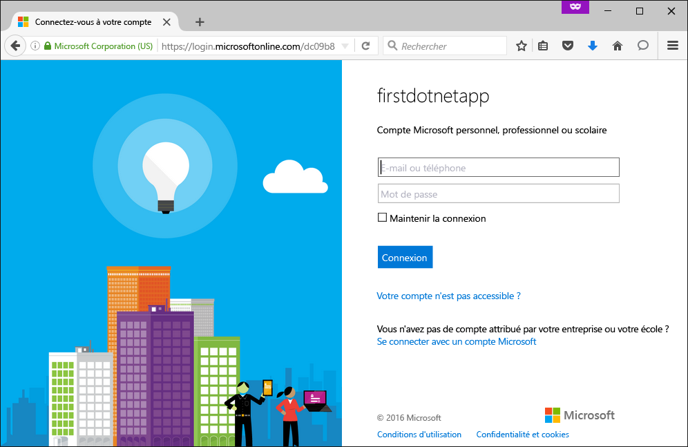 Si vous n’avez jamais utilisé Azure Active Directory, le répertoire par défaut ne contient probablement pas d’utilisateurs Azure AD. Dans ce cas, il est probable qu’il contienne uniquement le compte Microsoft associé à l’abonnement Azure. Cela explique pourquoi vous étiez automatiquement connecté à l’application dans un même navigateur. Vous pouvez utiliser ce même compte Microsoft pour vous connecter sur cette page de connexion.

Félicitations, vous authentifiez désormais tout le trafic vers votre site.

Vous avez peut-être remarqué que vous pouvez en faire beaucoup plus dans le panneau **Authentification / Autorisation**, c’est-à-dire :

- activer la connexion à partir de réseaux sociaux ;
- activer plusieurs options de connexion ;
- modifier le comportement par défaut lorsque les utilisateurs accèdent à votre application pour la première fois.

App Service propose une solution clé en main pour une partie des besoins d’authentification les plus courants. Vous n’avez donc pas besoin de fournir la logique d’authentification vous-même. Pour plus d’informations, consultez [...](/services/app-service/).

## Adaptez la taille de votre application

Vous allez à présent apprendre à adapter la taille de votre application. Vous pouvez adapter la taille de votre application App Service de deux manières :

- [Monter en puissance](https://en.wikipedia.org/wiki/Scalability#Horizontal_and_vertical_scaling) : lorsque vous faites monter en puissance une application App Service, vous modifiez le niveau tarifaire du plan App Service auquel appartient l’application. En plus d’obtenir un processeur amélioré et une mémoire et un espace disque plus importants, le fait de monter en puissance vous apporte des fonctionnalités supplémentaires. Celles-ci comprennent des instances de machine virtuelle dédiées, une mise à l’échelle automatique, un contrat SLA à 99,95 %, des domaines personnalisés, des certificats SSL personnalisés, des emplacements de déploiement, une sauvegarde et restauration et bien plus encore. Des niveaux supérieurs fournissent davantage de fonctionnalités à votre application App Service.  
- [Augmenter la taille des instances](https://en.wikipedia.org/wiki/Scalability#Horizontal_and_vertical_scaling) : lorsque vous augmentez la taille des instances de l’application App Service, cela modifie le nombre d’instances de machines virtuelles qui exécutent votre application (ou les applications du même plan App Service). Avec le niveau standard ou supérieur, vous pouvez activer la mise à l’échelle automatique des instances de machines virtuelles en fonction des métriques de performances. 

Sans plus attendre, préparons à présent la mise à l’échelle automatique de votre application.

1. Nous allons tout d’abord procéder à la montée en puissance pour activer la mise à l’échelle automatique. Dans le panneau de votre application, cliquez sur **Paramètres** > ** Monter en puissance (plan App Service)**. 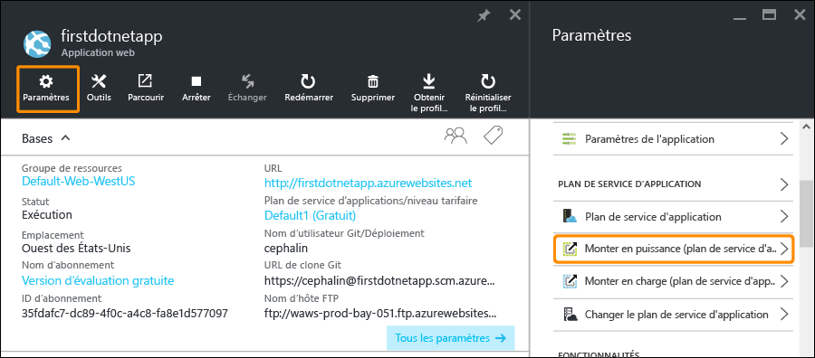

2. Faites défiler, puis sélectionnez le niveau **S1 Standard** (le plus bas niveau prenant en charge la mise à l’échelle automatique, encerclé ci-dessous), puis cliquez sur **Sélectionner**. Notez que ce niveau épuisera votre crédit d’évaluation. 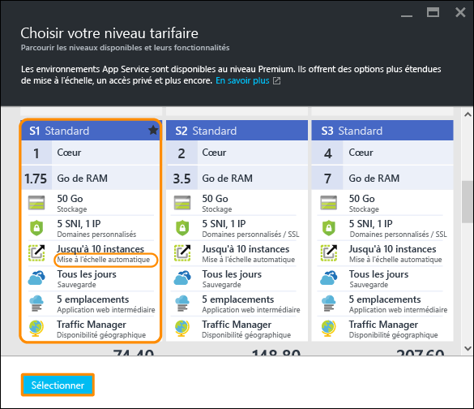

    Vous avez terminé la montée en puissance.
    
3. Ensuite, nous allons configurer la mise à l’échelle automatique. Dans le panneau de votre application, cliquez sur **Paramètres** > ** Augmenter la taille des instances (plan App Service)**. 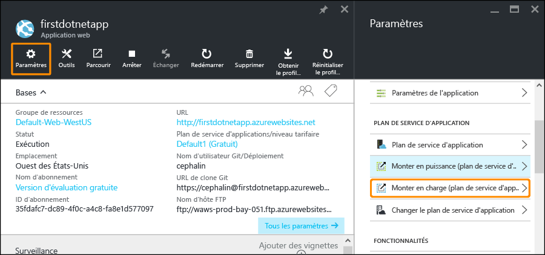

4. Définissez **Mise à l’échelle selon** sur **Pourcentage UC**. Les curseurs sous la liste déroulante changent en conséquence. Ensuite, définissez une plage d’**Instances** comprise entre **1** et **2** et une **Plage cible** entre **40** et **80**, en tapant dans les zones ou en déplaçant les curseurs. 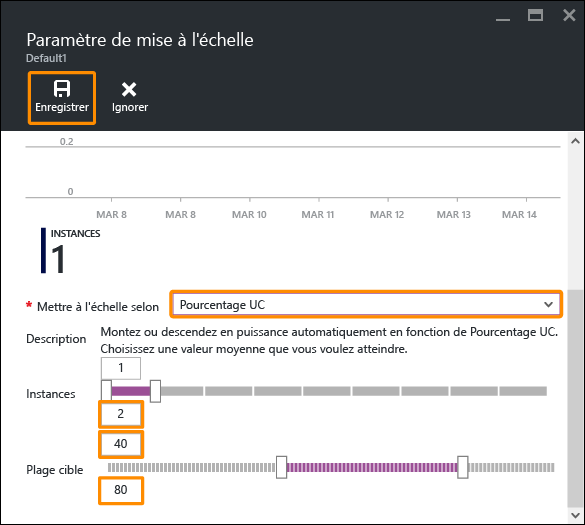
    
    Selon cette configuration, la taille des instances de votre application augmentera automatiquement (à un maximum de 2 instances) lorsque l’utilisation du processeur est supérieure à 80 %. Lorsque cette dernière est inférieure à 40 %, la taille des instances diminuera (à un minimum d’1 instance).
    
5. Cliquez sur **Enregistrer** dans la barre des tâches.

Félicitations, votre application se met à l’échelle automatiquement.

Vous avez peut-être remarqué que vous pouvez en faire beaucoup plus dans le panneau **Paramètres de mise à l’échelle**, comme :

- l’augmentation manuelle de la taille des instances à un certain nombre d’instances ;
- la mise à l’échelle selon des métriques de performances supplémentaires, telles que le pourcentage de mémoire ou la longueur de la file d’attente de disque ;
- la personnalisation du comportement de mise à l’échelle lorsqu’une règle de performance est déclenchée ;
- la mise à l’échelle automatique selon un calendrier prévu ;
- le réglage du comportement de mise à l’échelle automatique pour un événement ultérieur.

Pour plus d’informations sur la montée en puissance de votre application, consultez [Changement de niveau de tarification dans Azure App Service](../app-service/app-service-scale.md). Pour plus d’informations sur l’augmentation de la taille des instances, consultez [Mise à l’échelle manuelle ou automatique du nombre d’instances](../azure-portal/insights-how-to-scale.md).

## Recevoir des alertes pour votre application

À présent que votre application se met à l’échelle automatiquement, que se passe-t-il lorsqu’elle atteint le nombre maximal d’instances (10 instances pour le niveau **Standard**) tandis que l’utilisation du processeur dépasse le pourcentage souhaité (80 %) ? Vous pouvez configurer une alerte pour vous informer de cette situation afin de faire davantage monter en puissance votre application, par exemple. Nous allons rapidement configurer une alerte pour cela.

1. Dans le panneau de votre application, cliquez sur **Outils** > **Alertes**. 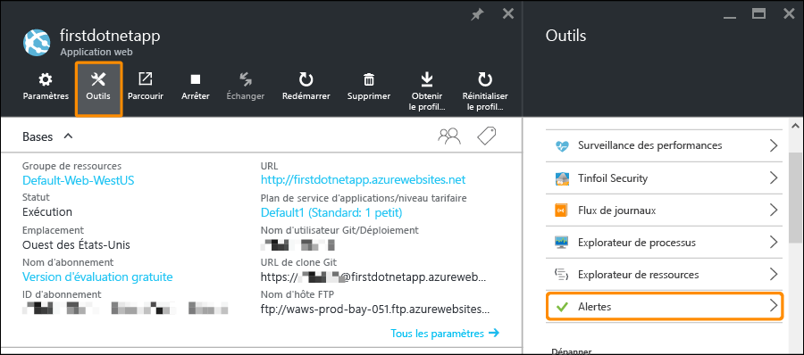

2. Cliquez sur **Ajouter une alerte**. Ensuite, dans la zone **Ressources**, sélectionnez la ressource qui se termine par **(serverfarms)**. C’est votre plan App Service. 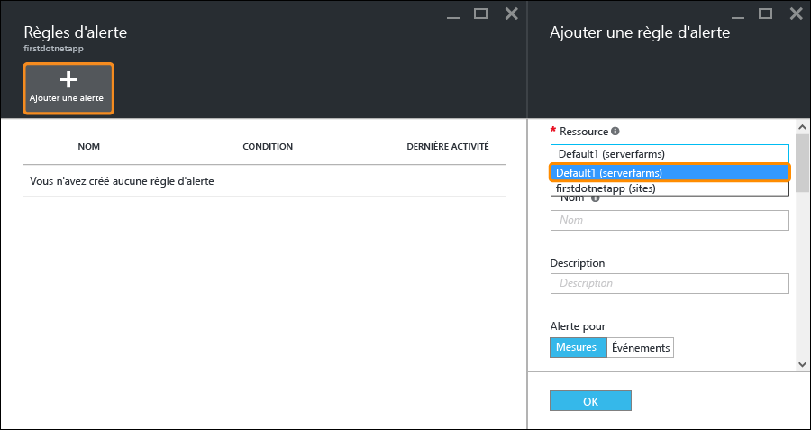

3. Définissez **Nom** sur `CPU Maxed`, **Métrique** sur **Pourcentage UC**, et **Seuil** sur `90`, puis sélectionnez **Envoyer des e-mails aux propriétaires, contributeurs et lecteurs** et cliquez sur **OK**. 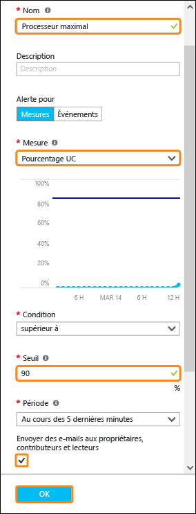
    
    Après la création de l’alerte par Azure, vous la verrez dans le panneau **Alertes**. 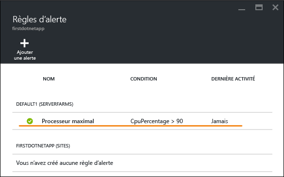

Félicitations, vous recevez désormais des alertes.

Ce paramètre d’alerte vérifie l’utilisation du processeur toutes les 5 minutes. Si celle-ci dépasse 90 %, vous (ainsi que toute personne autorisée) recevrez un message d’alerte. Pour afficher tous les utilisateurs autorisés à recevoir les alertes, revenez au panneau de votre application et cliquez sur le bouton **Accès**. 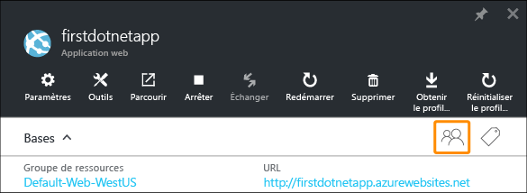

Vous verrez que les **Administrateurs des abonnements** sont déjà le **Propriétaire** de l’application. Ceci vous inclut si vous êtes l’administrateur du compte de votre abonnement Azure (par exemple, votre abonnement d’évaluation). Pour plus d’informations sur le contrôle d’accès en fonction du rôle Azure, consultez [Contrôle d’accès en fonction du rôle Azure](../active-directory/role-based-access-control-configure.md).

## Étapes suivantes

Lorsque vous avez configuré votre alerte, vous avez peut-être remarqué le vaste ensemble d’outils dans le panneau **Outils**. Ceux-ci vous permettent de résoudre les problèmes, analyser les performances, détecter les failles, gérer les ressources, interagir avec la console de machine virtuelle et ajouter des extensions utiles. Nous vous invitons à cliquer sur chacun d’entre eux pour découvrir les outils simples mais puissants à votre disposition.

En outre, découvrez comment en faire plus avec votre application déployée. Voici une liste partielle :

- [Acheter et configurer un nom de domaine personnalisé](custom-dns-web-site-buydomains-web-app.md).
- [Configurer des environnements intermédiaires](web-sites-staged-publishing.md)
- [Configurer un déploiement continu](web-sites-publish-source-control.md)
- [Sauvegarder une application](web-sites-backup.md)
- [Activer la journalisation des diagnostics](web-sites-enable-diagnostic-log.md)
- [Accéder à des ressources locales](web-sites-hybrid-connection-get-started.md)
- [Découvrir le fonctionnement d’App Service](../app-service/app-service-how-works-readme.md) 

<!---HONumber=AcomDC_0316_2016-->