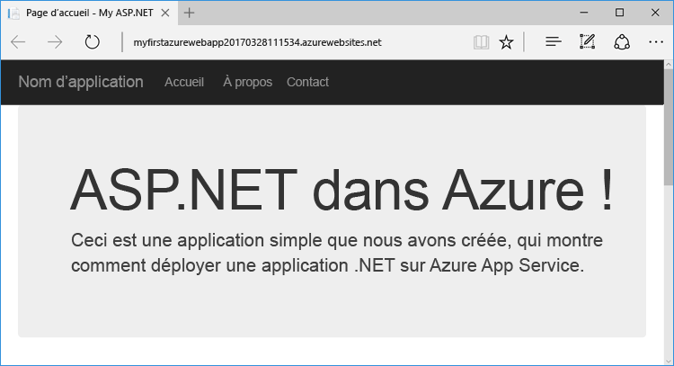
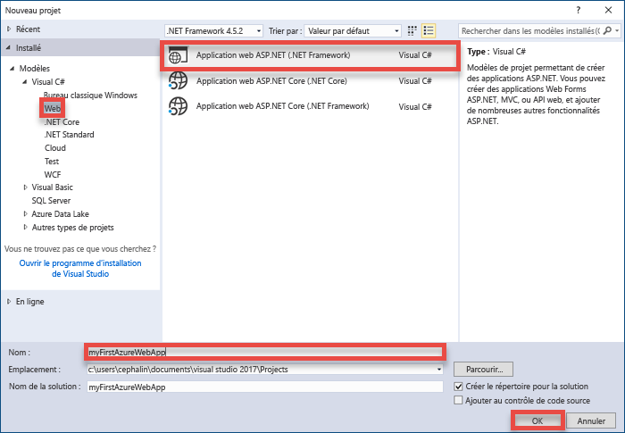
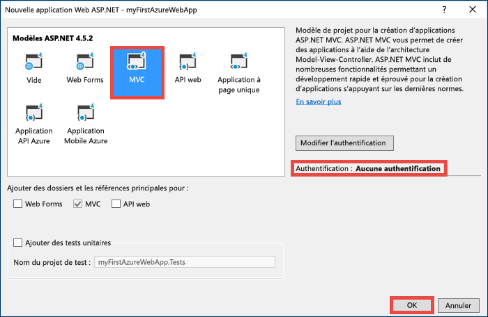
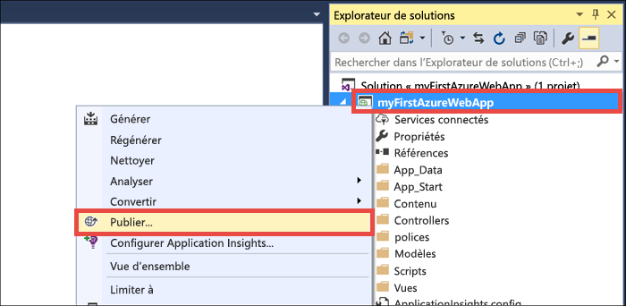
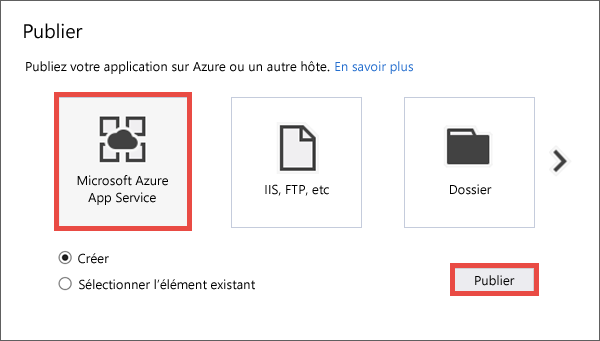
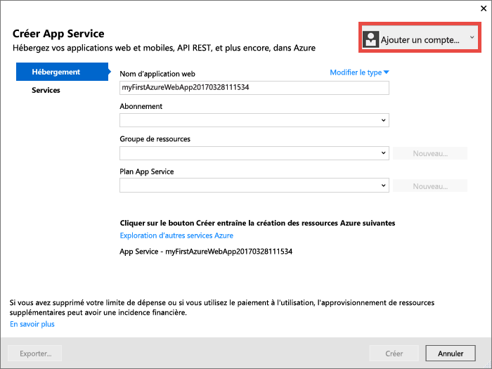
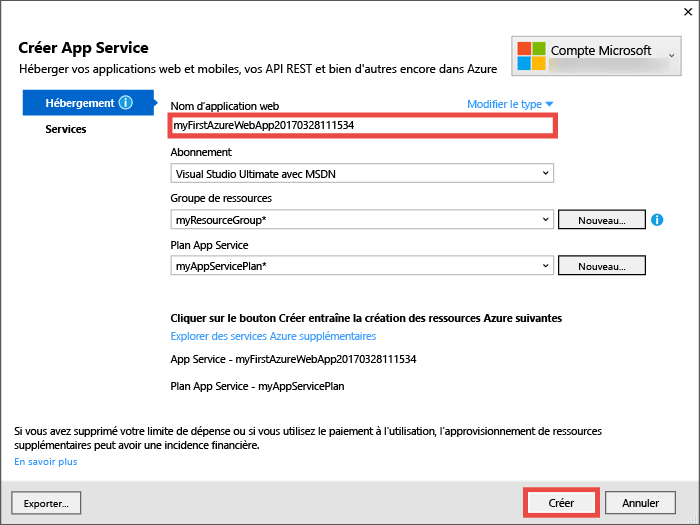
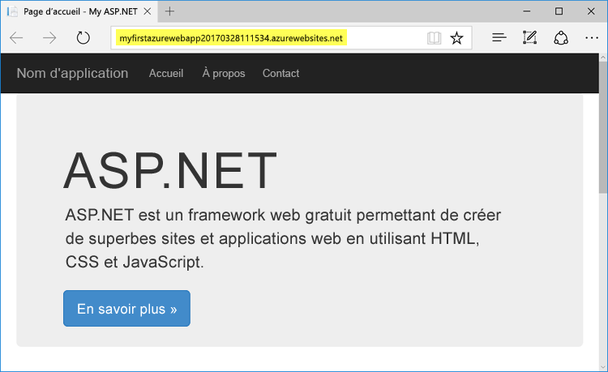
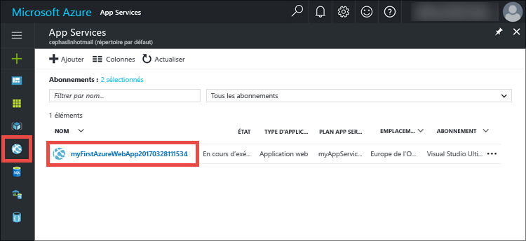
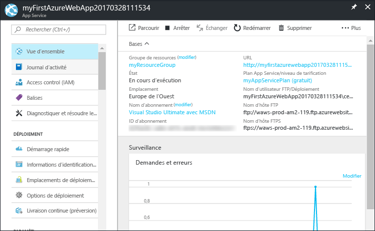

# <a name="create-your-first-aspnet-web-app-in-azure-in-five-minutes"></a>Créer votre première application web ASP.NET dans Azure en 5 minutes

[!INCLUDE [app-service-web-selector-get-started](../../includes/app-service-web-selector-get-started.md)] 

Ce démarrage rapide vous permet de déployer votre première application web ASP.NET dans [Azure App Service](../app-service/app-service-value-prop-what-is.md) en quelques minutes. À la fin de ce didacticiel, vous disposerez d’une application web simple et fonctionnelle dans le cloud.



## <a name="prerequisites"></a>Composants requis

Ce didacticiel montre comment utiliser Visual Studio 2017 pour générer et déployer une application web ASP.NET dans Azure. Si vous n’avez pas encore installé Visual Studio 2017, vous pouvez télécharger et utiliser la version **gratuite** [Visual Studio 2017 Community Edition](https://www.visualstudio.com/downloads/). Veillez à activer **le développement Azure** lors de l’installation de Visual Studio.

[!INCLUDE [quickstarts-free-trial-note](../../includes/quickstarts-free-trial-note.md)]

## <a name="create-an-aspnet-web-app"></a>Créez une application web ASP.NET

Dans Visual Studio, créez un projet avec `Ctrl`+`Shift`+`N`.

Dans le dialogue **Nouveau projet**, cliquez sur **Visual C# > Web > ASP.NET Web Application (.NET Framework)**.

Nommez l’application **myFirstAzureWebApp**, puis cliquez sur **OK**.
   


Vous pouvez déployer n’importe quel type d’application web ASP.NET dans Azure. Pour ce didacticiel, sélectionnez le modèle **MVC** et assurez-vous que l’authentification est définie sur **Aucune authentification**.
      
Cliquez sur **OK**.



## <a name="publish-to-azure"></a>Publication dans Azure

Dans **l’Explorateur de solutions**, cliquez avec le bouton droit sur le projet **myFirstAzureWebApp**, puis sélectionnez **Publier**.



Assurez-vous que **Microsoft Azure App Service** est sélectionné et cliquez sur **Publier**.



Cette opération ouvre la boîte de dialogue **Créer App Service** qui vous permet de créer toutes les ressources Azure dont vous avez besoin pour exécuter votre application web ASP.NET dans Azure.

## <a name="sign-in-to-azure"></a>Connexion à Azure

Dans la boîte de dialogue **Créer App Service**, cliquez sur **Ajouter un compte** puis connectez-vous à votre abonnement Azure. Si vous êtes déjà connecté à un compte Microsoft, assurez-vous que le compte conserve votre abonnement Azure. Si le compte Microsoft auquel vous êtes connecté ne comporte pas votre abonnement Azure, cliquez dessus pour ajouter le compte approprié.
   


Une fois connecté, vous êtes prêt à créer toutes les ressources dont vous avez besoin pour votre application web Azure dans cette boîte de dialogue.

## <a name="create-a-resource-group"></a>Créer un groupe de ressources

Dans un premier temps, vous avez besoin d’un _groupe de ressources_. 

> [!NOTE] 
> Un groupe de ressources est un conteneur logique dans lequel les ressources Azure comme les applications web, les bases de données et les comptes de stockage sont déployées et gérées.
>
>

À côté de **Groupe de ressources**, cliquez sur **Nouveau**.

Nommez votre groupe de ressources **myResourceGroup** et cliquez sur **OK**.

## <a name="create-an-app-service-plan"></a>Créer un plan App Service

[!INCLUDE [app-service-plan](../../includes/app-service-plan.md)]

À côté de **Plan App Service**, cliquez sur **Nouveau**. 

Dans la boîte de dialogue **Configurer plan App Service** configurez le nouveau plan App Service avec les paramètres suivants :

- **Plan App Service** : type **myAppServicePlan**. 
- **Emplacement** : choisissez **Europe de l’Ouest**, ou une région proche de vous.
- **Taille** : choisissez **Gratuit**, ou un autre [niveau tarifaire](https://azure.microsoft.com/pricing/details/app-service/).

Cliquez sur **OK**.


## <a name="create-and-publish-the-web-app"></a>Créer et publier l’application web

La seule chose qu’il reste à faire désormais est de nommer votre application web. Sous **Nom de l’application web**, entrez un nom d’application unique. Ce nom sera utilisé en partie dans le nom DNS par défaut de votre application (`<app_name>.azurewebsites.net`), il doit donc être unique sur l’ensemble des applications dans Azure. Vous pouvez ultérieurement mapper un nom de domaine personnalisé vers votre application web avant de l’exposer à vos utilisateurs.

Vous pouvez également accepter le nom généré automatiquement, qui est déjà unique.

Cliquez sur **Créer** pour commencer à créer les ressources Azure.



Une fois que l’Assistant a terminé de créer les ressources Azure, il publie automatiquement votre application web ASP.NET dans Azure pour la première fois, puis lance l’application web Azure publiée dans votre navigateur par défaut.



L’URL utilise le nom de l’application web que vous avez spécifié précédemment, avec le format `http://<app_name>.azurewebsites.net`. 

Félicitations, votre première application web ASP.NET s’exécute en temps réel dans Azure App Service.

## <a name="update-the-app-and-redeploy"></a>Mise à jour de l’application et redéploiement

Il est très simple d’effectuer une mise à jour et de redéployer dans Azure. Nous allons effectuer une mise à jour de la page d’accueil.

À partir de **l’Explorateur de solutions**, ouvrez **Views\Home\Index.cshtml**.

Recherchez la balise HTML `<div class="jumbotron">` vers le début et remplacez la balise entière par le code suivant :

```HTML
<div class="jumbotron">
    <h1>ASP.NET in Azure!</h1>
    <p class="lead">This is a simple app that we’ve built that demonstrates how to deploy a .NET app to Azure App Service.</p>
</div>
```

Pour redéployer dans Azure, cliquez sur votre projet **myFirstAzureWebApp** dans **l’Explorateur de solutions** et sélectionnez **Publier**.

Dans la page de publication, cliquez sur **Publier**.

Lorsque Visual Studio a terminé, il lance l’application web Azure mise à jour dans votre navigateur.


## <a name="manage-your-new-azure-web-app"></a>Gérer votre nouvelle application web Azure

Accédez au portail Azure pour voir l’application web que vous venez de créer. 

Pour ce faire, connectez-vous au portail : [https://portal.azure.com](https://portal.azure.com).

Dans le menu de gauche, cliquez sur **App Services**, puis cliquez sur le nom de votre application web Azure.



Vous accédez au _panneau_ de votre application web (une page du portail qui s’ouvre horizontalement). 

Par défaut, le panneau de votre application web affiche la page **Présentation**. Cette page propose un aperçu de votre application. Ici, vous pouvez également effectuer des tâches de gestion de base (parcourir, arrêter, démarrer, redémarrer et supprimer des éléments, par exemple).  



Les onglets figurant sur le côté gauche du panneau affichent les différentes pages de configuration que vous pouvez ouvrir. La liste suivante fournit quelques exemples des possibilités :

- Mapper un nom DNS personnalisé
- Lier un certificat SSL personnalisé
- Configurer le déploiement continu
- Montée en puissance et augmentation de la taille des instances
- Ajouter une authentification utilisateur

## <a name="clean-up-resources"></a>Supprimer des ressources

Pour supprimer votre première application web Azure, vous pouvez cliquer sur **Supprimer** dans la page de **Présentation**. Toutefois, il existe une meilleure solution pour supprimer tout ce que vous avez créé dans ce démarrage rapide. À partir de la page de **Présentation** de votre application web, cliquez sur le groupe de ressources pour ouvrir son panneau. 


Dans le panneau du groupe de ressources, vous pouvez voir le plan App Service et l’application App Service créés par Visual Studio. 

Dans la partie supérieure du panneau, cliquez sur **Supprimer**. 

<!---->

Dans le panneau de confirmation, confirmez en tapant le nom de groupe de ressources **myResourceGroup** dans la zone de texte et cliquez sur **Supprimer**.

## <a name="next-steps"></a>Étapes suivantes

> [!div class="nextstepaction"]
> [Découvrez comment créer une application ASP.NET dans Azure avec SQL Database](app-service-web-tutorial-dotnet-sqldatabase.md)

> [!div class="nextstepaction"]
> [Parcourez des exemples de scripts PowerShell d’applications web](app-service-powershell-samples.md)

