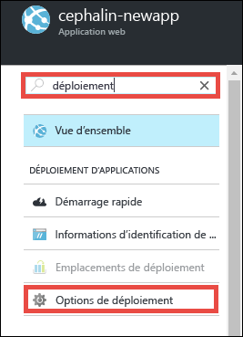
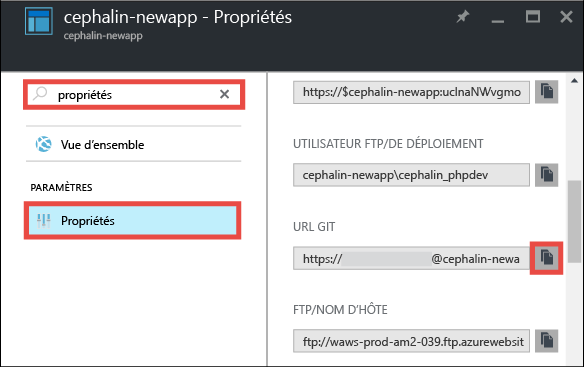
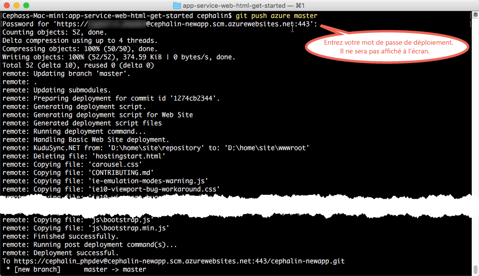

<properties 
	pageTitle="Déployer votre première application web dans Azure en 5 minutes | Microsoft Azure" 
	description="Découvrez la facilité avec laquelle vous pouvez exécuter des applications web dans App Service en déployant un exemple d’application. Commencez le développement rapidement et visualisez les résultats immédiatement." 
	services="app-service\web"
	documentationCenter=""
	authors="cephalin"
	manager="wpickett"
	editor=""
/>

<tags
	ms.service="app-service-web"
	ms.workload="web"
	ms.tgt_pltfrm="na"
	ms.devlang="na"
	ms.topic="hero-article"
	ms.date="09/16/2016" 
	ms.author="cephalin"
/>
	
# Déployer votre première application web dans Azure en 5 minutes

Dans ce didacticiel, vous découvrirez comment déployer une application web HTML+CSS simple dans [Azure App Service](../app-service/app-service-value-prop-what-is.md). 
App Service permet de créer des applications web, des [back-ends d’applications mobiles](/documentation/learning-paths/appservice-mobileapps/) 
et des [applications API](../app-service-api/app-service-api-apps-why-best-platform.md).

Vous allez :

- Créer une application web dans Azure App Service
- Déployer du contenu HTML et CSS dans votre application
- Voir vos pages s’exécuter dans un environnement de production
- Mettre à jour votre contenu de la même façon que vous [transmettez des validations Git](https://git-scm.com/docs/git-push)

## Conditions préalables

- [Installer Git](http://www.git-scm.com/downloads). Vérifiez que votre installation a réussi en exécutant `git --version` à partir d’une nouvelle invite de commande Windows,
d’une fenêtre PowerShell, d’un interpréteur de commande Linux ou d’un terminal OS X.
- Obtenir un compte Microsoft Azure. Si vous ne possédez pas de compte, vous pouvez 
[demander un essai gratuit](/pricing/free-trial/?WT.mc_id=A261C142F) ou 
[activer les avantages de votre abonnement Visual Studio](/pricing/member-offers/msdn-benefits-details/?WT.mc_id=A261C142F).

>[AZURE.NOTE] Vous pouvez [essayer App Service](http://go.microsoft.com/fwlink/?LinkId=523751) sans compte Azure. Créez une application de base et expérimentez-la pendant une heure, sans carte de paiement et sans engagement.

## Créer une application web

1. Connectez-vous au [portail Azure](https://portal.azure.com) avec votre compte Azure.

2. Dans le menu de gauche, cliquez sur **Nouveau** > **Web + mobile** > **Application web**.

    

3. Dans le panneau de création d’application, utilisez les paramètres suivants pour votre nouvelle application :

    - **Nom de l’application** : tapez un nom unique.
    - **Groupe de ressources** : sélectionnez **Créer** et donnez un nom au groupe de ressources.
    - **Plan App Service/Emplacement** : cliquez sur cette option pour la configurer, puis cliquez sur **Créer** pour définir le nom, l’emplacement et 
    le niveau tarifaire du plan App Service. N’hésitez pas à utiliser le niveau tarifaire **Gratuit**.

    Lorsque vous avez terminé, le panneau de création de votre application doit ressembler à ceci :

    

3. Cliquez sur l’option **Créer** au bas du panneau. Pour afficher la progression, cliquez sur l’icône **Notification** située en haut.

    

4. Une fois le déploiement terminé, le message de notification ci-dessous doit s’afficher. Cliquez sur ce message pour ouvrir le panneau de votre déploiement.

    

5. Dans le panneau **Déploiement réussi**, cliquez sur le lien **Ressource** pour ouvrir le panneau de votre nouvelle application web.

    

## Déployer du contenu dans votre application web

À présent, nous allons déployer du contenu dans Azure à l’aide de Git.

5. Dans le panneau de l’application web, accédez au menu **Options de déploiement** ou recherchez-le, puis cliquez dessus.

    

6. Cliquez sur **Choisir la source** > **Référentiel Git local** > **OK**.

7. De retour dans le panneau de l’application web, cliquez sur **Informations d’identification de déploiement**.

8. Définissez vos informations d’identification de déploiement et cliquez sur **Enregistrer**.

7. De retour dans le panneau de l’application web, accédez aux **Propriétés** ou recherchez-les, puis cliquez dessus. En regard de **URL Git**, cliquez sur le bouton **Copier**.

    

    Vous êtes maintenant prêt à déployer votre contenu avec Git.

1. Dans votre terminal de ligne de commande, passez à un répertoire de travail (`CD`) et clonez l’exemple d’application comme suit :

        git clone https://github.com/Azure-Samples/app-service-web-html-get-started.git

    

2. Passez au référentiel de votre exemple d’application. Par exemple :

        cd app-service-web-html-get-started

3. Configurez l’objet distant Git de votre application Azure en ajoutant l’URL Git copiée dans le portail quelques étapes auparavant.

        git remote add azure <giturlfromportal>

4. Déployez votre exemple de code dans votre application Azure de la même façon que vous transmettez du code avec Git :

        git push azure master

    

Et voilà ! Votre code s’exécute désormais dans Azure. Dans votre navigateur, accédez à http://*&lt;appname>*.azurewebsites.net pour le voir à l’œuvre.

## Mettre à jour votre application

Vous pouvez désormais utiliser Git pour transmettre votre code depuis la racine (référentiel) de votre projet dès que vous avez besoin d’apporter une mise à jour au site en ligne. Pour ce faire, il vous suffit de suivre la même procédure que pour le déploiement initial de votre contenu. Par exemple, chaque fois que vous voulez transmettre une nouvelle modification que vous avez testée localement, exécutez simplement les commandes suivantes depuis la racine (référentiel) de votre projet :

    git add .
    git commit -m "<your_message>"
    git push azure master

## Étapes suivantes

Accédez aux étapes de développement et de déploiement recommandées pour votre infrastructure de langage :

> [AZURE.SELECTOR]
- [.NET](web-sites-dotnet-get-started.md)
- [PHP](app-service-web-php-get-started.md)
- [Node.JS](app-service-web-nodejs-get-started.md)
- [Python](web-sites-python-ptvs-django-mysql.md)
- [Java](web-sites-java-get-started.md)

Ou faites-en plus avec votre première application web. Par exemple :

- Essayez [d’autres méthodes de déploiement de votre code dans Azure](../app-service-web/web-sites-deploy.md). Par exemple, pour effectuer un déploiement à partir de l’un de vos référentiels GitHub, sélectionnez simplement 
**GitHub** au lieu de **Référentiel Git local** dans les **Options de déploiement**.
- Donnez une nouvelle dimension à votre application Azure. Authentifiez vos utilisateurs. Faites évoluer sa capacité en fonction de la demande. Configurez des alertes de performance. Tout cela en seulement quelques clics. Consultez l’article 
[Ajouter des fonctionnalités à votre première application web](app-service-web-get-started-2.md).

<!----HONumber=AcomDC_0920_2016-->