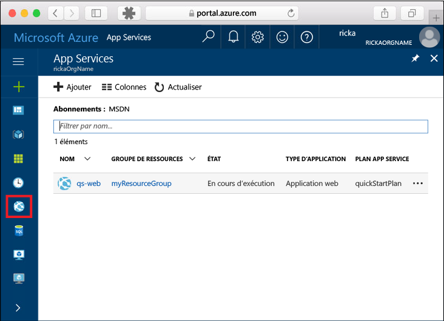
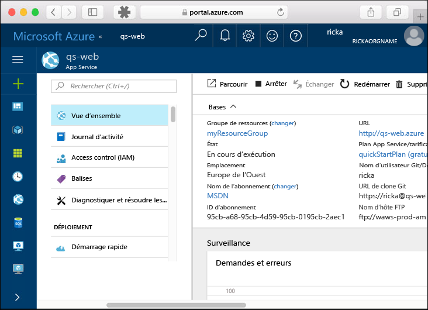

# <a name="create-a-static-html-web-app-in-azure"></a>Créer une application web HTML statique dans Azure

[Azure Web Apps](https://docs.microsoft.com/azure/app-service-web/app-service-web-overview) offre un service d’hébergement web hautement évolutif appliquant des mises à jour correctives automatiques.  Ce guide de démarrage rapide vous indique comment déployer un site HTML + CSS de base dans Azure Web Apps. Vous créez l’application web à l’aide de [l’interface de ligne de commande Azure](https://docs.microsoft.com/cli/azure/get-started-with-azure-cli), et vous utilisez Git pour déployer l’exemple de contenu HTML dans l’application web.


Vous pouvez suivre les étapes ci-dessous en utilisant un ordinateur Mac, Windows ou Linux. Une fois les composants requis installés, l’exécution de cette procédure prend environ cinq minutes.

## <a name="prerequisites"></a>Composants requis

Pour effectuer ce démarrage rapide :

- [Installez Git](https://git-scm.com/)
[!INCLUDE [quickstarts-free-trial-note](../../includes/quickstarts-free-trial-note.md)].

[!INCLUDE [cloud-shell-try-it.md](../../includes/cloud-shell-try-it.md)]

Si vous choisissez d’installer et d’utiliser l’interface de ligne de commande localement, vous devez exécuter Azure CLI version 2.0 ou une version ultérieure pour poursuivre la procédure décrite dans cet article. Exécutez `az --version` pour trouver la version. Si vous devez installer ou mettre à niveau, consultez [Installation d’Azure CLI 2.0]( /cli/azure/install-azure-cli). 

## <a name="download-the-sample"></a>Téléchargez l’exemple

Dans une fenêtre de terminal, exécutez la commande ci-après pour cloner le référentiel de l’exemple d’application sur votre ordinateur local.

```bash
git clone https://github.com/Azure-Samples/html-docs-hello-world.git
```

Vous utilisez cette fenêtre de terminal pour exécuter toutes les commandes de ce guide de démarrage rapide.

## <a name="view-the-html"></a>Affichez le code HTML

Naviguez vers le répertoire qui contient l’exemple HTML. Ouvrez le fichier *index.html* dans votre navigateur.


[!INCLUDE [Log in to Azure](../../includes/login-to-azure.md)] 

[!INCLUDE [Configure deployment user](../../includes/configure-deployment-user.md)] 

[!INCLUDE [Create resource group](../../includes/app-service-web-create-resource-group.md)] 

[!INCLUDE [Create app service plan](../../includes/app-service-web-create-app-service-plan.md)] 

[!INCLUDE [Create web app](../../includes/app-service-web-create-web-app.md)] 


Vous avez créé une application web vide dans Azure.

[!INCLUDE [Configure local git](../../includes/app-service-web-configure-local-git.md)] 

[!INCLUDE [Push to Azure](../../includes/app-service-web-git-push-to-azure.md)] 

```bash
Counting objects: 13, done.
Delta compression using up to 4 threads.
Compressing objects: 100% (11/11), done.
Writing objects: 100% (13/13), 2.07 KiB | 0 bytes/s, done.
Total 13 (delta 2), reused 0 (delta 0)
remote: Updating branch 'master'.
remote: Updating submodules.
remote: Preparing deployment for commit id 'cc39b1e4cb'.
remote: Generating deployment script.
remote: Generating deployment script for Web Site
remote: Generated deployment script files
remote: Running deployment command...
remote: Handling Basic Web Site deployment.
remote: KuduSync.NET from: 'D:\home\site\repository' to: 'D:\home\site\wwwroot'
remote: Deleting file: 'hostingstart.html'
remote: Copying file: '.gitignore'
remote: Copying file: 'LICENSE'
remote: Copying file: 'README.md'
remote: Finished successfully.
remote: Running post deployment command(s)...
remote: Deployment successful.
To https://<app_name>.scm.azurewebsites.net/<app_name>.git
 * [new branch]      master -> master
```

## <a name="browse-to-the-app"></a>Accéder à l’application

Dans un navigateur, accédez à l’URL de l’application web Azure :

```
http://<app_name>.azurewebsites.net
```

La page s’exécute comme une application web Azure App Service.


**Félicitations !** Vous avez déployé votre première application HTML dans App Service.

## <a name="update-and-redeploy-the-app"></a>Mise à jour et redéploiement de l’application

Ouvrez le fichier *index.html* dans un éditeur de texte, puis apportez une modification au balisage. Par exemple, remplacez le titre H1 « Azure App Service - Sample Static HTML Site » par « Azure App Service ».

Validez vos modifications dans Git, puis envoyez les modifications de code à Azure.

```bash
git commit -am "updated HTML"
git push azure master
```

Une fois le déploiement terminé, actualisez votre navigateur afin de voir les modifications.


## <a name="manage-your-new-azure-web-app"></a>Gérer votre nouvelle application web Azure

Accédez au <a href="https://portal.azure.com" target="_blank">Portail Azure</a> pour gérer l’application web que vous avez créée.

Dans le menu de gauche, cliquez sur **App Services**, puis cliquez sur le nom de votre application web Azure.



Vous voyez apparaître la page Vue d’ensemble de votre application web. Ici, vous pouvez également des tâches de gestion de base (parcourir, arrêter, démarrer, redémarrer et supprimer des éléments, par exemple). 



Le menu de gauche fournit différentes pages vous permettant de configurer votre application. 

[!INCLUDE [cli-samples-clean-up](../../includes/cli-samples-clean-up.md)]

## <a name="next-steps"></a>Étapes suivantes

> [!div class="nextstepaction"]
> [Mapper un domaine personnalisé](app-service-web-tutorial-custom-domain.md)

