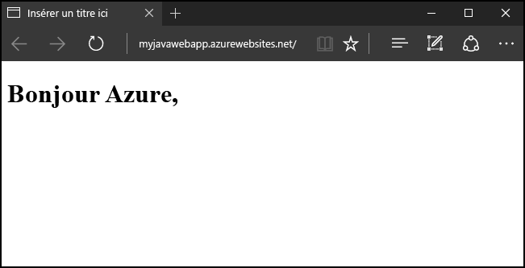
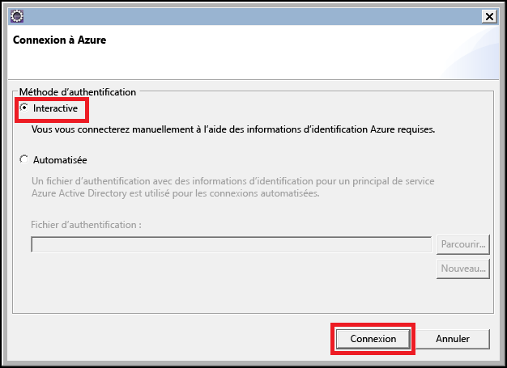
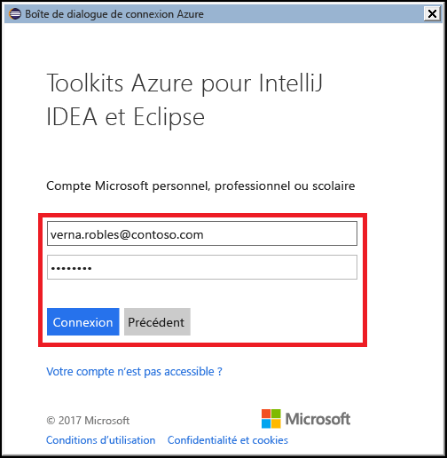
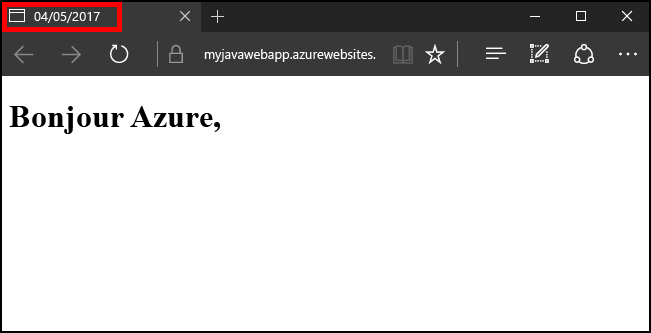

# <a name="create-your-first-java-web-app-in-azure-in-five-minutes"></a>Créer votre première application web Java dans Azure en 5 minutes

[!INCLUDE [app-service-web-selector-get-started](../../includes/app-service-web-selector-get-started.md)] 

Ce démarrage rapide vous permet de déployer votre première application web Java dans [Azure App Service](../app-service/app-service-value-prop-what-is.md) en quelques minutes. À la fin de ce didacticiel, vous disposerez d’une application web Java simple et fonctionnelle dans le cloud.



## <a name="prerequisites"></a>Composants requis

Ce didacticiel explique comment utiliser l’Environnement de développement intégré (IDE) Eclipse pour développeurs Java EE pour créer et déployer une application web Java dans Azure. Si Eclipse n’est pas installé, vous pouvez le télécharger gratuitement à l’adresse http://www.eclipse.org/.

Pour simplifier le processus de publication des applications web Java dans Azure, les étapes de ce didacticiel feront appel au [kit de ressources Azure pour Eclipse](/azure/azure-toolkit-for-eclipse). Pour obtenir des instructions sur l’installation du kit de ressources, consultez [Installation du kit de ressources Azure pour Eclipse](/azure/azure-toolkit-for-eclipse-installation).

> [!NOTE]
>
> Vous pouvez également utiliser [IntelliJ IDEA](https://www.jetbrains.com/idea/) de JetBrains pour suivre les étapes de ce didacticiel. Certaines étapes peuvent être légèrement différentes pour cet environnement de développement, bien qu’il existe également un [kit de ressources Azure pour IntelliJ](/azure/azure-toolkit-for-intellij) qui vous permet de simplifier votre processus de publication pour cet IDE.
>

Vous aurez également besoin d’un abonnement Azure pour suivre les étapes de ce didacticiel. Si vous n’avez pas d’abonnement Azure, vous pouvez activer vos [avantages abonnés MSDN](https://azure.microsoft.com/pricing/member-offers/msdn-benefits-details/) ou créer un [compte Azure gratuit](https://azure.microsoft.com/pricing/free-trial/).

## <a name="create-a-dynamic-web-project-in-eclipse"></a>Créer un projet web dynamique dans Eclipse

Dans Eclipse, sélectionnez le menu **Fichier**, **Nouveau**, puis **Projet web dynamique**.

Dans la boîte de dialogue **Nouveau projet web dynamique**, nommez le projet **MyFirstJavaOnAzureWebApp**, puis sélectionnez **Terminer**.
   


> [!NOTE]
>
> Si vous avez un environnement d’exécution local installé, tel que [Apache Tomcat](https://tomcat.apache.org/), vous pouvez le spécifier dans le champ **Runtime cible**.
>

Une fois votre projet web dynamique créé, ajoutez une nouvelle page JSP en développant votre projet dans l’Explorateur de projets, puis en cliquant avec le bouton droit sur le dossier **WebContent**, en cliquant sur **Nouveau**, et enfin sur **JSP File** (Fichier JSP).


Dans la boîte de dialogue New JSP File (Nouveau fichier JSP) qui s’affiche, nommez le fichier **index.jsp**, conservez le dossier parent en tant que **MyFirstJavaOnAzureWebApp/WebContent**, puis cliquez sur **Suivant**.


Sur la deuxième page de la boîte de dialogue New JSP File (Nouveau fichier JSP) qui s’affiche, nommez le fichier **index.jsp**, conservez le dossier parent en tant que **MyFirstJavaOnAzureWebApp/WebContent**, puis cliquez sur **Terminer**.


Lorsque votre nouvelle page s’ouvre dans Eclipse, remplacez la section `<body></body>` existante par le code suivant :

```jsp
<body>
<h1><% out.println("Hello Azure!"); %></h1>
</body>
```

Enregistrez les modifications apportées à la page.

## <a name="publish-your-web-app-to-azure"></a>Publier votre application web dans Azure

Vous allez utiliser les différentes fonctionnalités fournies par le kit de ressources Azure pour Eclipse, afin de déployer votre application web dans Azure.

Suivez l’une des méthodes ci-dessous pour démarrer le processus de publication :

* Cliquez avec le bouton droit sur votre projet dans **l’Explorateur de projets** Eclipse, puis cliquez sur **Azure** et **Publish as Azure Web App** (Publier en tant qu’application web Azure).

   

* Cliquez sur l’icône **Publier** de la barre d’outils Eclipse, puis sur **Publish as Azure Web App** (Publier en tant qu’application web Azure).

   

Si vous n’êtes pas encore connecté à votre compte Azure, vous serez invité à le faire. Pour ce faire, procédez comme suit :

1. Deux options s’offrent à vous pour vous connecter à votre compte Azure ; toutefois, dans le cadre de ce didacticiel, choisissez **Interactive**.

   

1. Entrez vos informations d’identification Azure, puis cliquez sur **Se connecter**.

   

1. Choisissez vos abonnements Azure, puis cliquez sur **Sélectionner**.

   

> [!NOTE]
>
> L’article [Azure Sign In Instructions for the Azure Toolkit for Eclipse](https://go.microsoft.com/fwlink/?linkid=846174) (Instructions de connexion à Azure pour le kit de ressources Azure pour Eclipse) fournit des instructions détaillées sur les méthodes de connexion **Interactive** et **Automatisée**.
>

Après vous être connecté à votre compte Azure, la boîte de dialogue **Déployer une application web** s’affiche. Si vous publiez une application web pour la première fois, aucun App Service ne doit être répertorié à l’écran. Si c’est le cas, ou si vous souhaitez créer un App Service, votre prochaine étape consistera à créer cet App Service. Pour ce faire, cliquez sur **Créer**.


Quand la boîte de dialogue **Créer App Service** s’affiche, les données initiales que vous devez fournir sont :

* Un nom unique pour votre application web, qui deviendra l’adresse DNS de votre application web ; par exemple : **MyJavaWebApp** sera *myjavawebapp.azurewebsites.net*.

* Le conteneur web que votre application web utilisera ; par exemple : **Version Tomcat 8.5 la plus récente**.

* Votre abonnement Azure.

   

Si vous n’avez pas de plans App Service ou si vous souhaitez créer un plan de service, vous devrez fournir les informations suivantes :

* Un nom unique pour votre nouveau plan de service ; ce nom apparaîtra lorsque vous publierez des applications web à l’aide du kit de ressources Azure, et il sera répertorié dans le [portail Azure](https://portal.azure.com) lorsque vous gérerez votre compte.

* L’emplacement géographique dans lequel votre plan de service sera créé.

* Le niveau de tarification pour votre plan de service.

   

Cliquez ensuite sur l’onglet **Groupe de ressources**. Si vous n’avez pas de groupes de ressources, ou si vous souhaitez en créer un, vous devrez fournir un nom unique pour votre nouveau groupe de ressources ; sinon, choisissez un groupe de ressources existant à partir du menu déroulant.


Enfin, cliquez sur l’onglet **JDK**. Parmi les options répertoriées, certaines permettent aux développeurs de spécifier des kits de développeur Java (JDK) tiers ou personnalisés, mais dans le cadre de ce didacticiel, vous devez choisir l’option **Par défaut**, puis cliquez sur **Créer**.


Le kit de ressources Azure commence à créer votre App Service et affiche une boîte de dialogue indiquant la progression de l’opération.


Une fois votre App Service créé, il ne vous reste plus qu’à choisir si vous déployez votre application web à la racine de votre site web. Par exemple, si vous avez un App Service au niveau de *wingtiptoys.azurewebsites.net* et que vous ne choisissez pas le déploiement à la racine, votre application web nommée **MyFirstJavaOnAzureWebApp** sera déployée au niveau de *wingtiptoys.azurewebsites.net/MyFirstJavaOnAzureWebApp*.


Après avoir exécuté toutes les étapes précédentes, cliquez sur **Déployer** pour publier votre application web dans Azure.


Félicitations ! Vous avez correctement déployé votre application web dans Azure ! Vous pouvez maintenant avoir un aperçu de votre application web sur le site web Azure :


## <a name="updating-your-web-app"></a>Mise à jour de votre application web

Après avoir publié votre application web dans Azure, la mise à jour de celle-ci est un processus beaucoup plus simple. Suivez les étapes ci-dessous pour publier les modifications apportées à votre application web.

Commencez par modifier l’exemple de code JSP écrit précédemment pour que le titre soit remplacé par la date du jour :

```jsp
<%@ page
    language="java"
    contentType="text/html; charset=ISO-8859-1"
    pageEncoding="ISO-8859-1"
    import="java.text.SimpleDateFormat"
    import="java.util.Date" %>
<!DOCTYPE html PUBLIC "-//W3C//DTD HTML 4.01 Transitional//EN" "http://www.w3.org/TR/html4/loose.dtd">
<html>
<head>
<meta http-equiv="Content-Type" content="text/html; charset=ISO-8859-1">
<% SimpleDateFormat date = new SimpleDateFormat("yyyy/MM/dd"); %>
<title><% out.println(date.format(new Date())); %></title>
</head>
<body>
<h1><% out.println("Hello Azure!"); %></h1>
</body>
</html>
```

Après avoir enregistré les modifications apportées, cliquez avec le bouton droit sur votre projet dans **l’Explorateur de projets** Eclipse, puis cliquez sur **Azure** et **Publier en tant qu’application web Azure**.


Quand la boîte de dialogue **Déployer une application web** s’affiche, votre App Service utilisé précédemment est répertorié. Pour mettre à jour votre application web, il vous suffit de mettre en surbrillance votre App Service et de cliquer sur **Déployer** pour publier vos modifications.


> [!NOTE]
>
> Si vous déployez votre application web à la racine de votre App Service, vous devez cocher l’option **Deploy to root** (Déployer à la racine) chaque fois que vous publiez vos modifications.
>

Après avoir publié vos modifications, vous remarquerez que le titre de la page a été remplacé par la date du jour dans votre navigateur.



## <a name="clean-up-resources"></a>Supprimer des ressources

Pour supprimer l’application web, utilisez **l’explorateur Azure** inclus dans le Kit de ressources Azure. Si l’affichage **Azure Explorer** n’est pas visible dans Eclipse, procédez comme suit pour remédier à ce problème :

1. Cliquez sur **Fenêtre**, puis sur **Show View** (Affichage) et choisissez **Autres**.

   

2. Quand la boîte de dialogue **Affichage** apparaît, sélectionnez **Azure Explorer** et cliquez sur **OK**.

   

Pour supprimer votre application web depuis Azure Explorer, vous devez développer le nœud **Web Apps**, puis cliquer sur votre application web et sélectionner **Supprimer**.


Lorsque vous êtes invité à supprimer de votre application web, cliquez sur **OK**.

## <a name="next-steps"></a>Étapes suivantes

Pour plus d’informations sur les boîtes à outils Azure pour les environnements de développement Java, consultez les liens suivants :

* [Kit de ressources Azure pour Eclipse (cet article)](../azure-toolkit-for-eclipse.md)
  * [Nouveautés du kit de ressources Azure pour Eclipse](../azure-toolkit-for-eclipse-whats-new.md)
  * [Installation du kit de ressources Azure pour Eclipse](../azure-toolkit-for-eclipse-installation.md)
  * [Azure Sign In Instructions for the Azure Toolkit for Eclipse](https://go.microsoft.com/fwlink/?linkid=846174) (Instructions de connexion à Azure pour le kit de ressources Azure pour Eclipse)
* [Kit de ressources Azure pour IntelliJ](../azure-toolkit-for-intellij.md)
  * [Nouveautés du Kit de ressources Azure pour IntelliJ](../azure-toolkit-for-intellij-whats-new.md)
  * [Installation du kit de ressources Azure pour IntelliJ](../azure-toolkit-for-intellij-installation.md)
  * [Azure Sign In Instructions for the Azure Toolkit for IntelliJ](https://go.microsoft.com/fwlink/?linkid=846179) (Instructions de connexion à Azure pour le kit de ressources Azure pour IntelliJ)

Pour plus d’informations sur l’utilisation d’Azure avec Java, consultez le [Centre de développement Java pour Azure](https://azure.microsoft.com/develop/java/) et les [outils Java pour Visual Studio Team Services](https://java.visualstudio.com/).

