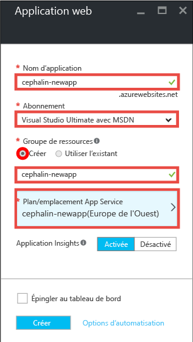
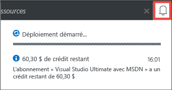
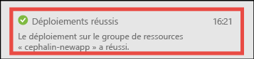
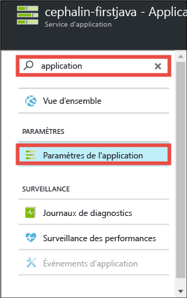
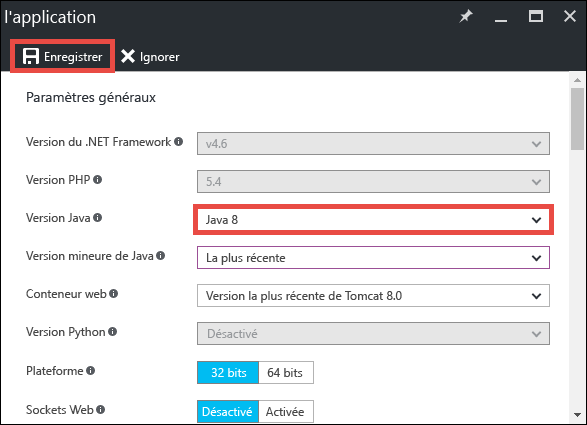
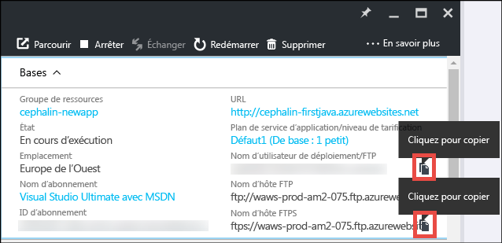
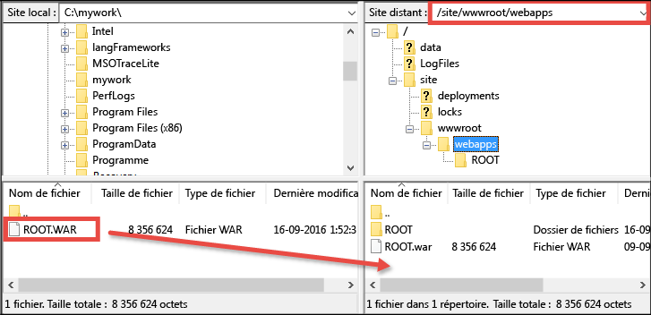

# Déployer votre première application web Java dans Azure en 5 minutes (CLI 2.0 version préliminaire)

> [!div class="op_single_selector"]
> * [Premier site HTML](app-service-web-get-started-html-cli-nodejs.md)
> * [Première application .NET](app-service-web-get-started-dotnet-cli-nodejs.md)
> * [Première application  PHP](app-service-web-get-started-php-cli-nodejs.md)
> * [Première application Node.js](app-service-web-get-started-nodejs-cli-nodejs.md)
> * [Première application Python](app-service-web-get-started-python-cli-nodejs.md)
> * [Première application Java](app-service-web-get-started-java.md)
> 
> 

Dans ce didacticiel, vous découvrirez comment déployer une application web Java simple dans [Azure App Service](../app-service/app-service-value-prop-what-is.md).
App Service permet de créer des applications web, des[back-ends d’applications mobiles](/documentation/learning-paths/appservice-mobileapps/) et des [applications API](../app-service-api/app-service-api-apps-why-best-platform.md).

Vous allez : 

* Créer une application web dans Azure App Service
* Déployer un exemple d’application Java
* Voir votre code s’exécuter dans un environnement de production

## Conditions préalables
* Obtenir un client FTP/FTPS, tel que [FileZilla](https://filezilla-project.org/).
* Obtenir un compte Microsoft Azure. Si vous n’avez pas de compte, vous pouvez [demander un essai gratuit](https://azure.microsoft.com/pricing/free-trial/?WT.mc_id=A261C142F) ou [activer les avantages de votre abonnement Visual Studio](https://azure.microsoft.com/pricing/member-offers/msdn-benefits-details/?WT.mc_id=A261C142F).

> [!NOTE]
> Vous pouvez [essayer App Service](http://go.microsoft.com/fwlink/?LinkId=523751) sans compte Azure. Créez une application de base et expérimentez-la pendant une heure, sans carte de paiement et sans engagement.
> 
> 

## Créer une application web
1. Connectez-vous au [portail Azure](https://portal.azure.com) avec votre compte Azure.
2. Dans le menu de gauche, cliquez sur **Nouveau** > **Web + mobile** > **Application web**.
   
    
3. Dans le panneau de création d’application, utilisez les paramètres suivants pour votre nouvelle application :
   
   * **Nom de l’application**: tapez un nom unique.
   * **Groupe de ressources** : sélectionnez **Créer** et donnez un nom au groupe de ressources.
   * **Plan App Service/Emplacement** : cliquez sur cette option pour la configurer, puis cliquez sur **Créer** pour définir le nom, l’emplacement et le niveau tarifaire du plan App Service. N’hésitez pas à utiliser le niveau tarifaire **Gratuit** .
     
     Lorsque vous avez terminé, le panneau de création de votre application doit ressembler à ceci :
     
     
4. Cliquez sur l’option **Créer** au bas du panneau. Pour afficher la progression, cliquez sur l’icône **Notification** située en haut.
   
    
5. Une fois le déploiement terminé, le message de notification ci-dessous doit s’afficher. Cliquez sur ce message pour ouvrir le panneau de votre déploiement.
   
    
6. Dans le panneau **Déploiement réussi**, cliquez sur le lien **Ressource** pour ouvrir le panneau de votre nouvelle application web.
   
    

## Déployer une application Java dans votre application web
À présent, nous allons déployer une application Java dans Azure à l’aide du protocole FTPS.

1. Dans le panneau de l’application web, accédez au menu **Paramètres de l’application** ou recherchez-le, puis cliquez dessus. 
   
    
2. Dans **Version de Java**, sélectionnez **Java 8**, puis cliquez sur **Enregistrer**.
   
    
   
    Lorsque vous recevez la notification **Les paramètres de l’application web ont été mis à jour**, accédez à http://*&lt;appname>*.azurewebsites.net pour voir le servlet JSP par défaut à l’œuvre.
3. De retour dans le panneau de l’application web, accédez au menu **Options de déploiement** ou recherchez-le, puis cliquez dessus.
4. Définissez vos informations d’identification de déploiement et cliquez sur **Enregistrer**.
5. Dans le panneau de l’application web, cliquez sur **Vue d’ensemble**. En regard de **Nom d’utilisateur FTP/Déploiement** et **Nom d’hôte FTPS**, cliquez sur le bouton **Copier** pour copier ces valeurs.
   
    
   
    Vous êtes maintenant prêt à déployer votre application Java avec le protocole FTPS.
6. Dans votre client FTP/FTPS, connectez-vous au serveur FTP de votre application web Azure en utilisant les valeurs copiées à l’étape précédente. Utilisez le mot de passe de déploiement créé précédemment.
   
    La capture d’écran suivante illustre la connexion à l’aide de FileZilla.
   
    
   
    Il se peut qu’Azure affiche des avertissements de sécurité relatifs au certificat SSL non reconnu. Ignorez-les et continuez.
7. Cliquez sur [ce lien](https://github.com/Azure-Samples/app-service-web-java-get-started/raw/master/webapps/ROOT.war) pour télécharger le fichier WAR sur votre ordinateur local.
8. Dans votre client FTP/FTPS, accédez au répertoire **/site/wwwroot/webapps** du site distant et faites-y glisser le fichier WAR téléchargé sur votre ordinateur local.
   
    
   
    Cliquez sur **OK** pour remplacer le fichier dans Azure.
   
   > [!NOTE]
   > Conformément au comportement par défaut de Tomcat, le nom de fichier **ROOT.war** dans /site/wwwroot/webapps vous donne l’application web racine (http://*&lt;nom_application>*.azurewebsites.net) et le nom de fichier ***&lt;nom_quelconque>*.war** vous donne une application web nommée (http://*&lt;nom_application>*.azurewebsites.net/*&lt;nom_quelconque>*).
   > 
   > 

Et voilà ! Votre application Java s’exécute désormais dans Azure. Dans votre navigateur, accédez à http://*&lt;nom_app>*.azurewebsites.net pour la voir à l’œuvre. 

## Mettre à jour votre application
Chaque fois que vous avez besoin d’effectuer une mise à jour, il vous suffit de charger le fichier WAR dans le même répertoire distant à l’aide de votre client FTP/FTPS.

## Étapes suivantes
[Créez une application web Java à partir d’un modèle dans Azure Marketplace](web-sites-java-get-started.md#marketplace). Vous pouvez obtenir votre propre conteneur Tomcat entièrement personnalisable et profiter de l’interface de gestion familière. 

Déboguez votre application web Azure directement dans [IntelliJ](app-service-web-debug-java-web-app-in-intellij.md) ou [Eclipse](app-service-web-debug-java-web-app-in-eclipse.md).

Ou faites-en plus avec votre première application web. Par exemple :

* Essayez [d’autres méthodes de déploiement de votre code dans Azure](web-sites-deploy.md). 
* Donnez une nouvelle dimension à votre application Azure. Authentifiez vos utilisateurs. Faites évoluer sa capacité en fonction de la demande. Configurez des alertes de performance. Tout cela en seulement quelques clics. Consultez l’article [Ajouter des fonctionnalités à votre première application web](app-service-web-get-started-2.md).

<!--HONumber=Jan17_HO1-->

