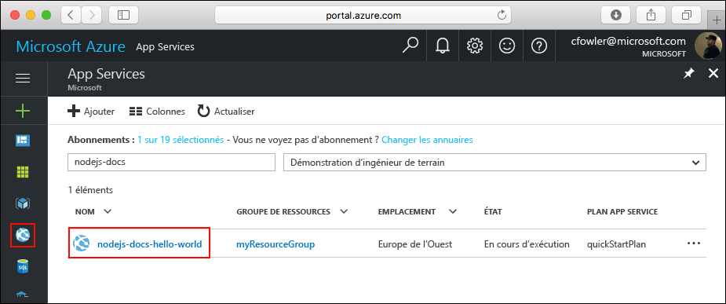

# <a name="create-a-nodejs-application-on-web-app"></a>Créer une application Node.js sur application web

Ce didacticiel de démarrage rapide vous guide dans le développement et le déploiement d’une application Node.js dans Azure. Nous allons exécuter l’application à l’aide d’un service Azure App basé sur Linux et créer et configurer une nouvelle application web à l’aide de l’interface CLI Azure. Nous allons ensuite utiliser GIT pour déployer notre application Node.js sur Azure.


Vous pouvez suivre les étapes ci-dessous à l’aide d’un ordinateur Mac, Windows ou Linux. Terminer toutes les étapes ci-dessous ne devrait vous prendre que 5 minutes environ.

## <a name="before-you-begin"></a>Avant de commencer

Avant d’exécuter cet exemple, installez localement les éléments suivants :

1. [Téléchargement et installation de GIT](https://git-scm.com/)
1. [Téléchargement et installation de Node.js et NPM](https://nodejs.org/)
1. Téléchargement et installation de l’interface [Azure CLI 2.0](https://docs.microsoft.com/cli/azure/install-azure-cli)

[!INCLUDE [quickstarts-free-trial-note](../../includes/quickstarts-free-trial-note.md)]

## <a name="download-the-sample"></a>Télécharger l’exemple

Cloner le référentiel d’application exemple Hello World sur votre ordinateur local.

```bash
git clone https://github.com/Azure-Samples/nodejs-docs-hello-world
```

> [!TIP]
> Vous pouvez également [Télécharger l’exemple](https://github.com/Azure-Samples/nodejs-docs-hello-world/archive/master.zip) sous forme de fichier zip et l’extraire.

Passez au répertoire qui contient l’extrait de code.

```bash
cd nodejs-docs-hello-world
```

## <a name="run-the-app-locally"></a>Exécutez l’application localement.

Exécutez l’application localement en ouvrant une fenêtre de terminal et en utilisant le script `npm start` pour que l’exemple lance le serveur http intégré Node.js.

```bash
npm start
```

Ouvrez un navigateur web et accédez à l’exemple.

```bash
http://localhost:1337
```

Vous pouvez voir le message **Hello World** à partir de l’exemple d’application affiché dans la page.


Dans la fenêtre de terminal, appuyez sur **Ctrl + C** pour quitter le serveur web.

## <a name="log-in-to-azure"></a>Connexion à Azure

Nous allons maintenant utiliser l’interface Azure CLI 2.0 dans une fenêtre de terminal pour créer les ressources nécessaires pour héberger notre application Node.js dans Azure. Connectez-vous à votre abonnement Azure avec la commande [az login](/cli/azure/#login) et suivez les instructions à l’écran.

```azurecli
az login
```

## <a name="configure-a-deployment-user"></a>Configurer un utilisateur de déploiement

Pour FTP et Git local, il est nécessaire de disposer d’un utilisateur de déploiement configuré sur le serveur pour authentifier votre déploiement. La création d’un utilisateur de déploiement est une configuration unique, notez le nom d’utilisateur et le mot de passe car ils seront utilisés dans une étape ultérieure.

> [!NOTE]
> Un utilisateur de déploiement est requis pour le déploiement FTP et Git Local vers une application web.
> Le `username` et `password` sont liés aux comptes, par conséquent, ils sont différents de vos informations d’identification de l’abonnement Azure. Ces informations d’identification ne doivent être créées qu’une seule fois.
>

Utilisez la commande [az appservice web deployment user set](/cli/azure/appservice/web/deployment/user#set) pour créer vos informations d’identification au niveau des comptes.

```azurecli
az appservice web deployment user set --user-name <username> --password <password>
```

## <a name="create-a-resource-group"></a>Créer un groupe de ressources

Créez un groupe de ressources avec [az group create](/cli/azure/group#create). Un groupe de ressources Azure est un conteneur logique dans lequel les ressources Azure comme les applications web, les bases de données et les comptes de stockage sont déployées et gérées.

```azurecli
az group create --name myResourceGroup --location westeurope
```

## <a name="create-an-azure-app-service"></a>Créez un Azure App Service

Créez un plan App Service basé sur Linux avec la commande [az appservice plan create](/cli/azure/appservice/plan#create).

> [!NOTE]
> Un plan App Service représente la collection des ressources physiques utilisées pour héberger vos applications. Toutes les applications affectées à un plan App Service partagent les ressources qu’il définit, ce qui vous permet de réduire les coûts lors de l’hébergement de plusieurs applications.
>
> Les plans App Service définissent :
> * Région (Europe du Nord, États-Unis de l’Est, Sud-Est asiatique)
> * La taille d’instance (« Petit », « Moyen », « Grand »)
> * Comptage (un, deux ou trois instances, etc.)
> * Référence (SKU) (gratuit, partagé, basique, standard, premium)
>

L’exemple suivant crée un plan App Service sur les Worker Linux nommés `quickStartPlan` à l’aide du niveau tarifaire **Standard**.

```azurecli
az appservice plan create --name quickStartPlan --resource-group myResourceGroup --sku S1 --is-linux
```

Lorsque le plan App Service a été créé, l’interface Azure CLI affiche des informations similaires à l’exemple suivant.

```json
{
    "id": "/subscriptions/00000000-0000-0000-0000-000000000000/resourceGroups/myResourceGroup/providers/Microsoft.Web/serverfarms/quickStartPlan",
    "kind": "linux",
    "location": "West Europe",
    "sku": {
    "capacity": 1,
    "family": "S",
    "name": "S1",
    "tier": "Standard"
    },
    "status": "Ready",
    "type": "Microsoft.Web/serverfarms"
}
```

## <a name="create-a-web-app"></a>Créer une application web

Maintenant qu’un plan App Service a été créé, créez une application web dans le plan App Service`quickStartPlan`. L’application web nous offre un espace d’hébergement pour déployer notre code et fournit également une URL pour nous permettre d’afficher l’application déployée. Utilisez la commande [az appservice web create](/cli/azure/appservice/web#create) pour créer l’application web.

Dans la commande ci-dessous, remplacez le nom unique de votre propre application là où se trouve l’espace réservé <nom_de_l’application>. Le <nom_de_l’application> sera utilisé en tant que site DNS par défaut pour l’application web, le nom doit donc être unique sur l’ensemble des applications dans Azure. Vous pouvez ultérieurement mapper toute entrée DNS personnalisée vers l’application web avant de l’exposer à vos utilisateurs.

```azurecli
az appservice web create --name <app_name> --resource-group myResourceGroup --plan quickStartPlan
```

Lorsque l’application web a été créée, l’interface Azure CLI affiche des informations similaires à l’exemple suivant.

```json
{
    "clientAffinityEnabled": true,
    "defaultHostName": "<app_name>.azurewebsites.net",
    "id": "/subscriptions/00000000-0000-0000-0000-000000000000/resourceGroups/myResourceGroup/providers/Microsoft.Web/sites/<app_name>",
    "isDefaultContainer": null,
    "kind": "app",
    "location": "West Europe",
    "name": "<app_name>",
    "repositorySiteName": "<app_name>",
    "reserved": true,
    "resourceGroup": "myResourceGroup",
    "serverFarmId": "/subscriptions/00000000-0000-0000-0000-000000000000/resourceGroups/myResourceGroup/providers/Microsoft.Web/serverfarms/quickStartPlan",
    "state": "Running",
    "type": "Microsoft.Web/sites",
}
```

Accédez au site pour voir votre application web nouvellement créé.

```bash
http://<app_name>.azurewebsites.net
```


Nous avons maintenant créé une nouvelle application web vide dans Azure. Configurons maintenant notre application web pour utiliser Node.js et y déployer notre application.

## <a name="configure-to-use-nodejs"></a>Configurer l’utilisation de Node.js

Utilisez la commande [az appservice web config update](/cli/azure/app-service/web/config#update) pour configurer l’application web pour utiliser la version de Node.js `6.9.3`.

> [!TIP]
> Définir la version de node.js ainsi utilise un conteneur par défaut fourni par la plate-forme, si vous souhaitez utiliser votre propre conteneur reportez-vous à la référence de l’interface CLI pour la commande [az appservice web config container update](/cli/azure/appservice/web/config/container#update).

```azurecli
az appservice web config update --linux-fx-version "NODE|6.9.3" --startup-file process.json --name <app_name> --resource-group myResourceGroup
```

## <a name="configure-local-git-deployment"></a>Configuration du déploiement Git local

Vous pouvez déployer dans votre application web de plusieurs façons, notamment FTP, Git local ainsi que GitHub, Visual Studio Team Services et Bitbucket.

Utilisez la commande [az appservice web source-control config-local-git](/cli/azure/appservice/web/source-control#config-local-git) pour configurer l’accès Git local à l’application web.

```azurecli
az appservice web source-control config-local-git --name <app_name> --resource-group myResourceGroup --query url --output tsv
```

Copiez la sortie à partir du terminal car elle sera utilisée à l’étape suivante.

```bash
https://<username>@<app_name>.scm.azurewebsites.net:443/<app_name>.git
```

## <a name="push-to-azure-from-git"></a>Effectuez une transmission de type push vers Azure à partir de Git

Ajoutez un référentiel distant Azure dans votre référentiel Git local.

```bash
git remote add azure <paste-previous-command-output-here>
```

Effectuez une transmission de type push vers Azure Remote pour déployer votre application. Le mot de passe que vous avez fourni précédemment dans le cadre de la création de l’utilisateur du déploiement vous sera demandé.

```azurecli
git push azure master
```

Au cours du déploiement, Azure App Service communiquera sa progression avec Git.

```bash
Counting objects: 23, done.
Delta compression using up to 4 threads.
Compressing objects: 100% (21/21), done.
Writing objects: 100% (23/23), 3.71 KiB | 0 bytes/s, done.
Total 23 (delta 8), reused 7 (delta 1)
remote: Updating branch 'master'.
remote: Updating submodules.
remote: Preparing deployment for commit id 'bf114df591'.
remote: Generating deployment script.
remote: Generating deployment script for node.js Web Site
remote: Generated deployment script files
remote: Running deployment command...
remote: Handling node.js deployment.
remote: Kudu sync from: '/home/site/repository' to: '/home/site/wwwroot'
remote: Copying file: '.gitignore'
remote: Copying file: 'LICENSE'
remote: Copying file: 'README.md'
remote: Copying file: 'index.js'
remote: Copying file: 'package.json'
remote: Copying file: 'process.json'
remote: Deleting file: 'hostingstart.html'
remote: Ignoring: .git
remote: Using start-up script index.js from package.json.
remote: Node.js versions available on the platform are: 4.4.7, 4.5.0, 6.2.2, 6.6.0, 6.9.1.
remote: Selected node.js version 6.9.1. Use package.json file to choose a different version.
remote: Selected npm version 3.10.8
remote: Finished successfully.
remote: Running post deployment command(s)...
remote: Deployment successful.
To https://<app_name>.scm.azurewebsites.net:443/<app_name>.git
 * [new branch]      master -> master
```

## <a name="browse-to-the-app"></a>Accédez à l’application

Accédez à l’application déployée à l’aide de votre navigateur web.

```bash
http://<app_name>.azurewebsites.net
```

Cette fois, la page qui affiche le message Hello World est en cours d’exécution à l’aide de notre code Node.js qui s’exécute en tant qu’application web Azure App Service.

## <a name="updating-and-deploying-the-code"></a>Mise à jour et déploiement du code

À l’aide d’un éditeur de texte local, ouvrez le fichier `index.js` dans l’application Node.js et effectuez une petite modification du texte contenu dans l’appel pour `response.end`:

```nodejs
response.end("Hello Azure!");
```

Valider vos modifications dans Git, puis envoyer les modifications de code vers Azure.

```bash
git commit -am "updated output"
git push azure master
```

Une fois le déploiement terminé, revenez à la fenêtre du navigateur ouverte dans le navigateur à l’étape de l’application et cliquez sur actualiser.


## <a name="manage-your-new-azure-web-app"></a>Gérer votre nouvelle application web Azure

Accédez au portail Azure pour voir l’application web que vous venez de créer.

Pour ce faire, connectez-vous à : [https://portal.azure.com](https://portal.azure.com).

Dans le menu de gauche, cliquez sur **App Service**, puis cliquez sur le nom de votre application web Azure.



Vous êtes dans le _panneau_ de votre application web (une page de portail qui s’ouvre horizontalement).

Par défaut, le panneau de votre application web affiche la page de **Présentation**. Cette page vous donne un aperçu de votre application. Ici, vous pouvez également effectuer des tâches de gestion de base telles que parcourir, arrêter, démarrer, redémarrer et supprimer. Les onglets sur le côté gauche du panneau affichent les différentes pages de configuration que vous pouvez ouvrir.


Ces onglets dans le panneau affichent les nombreuses fonctionnalités exceptionnelles que vous pouvez ajouter à votre application web. La liste suivante vous fournit quelques exemples des possibilités :

* Mapper un nom DNS personnalisé
* Lier un certificat SSL personnalisé
* Configurer le déploiement continu
* Adapter la taille des sites
* Ajouter une authentification utilisateur

**Félicitations !** Vous avez déployé votre première application Node.js dans App Service.

[!INCLUDE [cli-samples-clean-up](../../includes/cli-samples-clean-up.md)]

## <a name="next-steps"></a>Étapes suivantes

Explorez les [scripts d’interface CLI des applications web](app-service-cli-samples.md) créés au préalable.
