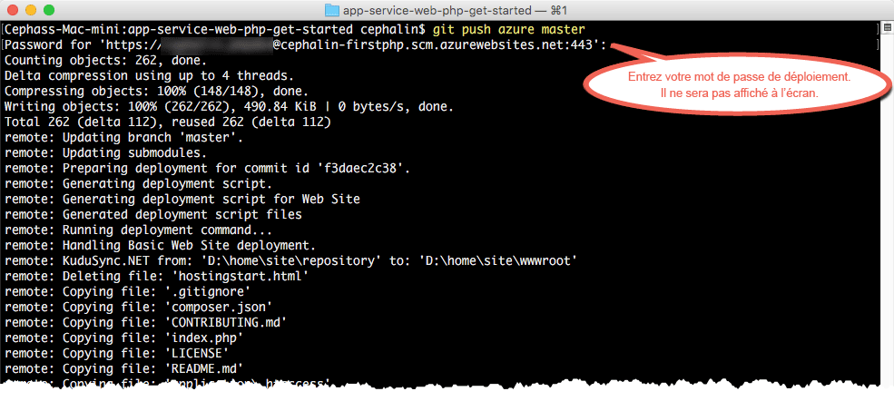

# Déployer votre première application web PHP dans Azure en 5 minutes (CLI 2.0 version préliminaire)
[!INCLUDE [app-service-web-selector-get-started](../../includes/app-service-web-selector-get-started.md)]

Dans ce didacticiel, vous découvrirez comment déployer votre première application web PHP dans [Azure App Service](../app-service/app-service-value-prop-what-is.md).
App Service permet de créer des applications web, des[back-ends d’applications mobiles](/documentation/learning-paths/appservice-mobileapps/) et des [applications API](../app-service-api/app-service-api-apps-why-best-platform.md).

Vous allez : 

* Créer une application web dans Azure App Service
* Déployer un exemple de code PHP
* Voir votre code s’exécuter dans un environnement de production
* Mettre à jour votre application web de la même façon que vous [transmettez des validations Git](https://git-scm.com/docs/git-push)

[!INCLUDE [app-service-linux](../../includes/app-service-linux.md)]

## Versions de l’interface de ligne de commande permettant d’effectuer la tâche

Vous pouvez exécuter la tâche en utilisant l’une des versions suivantes de l’interface de ligne de commande (CLI) :

- [Azure CLI 1.0](app-service-web-get-started-php-cli-nodejs.md) : notre interface de ligne de commande pour les modèles de déploiement Classique et Resource Manager
- [Azure CLI 2.0](app-service-web-get-started-php.md) : notre interface de ligne de commande nouvelle génération pour le modèle de déploiement Resource Manager

## Composants requis
* [Git](http://www.git-scm.com/downloads).
* [Azure CLI 2.0 version préliminaire](/cli/azure/install-az-cli2).
* Un compte Microsoft Azure Si vous n’avez pas de compte, vous pouvez [vous inscrire pour un essai gratuit](https://azure.microsoft.com/pricing/free-trial/?WT.mc_id=A261C142F) ou [activer les avantages de votre abonnement Visual Studio](https://azure.microsoft.com/pricing/member-offers/msdn-benefits-details/?WT.mc_id=A261C142F).

> [!NOTE]
> Vous pouvez [essayer App Service](https://azure.microsoft.com/try/app-service/) sans compte Azure. Créez une application de base et expérimentez-la pendant une heure, sans carte de paiement et sans engagement.
> 
> 

## Déployer une application web PHP
1. Ouvrez une nouvelle invite de commandes Windows, une fenêtre PowerShell, un interpréteur de commandes Linux ou un terminal OS X. Exécutez `git --version` et `az --version` pour vérifier que Git et l’interface de ligne de commande Azure sont installés sur votre ordinateur.
   
    
   
    Si les outils ne sont pas installés, consultez la [Configuration requise](#Prerequisites) pour accéder aux liens de téléchargement.
2. Connectez-vous au portail Azure :
   
        az login
   
    Appuyez-vous sur le message d’aide pour poursuivre le processus de connexion.
   
    

3. Définissez l’utilisateur de déploiement pour App Service. Vous déploierez le code ultérieurement à l’aide de ces informations d’identification.
   
        az appservice web deployment user set --user-name <unique-username> --password <8-char-or-longer-password-letters-and-numbers>

3. Créez un [groupe de ressources](../azure-resource-manager/resource-group-overview.md). Pour ce premier didacticiel App Service, il n’est pas vraiment nécessaire de vous familiariser avec l’outil.

        az group create --location "<location>" --name my-first-app-group

    Pour connaître les valeurs possibles que vous pouvez utiliser pour `<location>`, utilisez la commande CLI `az appservice list-locations`.

3. Créez un [plan App Service plan](../app-service/azure-web-sites-web-hosting-plans-in-depth-overview.md) appelé « FREE ». Pour ce premier didacticiel App Service, sachez que vous ne serez pas facturé pour les applications web utilisées dans ce plan.

        az appservice plan create --name my-free-appservice-plan --resource-group my-first-app-group --sku FREE

4. Créez une application web avec un nom unique dans `<app_name>`.

        az appservice web create --name <app_name> --resource-group my-first-app-group --plan my-free-appservice-plan

4. Vous obtenez ensuite l’exemple de code que vous souhaitez déployer. Passez à un répertoire de travail (`CD`) et clonez l’exemple d’application comme ce qui suit :
   
        cd <working_directory>
        git clone https://github.com/Azure-Samples/app-service-web-php-get-started.git

5. Passez au référentiel de votre exemple d’application. Par exemple :
   
        cd app-service-web-php-get-started
5. Configurez le déploiement Git local pour votre application web App Service avec la commande suivante :

        az appservice web source-control config-local-git --name <app_name> --resource-group my-first-app-group

    Vous obtenez une sortie JSON similaire à ce qui suit, ce qui signifie que le référentiel Git distant est configuré :

        {
        "url": "https://<deployment_user>@<app_name>.scm.azurewebsites.net/<app_name>.git"
        }

6. Ajoutez l’URL dans le fichier JSON en tant que Git distant pour votre référentiel local (appelé `azure` par souci de simplicité).

        git remote add azure https://<deployment_user>@<app_name>.scm.azurewebsites.net/<app_name>.git
   
7. Déployez votre exemple de code dans votre application Azure de la même façon que vous transmettez du code avec Git. Lorsque vous y êtes invité, utilisez le mot de passe que vous avez configuré précédemment.
   
        git push azure master
   
    
   
    `git push` injecte non seulement du code dans Azure, mais déclenche également des tâches de déploiement dans le moteur de déploiement. Vous pouvez également  [activer l’extension Composer](web-sites-php-mysql-deploy-use-git.md#composer) afin de traiter automatiquement les fichiers composer.json dans votre application PHP.

Félicitations, vous avez déployé votre application vers Azure App Service.

## Exécuter votre application en temps réel
Pour voir votre application en cours d’exécution dans Azure, exécutez cette commande à partir de n’importe quel répertoire de votre référentiel :

    az appservice web browse --name <app_name> --resource-group my-first-app-group

## Mettre à jour votre application
Vous pouvez désormais utiliser Git pour transmettre votre code depuis la racine (référentiel) de votre projet dès que vous avez besoin d’apporter une mise à jour au site en ligne. Pour ce faire, il vous suffit de suivre la même procédure que pour le déploiement initial de votre code. Par exemple, chaque fois que vous voulez transmettre une nouvelle modification que vous avez testée localement, exécutez simplement les commandes suivantes depuis la racine (référentiel) de votre projet :

    git add .
    git commit -m "<your_message>"
    git push azure master

## Étapes suivantes
[Créez, configurez et déployez une application web Laravel dans Azure](app-service-web-php-get-started.md). En suivant ce didacticiel, vous acquerrez les compétences de base nécessaires pour exécuter n’importe quelle application web PHP dans Azure. Vous apprendrez notamment à :

* Créer et configurer des applications dans Azure depuis PowerShell/Bash
* Définir la version PHP
* Utiliser un fichier de démarrage qui ne se trouve pas dans le répertoire de l’application racine
* Activer l’automatisation de Composer
* Accéder à des variables propres à l’environnement
* Résoudre les problèmes courants

Ou faites-en plus avec votre première application web. Par exemple :

* Essayez [d’autres méthodes de déploiement de votre code dans Azure](web-sites-deploy.md). Par exemple, pour effectuer un déploiement à partir de l’un de vos référentiels GitHub, sélectionnez simplement **GitHub** au lieu de **Dépôt Git local** dans **Options de déploiement**.
* Donnez une nouvelle dimension à votre application Azure. Authentifiez vos utilisateurs. Faites évoluer sa capacité en fonction de la demande. Configurez des alertes de performance. Tout cela en seulement quelques clics. Consultez l’article [Ajouter des fonctionnalités à votre première application web](app-service-web-get-started-2.md).

