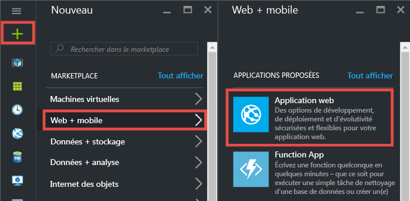
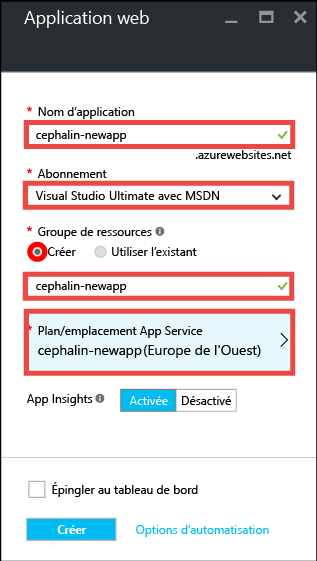
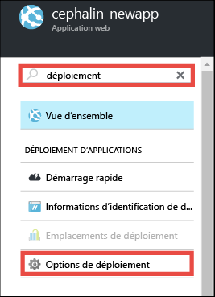
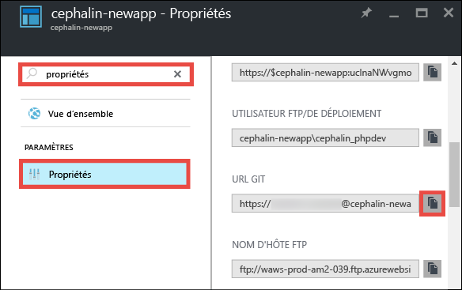

<properties 
	pageTitle="Déployer votre première application web sur Azure en 5 minutes | Microsoft Azure" 
	description="Découvrez la facilité avec laquelle vous pouvez exécuter des applications web dans App Service en déployant un exemple d’application. Commencez à développer pour de vrai en rapidement, et voyez les résultats immédiatement." 
	services="app-service\web"
	documentationCenter=""
	authors="cephalin"
	manager="wpickett"
	editor=""
/>

<tags
	ms.service="app-service-web"
	ms.workload="web"
	ms.tgt_pltfrm="na"
	ms.devlang="na"
	ms.topic="hero-article"
	ms.date="09/09/2016" 
	ms.author="cephalin"
/>
	
# Déployer votre première application web sur Azure en 5 minutes

Dans ce didacticiel, vous découvrirez comment déployer votre première application web vers [Azure App Service](../app-service/app-service-value-prop-what-is.md). App Service vous permet de créer des applications web, des [backends d’applications mobiles](/documentation/learning-paths/appservice-mobileapps/) et des [applications API](../app-service-api/app-service-api-apps-why-best-platform.md).

Vous allez :

- Créer une application web dans Azure App Service.
- Déployer un exemple de code (vous avez le choix entre ASP.NET, PHP, Node.js, Java ou Python).
- Voir votre code s’exécuter en production.
- mettre à jour votre application web de la même façon que vous transférez des validations [Git](https://git-scm.com/docs/git-push).

## Composants requis

- [Installez Git](http://www.git-scm.com/downloads). Vérifiez que votre installation a réussi en exécutant `git --version` à partir d’une nouvelle invite de commande Windows, d’une fenêtre PowerShell, d’un interpréteur de commande Linux ou d’un terminal OS X.
- Obtenir un compte Microsoft Azure. Si vous n’avez pas de compte, vous pouvez [demander un essai gratuit](/pricing/free-trial/?WT.mc_id=A261C142F) ou [activer les avantages de votre abonnement Visual Studio](/pricing/member-offers/msdn-benefits-details/?WT.mc_id=A261C142F).

>[AZURE.NOTE] Vous pouvez [Essayer App Service](http://go.microsoft.com/fwlink/?LinkId=523751) sans compte Azure. Créez une application de démarrage et expérimentez-la pendant une heure – aucun engagement ni carte de crédit requis.

## Créer une application web

1. Connectez-vous au [Portail Azure](https://portal.azure.com) avec votre compte Azure.

2. Dans le menu de gauche, cliquez sur **Nouveau** > **Web + mobile** > **Application web**.

    

3. Dans le panneau de création d’application, utilisez les paramètres suivants pour votre nouvelle application :

    - **Nom de l’application** : tapez un nom unique.
    - **Groupe de ressources** : sélectionnez **Créer** et donnez un nom au groupe de ressources.
    - **Plan App Service/Emplacement** : cliquez sur cette option pour la configurer, puis cliquez sur **Créer** pour définir le nom, l’emplacement et le niveau tarifaire du plan App Service. N’hésitez pas à utiliser le niveau tarifaire **Gratuit**.

    Lorsque vous avez terminé, le panneau de création de votre application doit ressembler à ceci :

    

3. Cliquez sur l’option **Créer** figurant en bas. Vous pouvez cliquer sur l’icône **Notification** en haut pour voir la progression.

    

4. Lorsque le déploiement est terminé, vous devez voir ce message de notification. Cliquez sur le message pour ouvrir le panneau de votre déploiement.

    

5. Dans le panneau **Déploiement réussi**, cliquez sur le lien **Ressources** pour ouvrir le panneau de votre nouvelle application web.

    

## Déployer le code sur votre application web

À présent, nous allons déployer du code vers Azure à l’aide de Git.

5. Dans le panneau de l’application web, accédez aux **Options de déploiement** ou recherchez-les, puis cliquez dessus.

    

6. Cliquez sur **Choisir la source** > **Référentiel Git local** > **OK**.

7. De retour dans le panneau de l’application web, cliquez sur **Informations d’identification de déploiement**.

8. Définissez vos informations d’identification de déploiement et cliquez sur **Enregistrer**.

7. De retour dans le panneau de l’application web, accédez aux **Propriétés** ou recherchez-les, puis cliquez dessus. En regard de **l’URL Git**, cliquez sur le bouton **Copier**.

    

    Vous êtes maintenant prêt à déployer votre code avec Git.

1. Dans votre terminal de ligne de commande, passez à un répertoire de travail (`CD`) et clonez l’exemple d’application comme suit :

        git clone <github_sample_url>

    

    Pour *&lt;github\_sample\_url>*, utilisez l’une des URL suivantes, en fonction de l’infrastructure souhaitée :

    - HTML+CSS+JS : [https://github.com/Azure-Samples/app-service-web-html-get-started.git](https://github.com/Azure-Samples/app-service-web-html-get-started.git)
    - ASP.NET : [https://github.com/Azure-Samples/app-service-web-dotnet-get-started.git](https://github.com/Azure-Samples/app-service-web-dotnet-get-started.git)
    - PHP (CodeIgniter) : [https://github.com/Azure-Samples/app-service-web-php-get-started.git](https://github.com/Azure-Samples/app-service-web-php-get-started.git)
    - Node.js (Express) : [https://github.com/Azure-Samples/app-service-web-nodejs-get-started.git](https://github.com/Azure-Samples/app-service-web-nodejs-get-started.git)
    - Java : [https://github.com/Azure-Samples/app-service-web-java-get-started.git](https://github.com/Azure-Samples/app-service-web-java-get-started.git)
    - Python (Django) : [https://github.com/Azure-Samples/app-service-web-python-get-started.git](https://github.com/Azure-Samples/app-service-web-python-get-started.git)

2. Passez au référentiel de votre exemple d’application. Par exemple,

        cd app-service-web-html-get-started

3. Configurez le Git distant pour votre application Azure et son URL Git, que vous avez copiée à partir du Portail, quelques étapes auparavant.

        git remote add azure <giturlfromportal>

4. Déployez votre exemple de code dans votre application Azure de la même manière que si vous transfériez un code avec Git :

        git push azure master

    

    Si vous avez utilisé l’une des infrastructures de langage, vous verrez une sortie différente. Cela est dû au fait que `git push` injecte non seulement du code dans Azure, mais déclenche également des tâches de déploiement dans le moteur de déploiement. Si vous disposez de fichiers package.json (Node.js) ou requirements.txt (Python) à la racine (référentiel) du projet, ou si vous avez un fichier packages.config dans votre projet ASP.NET, le script de déploiement restaure les packages requis à votre place. Vous pouvez également [activer l’extension Composer](web-sites-php-mysql-deploy-use-git.md#composer) afin de traiter automatiquement les fichiers composer.json dans votre application PHP.

Et voilà ! Votre code s’exécute désormais dans Azure. Dans votre navigateur, accédez à http://*&lt;appname>*. azurewebsites.net pour le voir en action.

## Mettre à jour votre application

Vous pouvez désormais procéder à un transfert depuis la racine (référentiel) de votre projet à tout moment à l’aide de Git. Vous pouvez ainsi effectuer des mises à jour du site web en activité. Vous pouvez utiliser la même procédure que celle que vous avez utilisée lors du déploiement de votre code pour la première fois. Par exemple : chaque fois que vous voulez transférer la modification que vous avez testée localement, exécutez simplement les commandes suivantes à partir de la racine (référentiel) du projet :

    git add .
    git commit -m "<your_message>"
    git push azure master

## Étapes suivantes

Recherchez les étapes de développement et de déploiement préférées pour votre infrastructure de langage :

> [AZURE.SELECTOR]
- [.NET](web-sites-dotnet-get-started.md)
- [PHP](app-service-web-php-get-started.md)
- [Node.JS](app-service-web-nodejs-get-started.md)
- [Python](web-sites-python-ptvs-django-mysql.md)
- [Java](web-sites-java-get-started.md)

Ou faites-en plus avec votre première application web. Par exemple :

- Essayez [d’autres méthodes de déploiement de votre code vers Azure](../app-service-web/web-sites-deploy.md). Par exemple, pour déployer à partir de l’un de vos référentiels GitHub, sélectionnez simplement **GitHub** au lieu de **Référentiel Git local** dans les **Options de déploiement**.
- Faites passer votre application Azure à la vitesse supérieure. Authentifiez vos utilisateurs. Mettez-la à l’échelle en fonction de la demande. Configurez des alertes de performance. Tout ceci en seulement quelques clics. Consultez l’article [Ajouter des fonctionnalités à votre première application web](app-service-web-get-started-2.md).

<!---HONumber=AcomDC_0914_2016-->