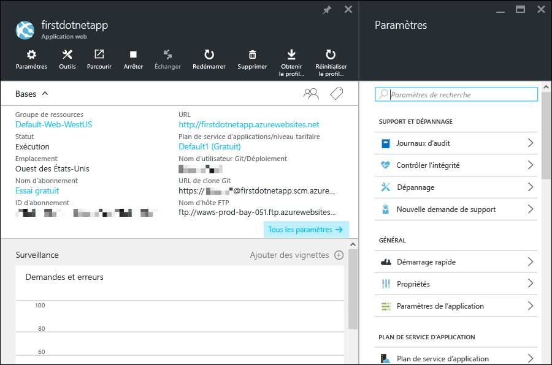

<properties 
	pageTitle="Prise en main des applications web dans Azure App Service." 
	description="Découvrez combien il est facile d’exécuter votre application web en direct dans App Service. Devenez développeur en 5 minutes ; obtenez immédiatement des résultats." 
	services="app-service\web"
	documentationCenter=""
	authors="cephalin" 
	manager="wpickett" 
	editor="" 
/>

<tags 
	ms.service="app-service-web" 
	ms.workload="web" 
	ms.tgt_pltfrm="na" 
	ms.devlang="na" 
	ms.topic="hero-article"
	ms.date="04/04/2016" 
	ms.author="cephalin"
/>
	
# Prise en main des applications web dans Azure App Service.

Ce didacticiel vous aide à vous familiariser rapidement avec le déploiement des applications web vers [Azure App Service](../app-service/app-service-value-prop-what-is.md). Avec une intervention limitée de votre part, vous allez pouvoir :

- déployer un exemple d’application web (vous avez le choix entre ASP.NET, PHP, Node.js, Java ou Python) ;
- exécuter votre application en quelques secondes ;
- mettre à jour votre application web de la même façon que vous transférez des validations [Git](http://www.git-scm.com/).

Vous jetterez également un premier regard sur le [portail Azure](https://portal.azure.com) et ses différentes fonctionnalités.

## Composants requis

Pour suivre ce didacticiel, vous avez besoin des éléments suivants :

- Git. Vous pouvez télécharger le fichier binaire d’installation [ici](http://www.git-scm.com/downloads). Vous devez être en mesure d’exécuter `git --version` à partir du terminal de ligne de commande de votre choix. 
- Connaissances élémentaires de Git.
- Interface de ligne de commande Azure Vous trouverez des instructions d’installation [ici](../xplat-cli-install.md). Vous devez être en mesure d’exécuter `azure --version` à partir du terminal de ligne de commande de votre choix.
- Un compte Microsoft Azure Si vous ne possédez pas de compte, vous pouvez [vous inscrire à une version d’évaluation gratuite](/pricing/free-trial/?WT.mc_id=A261C142F) ou [activer les avantages de votre abonnement Visual Studio](/pricing/member-offers/msdn-benefits-details/?WT.mc_id=A261C142F).

>[AZURE.NOTE] Pour voir en action Azure App Service avant d’ouvrir un compte Azure, accédez à [Essayer App Service](http://go.microsoft.com/fwlink/?LinkId=523751). De là, vous pouvez créer tout de suite une première application temporaire dans App Service. Aucune carte de crédit ni aucun engagement ne sont nécessaires.

## Déployer une application web

Déployons à présent une application web dans Azure App Service

1. Ouvrez une nouvelle invite de commandes Windows, un interpréteur de commandes Linux ou un terminal OS X et insérez `CD` dans un répertoire de travail. Clonez ensuite l’exemple d’application comme suit :

        git clone <github_sample_url>

    Pour *&lt;github\_sample\_url>*, utilisez l’une des URL suivantes, en fonction de l’infrastructure souhaitée :

    - ASP.NET : [https://github.com/Azure-Samples/app-service-web-dotnet-get-started.git](https://github.com/Azure-Samples/app-service-web-dotnet-get-started.git)
    - PHP (CodeIgniter) : [https://github.com/Azure-Samples/app-service-web-php-get-started.git](https://github.com/Azure-Samples/app-service-web-php-get-started.git)
    - Node.js (Express) : [https://github.com/Azure-Samples/app-service-web-nodejs-get-started.git](https://github.com/Azure-Samples/app-service-web-nodejs-get-started.git) 
    - Java : [https://github.com/Azure-Samples/app-service-web-java-get-started.git](https://github.com/Azure-Samples/app-service-web-java-get-started.git)
    - Python (Django) : [https://github.com/Azure-Samples/app-service-web-python-get-started.git](https://github.com/Azure-Samples/app-service-web-python-get-started.git)

2. `CD` dans le répertoire racine de votre exemple d’application. Par exemple,

        cd app-service-web-dotnet-get-started

3. Connectez-vous au portail Azure :

        azure login
    
    Suivez les instructions de l’invite pour poursuivre la connexion à un compte Microsoft associé à votre abonnement Azure.

4. Créez la ressource d’application d’App Service dans Azure avec un nom d’application unique à l’aide de la commande suivante.

        azure site create --git <app_name>
      
    >[AZURE.NOTE] Si vous n’avez jamais configuré les informations d’identification de déploiement pour votre abonnement Azure, vous serez invité à les créer. Ces informations d’identification (et non pas les informations d’identification de votre compte Azure) sont utilisées par App Service uniquement dans le cadre des déploiements Git et des connexions FTP.
    
    Votre application est maintenant créée dans Azure. Votre répertoire actuel a été initialisé avec Git et est connecté au nouvel App Service en tant que Git distant. Vous pouvez accéder à l’URL de l’application (http://&lt;app_name>.azurewebsites.net) pour visualiser la belle page HTML par défaut, mais essayons d’abord d’y amener votre propre code.

4. À présent, déployez votre exemple de code dans la nouvelle application App Service de la même manière que vous transfériez n’importe quel code avec Git :

        git push azure master 
    
    >[AZURE.NOTE] On vous demandera votre mot de passe de déploiement. Si vous débutez avec App Service, fournissez tout simplement le mot de passe de déploiement que vous venez de créer.
    
    `git push` injecte non seulement du code dans Azure, mais déclenche également des tâches de déploiement dans le moteur de déploiement. Si vous disposez de fichiers package.json (Node.js) ou requirements.txt (Python) dans la racine (référentiel) du projet, ou si vous avez un fichier packages.config dans votre projet ASP.NET, les scripts de déploiement restaurent les packages dont vous avez besoin. Vous pouvez également [activer l’extension Composer](web-sites-php-mysql-deploy-use-git.md#composer) afin de traiter automatiquement les fichiers composer.json dans votre application PHP.

Félicitations, vous avez déployé votre application vers Azure App Service.

## Exécuter votre application en temps réel

Pour voir votre application en cours d’exécution dans Azure, exécutez cette commande à partir de n’importe quel répertoire de votre référentiel :

    azure site browse

## Mettre à jour votre application

Vous pouvez désormais procéder à un transfert depuis la racine (référentiel) de votre projet à tout moment à l’aide de Git. Vous pouvez ainsi effectuer des mises à jour du site web en activité. Vous pouvez utiliser la même procédure que celle que vous avez utilisée lors du déploiement de votre application dans Azure pour la première fois. Par exemple : chaque fois que vous voulez transférer la modification que vous avez testée localement, exécutez simplement les commandes suivantes à partir de la racine (référentiel) du projet :
    
    git add .
    git commit -m "<your_message>"
    git push azure master

## Autres méthodes de déploiement

Il existe différentes façons de déployer votre application web. Le déploiement Git depuis un référentiel local n’en constitue qu’une seule. Vous pouvez assurer le déploiement directement depuis Visual Studio, assurer le déploiement en continu depuis GitHub, synchroniser à partir de DropBox ou de OneDrive, télécharger des fichiers via FTP, etc. Pour en savoir plus sur les options de déploiement, voir [Déploiement de votre application dans Azure App Service](../app-service-web/web-sites-deploy.md).

## Voir votre application sur le portail Azure

À présent, accédons au portail Azure pour voir ce que vous avez créé :

1. Connectez-vous au [portail Azure](https://portal.azure.com) avec le compte Microsoft associé à votre abonnement Azure.

2. Dans la barre à gauche, cliquez sur **App Services**.

3. Cliquez sur l’application que vous venez de créer pour ouvrir sa page dans le portail (nommée [panneau](../azure-portal-overview.md)). Le panneau **Paramètres** est également ouvert par défaut, pour plus de commodité.

    

Le panneau de portail de votre application App Service contient un ensemble de paramètres et d’outils que vous pouvez configurer, surveiller et sécuriser. Vous pouvez également les utiliser pour dépanner votre application. Prenez un moment pour vous familiariser avec cette interface en effectuant quelques tâches simples :

- Arrêtez l’application.
- Redémarrez l’application.
- Cliquez sur le lien **Groupe de ressources** pour afficher toutes les ressources déployées dans le groupe de ressources.
- Cliquez sur **Paramètres** > **Propriétés** pour voir d’autres informations relatives à votre application.
- Cliquez sur **Outils** pour accéder aux outils utiles pour la surveillance et le dépannage.  

## Étapes suivantes

Portez l’application que vous avez déployée à un niveau supérieur. Sécurisez-la grâce à l’authentification. Mettez-la à l’échelle en fonction de la demande. Configurez des alertes de performance. Tout ceci en seulement quelques clics. Voir [Prise en main d’Azure App Services, 2e partie](app-service-web-get-started-2.md).

Ou découvrez comment créer une application web pour App Service avec un environnement de langage spécifique :

- [Création d’une application web ASP.NET dans Azure App Service](web-sites-dotnet-get-started.md)
- [Créer une application web en PHP dans Microsoft Azure App Service](web-sites-php-mysql-deploy-use-git.md)
- [Créer une application web Node.js dans Azure App Service](web-sites-nodejs-develop-deploy-mac.md)
- [Créer une application web Java dans Azure App Service](web-sites-java-get-started.md)
- [Créer une application web Python dans Azure App Service](web-sites-python-ptvs-django-mysql.md)

Ou trouvez encore du contenu relatif à la plage d’applications que vous pouvez créer dans Azure App Service, notamment des applications web, des applications principales mobiles et des applications API.

- [Créer des applications web](/documentation/learning-paths/appservice-webapps/)
- [Créer des applications mobiles](/documentation/learning-paths/appservice-mobileapps/)
- [Créer des applications API](../app-service-api/app-service-api-apps-why-best-platform.md)

<!-----HONumber=AcomDC_0420_2016-->