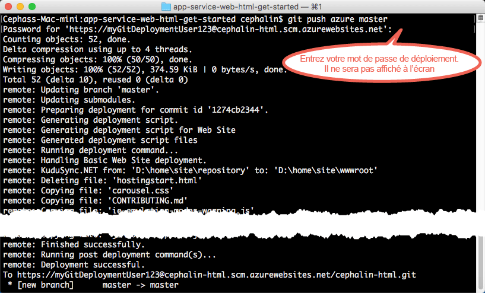

# Déployer votre première application web dans Azure en 5 minutes
Dans ce didacticiel, vous découvrirez comment déployer votre première application web dans [Azure App Service](../app-service/app-service-value-prop-what-is.md).
App Service permet de créer des applications web, des[back-ends d’applications mobiles](/documentation/learning-paths/appservice-mobileapps/) et des [applications API](../app-service-api/app-service-api-apps-why-best-platform.md).

Vous allez : 

* Créer une application web dans Azure App Service
* Déployer un exemple de code (vous avez le choix entre ASP.NET, PHP, Node.js, Java ou Python)
* Voir votre code s’exécuter dans un environnement de production
* Mettre à jour votre application web de la même façon que vous [transmettez des validations Git](https://git-scm.com/docs/git-push)

[!INCLUDE [app-service-linux](../../includes/app-service-linux.md)]

## Versions de la CLI permettant d’effectuer la tâche

Vous pouvez exécuter la tâche en utilisant l’une des versions suivantes de la CLI :

- [Azure CLI 1.0](app-service-web-get-started-cli-nodejs.md) : notre CLI pour les modèles de déploiement classiques et de gestion des ressources
- [Azure CLI 2.0 (version préliminaire)](app-service-web-get-started.md) : notre CLI nouvelle génération pour le modèle de déploiement de gestion des ressources

## Composants requis
* [Git](http://www.git-scm.com/downloads).
* [Azure CLI 2.0 version préliminaire](/cli/azure/install-az-cli2).
* Un compte Microsoft Azure Si vous n’avez pas de compte, vous pouvez [vous inscrire pour un essai gratuit](https://azure.microsoft.com/pricing/free-trial/?WT.mc_id=A261C142F) ou [activer les avantages de votre abonnement Visual Studio](https://azure.microsoft.com/pricing/member-offers/msdn-benefits-details/?WT.mc_id=A261C142F).

> [!NOTE]
> Vous pouvez [essayer App Service](http://go.microsoft.com/fwlink/?LinkId=523751) sans compte Azure. Créez une application de base et expérimentez-la pendant une heure, sans carte de paiement et sans engagement.
> 
> 

## Déployer une application web
Déployons à présent une application web dans Azure App Service

1. Ouvrez une nouvelle invite de commandes Windows, une fenêtre PowerShell, un interpréteur de commandes Linux ou un terminal OS X. Exécutez `git --version` et `azure --version` pour vérifier que Git et l’interface de ligne de commande Azure sont installés sur votre ordinateur.
   
    
   
    Si les outils ne sont pas installés, consultez la [Configuration requise](#Prerequisites) pour accéder aux liens de téléchargement.

2. Connectez-vous au portail Azure :
   
        az login
   
    Appuyez-vous sur le message d’aide pour poursuivre le processus de connexion.
   
    

3. Définissez l’utilisateur de déploiement pour App Service. Vous déploierez le code ultérieurement à l’aide de ces informations d’identification.
   
        az appservice web deployment user set --user-name <username> --password <password>

3. Créez un [groupe de ressources](../azure-resource-manager/resource-group-overview.md). Pour ce premier didacticiel App Service, il n’est pas vraiment nécessaire de vous familiariser avec l’outil.

        az group create --location "<location>" --name my-first-app-group

    Pour connaître les valeurs possibles que vous pouvez utiliser pour `<location>`, utilisez la commande CLI `az appservice list-locations`.

3. Créez un [plan App Service plan](../app-service/azure-web-sites-web-hosting-plans-in-depth-overview.md) appelé « FREE ». Pour ce premier didacticiel App Service, sachez que vous ne serez pas facturé pour les applications web utilisées dans ce plan.

        az appservice plan create --name my-free-appservice-plan --resource-group my-first-app-group --sku FREE

4. Créez une application web avec un nom unique dans `<app_name>`.

        az appservice web create --name <app_name> --resource-group my-first-app-group --plan my-free-appservice-plan

4. Vous obtenez ensuite des exemples de code que vous souhaitez déployer. Passez à un répertoire de travail (`CD`) et clonez l’exemple d’application comme ce qui suit :
   
        cd <working_directory>
        git clone <github_sample_url>
   
    Pour *&lt;github_sample_url>*, utilisez l’une des URL suivantes, en fonction du framework souhaité :
   
   * HTML+CSS+JS : [https://github.com/Azure-Samples/app-service-web-html-get-started.git](https://github.com/Azure-Samples/app-service-web-html-get-started.git)
   * ASP.NET : [https://github.com/Azure-Samples/app-service-web-dotnet-get-started.git](https://github.com/Azure-Samples/app-service-web-dotnet-get-started.git)
   * PHP (CodeIgniter) : [https://github.com/Azure-Samples/app-service-web-php-get-started.git](https://github.com/Azure-Samples/app-service-web-php-get-started.git)
   * Node.js (Express) : [https://github.com/Azure-Samples/app-service-web-nodejs-get-started.git](https://github.com/Azure-Samples/app-service-web-nodejs-get-started.git)
   * Java : [https://github.com/Azure-Samples/app-service-web-java-get-started.git](https://github.com/Azure-Samples/app-service-web-java-get-started.git)
   * Python (Django) : [https://github.com/Azure-Samples/app-service-web-python-get-started.git](https://github.com/Azure-Samples/app-service-web-python-get-started.git)

    
   
5. Passez au référentiel de votre exemple d’application. Par exemple :
   
        cd app-service-web-html-get-started

5. Configurez le déploiement Git local pour votre application web App Service avec la commande suivante :

        az appservice web source-control config-local-git --name <app_name> --resource-group my-first-app-group

    Vous obtenez une sortie JSON similaire à ce qui suit, ce qui signifie que le référentiel Git distant est configuré :

        {
        "url": "https://<deployment_user>@<app_name>.scm.azurewebsites.net/<app_name>.git"
        }

6. Ajoutez l’URL dans le fichier JSON en tant que Git distant pour votre référentiel local (appelé `azure` par souci de simplicité).

        git remote add azure https://<deployment_user>@<app_name>.scm.azurewebsites.net/<app_name>.git
   
7. Déployez votre exemple de code dans le Git distant `azure`. Lorsque vous y êtes invité, utilisez les informations d’identification de déploiement que vous avez configurées précédemment.
   
        git push azure master
   
    
   
    Si vous avez utilisé l’une des infrastructures de langage, vous observerez un résultat différent. `git push` injecte non seulement du code dans Azure, mais déclenche également des tâches de déploiement dans le moteur de déploiement. Si vous disposez de fichiers package.json (Node.js) ou requirements.txt (Python) à la racine (référentiel) du projet, ou si vous avez un fichier packages.config dans votre projet ASP.NET, le script de déploiement restaure les packages requis à votre place. Vous pouvez également [activer l’extension Composer](web-sites-php-mysql-deploy-use-git.md#composer) afin de traiter automatiquement les fichiers composer.json dans votre application PHP.

Félicitations, vous avez déployé votre application vers Azure App Service.

## Exécuter votre application en temps réel

Pour exécuter votre application en temps réel dans Azure, exécutez la commande qui suit :

    az appservice web browse --name <app_name> --resource-group my-first-app-group

## Mettre à jour votre application

Vous pouvez désormais utiliser Git pour transmettre votre code depuis la racine (référentiel) de votre projet dès que vous avez besoin d’apporter une mise à jour au site en ligne. Pour ce faire, il vous suffit de suivre la même procédure que pour le déploiement initial de votre code. Par exemple, chaque fois que vous voulez transmettre une nouvelle modification que vous avez testée localement, exécutez simplement les commandes suivantes depuis la racine (référentiel) de votre projet :

    git add .
    git commit -m "<your_message>"
    git push azure master

## Étapes suivantes

Accédez aux étapes de développement et de déploiement recommandées pour votre infrastructure de langage :

* [.NET](web-sites-dotnet-get-started.md)
* [PHP](app-service-web-php-get-started.md)
* [Node.JS](app-service-web-nodejs-get-started.md)
* [Python](web-sites-python-ptvs-django-mysql.md)
* [Java](web-sites-java-get-started.md)

Ou faites-en plus avec votre première application web. Par exemple :

* Essayez [d’autres méthodes de déploiement de votre code dans Azure](web-sites-deploy.md). Par exemple, pour effectuer un déploiement à partir de l’un de vos référentiels GitHub, sélectionnez simplement **GitHub** au lieu de **Dépôt Git local** dans **Options de déploiement**.
* Donnez une nouvelle dimension à votre application Azure. Authentifiez vos utilisateurs. Faites évoluer sa capacité en fonction de la demande. Configurez des alertes de performance. Tout cela en seulement quelques clics. Consultez l’article [Ajouter des fonctionnalités à votre première application web](app-service-web-get-started-2.md).

<!--HONumber=Dec16_HO3-->

