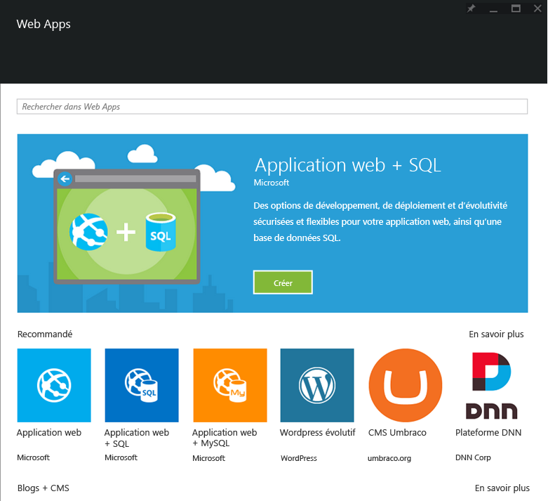

<properties
	pageTitle="Vue d'ensemble de Web Apps"
	description="En savoir plus sur App Service Web Apps"
	services="app-service\web"
	documentationCenter=""
	authors="jaime-espinosa"
	manager="wpickett"
	editor="jimbe"/>

<tags
	ms.service="app-service-web"
	ms.workload="web"
	ms.tgt_pltfrm="na"
	ms.devlang="na"
	ms.topic="get-started-article"
	ms.date="01/09/2016"
	ms.author="jaime.espinosa"/>

#Vue d'ensemble de Web Apps

[App Service](http://go.microsoft.com/fwlink/?LinkId=529714) est une plateforme entièrement gérée destinée aux développeurs professionnels et qui leur apporte un ensemble riche de fonctionnalités pour les scénarios web, mobiles et les scénarios d’intégration. Azure App Service vous permet de créer et de déployer des applications web stratégiques qui s'adaptent à votre entreprise.

Grâce à la puissance d’[App Service Web Apps](http://go.microsoft.com/fwlink/?LinkId=529714), utilisez les langages et les infrastructures que vous connaissez et desquels vous dépendez, déployez vos applications rapidement sur le cloud Azure et améliorez constamment votre code sans avoir à vous soucier de l’infrastructure.

## Bien plus que de simples sites web##

Les entreprises modernes interagissent avec leurs clients de façon de plus en plus sophistiquée. Les entreprises de tous types considèrent leur présence sur le Web comme un élément essentiel de leur activité et comme un composant majeur de leur plan commercial. En conséquence, les entreprises recherchent une plate-forme qui leur fournira souplesse, sécurité et évolutivité. En outre, elles doivent être en mesure d'établir une liaison à leur au système métier existant, de déployer rapidement de nouveau code et de réaliser une rotation des instances dans le monde entier. Grâce à Azure App Service et à Web Apps, les entreprises peuvent répondre aux besoins de leurs clients rapidement et à moindre coût.

## Pourquoi Web Apps ? ##

Azure App Service Web Apps est une plateforme entièrement gérée qui vous permet de générer, déployer et mettre à l'échelle des applications web professionnelles en quelques secondes. Vous pouvez vous concentrer sur le code de votre application et laisser à Azure la prise en charge de l'infrastructure pour la mise à l'échelle et une exécution sécurisée. Web Apps est un outil :

- **Familier et rapide** : utilisez vos compétences pour écrire du code dans votre langage, votre infrastructure et votre IDE de prédilection. En quelques clics, vous pouvez ajouter le contrôle de version, la mise à jour, l'authentification unique, la gestion de l'identité, le stockage isolé et l'analyse des performances de vos applications web existantes. Accédez aux nombreux éléments de la galerie que vous pourrez utiliser comme blocs de construction pour accélérer votre développement. Faites l'expérience d'une productivité de développement inégalée grâce aux fonctionnalités de pointe telles que l'intégration continue, le débogage de site actif et l'IDE Visual Studio.
- **Professionnel** : Web Apps est conçu pour la création et l’hébergement d’applications stratégiques sécurisées. Créez des applications d'entreprise Active Directory intégrées qui se connectent en toute sécurité aux ressources locales, puis hébergez-les sur une plateforme cloud conforme aux normes ISO, SOC2 et PCI. Tout cela, en profitant de contrats SLA de niveau entreprise.
- **À échelle globale** : Web Apps est optimisé pour fournir une disponibilité et une mise à l’échelle automatique dans une infrastructure de centre de données globale. Procédez en toute simplicité à une montée ou descente en puissance de vos applications sur demande. Une haute disponibilité est fournie au sein des différentes régions géographiques. La réplication de données et l'hébergement de services à plusieurs emplacements sont faciles et rapides. Il suffit d'un clic pour procéder à une extension de région ou de zone géographique.  

## Concepts de Web Apps ##

- **Galerie Web Apps** : sélectionnez parmi la liste des modèles d’applications web existants qui est alimentée en permanence. Profitez du meilleur de la communauté des applications OSS grâce à une installation en un clic de packages tels que Wordpress, Joomla et Drupal. Commencez votre développement d'applications sur de bonnes bases en exploitant des infrastructures telles que .NET MVC, Django et CakePHP.
- **Mise à l’échelle automatique** : Web Apps permet de réaliser rapidement une montée ou une descente en puissance pour gérer la charge entrante des clients. Sélectionnez manuellement le nombre et la taille des machines virtuelles ou configurez la mise à l'échelle automatique pour adapter vos serveurs à la charge ou planification.
- **Intégration continue** : configurez des flux de travail d’intégration et de déploiement continus avec VSTS, GitHub, TeamCity, Hudson ou BitBucket. Vous pouvez ainsi générer, tester et déployer automatiquement votre application web après chaque test d’intégration ou de vérification de code réussi.
- **Emplacements de déploiement** : mettez en place un [déploiement intermédiaire][Slots] pour vérifier votre code dans un environnement de pré-production identique à celui de votre application web de production dans Azure App Service. Quand vous êtes satisfait du résultat, publiez une nouvelle version de votre application sans interruption de service en effectuant une opération d'échange. 
- **Tests dans un environnement de production** : allez au-delà du déploiement intermédiaire en effectuant des tests A/B pour vérifier votre nouveau code avec une fraction configurable de votre trafic. 
- **WebJobs** : exécutez n’importe quel programme ou script sur des machines virtuelles Web Apps. Exécutez des tâches en continu ou selon un planning, et effectuez une mise à l'échelle pour une exécution sur plusieurs machines virtuelles. Pour intégrer Azure Storage ou Service Bus, utilisez le [Kit de développement logiciel (SDK) WebJobs][Webjobs] Azure.
- **Connexions hybrides** - - Accéder aux données locales à l'aide de [connexions hybrides](../biztalk-services/integration-hybrid-connection-overview.md) et de [réseaux virtuels](../app-service-web/web-sites-integrate-with-vnet.md).

## Prise en main ##
Pour commencer à utiliser Web Apps, suivez le didacticiel [Créer une application web ASP.NET][create].

Pour plus d’informations sur la plateforme Azure App Service, consultez [Azure App Service][appservice].

>[AZURE.NOTE] Si vous voulez vous familiariser avec Azure App Service avant d’ouvrir un compte Azure, accédez à la page [Essayer App Service](http://go.microsoft.com/fwlink/?LinkId=523751). Vous pourrez créer immédiatement et gratuitement une application de départ temporaire dans App Service. Aucune carte de crédit n’est requise ; vous ne prenez aucun engagement.

## Changements apportés
* Pour obtenir un guide présentant les modifications apportées dans le cadre de la transition entre Sites Web et App Service, consultez la page [Azure App Service et les services Azure existants](http://go.microsoft.com/fwlink/?LinkId=529714).

[appservice]: ../app-service/app-service-value-prop-what-is.md
[create]: web-sites-dotnet-get-started.md
[Webjobs]: websites-dotnet-webjobs-sdk-get-started.md
[Slots]: web-sites-staged-publishing.md

 

<!----HONumber=AcomDC_0224_2016-->