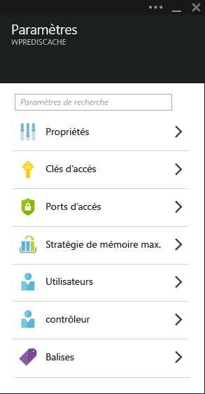
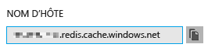
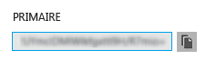
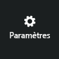
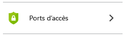
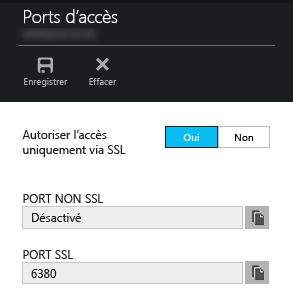
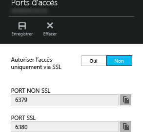

<properties
   pageTitle="Connecter une application web dans Azure App Service à Cache Redis via le protocole Memcache"
   description="Connecter une application web dans Azure App Service à Cache Redis en utilisant le protocole Memcache"
   services="app-service\web"
   documentationCenter="php"
   authors="SyntaxC4"
   manager="wpickett"
   editor="riande"/>

<tags
   ms.service="app-service-web"
   ms.devlang="php"
   ms.topic="get-started-article"
   ms.tgt_pltfrm="windows"
   ms.workload="web"
   ms.date="06/30/2015"
   ms.author="cfowler"/>

# Connecter une application web dans Azure App Service à Cache Redis via le protocole Memcache

Cet article va vous apprendre à connecter une application web WordPress dans [Azure App Service](http://go.microsoft.com/fwlink/?LinkId=529714) au [Cache Redis Azure][12] à l’aide du protocole [Memcache][13]. Si vous disposez d’une application web utilisant un serveur Memcached pour la mise en cache en mémoire, vous pouvez la faire migrer vers Azure App Service et utiliser la solution de mise en cache interne dans Microsoft Azure en apportant peu de modifications à votre code d’application, voire aucune. En outre, vous pouvez exploiter votre expertise de Memcache pour créer des applications distribuées hautement évolutives dans Azure App Service avec le Cache Redis Azure pour la mise en cache en mémoire, tout en utilisant des infrastructures d’application populaires telles que .NET, PHP, Node.js, Java et Python.

App Service Web Apps permet ce scénario d’application avec le shim Web Apps Memcache, qui est un serveur Memcached local agissant comme un proxy Memcache pour la mise en cache des appels vers le Cache Redis Azure. Ainsi, n’importe quelle application qui communique à l’aide du protocole Memcache peut mettre en cache des données avec le Cache Redis. Ce shim Memcache fonctionne au niveau du protocole. Il peut donc être utilisé par n’importe quelle application ou infrastructure d’application tant qu’il communique à l’aide du protocole Memcache.

## Composants requis

Le shim Web Apps Memcache peut être utilisé avec n’importe quelle application, dans la mesure où il communique à l’aide du protocole Memcache. Pour cet exemple, l’application de référence est un site WordPress évolutif qui peut être configuré à partir d’Azure Marketplace.

Appliquez les procédures décrites dans les billets suivants :

* [Configurer une instance du service Cache Redis Azure][1]
* [Déployer un site WordPress évolutif dans Azure][0]

Dès lors que le site WordPress évolutif est déployé et qu’une instance de Cache Redis est configurée, vous pouvez procéder à l’activation du shim Memcache dans Azure App Service Web Apps.

## Activer le shim Web Apps Memcache

Pour configurer le shim Memcache, vous devez créer trois paramètres d’application. Cette opération peut être effectuée à l’aide de différentes méthodes, notamment le [portail Azure](http://go.microsoft.com/fwlink/?LinkId=529715), l’[ancien portail][3], les [applets de commande Azure PowerShell][5] ou l’[interface de ligne de commande Azure][5]. Pour ce billet, je vais utiliser le [portail Azure][4] pour définir les paramètres d’application. Les valeurs suivantes peuvent être récupérées à partir du panneau **Paramètres** de votre instance de Cache Redis.



### Ajouter le paramètre d’application REDIS\_HOST

**REDIS\\\_HOST** est le premier paramètre d’application que vous devez créer. Il définit la destination vers laquelle le shim transfère les informations du cache. La valeur requise pour le paramètre d’application REDIS\_HOST peut être récupérée à partir du panneau **Propriétés** de votre instance de Cache Redis.



Définissez la clé du paramètre d’application sur **REDIS\\\_HOST** et la valeur du paramètre d’application selon le **nom d’hôte** de l’instance de Cache Redis.


### Ajouter un paramètre d’application REDIS\_KEY

**REDIS\\\_KEY** est le deuxième paramètre d’application que vous devez créer. Il fournit le jeton d’authentification requis pour accéder à l’instance de Cache Redis de façon sécurisée. La valeur requise pour le paramètre d’application REDIS\_KEY peut être récupérée à partir du panneau **Touches d’accès rapides** de l’instance de Cache Redis.



Définissez la clé du paramètre d’application sur **REDIS\\\_KEY** et la valeur du paramètre d’application selon la **clé primaire** de l’instance de Cache Redis.


### Ajouter un paramètre d’application MEMCACHESHIM\_REDIS\_ENABLE

Le dernier paramètre d’application est utilisé pour activer le shim Memcache dans Web Apps, lequel utilisera REDIS\_HOST et REDIS\_KEY pour se connecter au Cache Redis Azure et transférer les appels du cache. Définissez la clé du paramètre d’application sur **MEMCACHESHIM\\\_REDIS\\\_ENABLE** et la valeur sur **true**.


Une fois que vous avez ajouté les trois (3) paramètres d’application, cliquez sur **Enregistrer**.

## Activer l’extension Memcache pour PHP

Pour permettre à l’application de communiquer à l’aide du protocole Memcache, il est nécessaire d’installer l’extension Memcache pour PHP (infrastructure de langage pour votre site WordPress).

### Télécharger l’extension php\_memcache

Accédez à [PECL][6], sous la catégorie de mise en cache, puis cliquez sur [memcache][7]. Sous la colonne des téléchargements, cliquez sur le lien DLL.


Téléchargez le lien Non-Thread Safe (NTS) x86 pour la version de PHP activée dans Web Apps. (PHP 5.4 par défaut)


### Activer l’extension php\_memcache

Après avoir téléchargé le fichier, décompressez le fichier **php\\\_memcache.dll** et chargez-le dans le répertoire **d:\\\\home\\\\site\\\\wwwroot\\\\bin\\\\ext\\\\**. Une fois le fichier php\_memcache.dll chargé dans l’application web, l’extension doit être activée au niveau du runtime PHP. Pour activer l’extension Memcache dans le portail Azure, ouvrez le panneau **Paramètres d’application** pour l’application web, puis ajoutez un nouveau paramètre d’application avec la clé de **PHP\\\_EXTENSIONS** et la valeur **bin\\\\ext\\\\php\_memcache.dll**.


> Si l’application web doit charger plusieurs extensions PHP, la valeur de PHP\_EXTENSIONS doit être une liste de chemins d’accès relatifs aux fichiers DLL séparés par des virgules.


Une fois que vous avez terminé, cliquez sur **Enregistrer**.

## Installer le plug-in Memcache WordPress

> Vous pouvez également télécharger le [plug-in Memcached Object Cache](https://wordpress.org/plugins/memcached/) à partir de WordPress.org.

Dans la page des plug-ins WordPress, cliquez sur le bouton **Ajouter nouveau**.


Tapez **memcached** dans la zone de recherche, puis appuyez sur la touche **Entrée**.


Recherchez **Memcached Object Cache** dans la liste, puis cliquez sur le bouton **Installer maintenant**.


### Activer le plug-in Memcache WordPress

>[AZURE.NOTE]Suivez les instructions de ce blog pour savoir [comment activer une extension de site dans Web Apps][8], afin d’installer Visual Studio Online.

Dans le fichier `wp-config.php`, ajoutez l’extrait de code suivant avant le commentaire d’arrêt de la modification, à la fin du fichier.

```php
$memcached_servers = array(
	'default' => array('localhost:' . getenv("MEMCACHESHIM_PORT"))
);
```

Une fois cet extrait de code collé, monaco enregistre automatiquement le document.

L’étape suivante consiste à activer le plug-in de cache d’objets. Pour cela, glissez-déplacez le fichier **object-cache.php** du dossier **wp-content/memcached** vers le dossier **wp-content** pour activer la fonctionnalité de cache d’objets Memcache.


Une fois le fichier **object-cache.php** placé dans le dossier **wp-content**, le cache d’objets Memcached est activé.


## Vérifier si le plug-in de cache d’objets Memcache est opérationnel

Toutes les étapes d’activation du shim Web Apps Memcache sont maintenant terminées. Il ne vous reste plus qu’à vérifier que les données sont insérées dans votre instance de Cache Redis.

### Activer la prise en charge des ports non SSL dans le Cache Redis Azure

>[AZURE.NOTE]Au moment de la rédaction de ce document, l’interface de ligne de commande Redis ne prend pas en charge la connectivité SSL. Les étapes suivantes sont donc nécessaires.

Dans le portail Azure, accédez à l’instance de Cache Redis que vous avez créée pour cette application web. Une fois le panneau de cache ouvert, cliquez sur l’icône **Paramètres**.



Sélectionnez **Ports d’accès** dans la liste.



Cliquez sur **Non** sous l’option **Permettre l’accès uniquement via SSL**.



Vous verrez que le port non SSL est maintenant défini. Cliquez sur **Save**.



### Se connecter au Cache Redis Azure à partir de l’interface de ligne de commande Redis

>[AZURE.NOTE]Cette étape suppose que Redis est installé localement sur votre ordinateur de développement. [Installez Redis localement en suivant ces instructions][9].

Ouvrez la console de ligne de commande de votre choix et tapez la commande suivante :

```shell
redis-cli –h <hostname-for-redis-cache> –a <primary-key-for-redis-cache> –p 6379
```

Remplacez **<hostname-for-redis-cache>** par le nom d’hôte xxxxx.redis.cache.windows.net réel et **<primary-key-for-redis-cache>** par la clé d’accès pour le cache, puis appuyez sur **Entrée**. Une fois que l’interface de ligne de commande est connectée à l’instance de Cache Redis, lancez une commande Redis quelconque. Ce sont les clés qui sont répertoriées dans la capture d’écran ci-dessous.


L’appel visant à répertorier les clés doit retourner une valeur. Si ce n’est pas le cas, essayez d’accéder à l’application web et réessayez.

## Conclusion

Félicitations ! L’application WordPress dispose maintenant d’un cache en mémoire centralisé, qui favorise l’augmentation du débit. Rappelez-vous que le shim Web Apps Memcache peut être utilisé avec n’importe quel client Memcache, quels que soient le langage de programmation et l’infrastructure d’application. Pour fournir des commentaires ou poser des questions sur le shim Web Apps Memcache, publiez un message sur les [forums MSDN][10] ou sur [Stackoverflow][11].

>[AZURE.NOTE]Si vous voulez vous familiariser avec Azure App Service avant d’ouvrir un compte Azure, accédez à la page [Essayer App Service](http://go.microsoft.com/fwlink/?LinkId=523751). Vous pourrez créer immédiatement et gratuitement une application de départ temporaire dans App Service. Aucune carte de crédit n’est requise ; vous ne prenez aucun engagement.

## Changements apportés
* Pour obtenir un guide présentant les modifications apportées dans le cadre de la transition entre Sites Web et App Service, consultez la page [Azure App Service et les services Azure existants](http://go.microsoft.com/fwlink/?LinkId=529714).
* Pour obtenir un guide présentant les modifications apportées dans le cadre de la transition entre l’ancien et le nouveau portail, consultez la page [Références sur la navigation dans le portail Azure](http://go.microsoft.com/fwlink/?LinkId=529715).


[0]: http://bit.ly/1F0m3tw
[1]: http://bit.ly/1t0KxBQ
[2]: http://manage.windowsazure.com
[3]: http://portal.azure.com
[4]: ../powershell-install-configure.md
[5]: /downloads
[6]: http://pecl.php.net
[7]: http://pecl.php.net/package/memcache
[8]: http://blog.syntaxc4.net/post/2015/02/05/how-to-enable-a-site-extension-in-azure-websites.aspx
[9]: http://redis.io/download#installation
[10]: https://social.msdn.microsoft.com/Forums/home?forum=windowsazurewebsitespreview
[11]: http://stackoverflow.com/questions/tagged/azure-web-sites
[12]: /services/cache/
[13]: http://memcached.org
 

<!---HONumber=July15_HO5-->