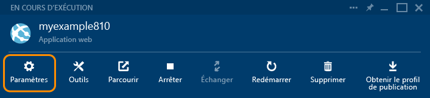

<properties
	pageTitle="Création d’une application web ASP.NET dans Azure App Service | Microsoft Azure"
	description="Ce didacticiel explique comment créer un projet web ASP.NET dans Visual Studio 2013 et comment le déployer dans Azure App Service."
	services="app-service\web"
	documentationCenter=".net"
	authors="tdykstra"
	manager="wpickett"
	editor="jimbe"/>

<tags
	ms.service="app-service-web"
	ms.workload="web"
	ms.tgt_pltfrm="na"
	ms.devlang="dotnet"
	ms.topic="hero-article"
	ms.date="12/07/2015"
	ms.author="tdykstra"/>

# Création d’une application web ASP.NET dans Azure App Service

> [AZURE.SELECTOR]
- [.Net](web-sites-dotnet-get-started.md)
- [Node.js](web-sites-nodejs-develop-deploy-mac.md)
- [Java](web-sites-java-get-started.md)
- [PHP - Git](web-sites-php-mysql-deploy-use-git.md)
- [PHP - FTP](web-sites-php-mysql-deploy-use-ftp.md)
- [Python](web-sites-python-ptvs-django-mysql.md)

## Vue d'ensemble

Ce didacticiel montre comment déployer une application web ASP.NET dans une [application web dans Azure App Service](app-service-web-overview.md) en utilisant Visual Studio 2015 ou Visual Studio 2013. Ce didacticiel part du principe que vous êtes un développeur ASP.NET sans expérience préalable avec Azure. À la fin de ce didacticiel, vous disposerez d’une application web simple et fonctionnelle dans le cloud.

L’illustration suivante présente l’application terminée :

Vous apprendrez ce qui suit :

* Comment préparer votre ordinateur pour le développement Azure en installant le [Kit de développement logiciel (SDK) Azure pour .NET](../dotnet-sdk/).
* Comment configurer Visual Studio pour créer une application web App Service pendant la création d’un projet web ASP.NET MVC 5.
* Comment déployer un projet web sur une application web App Service à l’aide de Visual Studio.
* Utilisation de l’**Explorateur de serveurs** Visual Studio pour ouvrir des fichiers distants et démarrer une session de débogage à distance. 
* utiliser le [portail Azure](/overview/preview-portal/) pour surveiller et gérer votre application web.

> [AZURE.NOTE] Ce didacticiel porte sur l’utilisation d’ASP.NET avec Azure App Service. Il n’explique pas comment développer une application web ASP.NET. Pour une présentation d’ASP.NET MVC 5, consultez [Prise en main d’ASP.NET MVC 5](http://www.asp.net/mvc/overview/getting-started/introduction/getting-started) sur le site [ASP.NET](http://asp.net/). Pour des liens vers d’autres articles plus détaillés sur l’utilisation d’Azure App Service, consultez la section [Étapes suivantes](#next-steps).
> 
> Aidez-nous à améliorer la portée et l’approche de ce didacticiel. Si vous aimeriez que d’autres thèmes soient traités dans un didacticiel de prise en main, n’hésitez pas à laisser un [commentaire](#comments) en bas de cette page.

##Inscription à Microsoft Azure

Pour suivre ce didacticiel, vous avez besoin d'un compte Azure. Vous pouvez :

* [Ouvrir un compte Azure gratuitement](/pricing/free-trial/?WT.mc_id=A261C142F). Vous obtenez des crédits que vous pouvez utiliser pour essayer des services Azure payants. Même après que les crédits sont épuisés, vous pouvez conserver le compte et utiliser les services et fonctionnalités Azure gratuits, comme la fonction Web Apps dans Azure App Service.
* [Activez les avantages d’abonnement Visual Studio](/pricing/member-offers/msdn-benefits-details/?WT.mc_id=A261C142F). Votre abonnement Visual Studio vous donne droit chaque mois à des crédits dont vous pouvez vous servir pour les services Azure payants.

Si vous souhaitez commencer à utiliser Azure App Service avant d’ouvrir un compte Azure, accédez à [Essayer App Service](http://go.microsoft.com/fwlink/?LinkId=523751). Là, vous pouvez créer immédiatement une application de départ temporaire dans App Service. Aucune carte de crédit n’est requise ni aucun engagement.

Dans cette vidéo, Scott Hanselman montre combien il est facile de s’inscrire à un essai gratuit de Microsoft Azure. (Durée : 1:58)

> [AZURE.VIDEO sign-up-for-microsoft-azure]

[AZURE.INCLUDE [install-sdk-2015-2013](../../includes/install-sdk-2015-2013.md)]

## Créer un projet et une application web

La première étape consiste à créer un projet web dans Visual Studio et une application web dans Azure App Service. Lorsque cette opération effectuée, vous allez déployer le projet vers l'application web pour le rendre disponible sur Internet.

Le diagramme illustre ce que vous faites dans les étapes de création et de déploiement.

1. Ouvrez Visual Studio 2015 ou Visual Studio 2013.

	Si vous utilisez Visual Studio 2013, les écrans seront légèrement différents des captures d'écran, mais les procédures sont essentiellement les mêmes.

2. Dans le menu **Fichier**, cliquez sur **Nouveau > Projet**.

3. Dans la boîte de dialogue **Nouveau projet**, cliquez sur **C# > Web > Application web ASP.NET**. Vous pouvez, si vous préférez, sélectionner **Visual Basic**.

3. Vérifiez que la version cible sélectionnée est **.NET Framework 4.5.2**.

4.  [Azure Application Insights](app-insights-overview.md) surveille la disponibilité, les performances et l’utilisation de votre application web. Décochez la case **Ajouter Application Insights au projet** si vous ne voulez pas l’essayer.

4. Nommez l’application **MonExemple**.

5. Cliquez sur **OK**.

	

5. Dans la boîte de dialogue **Nouveau projet ASP.NET**, sélectionnez le modèle **MVC**.

	[MVC](http://www.asp.net/mvc) est une infrastructure ASP.NET pour le développement d’applications web.

7. Cliquez sur **Modifier l'authentification**.

	

6. Dans la boîte de dialogue **Modifier l'authentification**, cliquez sur **Aucune authentification**, puis sur **OK**.

	

	L’exemple d’application que vous créez ne permettra pas aux utilisateurs de se connecter. La section [Étapes suivantes](#next-steps) renvoie vers un didacticiel qui implémente l’authentification et l’autorisation.

5. Dans la boîte de dialogue **Nouveau projet ASP.NET**, conservez les paramètres existants sous **Microsoft Azure**, puis cliquez sur **OK**.

	

	Les paramètres par défaut indiquent que Visual Studio va créer une application web Azure pour votre projet web. Dans la section suivante du didacticiel, vous allez déployer le projet web vers l’application web nouvellement créée.

5. Si vous n’êtes pas déjà connecté à Azure, Visual Studio vous invite à le faire. Connectez-vous avec l’ID et le mot de passe du compte que vous utilisez pour gérer votre abonnement Azure.

	Lorsque vous êtes connecté, la boîte de dialogue **Céer App Service** vous demande les ressources que vous voulez créer.

	

3. Dans la boîte de dialogue **Créer App Service**, saisissez un **Nom de l’application Web** unique dans le domaine *azurewebsites.net*. Par exemple, vous pouvez le nommer MonExemple avec des chiffres à droite pour le rendre unique, comme MonExemple810. Si un nom web par défaut est créé pour vous, il sera unique et vous pouvez l'utiliser.

	Si une autre personne a déjà utilisé le nom que vous avez entré, un point d’exclamation rouge s’affiche à droite au lieu d’une coche verte, et vous devez entrer un autre nom.

	Azure utilise ce nom comme préfixe de l'URL de votre application. L’URL complète se compose de ce nom plus *.azurewebsites.net* (comme indiqué en regard de la zone de texte **Nom de l’application web**). Par exemple, si le nom du site est `MyExample810`, l’URL sera `MyExample810.azurewebsites.net`. L'URL doit être unique.

4. En regard de la liste déroulante **Plan de service d’application**, cliquez sur le bouton **Nouveau...**.

	La section [Étapes suivantes](#next-steps) comporte des liens vers des informations sur les plans App Service.

5. Entrez **MonExemplePlan** ou un autre nom si vous préférez pour le nom du plan.

6. Dans la liste déroulante **Groupe de ressources**, sélectionnez le nom de votre nouveau groupe de ressources.

	La section [Étapes suivantes](#next-steps) comporte des liens vers des informations sur les groupes de ressources.

5. Saisissez **MonExempleGroupe** ou un autre nom de votre choix comme nom de groupe de ressources.

5. Dans la liste déroulante **Région**, sélectionnez le lieu le plus proche de vous.

	Ce paramètre indique le centre de données Azure dans lequel votre application Web sera exécutée. Pour les besoins de ce didacticiel, vous pouvez sélectionner n’importe quelle région : la différence ne sera pas sensible. Toutefois, pour une application web de production, votre serveur web doit être aussi proche que possible des navigateurs qui accèdent à votre site afin de minimiser la [latence](http://www.bing.com/search?q=web%20latency%20introduction&qs=n&form=QBRE&pq=web%20latency%20introduction&sc=1-24&sp=-1&sk=&cvid=eefff99dfc864d25a75a83740f1e0090).

5. Ne modifiez pas le champ de base de données.

	Vous n’utiliserez pas de base de données dans le cadre de ce didacticiel. La section [Étapes suivantes](#next-steps) renvoie vers un didacticiel qui vous explique comment utiliser une base de données.

6. Cliquez sur **OK**.

	

	En quelques secondes, Visual Studio crée le projet web dans le dossier indiqué, puis crée l’application web dans la région Azure indiquée.

	La fenêtre **Explorateur de solutions** indique les fichiers et les dossiers du nouveau projet.

	

	La fenêtre **Activité Azure App Service** indique que l’application web a été créée.

	

	L’application web s’affiche dans l’**Explorateur de serveurs**.

	

## Déploiement du projet dans l’application web

Dans cette section, vous déployez le projet web dans l’application web, comme illustré à l’étape 2 du diagramme.

1. Dans l’**Explorateur de solutions**, cliquez avec le bouton droit sur le projet, puis sélectionnez **Publier**.

	

	Au bout de quelques secondes, l’Assistant **Publier le site web** s’ouvre. L’Assistant s’ouvre sur un *profil de publication* présentant des paramètres pour le déploiement du projet web sur la nouvelle application web. Si vous souhaitez exécuter le déploiement sur une autre application web, cliquez sur l’onglet **Profil** pour créer un autre profil. Dans le cadre de ce didacticiel, vous allez accepter les paramètres de déploiement de l’application web que vous avez créée plus tôt.

8. Sous l’onglet **Connexion** de l’Assistant **Publier le site web**, cliquez sur **Suivant**.

	

10. Sous l’onglet **Paramètres**, cliquez sur **Suivant**.

	Vous pouvez accepter les valeurs par défaut pour **Configuration** et **Options de publication des fichiers**.

	Vous pouvez utiliser la liste déroulante **Configuration** pour déployer une version de débogage pour le débogage distant. La section [Étapes suivantes](#next-steps) renvoie vers un didacticiel qui explique comment exécuter Visual Studio en mode de débogage à distance.

	

11. Dans l’onglet **Aperçu**, cliquez sur **Publier**.

	Si vous voulez connaître les fichiers qui seront copiés dans Azure, cliquez sur **Démarrer l’aperçu** avant de cliquer sur **Publier**.

	

	Quand vous cliquez sur **Publier**, Visual Studio démarre le processus de copie des fichiers sur le serveur Azure.

	Les fenêtres **Sortie** et **Activité Azure App Service** indiquent les actions de déploiement effectuées et signalent la réussite du déploiement.

	

	Une fois le déploiement réussi, le navigateur par défaut ouvre automatiquement l’URL de l’application web déployée, et l’application créée est exécutée dans le cloud. L'URL de la barre d'adresse du navigateur indique que l'application web est chargée depuis Internet.

	

13. Laissez cette fenêtre de navigateur ouverte en vue de l’utiliser dans la prochaine section.

**Conseil :** vous pouvez activer la barre d’outils **Publication Web en un clic** pour accélérer le déploiement. Cliquez sur **Affichage > Barres d’outils**, puis sélectionnez **Publication Web en un clic**. Vous pouvez utiliser cette barre d’outils pour sélectionner un profil ou encore cliquer sur un bouton pour publier ou pour ouvrir l’Assistant **Publier le site web**.

## Ouvrir des fichiers distants dans l’Explorateur de serveurs

Lorsque vous testez et déboguez une application web, vous pouvez apporter des modifications rapides temporaires au site distant en ouvrant et en modifiant les fichiers dans l’**Explorateur de serveurs**.

1.  Dans l’**Explorateur de serveurs**, accédez à **Azure > App Service > MonExempleGroupe**, puis développez le nœud de votre application web.

2. Développez **Fichiers > Affichages > Accueil**, puis double-cliquez sur le fichier *Index.cshtml*.

	

3. Remplacez `<h1>ASP.NET</h1>` par `<h1>Azure App Service</h1>`.

4. Enregistrez le fichier.

5. Actualisez la fenêtre du navigateur contenant le site exécuté dans Azure.

	

Cette modification est désormais présente sur le site déployé, mais pas dans le projet local. Si vous redéployez le projet, le site reviendra à sa version avant modification.

Cette fonctionnalité est pratique pour [désactiver temporairement customErrors dans le fichier Web.config afin d’obtenir un message d’erreur détaillé](web-sites-dotnet-troubleshoot-visual-studio.md).

Dans l’**Explorateur de serveurs**, vous pouvez également cliquer avec le bouton droit sur le nœud App Service et accéder aux paramètres de ce dernier dans une fenêtre Visual Studio, démarrer une session de débogage distant, et afficher les journaux d’application en temps réel pendant que l’application les enregistre.

Pour plus d’informations, consultez la page [Résolution des problèmes des applications web Azure dans Visual Studio](web-sites-dotnet-troubleshoot-visual-studio.md).

## Surveillance et gestion de l’application web dans le portail Azure

Le [portail Azure](/services/management-portal/) est une interface web qui vous permet de gérer et de surveiller vos services Azure, tels que l’application web que vous venez de créer. Dans cette section du didacticiel, vous allez examiner certaines des possibilités offertes par le portail.

1. Dans votre navigateur, accédez à [https://portal.azure.com](https://portal.azure.com) et connectez-vous avec vos informations d'identification Azure.

2. Cliquez sur **App Services**, puis sur le nom de votre application web.

	Le panneau **Application web** affiche une vue d’ensemble des paramètres et des statistiques d’utilisation de votre application web.

	

	À ce stade, le trafic sur votre application web est encore très faible et il ne sera peut-être pas visible dans le graphique. Si vous accédez à votre application, actualisez la page plusieurs fois, puis actualisez la page du portail ; les statistiques commenceront à s’afficher.

3. Cliquez sur **Paramètres** pour afficher d’autres options de configuration de votre application web.

	

	Différents types de paramètres sont répertoriés.

	

4. Cliquez sur **Paramètres de l’application** pour afficher un exemple des paramètres configurables dans le portail.

	Par exemple, vous pouvez contrôler la version .NET utilisée pour l’application web, activer des fonctionnalités telles que [WebSockets](/blog/2013/11/14/introduction-to-websockets-on-windows-azure-web-sites/) et définir les [valeurs de la chaîne de connexion](/blog/2013/07/17/windows-azure-web-sites-how-application-strings-and-connection-strings-work/).

	

Ce ne sont là que quelques-unes des fonctionnalités du portail. Vous pouvez créer des applications web, supprimer des applications web existantes, arrêter et redémarrer des applications web, et gérer d’autres types de services Azure, par exemple, des bases de données et des machines virtuelles.

## Étapes suivantes

Dans ce didacticiel, vous avez appris à créer une application web simple et à la déployer sur une application web Azure. Pour en savoir plus sur les applications web dans Azure App Service, consultez les rubriques et ressources suivantes :

* Ajout d’une fonctionnalité de base de données et d’autorisation

	Pour suivre un didacticiel expliquant comment accéder aux bases de données et limiter certaines fonctions d’application aux utilisateurs autorisés, consultez la page [Déploiement d’une application ASP.NET MVC avec une fonctionnalité d’appartenance, OAuth et une base de données SQL Database vers une application web Azure](/develop/net/tutorials/web-site-with-sql-database/). L’utilisation de ce didacticiel implique des connaissances de MVC 5 ; si vous débutez avec MVC 5, consultez [Prise en main d’ASP.NET MVC 5](http://www.asp.net/mvc/overview/getting-started/introduction/getting-started).

* Autres méthodes de déploiement d’un projet web

	Pour plus d’informations sur les autres méthodes de déploiement de projets web sur des applications web, à l’aide de Visual Studio ou en [automatisant le déploiement](http://www.asp.net/aspnet/overview/developing-apps-with-windows-azure/building-real-world-cloud-apps-with-windows-azure/continuous-integration-and-continuous-delivery) à partir d’un [système de contrôle de code source](http://www.asp.net/aspnet/overview/developing-apps-with-windows-azure/building-real-world-cloud-apps-with-windows-azure/source-control), consultez [Déploiement d’une application web Azure](web-sites-deploy.md).

	Visual Studio génère également des scripts Windows PowerShell que vous pouvez utiliser pour automatiser le déploiement. Pour en savoir plus, consultez la page [Tout automatiser (développement d’applications de cloud concrètes avec Azure)](http://www.asp.net/aspnet/overview/developing-apps-with-windows-azure/building-real-world-cloud-apps-with-windows-azure/automate-everything).

* Résolution des problèmes d’une application web

	Visual Studio fournit des fonctionnalités qui facilitent l’affichage des journaux Azure durant leur génération en temps réel. Vous pouvez aussi exécuter le mode Debug à distance dans Azure. Pour plus d’informations, consultez la page [Résolution des problèmes des applications web Azure dans Visual Studio](web-sites-dotnet-troubleshoot-visual-studio.md).

* Ajout d’un nom de domaine personnalisé et de SSL

	Pour des informations sur l’utilisation de SSL et de votre propre nom de domaine (par exemple, www.contoso.com au lieu de contoso.azurewebsites.net), consultez les ressources suivantes :

	* [Configuration d’un nom de domaine personnalisé dans Azure App Service](web-sites-custom-domain-name.md)
	* [Activation du protocole HTTPS pour un site web Azure](web-sites-configure-ssl-certificate.md)

* Ajout de fonctions en temps réel telles que la conversation instantanée

	Si votre application web doit inclure des fonctionnalités en temps réel (par exemple, un service de conversation en ligne, un jeu ou un téléscripteur pour le marché boursier), vous pouvez obtenir des performances optimales en utilisant [ASP.NET SignalR](http://www.asp.net/signalr) avec la méthode de transport [WebSockets](/blog/2013/11/14/introduction-to-websockets-on-windows-azure-web-sites/). Pour plus d’informations, consultez la page [Utilisation de SignalR avec Azure Web Apps](http://www.asp.net/signalr/overview/signalr-20/getting-started-with-signalr-20/using-signalr-with-windows-azure-web-sites).

* Comparaison entre App Service, Azure Cloud Services et Azure Virtual Machines pour les applications web

	Azure vous permet d’exécuter des applications web dans App Service Web Apps (comme vous l’avez vu dans ce didacticiel), mais aussi dans Cloud Services ou Virtual Machines. Pour plus d’informations, consultez [Applications web, services cloud et machines virtuelles Azure : quand les utiliser ?](/manage/services/web-sites/choose-web-app-service/)

* [Comment choisir ou créer un plan App Service](../app-service/azure-web-sites-web-hosting-plans-in-depth-overview.md)

* [Comment choisir ou créer un groupe de ressources](../azure-portal/resource-group-portal.md)

## Changements apportés
* Pour obtenir un guide présentant les modifications apportées dans le cadre de la transition entre Sites Web et App Service, consultez la page [Azure App Service et les services Azure existants](http://go.microsoft.com/fwlink/?LinkId=529714).

<!---HONumber=AcomDC_0204_2016-->