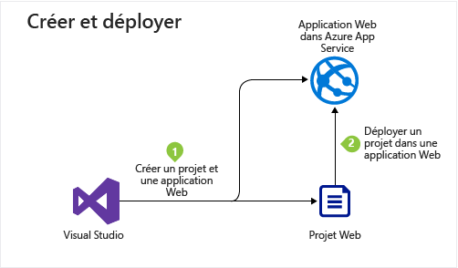
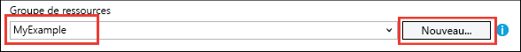
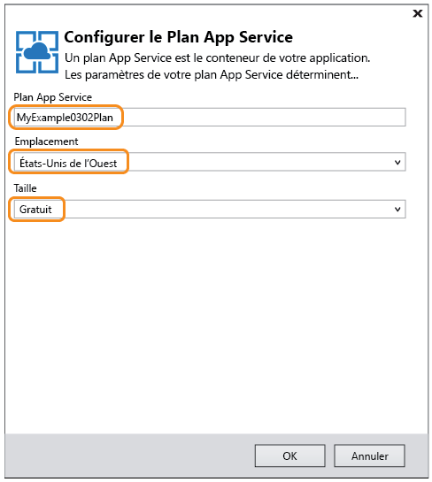

# Déployer une application web ASP.NET dans Azure App Service à l’aide de Visual Studio
[!INCLUDE [tabs](../../includes/app-service-web-get-started-nav-tabs.md)]

## Vue d'ensemble
Ce didacticiel montre comment déployer une application web ASP.NET dans une [application web dans Azure App Service](app-service-web-overview.md) à l’aide de Visual Studio 2015.

Ce didacticiel part du principe que vous êtes un développeur ASP.NET sans expérience préalable d’Azure. À la fin de ce didacticiel, vous disposerez d’une application web simple et fonctionnelle dans le cloud.

Vous apprendrez ce qui suit :

* Comment créer une application web App Service pendant la création d’un projet web dans Visual Studio.
* Comment déployer un projet web sur une application web App Service à l’aide de Visual Studio.

Le schéma montre ce que vous allez faire dans ce didacticiel.

À la fin du didacticiel, une section [Résolution de problèmes](#troubleshooting) fournit des suggestions sur la marche à suivre en cas de dysfonctionnement, et une section [Étapes suivantes](#next-steps) vous oriente vers d’autres didacticiels plus détaillés sur l’utilisation d’Azure App Service.

Comme il s’agit d’un didacticiel de pris en main, le projet web dont il décrit le déploiement est simple et n’utilise aucune base de données, authentification ou autorisation. Pour obtenir des liens vers des rubriques de déploiement plus avancées, consultez [Déploiement de votre application dans Azure App Service](web-sites-deploy.md).

En plus du temps nécessaire pour installer le Kit de développement logiciel Azure SDK pour .NET, ce didacticiel dure de 10 à 15 minutes.

## Configuration requise
* Ce didacticiel suppose que vous connaissiez ASP.NET MVC et Visual Studio. Si vous avez besoin d’une introduction, consultez [Getting Started with ASP.NET MVC 5](http://www.asp.net/mvc/overview/getting-started/introduction/getting-started).
* Vous avez besoin d’un compte Azure. Vous pouvez [ouvrir un compte Azure gratuit](https://azure.microsoft.com/pricing/free-trial/?WT.mc_id=A261C142F) ou [activer les avantages de l’abonnement à Visual Studio](https://azure.microsoft.com/pricing/member-offers/msdn-benefits-details/?WT.mc_id=A261C142F). 
  
    Si vous souhaitez commencer à utiliser Azure App Service avant d’ouvrir un compte Azure, accédez à [Essayer App Service](http://go.microsoft.com/fwlink/?LinkId=523751). Là, vous pouvez créer une première application temporaire dans App Service. Aucune carte de crédit ni engagement n’est nécessaire.

## Configuration de l’environnement de développement
Ce didacticiel a été rédigé pour Visual Studio 2015 avec le [Kit de développement logiciel (SDK) Azure pour .NET](../dotnet-sdk.md) version 2.9 ou ultérieure. 

* [Téléchargez la dernière version du Kit de développement logiciel (SDK) Azure pour Visual Studio 2015](http://go.microsoft.com/fwlink/?linkid=518003). Ce SDK installe Visual Studio 2015 si ce n’est déjà fait.
  
  > [!NOTE]
  > en fonction du nombre de dépendances du Kit de développement logiciel (SDK) qui se trouvent déjà sur votre ordinateur, l'installation du SDK peut prendre un certain temps (de plusieurs minutes à une demi-heure, voire plus).
  > 
  > 

Si vous préférez utiliser Visual Studio 2013, [téléchargez la dernière version du SDK Azure pour Visual Studio 2013](http://go.microsoft.com/fwlink/?LinkID=324322). Certains écrans diffèrent des illustrations.

## Création d’une application web
L’étape suivante consiste à créer un projet d’application web dans Visual Studio et une application web dans Azure App Service. Dans cette section du didacticiel, vous allez configurer le nouveau projet web. 

1. Ouvrez Visual Studio 2015.
2. Cliquez sur **Fichier > Nouveau > Projet**.
3. Dans la boîte de dialogue **Nouveau projet**, cliquez sur **Visual C# > Web > Application Web ASP.NET**.
4. Vérifiez que la version cible sélectionnée est **.NET Framework 4.5.2** .
5. [Azure Application Insights](../application-insights/app-insights-overview.md) surveille la disponibilité, les performances et l’utilisation de votre application web. La case **Ajouter Application Insights au projet** est cochée par défaut à la première création d’un projet web après l’installation de Visual Studio. Décochez la case si vous ne voulez pas essayer Application Insights.
6. Nommez l’application **MonExemple**, puis cliquez sur **OK**.
   
    
7. Dans la boîte de dialogue **Nouveau projet ASP.NET**, sélectionnez le modèle **MVC**, puis cliquez sur **Modifier l’authentification**.
   
    Dans ce didacticiel, vous déployez un projet web ASP.NET MVC. Pour découvrir comment déployer un projet d’API web ASP.NET, consultez la section [Étapes suivantes](#next-steps) . 
   
    
8. Dans la boîte de dialogue **Modifier l’authentification**, cliquez sur **Aucune authentification**, puis sur **OK**.
   
    
   
    Dans ce didacticiel de prise en main, vous déployez une application simple sans aucune fonction de connexion d’utilisateur.
9. Dans la section **Microsoft Azure** de la boîte de dialogue **Nouveau projet ASP.NET**, vérifiez que l’option **Hôte dans le cloud** est sélectionnée et que l’option **App Service** est sélectionnée dans la liste déroulante.
   
    
   
    Ces paramètres font en sorte que Visual Studio crée une application web Azure pour votre projet web.
10. Cliquez sur **OK**

## Création de ressources Azure
Maintenant, vous allez indiquer à Visual Studio les ressources Azure que vous souhaitez créer.

1. Dans la boîte de dialogue **Créer App Service**, cliquez sur **Ajouter un compte**, puis connectez-vous à Azure avec l’ID et le mot de passe du compte que vous utilisez pour gérer votre abonnement Azure.
   
    
   
    Si vous vous êtes déjà connecté sur le même ordinateur, le bouton **Ajouter un compte** peut ne pas s’afficher. Dans ce cas, vous pouvez ignorer cette étape ou vous devrez peut-être saisir à nouveau vos informations d’identification.
2. Entrez un **Nom de l’application web** unique dans le domaine *azurewebsites.net* . Par exemple, vous pouvez le nommer MonExemple avec des chiffres à droite pour le rendre unique, comme MonExemple810. Si un nom web par défaut est créé pour vous, il sera unique et vous pouvez l'utiliser.
   
    Si une autre personne a déjà utilisé le nom que vous avez entré, un point d’exclamation rouge (et non une coche verte) s’affiche à droite, et vous devez saisir un autre nom.
   
    L’URL de votre application est ce nom suivi de *.azurewebsites.net*. Par exemple, si le nom est `MyExample810`, l’URL est `myexample810.azurewebsites.net`.
   
    Vous pouvez également utiliser un domaine personnalisé avec une application web Azure. Pour plus d’informations, consultez [Configurer un nom de domaine personnalisé dans Azure App Service](web-sites-custom-domain-name.md).
3. En regard de la zone **Groupe de ressources**, cliquez sur le bouton **Nouveau**, puis entrez « MonExemple » ou un autre nom si vous préférez. 
   
    
   
    Un groupe de ressources est une collection de ressources Azure telles que des applications web, des bases de données, des machines virtuelles. Pour un didacticiel, il est généralement préférable de créer un groupe de ressources, car cela permet de supprimer en une étape les ressources Azure que vous créez pour le didacticiel. Pour plus d’informations, consultez [Présentation d’Azure Resource Manager](../azure-resource-manager/resource-group-overview.md).
4. Cliquez sur le bouton **Nouveau** situé en regard de la liste déroulante **Plan App Service**.
   
    
   
    La boîte de dialogue **Configurer le plan App Service** apparaît.
   
    
   
    Au cours des étapes suivantes, vous allez configurer un plan App Service pour le nouveau groupe de ressources. Un plan de service d’application spécifie les ressources de calcul nécessaires à l’exécution de votre application web. Par exemple, si vous choisissez le niveau Gratuit, votre application API s’exécute sur des machines virtuelles partagées, tandis que pour certains niveaux payants, elle s’exécute sur des machines virtuelles dédiées. Pour plus d’informations, consultez [Présentation détaillée des plans Azure App Service](../app-service/azure-web-sites-web-hosting-plans-in-depth-overview.md).
5. Dans la boîte de dialogue **Configurer le plan App Service** , entrez « MonPlanExemple » ou un autre nom si vous préférez.
6. Dans la liste déroulante **Emplacement** , sélectionnez le lieu le plus proche de vous.
   
    Ce paramètre indique le centre de données Azure dans lequel votre application sera exécutée. Pour les besoins de ce didacticiel, vous pouvez sélectionner n’importe quelle région : la différence ne sera pas sensible. Toutefois, pour une application de production, votre serveur doit être aussi proche que possible des clients qui y accèdent, afin de minimiser la [latence](http://www.bing.com/search?q=web%20latency%20introduction&qs=n&form=QBRE&pq=web%20latency%20introduction&sc=1-24&sp=-1&sk=&cvid=eefff99dfc864d25a75a83740f1e0090).
7. Dans la liste déroulante **Taille**, cliquez sur **Gratuit**.
   
    Dans ce didacticiel, le niveau tarifaire Gratuit offre des performances suffisantes.
8. Dans la boîte de dialogue **Configurer le plan App Service**, cliquez sur **OK**.
9. Dans la boîte de dialogue **Créer App Service**, cliquez sur **Créer**.

## Inspection des ressources Azure dans Visual Studio
Visual Studio crée rapidement, généralement en moins de 1 minute, le projet web et l’application web.  

La fenêtre **Explorateur de solutions** indique les fichiers et les dossiers du nouveau projet.

La fenêtre **Activité Azure App Service** indique que les ressources App Service ont été créées dans Azure. Vous pouvez cliquer sur le lien ici pour démarrer immédiatement la publication de votre nouveau projet. Toutefois, le didacticiel vous montre ultérieurement comment publier vos fichiers à tout moment.

La fenêtre **Cloud Explorer** vous permet d’afficher et de gérer des ressources Azure, notamment l’application web que vous venez de créer.

## Déploiement du projet web dans Azure
Dans cette section, vous déployez le projet web dans la ressource d’application web que vous avez créée dans Azure App Service.

1. Dans **l’Explorateur de solutions**, cliquez avec le bouton droit sur le projet, puis sélectionnez **Publier**.
   
    
   
    Au bout de quelques secondes, l’Assistant **Publier le site web** s’ouvre. L’Assistant s’ouvre sur un *profil de publication* présentant des paramètres pour le déploiement du projet web sur la nouvelle application web.
   
    > [!TIP] 
    > Le profil de publication contient le nom d’utilisateur et le mot de passe pour le déploiement.  Ces informations d’identification ont été générées pour vous. Vous n’avez pas à les saisir. Le mot de passe est chiffré dans un fichier utilisateur spécifique masqué dans le dossier `Properties\PublishProfiles` .
    >
    >
2. Sous l’onglet **Connexion** de l’Assistant **Publier le site web**, cliquez sur **Suivant**.
   
    
   
    L’onglet suivant est **Paramètres** . Vous pouvez y modifier la configuration pour déployer un build de [débogage à distance](web-sites-dotnet-troubleshoot-visual-studio.md#remotedebug). Cet onglet offre également plusieurs [Options de publication des fichiers](https://msdn.microsoft.com/library/dd465337.aspx#Anchor_2).
3. Sous l’onglet **Paramètres**, cliquez sur **Suivant**.
   
   
   
   L’onglet suivant est **Aperçu**, vous pouvez voir les fichiers qui vont être copiés de votre projet vers l’application API. Lorsque vous déployez un projet vers une application API vers laquelle vous avez déjà déployé auparavant le projet, seuls les fichiers modifiés sont copiés. Si vous souhaitez afficher la liste de ce qui sera copié, vous pouvez cliquer sur le bouton **Démarrer l’aperçu** .
4. Dans l’onglet **Aperçu**, cliquez sur **Publier**.
   
   
   
   Lorsque vous cliquez sur **Publier**, Visual Studio lance le processus de copie des fichiers sur le serveur Azure. Cela peut prendre une à deux minutes.
   
   Les fenêtres **Sortie** et **Activité Azure App Service** indiquent les actions de déploiement effectuées et signalent la réussite du déploiement.
   
   
   
   Une fois le déploiement réussi, le navigateur par défaut ouvre automatiquement l’URL de l’application web déployée, et l’application créée est exécutée dans le cloud. L'URL de la barre d'adresse du navigateur indique que l'application web est chargée depuis Internet.
   
   
   
   > [!TIP]
   > Vous pouvez activer la barre d’outils **Publication Web en un clic** pour accélérer le déploiement. Cliquez sur **Affichage > Barres d’outils**, puis sélectionnez **Publication Web en un clic**. Vous pouvez utiliser cette barre d’outils pour sélectionner un profil, cliquer sur un bouton pour effectuer la publication ou cliquer sur un bouton pour ouvrir l’Assistant **Publier le site web** .
   > 
   > 
   > 

## Résolution de problèmes
Si vous rencontrez un problème pendant que vous progressez dans ce didacticiel, assurez-vous que vous utilisez la dernière version du kit de développement logiciel Azure pour .NET. Le moyen le plus simple consiste à [télécharger le kit de développement logiciel (SDK) Azure pour Visual Studio 2015](http://go.microsoft.com/fwlink/?linkid=518003). Si la version actuelle est installée, Web Platform Installer vous informe qu’aucune installation n’est nécessaire.

Si vous vous trouvez sur un réseau d’entreprise et que vous essayez d’exécuter un déploiement au-delà d’un pare-feu dans Azure App Service, assurez-vous que les ports 443 et 8172 sont ouverts pour le déploiement Web. Si vous ne pouvez pas ouvrir ces ports, consultez la section Étapes suivantes pour connaître les autres options de déploiement.

Une fois que votre application web ASP.NET exécutée dans Azure App Service, vous souhaiterez peut-être en savoir plus sur les fonctionnalités de Visual Studio qui simplifient la résolution des problèmes. Pour plus d’informations sur la journalisation, le débogage à distance et bien plus encore, consultez [Dépanner une application web dans Azure App Service à l’aide de Visual Studio](web-sites-dotnet-troubleshoot-visual-studio.md).

## Étapes suivantes
Dans ce didacticiel, vous avez appris à créer une application web simple et à la déployer sur une application web Azure. Pour en savoir plus sur Azure App Service, consultez les rubriques et ressources suivantes :

* Surveillez et gérez votre application web dans le [portail Azure](https://portal.azure.com/). 
  
    Pour plus d’informations, consultez [une vue d’ensemble du portail Azure](/services/management-portal/) et [Configurer des applications web dans Azure App Service](web-sites-configure.md).
* Déployer un projet web dans une nouvelle application web à l’aide de Visual Studio
  
    Dans **l’Explorateur de solutions**, cliquez avec le bouton droit sur le projet, puis cliquez sur **Publier**. Choisissez **Microsoft Azure App Service** comme cible de publication, puis cliquez sur **Nouveau**. Ensuite, les boîtes de dialogue sont identiques à celles que vous avez vues dans ce didacticiel.
* Déployer un projet web à partir du contrôle de code source
  
    Pour plus d’informations sur [l’automatisation du déploiement](http://www.asp.net/aspnet/overview/developing-apps-with-windows-azure/building-real-world-cloud-apps-with-windows-azure/continuous-integration-and-continuous-delivery) à partir d’un [système de contrôle de code source](http://www.asp.net/aspnet/overview/developing-apps-with-windows-azure/building-real-world-cloud-apps-with-windows-azure/source-control), consultez [Déployer votre première application web dans Azure en 5 minutes](app-service-web-get-started.md) et [Déploiement de votre application dans Azure App Service](web-sites-deploy.md).
* Déployer une API web ASP.NET dans une application API dans Azure App Service
  
    Vous avez vu comment créer une instance d’Azure App Service qui est principalement destinée à héberger un site web. App Service propose également des fonctionnalités d’hébergement des API web, comme la prise en charge de CORS et des métadonnées d’API pour la génération du code client. Vous pouvez utiliser les fonctionnalités d’API dans une application web, mais si votre objectif est d’héberger une API dans une instance d’App Service, il vaut mieux opter pour une **application API** . Pour plus d’informations, consultez [Prise en main d’API Apps et d’ASP.NET dans Azure App Service](../app-service-api/app-service-api-dotnet-get-started.md). 
* Ajouter un nom de domaine personnalisé et SSL
  
    Pour des informations sur l’utilisation de SSL et de votre propre nom de domaine (par exemple, www.contoso.com au lieu de contoso.azurewebsites.net), consultez les ressources suivantes :
  
  * [Configuration d’un nom de domaine personnalisé dans Azure App Service](web-sites-custom-domain-name.md)
  * [Activation du protocole HTTPS pour un site web Azure](web-sites-configure-ssl-certificate.md)
* Supprimez le groupe de ressources contenant votre application web et les ressources Azure associées, lorsque vous en avez terminé.
  
    Pour plus d’informations sur l’utilisation des groupes de ressources dans le portail Azure, consultez [Déployer des ressources avec des modèles Resource Manager et le portail Azure](../azure-resource-manager/resource-group-template-deploy-portal.md).   
* Pour plus d’exemples de création d’une application web ASP.NET dans App Service, consultez [Create and deploy an ASP.NET web app in Azure App Service](https://github.com/Microsoft/HealthClinic.biz/wiki/Create-and-deploy-an-ASP.NET-web-app-in-Azure-App-Service) (Créer et déployer une application web ASP.NET dans Azure App Service) et [Create and deploy a mobile app in Azure App Service (Créer et déployer une application mobile dans Azure App Service)](https://github.com/Microsoft/HealthClinic.biz/wiki/Create-and-deploy-a-mobile-app-in-Azure-App-Service) dans la [démonstration](https://blogs.msdn.microsoft.com/visualstudio/2015/12/08/connectdemos-2015-healthclinic-biz/) de 2015 Connect pour [HealthClinic.biz](https://github.com/Microsoft/HealthClinic.biz). Pour d’autres démarrages rapides à partir de la démonstration pour HealthClinic.biz, consultez [Azure Developer Tools Quickstarts](https://github.com/Microsoft/HealthClinic.biz/wiki/Azure-Developer-Tools-Quickstarts)(Démarrages rapides avec les outils de développement Azure).

<!--HONumber=Dec16_HO3-->

