<properties
	pageTitle="Création d’une application web ASP.NET dans Azure App Service"
	description="Ce didacticiel explique comment créer un projet web ASP.NET dans Visual Studio 2013 et comment le déployer dans Azure App Service. En moins de 15 minutes, vous disposerez d'une application s'exécutant dans le cloud."
	services="app-service\web"
	documentationCenter=".net"
	authors="tdykstra"
	manager="wpickett"
	editor="mollybos"/>

<tags
	ms.service="app-service-web"
	ms.workload="web"
	ms.tgt_pltfrm="na"
	ms.devlang="dotnet"
	ms.topic="get-started-article" 
	ms.date="06/26/2015"
	ms.author="tdykstra"/>

# Création d’une application web ASP.NET dans Azure App Service

## Vue d'ensemble

Ce didacticiel vous montre comment créer une application web ASP.NET et la déployer dans [App Service Web Apps](http://go.microsoft.com/fwlink/?LinkId=529714) en utilisant Visual Studio 2013 ou Visual Studio Express 2013 pour le Web. Ce didacticiel part du principe que vous n’avez pas d’expérience en tant qu’utilisateur d’Azure ou d’ASP.NET. À la fin de ce didacticiel, vous disposerez d’une application web simple et fonctionnelle dans le cloud.

Vous apprendrez ce qui suit :

* configurer votre ordinateur pour le développement Azure en installant le Kit de développement logiciel (SDK) Azure ;
* créer un projet web ASP.NET Visual Studio et le déployer vers une application web Azure ;
* modifier ce projet et redéployer l'application ;
* utiliser le [portail Azure](http://go.microsoft.com/fwlink/?LinkId=529715) pour surveiller et gérer votre application web.

Pour suivre ce didacticiel, vous avez besoin d'un compte Azure :

* Vous pouvez [ouvrir un compte Azure gratuitement](/pricing/free-trial/?WT.mc_id=A261C142F) : vous obtenez alors des crédits dont vous pouvez vous servir pour tester les services Azure payants, et même lorsqu’ils sont épuisés, vous pouvez conserver le compte et utiliser les services Azure gratuits, tels qu’App Service Web Apps.
* Vous pouvez [activer les avantages de l'abonnement MSDN](/pricing/member-offers/msdn-benefits-details/?WT.mc_id=A261C142F) : votre abonnement MSDN vous donne droit chaque mois à des crédits dont vous pouvez vous servir pour les services Azure payants.</li>

L’illustration suivante présente l’application terminée :

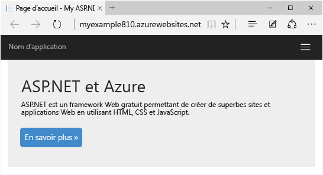

##Inscription à Microsoft Azure (Vidéo)

Dans cette vidéo, Scott Hanselman montre combien il est facile de s’inscrire à une version d’évaluation gratuite de Microsoft Azure. (Durée : 1:58)

> [AZURE.VIDEO sign-up-for-microsoft-azure]

[AZURE.INCLUDE [install-sdk-2013-only](../../includes/install-sdk-2013-only.md)]

## Création d’une application web ASP.NET

Vous devez tout d’abord créer un projet d’application Web. Visual Studio crée automatiquement l’application web Azure dans laquelle vous allez déployer votre projet.

1. Ouvrez Visual Studio 2013 ou Visual Studio 2013 Express pour le Web.

2. Dans le menu **Fichier**, cliquez sur **Nouveau projet**.

3. Dans la boîte de dialogue **Nouveau projet**, cliquez sur **C#** > **Web** > **Application Web ASP.NET**. Vous pouvez, si vous préférez, sélectionner **Visual Basic**.

3. Vérifiez que la version cible sélectionnée est **.NET Framework 4.5**.

4.  [Application Insights](app-insights-overview.md) surveille la disponibilité, les performances et l'utilisation. Désactivez la case à cocher **Ajouter Application Insights au projet** si vous ne voulez pas l'essayer.

4. Nommez l’application **MonExemple**, puis cliquez sur **OK**.

	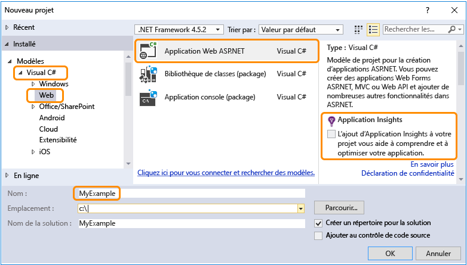

5. Dans la boîte de dialogue **Nouveau projet ASP.NET**, sélectionnez le modèle **MVC**. Si vous préférez utiliser Web Forms ASP.NET, vous pouvez sélectionner le modèle **Web Forms**.

	[MVC et Web Forms](http://www.asp.net/get-started/websites) sont des infrastructures ASP.NET permettant de développer des applications web. Pour les besoins de ce didacticiel, vous pouvez choisir l'un ou l'autre, mais si vous sélectionnez Web Forms, vous devrez modifier *Default.aspx* ultérieurement, quand le didacticiel vous invitera à modifier *Index.cshtml*.

7. Cliquez sur **Modifier l'authentification**.

	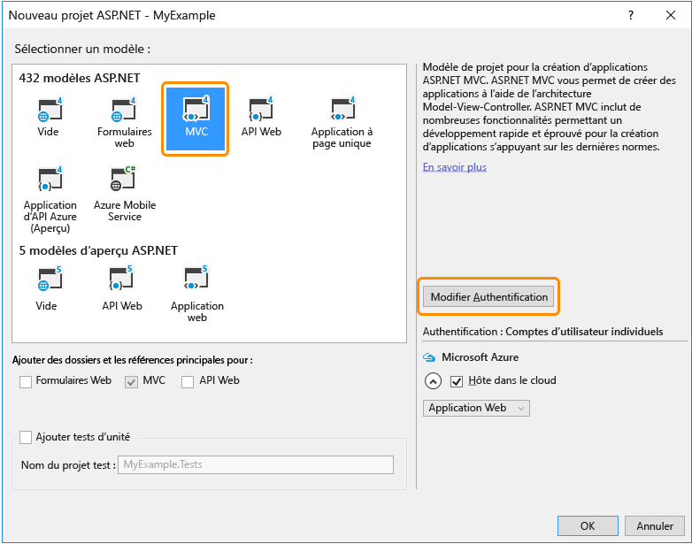

6. Dans la boîte de dialogue **Modifier l'authentification**, cliquez sur **Aucune authentification**, puis sur **OK**.

	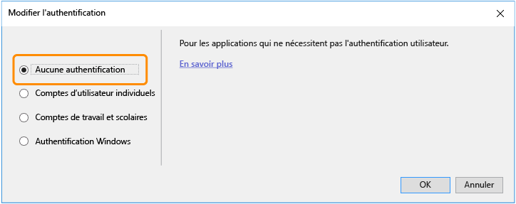

	L’exemple d’application que vous créez ne permettra pas aux utilisateurs de se connecter. La section [Étapes suivantes](#next-steps) renvoie vers un didacticiel qui implémente l’authentification et l’autorisation.

5. Dans la boîte de dialogue **Nouveau projet ASP.NET**, conservez les paramètres existants sous **MicrosoftAzure**, puis cliquez sur **OK**.

	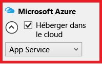

	Les paramètres par défaut indiquent que Visual Studio va créer une application web Azure pour votre projet web. Dans la section suivante du didacticiel, vous allez déployer le projet web vers l’application web nouvellement créée.

5. Si vous n’êtes pas déjà connecté à Azure, Visual Studio vous invite à le faire. Connectez-vous avec l’ID et le mot de passe du compte que vous utilisez pour gérer votre abonnement Azure.

	Lorsque vous êtes connecté, la boîte de dialogue **Configurer les paramètres de l’application web Microsoft Azure** vous demande les ressources que vous voulez créer.

	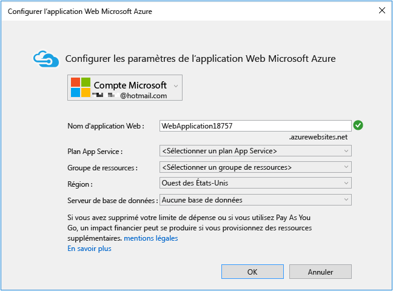

3. Dans la boîte de dialogue **Configurer les paramètres de l’application web Microsoft Azure**, conservez la valeur par défaut.

	Vous pouvez entrer un autre **nom d'application web** si vous préférez, mais le nom doit être unique dans le domaine *azurewebsites.net*. Le nom par défaut fourni par Visual Studio est unique.

	Azure utilise ce nom comme préfixe de l'URL de votre application. L’URL complète se compose de ce nom plus *.azurewebsites.net* (comme indiqué en regard de la zone de texte **Nom de l’application web**). Par exemple, si le nom du site est `MyExample6442`, l’URL sera `MyExample6442.azurewebsites.net`. L'URL doit être unique. Si une autre personne utilise déjà celle que vous avez entrée, un point d’exclamation rouge s’affiche à droite au lieu d’une coche verte, et vous devez entrer un autre nom.

4. Dans la liste déroulante **Plan App Service**, sélectionnez **Créer un plan App Service**.

	La section [Étapes suivantes](#next-steps) à la fin du didacticiel comporte des liens vers des informations sur les plans de service de l'application.

5. Entrez *MonExemplePlan* ou un autre nom si vous préférez pour le nom du plan.

6. Dans la liste déroulante **Groupe de ressources**, sélectionnez **Créer un groupe de ressources**.

	La section [Étapes suivantes](#next-steps) comporte des liens vers des informations sur les groupes de ressources.

5. Entrez *MonExempleGroupeRessources* ou un autre nom si vous préférez pour le nom du groupe de ressources.

5. Dans la liste déroulante **Région**, sélectionnez le lieu le plus proche de vous.

	Ce paramètre indique le centre de données Azure sur lequel votre application Web sera exécutée. Pour les besoins de ce didacticiel, vous pouvez sélectionner n’importe quelle région : la différence ne sera pas sensible. Mais pour une application web de production, votre serveur web doit être le plus proche possible des navigateurs qui accèdent à votre site afin de minimiser la [latence](http://www.bing.com/search?q=web%20latency%20introduction&qs=n&form=QBRE&pq=web%20latency%20introduction&sc=1-24&sp=-1&sk=&cvid=eefff99dfc864d25a75a83740f1e0090).

5. Ne modifiez pas le champ de base de données.

	Vous n’utiliserez pas de base de données dans le cadre de ce didacticiel. La section [Étapes suivantes](#next-steps) située à la fin de ce didacticiel mène vers un autre didacticiel qui vous expliquera comment utiliser une base de données.

6. Cliquez sur **OK**.

	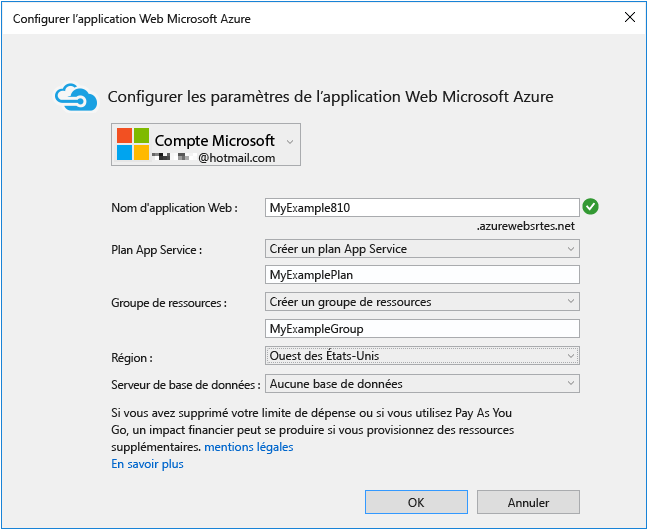

	En quelques secondes, Visual Studio crée le projet Web dans le dossier indiqué, puis crée l’application web dans la région Azure indiquée.

	La fenêtre **Explorateur de solutions** indique les fichiers et les dossiers du nouveau projet.

	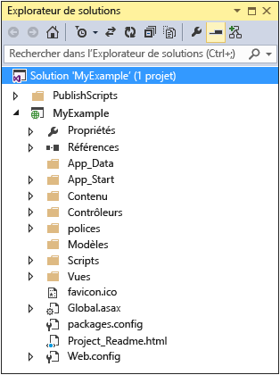

	La fenêtre **Activité Azure App Service** indique que l’application web a été créée.

	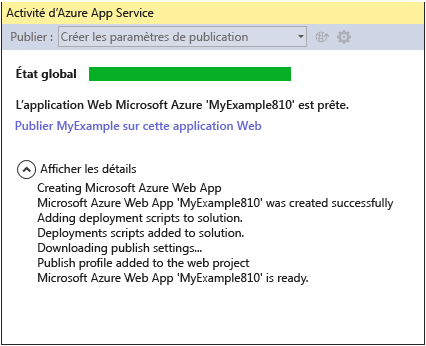

	Par ailleurs, l’application web apparaît dans l’Explorateur de serveurs.

	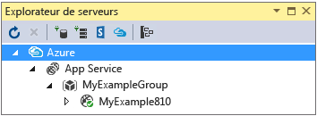

## Déploiement de l'application dans Azure

7. Dans la fenêtre **Activité Azure App Service**, cliquez sur **Publier MonExemple dans cette application web**.

	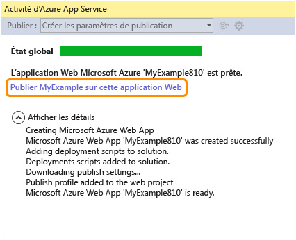

	Au bout de quelques secondes, l’Assistant **Publier le site Web** apparaît.

	Les paramètres dont Visual Studio a besoin pour déployer votre projet vers Azure ont été enregistrés dans un *profil de publication*. L'Assistant vous permet de passer en revue et de modifier ces paramètres.

8. Dans l’onglet **Connexion** de l’Assistant **Publier le site Web**, cliquez sur **Valider la connexion** pour vous assurer que Visual Studio peut se connecter à Azure afin de déployer le projet Web.

	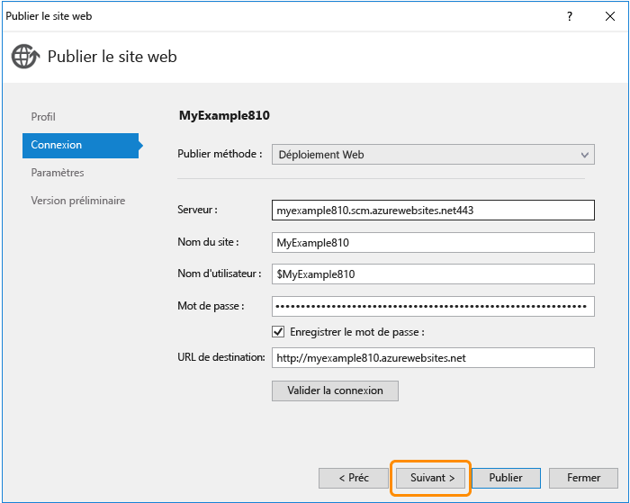

	Une fois la connexion validée, une coche verte est affichée en regard du bouton **Validate Connection**.

9. Cliquez sur **Next**.

	

10. Sous l’onglet **Paramètres**, cliquez sur **Suivant**.

	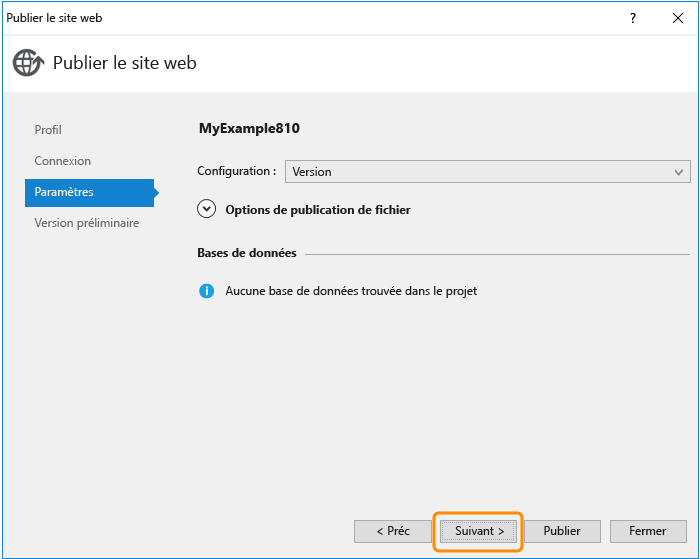

	Vous pouvez accepter les valeurs par défaut pour **Configuration** et **Options de publication des fichiers**.

	La liste déroulante **Configuration** vous permet de déployer une version de débogage pour le débogage distant. La section [Étapes suivantes](#next-steps) renvoie vers un didacticiel qui explique comment exécuter Visual Studio en mode de débogage à distance.

	Si vous développez **Options de publication des fichiers**, vous avez accès à plusieurs paramètres vous permettant de traiter des scénarios qui ne s'appliquent pas à ce didacticiel :

	* Supprimer les fichiers supplémentaires à la destination.

		Supprime du serveur tous les fichiers qui ne sont pas dans votre projet. Cela peut s’avérer utile si vous déployez un projet vers une application web que vous avez déjà utilisée précédemment pour déployer un autre projet.

	* Précompiler pendant la publication.

		Permet de réduire les temps de préchauffage lors de la première demande pour les applications volumineuses.

	* Exclure les fichiers du dossier App_Data.

		Pour les tests, vous conservez parfois dans le dossier App_Data un fichier de base de données SQL Server que vous ne souhaitez pas déployer en production.

11. Sous l'onglet **Aperçu**, cliquez sur **Démarrer l'aperçu**.

	

	L'onglet affiche la liste des fichiers qui seront copiés sur le serveur. L’affichage de l’aperçu n’est pas requis pour publier l’application. Cependant, il s’agit d’une fonction utile à ne pas négliger.

12. Cliquez sur **Publier**.

	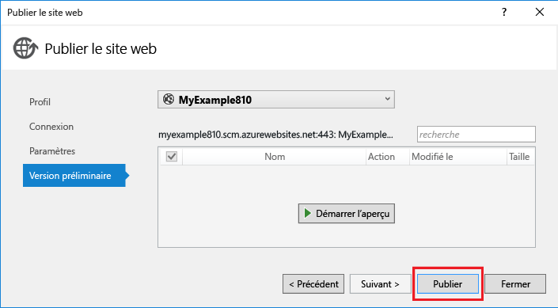

	Visual Studio démarre le processus de copie des fichiers vers le serveur Azure.

	Les fenêtres **Output** et **Web Publish Activity** indiquent les actions de déploiement entreprises et signalent la réussite du déploiement.

	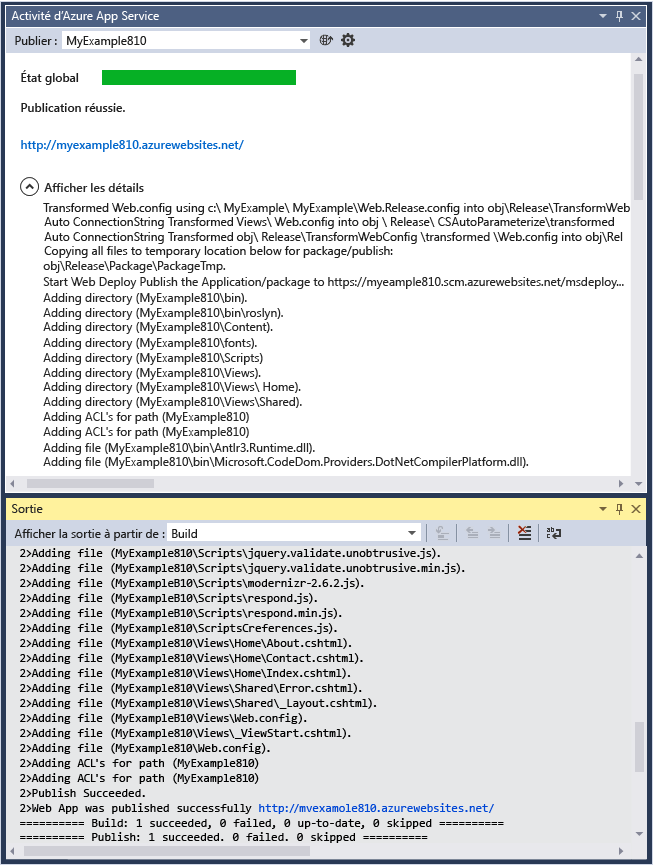

	Une fois le déploiement réussi, le navigateur par défaut ouvre automatiquement l’URL de l’application web déployée, et l’application créée est exécutée dans le cloud. L’URL de la barre d’adresse du navigateur indique que l’application web est chargée depuis Internet.

	

13. Fermez le navigateur.

## Modification et redéploiement

Cette section du didacticiel permet de modifier le titre **h1** de la page d'accueil, d'exécuter le projet en local sur votre ordinateur de développement pour vérifier les modifications apportées, puis de déployer la version modifiée vers Azure.

2. Ouvrez le fichier *Views/Home/Index.cshtml* ou *.vbhtml* dans l'**Explorateur de solutions**, remplacez le titre **h1** « ASP.NET » par « ASP.NET et Azure », puis enregistrez le fichier.

	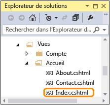

	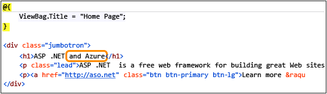

1. Appuyez sur Ctrl+F5 pour voir le titre mis à jour en exécutant l’application web sur votre ordinateur local.

	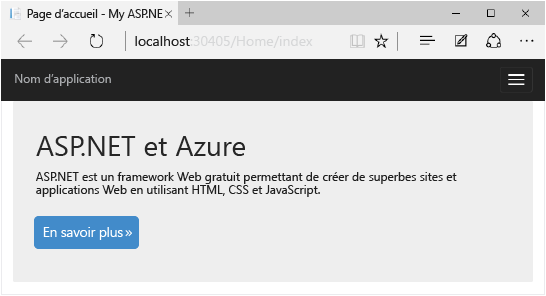

	L'URL `http://localhost` indique que l'application est exécutée sur votre ordinateur local. L’application est exécutée par défaut dans IIS Express, qui est une version légère d’IIS conçue pour une utilisation pendant le développement d’applications Web.

1. Fermez le navigateur.

1. Dans l’**Explorateur de solutions**, cliquez avec le bouton droit sur le projet, puis sélectionnez **Publier**.

	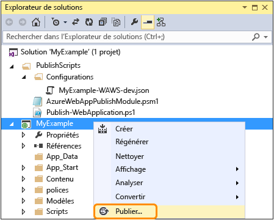

	L’onglet Aperçu de l’Assistant **Publier le site Web** apparaît. Si vous devez modifier des paramètres de publication, vous pouvez choisir un autre onglet. Mais à présent, nous partons du principe que vous voulez procéder à un redéploiement sans modifier les paramètres.

2. Dans l’Assistant **Publier le site Web** cliquez sur **Publier**.

	

	Visual Studio déploie le projet vers Azure et ouvre l’application web dans le navigateur par défaut.

	

**Conseil :** vous pouvez activer la barre d'outils **Publication Web en un clic** pour accélérer encore le déploiement. Cliquez sur **Affichage** > **Barres d'outils**, puis sélectionnez **Publication Web en un clic**. La barre d'outils vous permet de sélectionner un profil, de cliquer sur un bouton pour publier ou de cliquer sur un bouton pour ouvrir l'Assistant **Publier le site Web**.

## Surveillance et gestion de l’application web dans le portail de gestion

Le [portail de gestion Azure](/services/management-portal/) est une interface web permettant de gérer et de surveiller vos services Azure, tels que l’application web que vous venez de créer. Dans cette section du didacticiel, vous allez examiner certaines des possibilités offertes par le portail.

1. Dans votre navigateur, accédez à [https://portal.azure.com]() et connectez-vous avec vos informations d'identification Azure.

2. Cliquez sur **Parcourir > Web Apps**, puis cliquez sur le nom de votre application web.

	Le panneau **Application web** de votre application web affiche une vue d’ensemble des statistiques d’utilisation et des liens vers des fonctions de gestion d’application web courantes.

	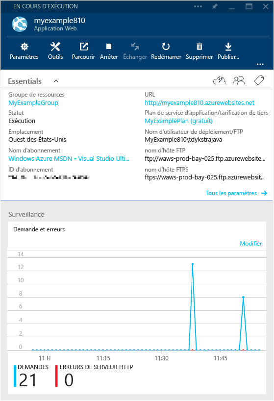-->

	À ce stade, le trafic sur votre application web est encore très faible et il ne sera peut-être pas visible dans le graphique. Si vous accédez à votre application, actualisez la page plusieurs fois, puis actualisez la page du portail ; les statistiques commenceront à s’afficher.

3. Cliquez sur **Tous les paramètres** pour afficher d’autres options de configuration de votre application web.

	Différents types de paramètres sont répertoriés.

	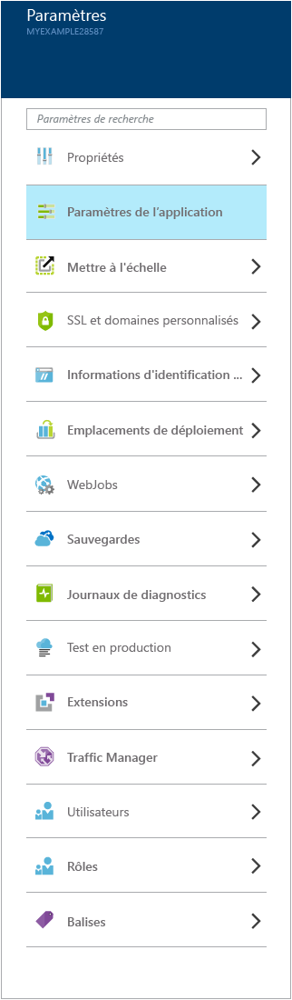-->

4. Cliquez sur **Paramètres de l’application** pour voir un exemple des paramètres configurables dans le portail.

	Par exemple, vous pouvez contrôler la version .NET utilisée pour l’application web, activer des fonctionnalités telles que [WebSockets](/blog/2013/11/14/introduction-to-websockets-on-windows-azure-web-sites/) ou définir les [valeurs de la chaîne de connexion](/blog/2013/07/17/windows-azure-web-sites-how-application-strings-and-connection-strings-work/).

	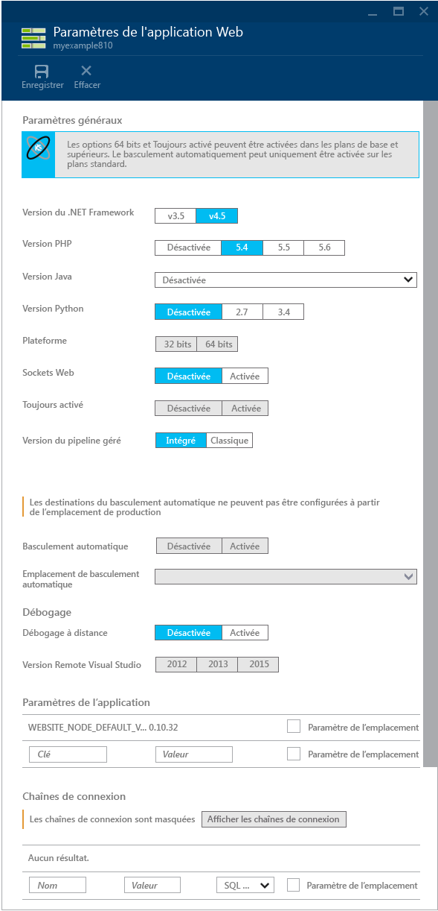

Ce ne sont là que quelques-unes des fonctionnalités du portail de gestion. Vous pouvez créer des applications web, supprimer des applications web existantes, arrêter et redémarrer des applications web, et gérer d’autres types de services Azure, par exemple, des bases de données et des machines virtuelles.

>[AZURE.NOTE]Si vous voulez vous familiariser avec Azure App Service avant d’ouvrir un compte Azure, accédez à la page [Essayer App Service](http://go.microsoft.com/fwlink/?LinkId=523751). Vous pourrez créer immédiatement et gratuitement une application de départ temporaire dans App Service. Aucune carte de crédit n’est requise ; vous ne prenez aucun engagement.

## Étapes suivantes

Dans ce didacticiel, vous avez appris à créer une application web simple et à la déployer vers une application web Azure. Pour en savoir plus, consultez les rubriques et ressources suivantes :

* Autres méthodes de déploiement d’un projet Web

	Dans ce didacticiel, vous avez appris la méthode la plus rapide pour créer une application web et la déployer en une opération. Pour découvrir d’autres méthodes de déploiement, en utilisant Visual Studio ou en [automatisant le déploiement](http://www.asp.net/aspnet/overview/developing-apps-with-windows-azure/building-real-world-cloud-apps-with-windows-azure/continuous-integration-and-continuous-delivery) à partir d’un [système de contrôle de code source](http://www.asp.net/aspnet/overview/developing-apps-with-windows-azure/building-real-world-cloud-apps-with-windows-azure/source-control), consultez l’article [Déploiement d’une application web Azure](web-sites-deploy.md).

	Visual Studio génère également des scripts Windows PowerShell qui vous permettent d'automatiser le déploiement. Pour en savoir plus, consultez la page [Tout automatiser (développement d’applications de cloud concrètes avec Azure)](http://www.asp.net/aspnet/overview/developing-apps-with-windows-azure/building-real-world-cloud-apps-with-windows-azure/automate-everything).

* Gestion d’une application web dans Visual Studio

	Pour plus d’informations sur les fonctions de gestion d’application web disponibles dans l’**Explorateur de serveurs**, consultez la page [Résolution des problèmes des applications web Azure dans Visual Studio](web-sites-dotnet-troubleshoot-visual-studio.md).

* Résolution des problèmes d’une application web

	Visual Studio fournit des fonctionnalités qui facilitent l'affichage des journaux Azure durant leur génération en temps réel. Vous pouvez aussi exécuter le mode Debug à distance dans Azure. Pour plus d’informations, consultez la page [Résolution des problèmes des applications web Azure dans Visual Studio](web-sites-dotnet-troubleshoot-visual-studio.md).

* Ajout d'une fonctionnalité de base de données et d'autorisation

	Pour suivre un didacticiel expliquant comment accéder aux bases de données et limiter certaines fonctions d’application aux utilisateurs autorisés, consultez la page [Déploiement d’une application ASP.NET MVC avec une fonctionnalité d’appartenance, OAuth et une base de données SQL Database vers une application web Azure](/develop/net/tutorials/web-site-with-sql-database/).

* Ajout d'un nom de domaine personnalisé et de SSL

	Pour des informations sur l'utilisation de SSL et de votre propre nom de domaine (par exemple, www.contoso.com au lieu de contoso.azurewebsites.net), consultez les ressources suivantes :

	* [Configuration d'un nom de domaine personnalisé pour un site web Azure](web-sites-custom-domain-name.md).
	* [Activation du protocole HTTPS pour un site web Azure](web-sites-configure-ssl-certificate.md)

* Manière d'éviter les délais de sortie de veille après les périodes d'inactivité

	Par défaut, les applications web sont déchargées si elles sont inactives depuis un certain temps. La première demande après une telle période doit patienter jusqu’à ce que l’application web soit rechargée. Pour éviter ce temps d'attente, vous pouvez activer la fonction AlwaysOn. Pour plus d'informations, consultez les options de configuration dans [Configuration des applications web](web-sites-configure.md).

* Ajout de fonctions en temps réel telles que la conversation instantanée

	Si votre application web doit inclure des fonctions en temps réel (telles qu’un service de conversation instantanée, un jeu, un afficheur en temps réel des cours de bourse, etc.), vous pouvez obtenir des performances optimales en utilisant [ASP.NET SignalR](http://www.asp.net/signalr) avec la méthode de transport [WebSockets](/blog/2013/11/14/introduction-to-websockets-on-windows-azure-web-sites/). Pour plus d’informations, consultez la page [Utilisation de SignalR avec Azure Web Apps](http://www.asp.net/signalr/overview/signalr-20/getting-started-with-signalr-20/using-signalr-with-windows-azure-web-sites).

* Comparaison entre App Service, Cloud Services et Virtual Machines pour les applications web

	Azure vous permet d’exécuter des applications web dans App Service Web Apps (comme vous l’avez vu dans ce didacticiel), mais aussi dans Cloud Services ou Virtual Machines. Pour plus d’informations, consultez les articles [Modèles d’exécution Azure](/develop/net/fundamentals/compute/) et [Applications web, services cloud et machines virtuelles Azure : quand les utiliser ?](/manage/services/web-sites/choose-web-app-service/)

* [Comment choisir ou créer un plan App Service](../app-service/azure-web-sites-web-hosting-plans-in-depth-overview.md)

* [Comment choisir ou créer un groupe de ressources](../azure-preview-portal-using-resource-groups.md)

## Changements apportés
* Pour obtenir un guide présentant les modifications apportées dans le cadre de la transition entre Sites Web et App Service, consultez la page [Azure App Service et les services Azure existants](http://go.microsoft.com/fwlink/?LinkId=529714).
* Pour obtenir un guide présentant les modifications apportées dans le cadre de la transition entre l’ancien et le nouveau portail, consultez la page [Références sur la navigation dans le portail Azure](http://go.microsoft.com/fwlink/?LinkId=529715).
 

<!---HONumber=July15_HO3-->