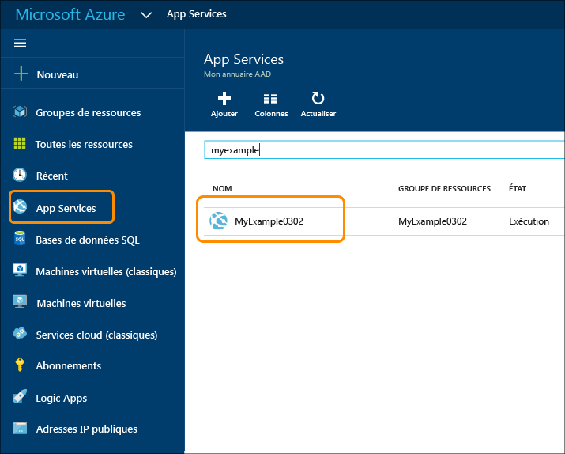

<properties
	pageTitle="Création d’une application web ASP.NET dans Azure App Service | Microsoft Azure"
	description="Ce didacticiel explique comment créer un projet web ASP.NET dans Visual Studio 2013 et comment le déployer dans Azure App Service."
	services="app-service\web"
	documentationCenter=".net"
	authors="tdykstra"
	manager="wpickett"
	editor="jimbe"/>

<tags
	ms.service="app-service-web"
	ms.workload="web"
	ms.tgt_pltfrm="na"
	ms.devlang="dotnet"
	ms.topic="hero-article"
	ms.date="03/02/2015"
	ms.author="tdykstra"/>

# Création d’une application web ASP.NET dans Azure App Service

> [AZURE.SELECTOR]
- [.Net](web-sites-dotnet-get-started.md)
- [Node.JS](web-sites-nodejs-develop-deploy-mac.md)
- [Java](web-sites-java-get-started.md)
- [PHP - Git](web-sites-php-mysql-deploy-use-git.md)
- [PHP - FTP](web-sites-php-mysql-deploy-use-ftp.md)
- [Python](web-sites-python-ptvs-django-mysql.md)

## Vue d'ensemble

Ce didacticiel montre comment déployer une application web ASP.NET dans une [application web dans Azure App Service](app-service-web-overview.md) en utilisant Visual Studio 2015. Ce didacticiel part du principe que vous êtes un développeur ASP.NET sans expérience préalable avec Azure. À la fin de ce didacticiel, vous disposerez d’une application web simple et fonctionnelle dans le cloud.

L’illustration suivante présente l’application terminée :

Vous apprendrez ce qui suit :

* Comment créer une application web App Service pendant la création d’un projet web dans Visual Studio.
* Comment déployer un projet web sur une application web App Service à l’aide de Visual Studio.
* utiliser le [portail Azure](/overview/preview-portal/) pour surveiller et gérer votre application web.

À la fin du didacticiel, la section [Étapes suivantes](#next-steps) propose des liens vers d’autres didacticiels plus détaillés sur l’utilisation d’Azure App Service.

> [AZURE.NOTE] Aidez-nous à améliorer la portée et l’approche de ce didacticiel. Si vous aimeriez que d’autres thèmes soient traités dans un didacticiel de prise en main, n’hésitez pas à laisser un [commentaire](#comments) en bas de cette page.

[AZURE.INCLUDE [Conditions préalables](../../includes/app-service-web-dotnet-get-started-prereqs.md)]

## Créer un projet et une application web

La première étape consiste à créer un projet web dans Visual Studio et une application web dans Azure App Service. Lorsque cette opération effectuée, vous allez déployer le projet vers l'application web pour le rendre disponible sur Internet.

Le diagramme illustre ce que vous faites dans les étapes de création et de déploiement.

1. Ouvrez Visual Studio 2015.

2. Cliquez sur **Fichier > Nouveau > Projet**.

3. Dans la boîte de dialogue **Nouveau projet**, cliquez sur **Visual C# > Web > Application web ASP.NET**. Vous pouvez, si vous préférez, sélectionner **Visual Basic**.

3. Vérifiez que la version cible sélectionnée est **.NET Framework 4.5.2**.

4.  [Azure Application Insights](../application-insights/app-insights-overview.md) surveille la disponibilité, les performances et l’utilisation de votre application web. La case à cocher **Ajouter Application Insights au projet** est activée par défaut la première fois que vous créez un projet web après l’installation de Visual Studio. Décochez la case si vous ne voulez pas essayer Application Insights.

4. Nommez l’application **MonExemple**.

5. Cliquez sur **OK**.

	

5. Dans la boîte de dialogue **Nouveau projet ASP.NET**, sélectionnez le modèle **MVC**.

7. Cliquez sur **Modifier l'authentification**.

	

6. Dans la boîte de dialogue **Modifier l'authentification**, cliquez sur **Aucune authentification**, puis sur **OK**.

	

	Dans ce didacticiel, vous allez créer une application simple qui ne prend pas en charge la connexion des utilisateurs.

5. Dans la section **Microsoft Azure** de la boîte de dialogue **Nouveau projet ASP.NET**, vérifiez que **Héberger dans le cloud** est sélectionné et que **App Service** est sélectionné dans la liste déroulante.

	

	Ces paramètres indiquent que Visual Studio va créer une application web Azure pour votre projet web.

6. Cliquez sur **OK**.

5. Si vous n’êtes pas déjà connecté à Azure, Visual Studio vous invite à le faire. Connectez-vous avec l’ID et le mot de passe du compte que vous utilisez pour gérer votre abonnement Azure.

	Lorsque vous êtes connecté, la boîte de dialogue **Céer App Service** vous demande les ressources que vous voulez créer.

	

3. Dans la boîte de dialogue **Créer App Service**, saisissez un **nom d’application web** unique dans le domaine *azurewebsites.net*. Par exemple, vous pouvez le nommer MonExemple avec des chiffres à droite pour le rendre unique, comme MonExemple810. Si un nom web par défaut est créé pour vous, il sera unique et vous pouvez l'utiliser.

	Si une autre personne a déjà utilisé le nom que vous avez entré, un point d’exclamation rouge s’affiche à droite au lieu d’une coche verte, et vous devez entrer un autre nom.

	Azure utilise ce nom comme préfixe de l’URL de votre application. L’URL complète se compose de ce nom plus *.azurewebsites.net* (comme indiqué en regard de la zone de texte **Nom de l’application web**). Par exemple, si le nom du site est `MyExample810`, l’URL sera `myexample810.azurewebsites.net`. L'URL doit être unique.

6. En regard de la zone **Groupe de ressources**, cliquez sur **Nouveau**, puis entrez « MyExample » ou un autre nom si vous préférez.

	Cette zone de liste modifiable vous permet de sélectionner un groupe de ressources existant ou d’en créer un en tapant un nom différent des groupes de ressources existants de votre abonnement.

	Un groupe de ressources est une collection de ressources Azure telles que des applications API, des bases de données, des machines virtuelles, etc. Pour un didacticiel, il est généralement préférable de créer un groupe de ressources, car cela permet de supprimer en une étape les ressources Azure que vous créez pour le didacticiel. Pour plus d’informations, consultez [Présentation d’Azure Resource Manager](../resource-group-overview.md).

4. Cliquez sur le bouton **Nouveau** situé en regard de la liste déroulante **Plan App Service**.

	

	La capture d’écran montre des exemples de valeur pour **Nom de l’application web**, **Abonnement** et **Groupe de ressources**. Vos valeurs sont différentes.

	Au cours des étapes suivantes, vous allez créer un plan de service d’application pour le nouveau groupe de ressources. Un plan de service d’application spécifie les ressources de calcul sur lesquelles votre application API s’exécute. Par exemple, si vous choisissez le niveau Gratuit, votre application API s’exécute sur des machines virtuelles partagées, tandis que pour certains niveaux payants, elle s’exécute sur des machines virtuelles dédiées. Pour plus d’informations, consultez [Présentation des plans App Service](../app-service/azure-web-sites-web-hosting-plans-in-depth-overview.md).

5. Dans la boîte de dialogue **Configurer le plan App Service**, entrez « MyExamplePlan » ou un autre nom si vous préférez.

5. Dans la liste déroulante **Emplacement**, sélectionnez le lieu le plus proche de vous.

	Ce paramètre indique le centre de données Azure dans lequel votre application sera exécutée. Pour les besoins de ce didacticiel, vous pouvez sélectionner n’importe quelle région : la différence ne sera pas sensible. Toutefois, pour une application de production, votre serveur doit être le plus proche possible des clients qui y accèdent, afin de minimiser la [latence](http://www.bing.com/search?q=web%20latency%20introduction&qs=n&form=QBRE&pq=web%20latency%20introduction&sc=1-24&sp=-1&sk=&cvid=eefff99dfc864d25a75a83740f1e0090).

5. Dans la liste déroulante **Taille**, cliquez sur **Gratuit**.

	Pour ce didacticiel, le niveau tarifaire Gratuit fournit des performances suffisantes.

6. Dans la boîte de dialogue **Configurer le plan App Service**, cliquez sur **OK**.

	

7. Dans la boîte de dialogue **Créer App Service**, cliquez sur **Créer**.

	

	Visual Studio crée rapidement, généralement en moins de 1 minute, le projet web et l’application web.

	La fenêtre **Explorateur de solutions** indique les fichiers et les dossiers du nouveau projet.

	

	La fenêtre **Activité Azure App Service** indique que l’application web a été créée.

	

	L’application web s’affiche dans **Cloud Explorer**.

	

## Déploiement du projet dans l’application web

Dans cette section, vous déployez le projet web dans l’application web, comme illustré à l’étape 2 du diagramme.

1. Dans l’**Explorateur de solutions**, cliquez avec le bouton droit sur le projet, puis sélectionnez **Publier**.

	

	Au bout de quelques secondes, l’Assistant **Publier le site web** s’ouvre. L’Assistant s’ouvre sur un *profil de publication* présentant des paramètres pour le déploiement du projet web sur la nouvelle application web. Si vous souhaitez exécuter le déploiement sur une autre application web, cliquez sur l’onglet **Profil** pour créer un autre profil. Dans le cadre de ce didacticiel, vous allez accepter les paramètres de déploiement de l’application web que vous avez créée plus tôt.

8. Sous l’onglet **Connexion** de l’Assistant **Publier le site web**, cliquez sur **Suivant**.

	

	Dans l’onglet suivant **Paramètres**, vous pouvez modifier l’onglet Configuration de build pour déployer une build de débogage pour le [débogage distant](../app-service-web/web-sites-dotnet-troubleshoot-visual-studio.md#remotedebug). L’onglet offre également plusieurs **Options de publication des fichiers** :

	* Supprimer les fichiers supplémentaires de la destination
	* Précompiler durant la publication
	* Exclure les fichiers du dossier App\_Data

	Pour ce didacticiel, vous n’avez besoin d’aucune de ces options. Pour obtenir des explications détaillées sur leur action, consultez [Déploiement d’un projet web à l’aide de la publication en un clic dans Visual Studio](https://msdn.microsoft.com/library/dd465337.aspx).

10. Sous l’onglet **Paramètres**, cliquez sur **Suivant**.

	

	Dans l’onglet suivant **Aperçu**, vous pouvez voir les fichiers qui vont être copiés de votre projet vers l’application API. Lorsque vous déployez un projet vers une application API vers laquelle vous avez déjà déployé auparavant le projet, seuls les fichiers modifiés sont copiés. Si vous souhaitez afficher la liste de ce qui sera copié, vous pouvez cliquer sur le bouton **Démarrer l’aperçu**.

11. Dans l’onglet **Aperçu**, cliquez sur **Publier**.

	

	Quand vous cliquez sur **Publier**, Visual Studio démarre le processus de copie des fichiers sur le serveur Azure. Cela peut prendre une à deux minutes.

	Les fenêtres **Sortie** et **Activité Azure App Service** indiquent les actions de déploiement effectuées et signalent la réussite du déploiement.

	

	Une fois le déploiement réussi, le navigateur par défaut ouvre automatiquement l’URL de l’application web déployée, et l’application créée est exécutée dans le cloud. L'URL de la barre d'adresse du navigateur indique que l'application web est chargée depuis Internet.

	

> [AZURE.TIP] Vous pouvez activer la barre d’outils **Publication Web en un clic** pour accélérer le déploiement. Cliquez sur **Affichage > Barres d’outils**, puis sélectionnez **Publication Web en un clic**. Vous pouvez utiliser cette barre d’outils pour sélectionner un profil ou encore cliquer sur un bouton pour publier ou pour ouvrir l’Assistant **Publier le site web**. 

## Surveillance et gestion de l’application web dans le portail Azure

Le [portail Azure](/services/management-portal/) est une interface web qui vous permet de gérer et de surveiller vos services Azure, tels que l’application web que vous venez de créer. Dans cette section du didacticiel, vous allez examiner certaines des possibilités offertes par le portail.

1. Dans votre navigateur, accédez à [https://portal.azure.com](https://portal.azure.com) et connectez-vous avec les informations d’identification que vous utilisez pour la gestion de votre compte Azure.

2. Cliquez sur **App Services**, puis sur le nom de votre application web.

	

	Le panneau **Application web** affiche une vue d’ensemble des paramètres et des statistiques d’utilisation de votre application web. Les fenêtres qui s’ouvrent sur la droite du portail sont appelées des *panneaux*.

	

	À ce stade, le trafic sur votre application web est encore très faible et il ne sera peut-être pas visible dans le graphique. Si vous accédez à votre application, actualisez la page plusieurs fois, puis actualisez la page du portail ; les statistiques commenceront à s’afficher.

3. Le panneau **Paramètres** affiche d’autres options de configuration de votre application web.

	

	Ce panneau inclut d’autres sections en plus de celles affichées dans cette capture d’écran.

4. Cliquez sur **Paramètres de l’application** dans la section **Général** du panneau **Paramètres** pour afficher un exemple des paramètres configurables dans le portail.

	Par exemple, vous pouvez contrôler la version .NET utilisée pour l’application web, activer des fonctionnalités telles que [WebSockets](/blog/2013/11/14/introduction-to-websockets-on-windows-azure-web-sites/) et définir les [valeurs de la chaîne de connexion](/blog/2013/07/17/windows-azure-web-sites-how-application-strings-and-connection-strings-work/).

	

Ce ne sont là que quelques-unes des fonctionnalités du portail. Vous pouvez créer des applications web, supprimer des applications web existantes, arrêter et redémarrer des applications web, et gérer d’autres types de services Azure, par exemple, des bases de données et des machines virtuelles.

## Étapes suivantes

Dans ce didacticiel, vous avez appris à créer une application web simple et à la déployer sur une application web Azure. Pour en savoir plus sur Azure App Service, consultez les rubriques et ressources suivantes :

* Autres méthodes permettant de créer des applications web

	Vous avez vu comment créer une application web lors de la création d’un projet Visual Studio. Vous pouvez également créer des ressources Azure dans le processus de déploiement dans Visual Studio de la même façon que lors de la création d’un projet. Vous pouvez aussi créer des applications web en utilisant le [portail Azure](https://portal.azure.com/), des [applets de commande Azure pour Windows PowerShell](../powershell-install-configure.md) ou l’[interface de ligne de commande multiplateforme](../xplat-cli.md).

* Création d’applications API

	Vous avez vu comment créer une instance d’Azure App Service qui est principalement destinée à héberger un site web. App Service dispose également de fonctionnalités conçues pour faciliter le développement, le test et l’hébergement des API. Pour plus d’informations, consultez [Prise en main d’API Apps et d’ASP.NET dans Azure App Service](../app-service-api/app-service-api-dotnet-get-started.md).

* Autres méthodes de déploiement d’un projet web

	Pour plus d’informations sur les autres méthodes de déploiement de projets web sur des applications web, à l’aide de Visual Studio ou en [automatisant le déploiement](http://www.asp.net/aspnet/overview/developing-apps-with-windows-azure/building-real-world-cloud-apps-with-windows-azure/continuous-integration-and-continuous-delivery) à partir d’un [système de contrôle de code source](http://www.asp.net/aspnet/overview/developing-apps-with-windows-azure/building-real-world-cloud-apps-with-windows-azure/source-control), consultez [Déploiement d’une application web Azure](web-sites-deploy.md).

	Visual Studio génère également des scripts Windows PowerShell que vous pouvez utiliser pour automatiser le déploiement. Pour en savoir plus, consultez la page [Tout automatiser (développement d’applications de cloud concrètes avec Azure)](http://www.asp.net/aspnet/overview/developing-apps-with-windows-azure/building-real-world-cloud-apps-with-windows-azure/automate-everything).

* Résolution des problèmes d’une application web

	Visual Studio fournit des fonctionnalités qui facilitent l’affichage des journaux Azure durant leur génération en temps réel. Vous pouvez aussi exécuter le mode Debug à distance dans Azure. Pour plus d’informations, consultez la page [Résolution des problèmes des applications web Azure dans Visual Studio](web-sites-dotnet-troubleshoot-visual-studio.md).

* Ajout d’un nom de domaine personnalisé et de SSL

	Pour des informations sur l’utilisation de SSL et de votre propre nom de domaine (par exemple, www.contoso.com au lieu de contoso.azurewebsites.net), consultez les ressources suivantes :

	* [Configuration d’un nom de domaine personnalisé dans Azure App Service](web-sites-custom-domain-name.md)
	* [Activation du protocole HTTPS pour un site web Azure](web-sites-configure-ssl-certificate.md)

* Ajout de fonctions en temps réel telles que la conversation instantanée

	Si votre application web doit inclure des fonctionnalités en temps réel (par exemple, un service de conversation en ligne, un jeu ou un téléscripteur pour le marché boursier), vous pouvez obtenir des performances optimales en utilisant [ASP.NET SignalR](http://www.asp.net/signalr) avec la méthode de transport [WebSockets](/blog/2013/11/14/introduction-to-websockets-on-windows-azure-web-sites/). Pour plus d’informations, consultez la page [Utilisation de SignalR avec Azure Web Apps](http://www.asp.net/signalr/overview/signalr-20/getting-started-with-signalr-20/using-signalr-with-windows-azure-web-sites).

* Comparaison entre App Service, Azure Cloud Services et Azure Virtual Machines pour les applications web

	Azure vous permet d’exécuter des applications web dans App Service Web Apps (comme vous l’avez vu dans ce didacticiel), mais aussi dans Cloud Services ou Virtual Machines. Pour plus d’informations, consultez [Applications web, services cloud et machines virtuelles Azure : quand les utiliser ?](/manage/services/web-sites/choose-web-app-service/)

<!---HONumber=AcomDC_0309_2016-->