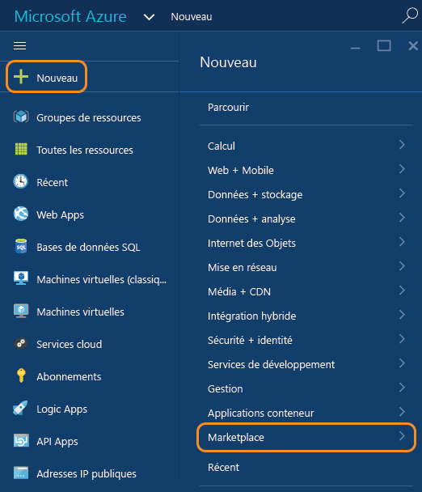
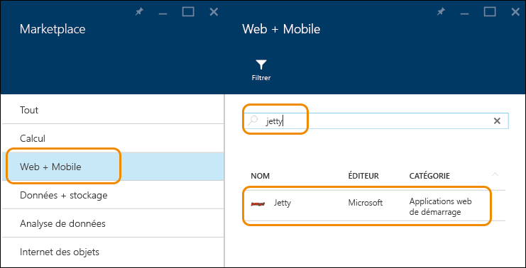
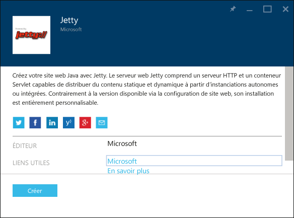
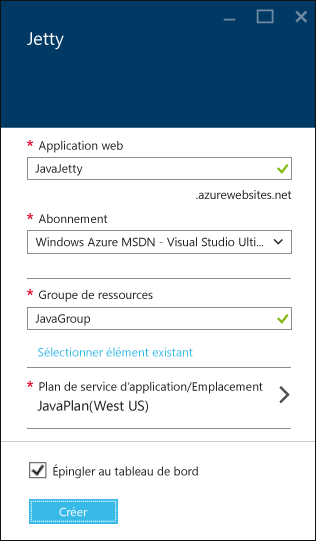
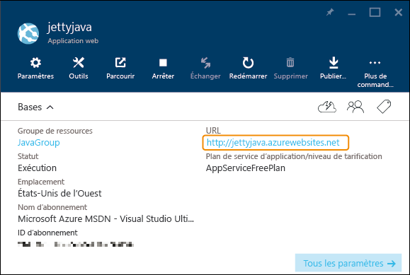

<properties
	pageTitle="Création d’une application web Java dans Azure App Service | Microsoft Azure"
	description="Ce didacticiel vous explique comment déployer une application web Java dans Azure App Service."
	services="app-service\web"
	documentationCenter="java"
	authors="rmcmurray"
	manager="wpickett"
	editor="jimbe"/>
<tags
	ms.service="app-service-web"
	ms.workload="web"
	ms.tgt_pltfrm="na"
	ms.devlang="Java"
	ms.topic="hero-article"
	ms.date="08/31/2015"
	ms.author="robmcm"/>

# Créer une application web Java dans Azure App Service

> [AZURE.SELECTOR]
- [.Net](web-sites-dotnet-get-started.md)
- [Node.js](web-sites-nodejs-develop-deploy-mac.md)
- [Java](web-sites-java-get-started.md)
- [PHP - Git](web-sites-php-mysql-deploy-use-git.md)
- [PHP - FTP](web-sites-php-mysql-deploy-use-ftp.md)
- [Python](web-sites-python-ptvs-django-mysql.md)

Ce didacticiel vous explique comment créer une [application web Java dans Azure App Service](http://go.microsoft.com/fwlink/?LinkId=529714) à l’aide du portail Azure en version préliminaire. Vous pouvez choisir un modèle d’application web à partir de Microsoft Azure Marketplace, ou créer une application web générique que vous configurez manuellement pour Java.

Si vous ne souhaitez pas utiliser l’une de ces techniques (par exemple, si vous préférez personnaliser votre conteneur d’applications), consultez la page [Charger une application web Java personnalisée dans Azure](web-sites-java-custom-upload.md).

> [AZURE.NOTE]Pour effectuer ce didacticiel, vous avez besoin d’un compte Microsoft Azure. Si vous ne possédez pas de compte, vous pouvez [activer les avantages de votre abonnement MSDN][] ou [obtenir une évaluation gratuite][].
>
> Si vous souhaitez commencer à utiliser Azure App Service avant d’ouvrir un compte Azure, accédez à [Essayer App Service][]. Là, vous pouvez créer immédiatement une application de départ temporaire dans App Service. Aucune carte de crédit n’est requise ni aucun engagement.

## Sélectionner un modèle d’application web dans Microsoft Azure Marketplace

Cette section vous montre comment utiliser Microsoft Azure Marketplace pour créer une application web Java.

1. Connectez-vous au [portail Azure en version préliminaire](https://portal.azure.com/).

2. Cliquez sur **Nouveau > Marketplace**.

	

5. Cliquez sur **web + Mobile**.

	Il vous faudra éventuellement faire défiler le contenu sur la gauche pour afficher le panneau **Marketplace**, à partir duquel vous pouvez sélectionner **web + Mobile**.

6. Dans la zone textuelle de recherche, saisissez le nom d’un serveur d’application Java, comme **Apache Tomcat** ou **Jetty**, puis appuyez sur Entrée.

4. Dans les résultats de recherche, cliquez sur le serveur d'applications Java.

	

5. Dans le premier panneau **Apache Tomcat** ou **Jetty**, cliquez sur **Créer**.

	

4. Dans le panneau **Apache Tomcat** ou **Jetty** suivant, attribuez un nom à l’application web dans la zone **Application web**.

	Ce nom doit être unique dans le domaine azurewebsites.net, car l’URL de l’application web sera {nom}.azurewebsites.net. Si le nom que vous entrez n’est pas unique, un point d’exclamation rouge s’affiche dans la zone de texte.

5. Sélectionnez un **Groupe de ressources** ou créez-en un.

	Pour plus d’informations sur les groupes de ressources, consultez [Utilisation du portail Azure en version préliminaire pour gérer vos ressources Azure](../resource-group-portal.md).

5. Sélectionnez un **plan App Service/emplacement** ou créez-en un.

	Pour plus d’informations sur les plans App Service, consultez [Présentation des plans d’Azure App Service](../azure-web-sites-web-hosting-plans-in-depth-overview.md).

6. Cliquez sur **Create**.

	

	Azure termine la création de la nouvelle application web dans un délai bref, généralement inférieur à une minute.

7. Cliquez sur **Applications web > {votre nouvelle application web}**.

8. Cliquez sur l’**URL** afin d’accéder au nouveau site.

	

	Si vous avez sélectionné Tomcat, une page similaire à l’exemple suivant s’affiche.

	

	Si vous avez sélectionné Jetty, une page similaire à l’exemple suivant s’affiche.

	

Maintenant que vous avez créé l’application web avec un conteneur d’applications, consultez la section [Étapes suivantes](#next-steps) pour accéder aux informations concernant le chargement de votre application dans l’application web.

## Créer une application web et la configurer manuellement pour Java

Cette section vous explique comment créer une application web et la configurer manuellement pour Java.

1. Connectez-vous au [portail Azure en version préliminaire](https://portal.azure.com/).

2. Cliquez sur **Nouveau > web + Mobile**.

6. Cliquez sur **Application web**.

4. Attribuez un nom à l’application web dans la zone **Application web**.

	Ce nom doit être unique dans le domaine azurewebsites.net, car l’URL de l’application web sera {nom}.azurewebsites.net. Si le nom que vous entrez n’est pas unique, un point d’exclamation rouge s’affiche dans la zone de texte.

5. Sélectionnez un **Groupe de ressources** ou créez-en un.

	Pour plus d’informations sur les groupes de ressources, consultez [Utilisation du portail Azure en version préliminaire pour gérer vos ressources Azure](../resource-group-portal.md).

5. Sélectionnez un **plan App Service/emplacement** ou créez-en un.

	Pour plus d’informations sur les plans App Service, consultez [Présentation des plans d’Azure App Service](../azure-web-sites-web-hosting-plans-in-depth-overview.md).

6. Cliquez sur **Create**.
 
11. Une fois l’application web créée, cliquez sur **Applications web > {votre application web}**.
 
13. Dans le panneau **Application web**, cliquez sur **Paramètres**.

12. Cliquez sur **Paramètres de l’application**.

13. Sélectionnez la **version Java** souhaitée.

14. Sélectionnez le **conteneur web** souhaité.

15. Cliquez sur **Enregistrer**.

	Votre application web passe sous Java en quelques instants.

7. Cliquez sur **Applications web > {votre nouvelle application web}**.

8. Cliquez sur l’**URL** afin d’accéder au nouveau site.

	La page web confirme que vous avez créé une application web basée sur Java.

## Étapes suivantes

À ce stade, vous disposez d’un serveur d’applications Java s’exécutant dans votre application web, dans Azure App Service. Pour déployer votre propre code dans l’application web, consultez la page [Ajout d’une application ou d’une page web à votre application web Java](web-sites-java-add-app.md).

Pour plus d’informations sur le développement des applications Java dans Azure, consultez le [Centre de développement Java](/develop/java/).

<!-- External Links -->
[activer les avantages de votre abonnement MSDN]: http://go.microsoft.com/fwlink/?LinkId=623901
[obtenir une évaluation gratuite]: http://go.microsoft.com/fwlink/?LinkId=623901

[Essayer App Service]: http://go.microsoft.com/fwlink/?LinkId=523751

<!---HONumber=Oct15_HO4-->