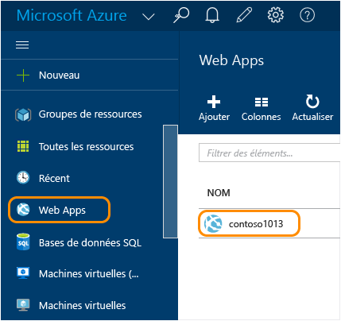
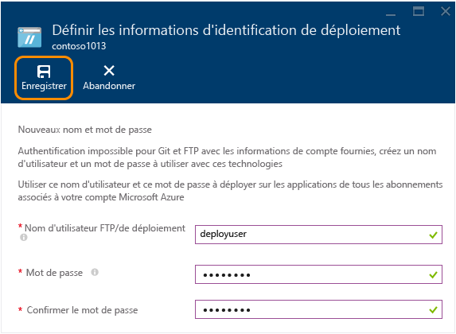
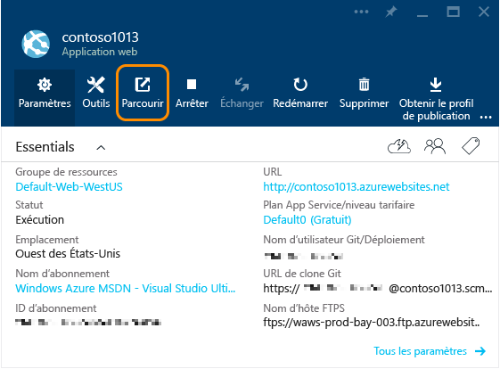

<properties
	pageTitle="Création d’une application web Node.js dans Azure App Service | Microsoft Azure"
	description="Découvrez comment déployer une application Node.js sur une application web dans Azure App Service."
	services="app-service\web"
	documentationCenter="nodejs"
	authors="rmcmurray"
	manager="wpickett"
	editor=""/>

<tags
	ms.service="app-service-web"
	ms.workload="web"
	ms.tgt_pltfrm="na"
	ms.devlang="nodejs"
	ms.topic="hero-article"
	ms.date="11/20/2015"
	ms.author="robmcm"/>

# Créer une application web Node.js dans Azure App Service

> [AZURE.SELECTOR]
- [.Net](web-sites-dotnet-get-started.md)
- [Node.js](web-sites-nodejs-develop-deploy-mac.md)
- [Java](web-sites-java-get-started.md)
- [PHP - Git](web-sites-php-mysql-deploy-use-git.md)
- [PHP - FTP](web-sites-php-mysql-deploy-use-ftp.md)
- [Python](web-sites-python-ptvs-django-mysql.md)

Ce didacticiel explique comment créer une simple application [Node.js](http://nodejs.org) et la déployer sur une [application web](app-service-web-overview.md) dans [Azure App Service](../app-service/app-service-value-prop-what-is.md) en utilisant [Git](http://git-scm.com). Les instructions de ce didacticiel s’appliquent à tous les systèmes d’exploitation pouvant exécuter Node.js.

Vous apprendrez ce qui suit :

* Comment créer une application web dans Azure App Service à l’aide du portail Azure en version préliminaire.
* Comment déployer une application Node.js sur l’application web par transmission de type push au référentiel Git de l’application web.

L’application terminée écrit une courte chaîne « Hello World » dans le navigateur.

![Navigateur affichant le message « Hello World ».][helloworld-completed]

Pour des didacticiels et exemples de code avec des applications Node.js plus complexes, ou pour d’autres rubriques sur l’utilisation de Node.js dans Azure, consultez le [Centre de développement Node.js](/develop/nodejs/).

> [AZURE.NOTE]Pour effectuer ce didacticiel, vous avez besoin d’un compte Microsoft Azure. Si vous ne possédez pas de compte, vous pouvez [activer les avantages de votre abonnement MSDN](/fr-FR/pricing/member-offers/msdn-benefits-details/?WT.mc_id=A261C142F) ou [obtenir une évaluation gratuite](/fr-FR/pricing/free-trial/?WT.mc_id=A261C142F).
>
> Si vous souhaitez commencer à utiliser Azure App Service avant d’ouvrir un compte Azure, accédez à [Essayer App Service](http://go.microsoft.com/fwlink/?LinkId=523751). Là, vous pouvez créer immédiatement une application de départ temporaire dans App Service. Aucune carte de crédit n’est requise ni aucun engagement.

## Créer une application web et activer la publication Git

Pour créer une application web dans Azure App Service et activer la publication Git, suivez la procédure ci-après.

[Git](http://git-scm.com/%20target="_blank) est un système de contrôle de version distribué permettant de déployer votre site web Azure. Vous stockerez le code que vous écrivez pour votre application Web dans un référentiel Git local, et vous déploierez votre code dans Azure par transmission de type Push vers un référentiel distant. Cette méthode de déploiement est une fonctionnalité des applications web App Service.

1. Connectez-vous au [portail Azure en version préliminaire](https://portal.azure.com).

2. Cliquez sur l’icône **+ NOUVEAU** dans le coin supérieur gauche du portail.

3. Cliquez sur **Web + mobile**, puis cliquez sur **Application web**.

    ![][portal-quick-create]

4. Entrez un nom pour l’application web dans la zone **Application web**.

	Ce nom doit être unique dans le domaine azurewebsites.net, car l’URL de l’application web sera {nom}.azurewebsites.net. Si le nom que vous entrez n’est pas unique, un point d’exclamation rouge s’affiche dans la zone de texte.

5. Sélectionnez un **Abonnement**.

6. Sélectionnez un **Groupe de ressources** ou créez-en un.

	Pour plus d’informations sur les groupes de ressources, consultez [Utilisation du portail Azure en version préliminaire pour gérer vos ressources Azure](../resource-group-portal.md).

7. Sélectionnez un **plan App Service/emplacement** ou créez-en un.

	Pour plus d’informations sur les plans App Service, consultez [Présentation des plans d’Azure App Service](../azure-web-sites-web-hosting-plans-in-depth-overview.md).

8. Cliquez sur **Create**.
   
	![][portal-quick-create2]

	Azure termine la création de la nouvelle application web dans un délai bref, généralement inférieur à une minute.

9. Cliquez sur **Applications web > {votre nouvelle application web}**.

	

10. Dans le panneau **Application web**, cliquez sur la partie **Déploiement**.

	![][deployment-part]

11. Dans le panneau **Déploiement continu**, cliquez sur **Choisir la source**

12. Cliquez sur **Référentiel Git local**, puis sur **OK**.

	![][setup-git-publishing]

13. Configurez les informations d’identification de déploiement si vous ne l’avez pas déjà fait.

	a. Dans le panneau Application web, cliquez sur **Paramètres > Informations d’identification de déploiement**.

	![][deployment-credentials]
 
	b. Créez un nom d'utilisateur et un mot de passe.
	
	

14. Dans le panneau Application web, cliquez sur **Paramètres**, puis sur **Propriétés**.
 
	Pour procéder à la publication, vous effectuerez une transmission de type push vers un référentiel Git distant. L’URL pour le référentiel est répertoriée sous **URL GIT**. Vous aurez besoin de cette URL plus loin dans le didacticiel.

	![][git-url]

## Génération et test de votre application localement

Dans cette section, vous allez créer un fichier **server.js** contenant une version légèrement modifiée de l’exemple « Hello World » de [nodejs.org]. Le code ajoute process.env.PORT en tant que port d’écoute lors de l’exécution dans une application web Azure.

1. Créez un répertoire nommé *helloworld*.

2. Utilisez un éditeur de texte pour créer un fichier nommé **server.js** dans le répertoire *helloworld*.

2. Copiez le code suivant dans le fichier **server.js**, puis enregistrez le fichier :

        var http = require('http')
        var port = process.env.PORT || 1337;
        http.createServer(function(req, res) {
          res.writeHead(200, { 'Content-Type': 'text/plain' });
          res.end('Hello World\n');
        }).listen(port);

3. Ouvrez la ligne de commande, puis utilisez la commande suivante pour démarrer l’application web localement.

        node server.js

4. Ouvrez votre navigateur web et accédez à http://localhost:1337.

	Une page web affichant « Hello World » apparaît, comme indiqué sur la capture d’écran suivante.

    ![Navigateur affichant le message « Hello World ».][helloworld-localhost]

## Publication de votre application

1. Si vous ne l’avez pas déjà fait, installez Git.

	Pour obtenir des instructions d’installation pour votre plateforme, voir la [page de téléchargement de Git](http://git-scm.com/download).

1. À partir de la ligne de commande, remplacez les répertoires par le répertoire **helloworld**, puis entrez la commande suivante pour initialiser un référentiel Git local.

		git init

2. Utilisez les commandes suivantes pour ajouter des fichiers au référentiel :

		git add .
		git commit -m "initial commit"

3. Ajoutez un Git distant pour la transmission des mises à jour vers l’application web créée précédemment, en utilisant la commande suivante :

		git remote add azure [URL for remote repository]

4. Transférez vos modifications dans Azure en utilisant la commande suivante :

		git push azure master

	Vous êtes invité à entrer le mot de passe que vous avez créé précédemment. Le résultat ressemble à l’exemple qui suit.

		Counting objects: 3, done.
		Delta compression using up to 8 threads.
		Compressing objects: 100% (2/2), done.
		Writing objects: 100% (3/3), 374 bytes, done.
		Total 3 (delta 0), reused 0 (delta 0)
		remote: New deployment received.
		remote: Updating branch 'master'.
		remote: Preparing deployment for commit id '5ebbe250c9'.
		remote: Preparing files for deployment.
		remote: Deploying Web.config to enable Node.js activation.
		remote: Deployment successful.
		To https://user@testsite.scm.azurewebsites.net/testsite.git
		 * [new branch]      master -> master

5. Pour afficher votre application, cliquez sur le bouton **Parcourir** dans la partie **Application web** du portail Azure.

	

	

## Publication des modifications apportées à votre application

1. Ouvrez le fichier **server.js** dans un éditeur de texte, puis remplacez « Hello World\\n » par « Hello Azure\\n ». 

2. Enregistrez le fichier.

2. Dans la ligne de commande, remplacez les répertoires par le répertoire **helloworld** et exécutez les commandes suivantes :

		git add .
		git commit -m "changing to hello azure"
		git push azure master

	Vous êtes invité à fournir votre mot de passe de nouveau.

3. Actualisez la fenêtre du navigateur avec laquelle vous avez accédé à l’URL de l’application web.

	![Page Web affichant « Hello Azure »][helloworld-completed]

## Restaurer un déploiement

À partir du panneau **Application web**, vous pouvez cliquer sur **Paramètres > Déploiement continu** pour afficher l’historique de déploiement dans le panneau **Déploiements**. Si vous avez besoin de restaurer un déploiement précédent, sélectionnez-le et cliquez sur **Redéployer** dans le panneau **Détails du déploiement**.

## Étapes suivantes

Vous avez déployé une application Node.js sur une application web dans Azure App Service. Pour en savoir plus sur le mode d’exécution des applications Node.js par App Service Web Apps, consultez [Azure App Service Web Apps : Node.js](http://blogs.msdn.com/b/silverlining/archive/2012/06/14/windows-azure-websites-node-js.aspx) et [Spécification d’une version Node.js dans une application Azure](../nodejs-specify-node-version-azure-apps.md).

Node.js fournit un écosystème de modules enrichi que vos applications peuvent utiliser. Pour savoir comment Web Apps fonctionne avec les modules, consultez [Utilisation de modules Node.js avec les applications Azure](../nodejs-use-node-modules-azure-apps.md).

Si vous rencontrez des problèmes avec votre application après son déploiement dans Azure, consultez [Débogage d’une application Node.js dans Azure App Service](web-sites-nodejs-debug.md) pour en savoir plus sur le diagnostic du problème.

Cet article utilise le portail Azure pour créer une application web. Vous pouvez également utiliser l’[interface de ligne de commande Azure](../xplat-cli-install.md) ou [Azure PowerShell](../install-configure-powershell.md) pour effectuer les mêmes opérations.

Pour plus d’informations sur le développement d’applications Node.js dans Azure, consultez le [Centre de développement Node.js](/develop/nodejs/).

[helloworld-completed]: ./media/web-sites-nodejs-develop-deploy-mac/helloazure.png
[helloworld-localhost]: ./media/web-sites-nodejs-develop-deploy-mac/helloworldlocal.png
[portal-quick-create]: ./media/web-sites-nodejs-develop-deploy-mac/create-quick-website.png
[portal-quick-create2]: ./media/web-sites-nodejs-develop-deploy-mac/create-quick-website2.png
[setup-git-publishing]: ./media/web-sites-nodejs-develop-deploy-mac/setup_git_publishing.png
[go-to-dashboard]: ./media/web-sites-nodejs-develop-deploy-mac/go_to_dashboard.png
[deployment-part]: ./media/web-sites-nodejs-develop-deploy-mac/deployment-part.png
[deployment-credentials]: ./media/web-sites-nodejs-develop-deploy-mac/deployment-credentials.png
[git-url]: ./media/web-sites-nodejs-develop-deploy-mac/git-url.png

<!---HONumber=AcomDC_1125_2015-->