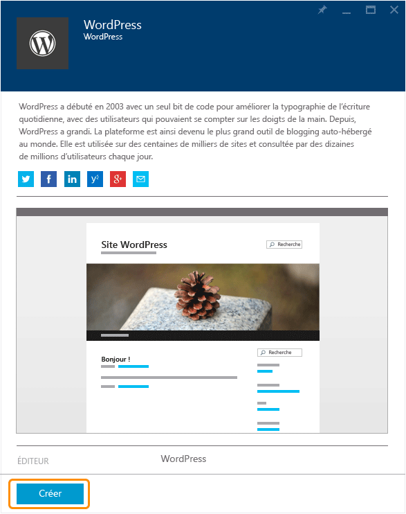
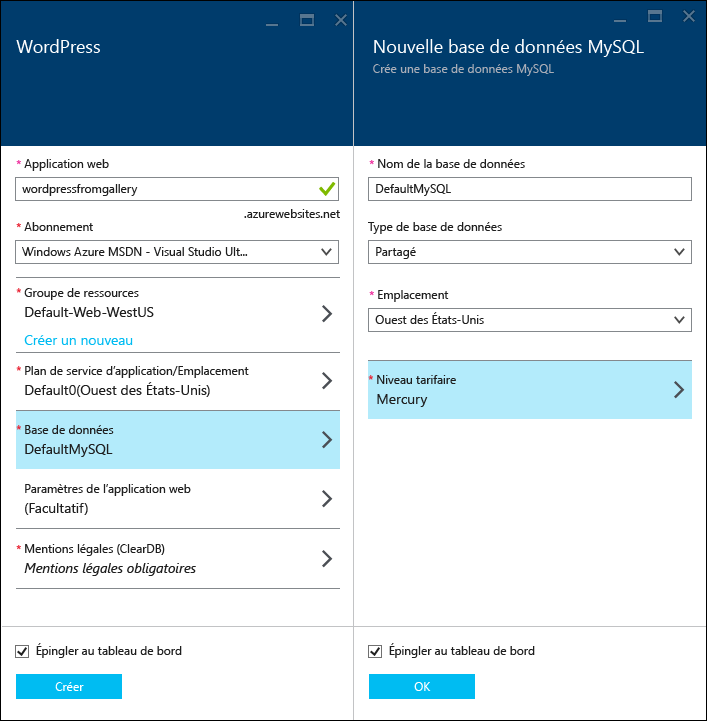
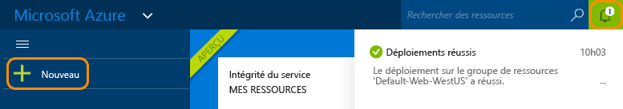
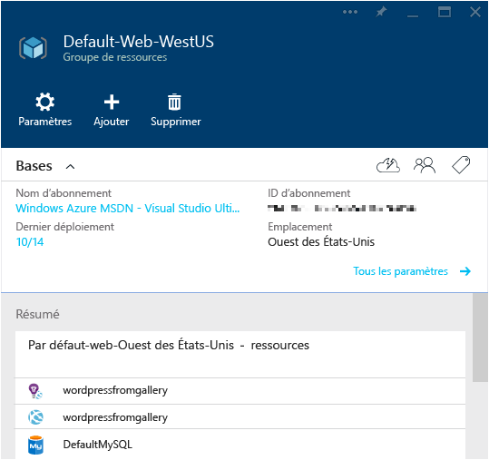

<properties
	pageTitle="Créer une application web WordPress dans Azure App Service | Microsoft Azure"
	description="Découvrez comment créer une application web Azure pour un blog WordPress par le biais du portail Azure en version préliminaire."
	services="app-service\web"
	documentationCenter="php"
	authors="tfitzmac"
	manager="wpickett"
	editor=""/>

<tags
	ms.service="app-service-web"
	ms.workload="na"
	ms.tgt_pltfrm="na"
	ms.devlang="PHP"
	ms.topic="hero-article"
	ms.date="10/13/2015"
	ms.author="tomfitz"/>

# Créer une application web WordPress dans Azure App Service

Ce didacticiel montre comment rechercher une application dans Azure Marketplace et comment l’installer dans une application web App Service. Le didacticiel utilise un blog WordPress comme exemple, mais le processus est similaire pour de nombreuses autres applications Marketplace.

Lorsque vous aurez terminé avec le didacticiel, vous disposerez de votre propre blog WordPress installé et configuré dans le cloud.

Vous apprendrez ce qui suit :

* Comment trouver un modèle d’application dans Azure Marketplace.
* Comment créer une application web dans Azure App Service basée sur le modèle.
* Comment configurer les paramètres d’Azure App Service pour la nouvelle application web et la base de données MySQL.

Azure Marketplace met à votre disposition une large gamme d’applications web populaires, développées par Microsoft, par des sociétés tierces ou par des initiatives de logiciel open source. Les applications web sont basées sur un large éventail d’infrastructures répandues, notamment [PHP](/develop/nodejs/) dans cet exemple WordPress, [.NET](/develop/net/), [Node.js](/develop/nodejs/), [Java](/develop/java/) et [Python](/develop/python/), pour en citer quelques-unes. Pour créer une application web à partir d’Azure Marketplace, le seul logiciel nécessaire est le navigateur que vous utilisez pour le [portail Azure en version préliminaire](https://portal.azure.com/).

> [AZURE.NOTE]Pour effectuer ce didacticiel, vous avez besoin d’un compte Microsoft Azure. Si vous ne possédez pas de compte, vous pouvez [activer les avantages de votre abonnement MSDN](/fr-FR/pricing/member-offers/msdn-benefits-details/?WT.mc_id=A261C142F) ou [obtenir une évaluation gratuite](/fr-FR/pricing/free-trial/?WT.mc_id=A261C142F).
>
> Si vous souhaitez commencer à utiliser Azure App Service avant d’ouvrir un compte Azure, accédez à [Essayer App Service](http://go.microsoft.com/fwlink/?LinkId=523751). Là, vous pouvez créer immédiatement une application de départ temporaire dans App Service. Aucune carte de crédit n’est requise ni aucun engagement.

## Sélectionner WordPress et configurer pour Azure App Service

1. Connectez-vous au [portail Azure en version préliminaire](https://portal.azure.com/).

2. Cliquez sur **Nouveau > Marketplace**.
	
    ![Création][5]
	
3. Recherchez **WordPress**, puis cliquez sur **WordPress**.

	![WordPress dans la liste][7]
	
5. Après avoir lu la description de l’application WordPress, cliquez sur **Créer**.

	

4. Entrez un nom pour l’application web dans la zone **Application web**.

	Ce nom doit être unique dans le domaine azurewebsites.net, car l’URL de l’application web sera {nom}.azurewebsites.net. Si le nom que vous entrez n’est pas unique, un point d’exclamation rouge s’affiche dans la zone de texte.

8. Si vous avez plusieurs abonnements, choisissez celui que vous souhaitez utiliser.

5. Sélectionnez un **Groupe de ressources** ou créez-en un.

	Pour plus d’informations sur les groupes de ressources, consultez [Utilisation du portail Azure en version préliminaire pour gérer vos ressources Azure](../resource-group-portal.md).

5. Sélectionnez un **plan App Service/emplacement** ou créez-en un.

	Pour plus d’informations sur les plans App Service, consultez [Présentation des plans d’Azure App Service](../azure-web-sites-web-hosting-plans-in-depth-overview.md).

7. Cliquez sur **Base de données**, puis dans le panneau **Nouvelle base de données MySQL** et indiquez les valeurs requises pour configurer votre base de données MySQL.

	a. Entrez un nouveau nom ou conservez le nom par défaut.

	b. Laissez le **Type de base de données** défini sur la valeur **Partagé**.

	c. Choisissez le même emplacement que celui choisi pour l’application web.

	d. Sélectionnez un niveau tarifaire. Le niveau Mercure (gratuit avec connexions autorisées et espace disque minimum) convient parfaitement pour ce didacticiel.

8. Dans le panneau **Nouvelle base de données MySQL**, cliquez sur **OK**.

8. Dans le panneau **WordPress**, acceptez les mentions légales, puis cliquez sur **Créer**.

	

	Généralement, Azure App Service crée l’application web en moins d’une minute. Vous pouvez surveiller la progression en cliquant sur l’icône en forme de cloche en haut de la page du portail.

	

## Lancer et gérer l’application web WordPress
	
7. Une fois la création de l’application web terminée, accédez dans le portail au groupe de ressources dans lequel vous avez créé l’application ; vous pourrez voir l’application web et la base de données.

	La ressource supplémentaire dotée de l’icône en forme d’ampoule est [Application Insights](/services/application-insights/), qui fournit des services de surveillance pour votre application web.

1. Dans le panneau **Groupe de ressources**, cliquez sur la ligne de l’application web.

	

2. Dans le panneau Application Web, cliquez sur **Parcourir**.

    ![URL du site][browse]

3. Sur la page de **bienvenue** WordPress, entrez les informations de configuration requises par WordPress, puis cliquez sur **Install WordPress**.

	

4. Connectez-vous en utilisant les informations d’identification créées sur la page de **bienvenue**.

5. La page de tableau de bord de votre site s’ouvre.

	

## Étapes suivantes

Vous savez désormais comment créer et déployer une application web PHP à partir de la galerie. Pour plus d’informations sur l’utilisation de PHP dans Azure, consultez le [Centre de développement PHP](/develop/php/).

Pour plus d’informations sur l’utilisation d’App Service Web Apps, consultez les liens sur le côté gauche de la page (pour les grandes fenêtres de navigateur) ou en haut de la page (pour les fenêtres de navigateur étroites).

## Changements apportés
* Pour obtenir un guide présentant les modifications apportées dans le cadre de la transition entre Sites Web et App Service, consultez [Azure App Service et les services Azure existants](http://go.microsoft.com/fwlink/?LinkId=529714).
* Pour obtenir un guide présentant les modifications apportées dans le cadre de la transition entre l’ancien et le nouveau portail, consultez [Références sur la navigation dans le portail Azure en version préliminaire](http://go.microsoft.com/fwlink/?LinkId=529715).

[5]: ./media/web-sites-php-web-site-gallery/startmarketplace.png
[7]: ./media/web-sites-php-web-site-gallery/search-web-app.png
[browse]: ./media/web-sites-php-web-site-gallery/browse-web.png

<!---HONumber=Oct15_HO3-->