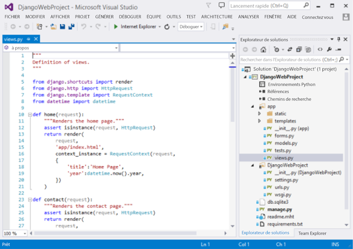
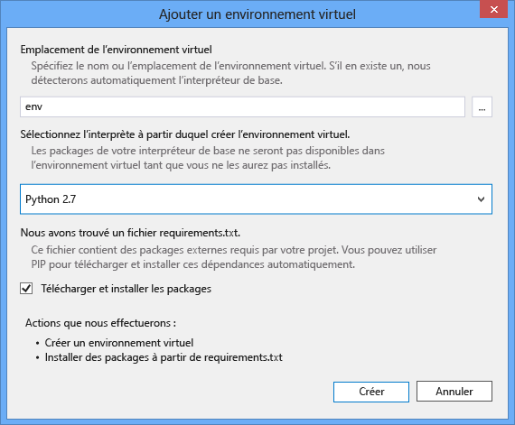
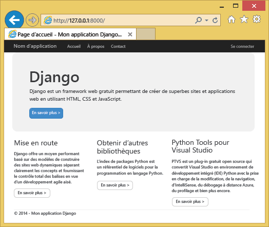
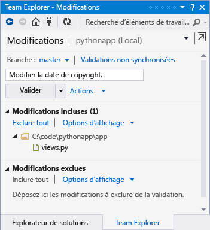
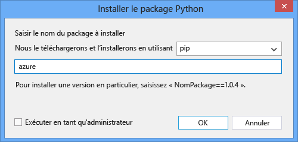
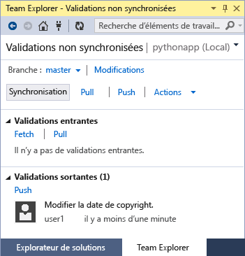

<properties
	pageTitle="Création d’applications web avec Django dans Azure"
	description="Didacticiel expliquant comment exécuter une application web Python dans Azure App Service Web Apps."
	services="app-service\web"
	documentationCenter="python"
	authors="huguesv"
	manager="wpickett"
	editor=""/>

<tags
	ms.service="app-service-web"
	ms.workload="web"
	ms.tgt_pltfrm="na"
	ms.devlang="python"
	ms.topic="hero-article" 
	ms.date="04/15/2015"
	ms.author="huguesv"/>

# Création d’applications web avec Django dans Azure

Ce didacticiel décrit comment exécuter Python dans [Azure App Service Web Apps](http://go.microsoft.com/fwlink/?LinkId=529714). Web Apps offre un hébergement gratuit limité ainsi qu’un déploiement rapide, et vous permet d’utiliser Python. À mesure que votre application croît, vous pouvez passer à un hébergement payant, et vous pouvez également intégrer l'application à tous les autres services Azure.

Vous allez créer une application à l’aide de l’infrastructure web Django (consultez les autres versions de ce didacticiel pour [Flask](web-sites-python-create-deploy-flask-app.md) et [Bottle](web-sites-python-create-deploy-bottle-app.md)). Vous allez créer l’application web dans Azure Marketplace, configurer le déploiement de Git et cloner le référentiel localement. Ensuite, vous exécuterez l’application localement, puis vous apporterez des modifications que vous validerez et transmettrez à Azure. Ce didacticiel vous explique comment procéder depuis Windows ou Mac/Linux.

[AZURE.INCLUDE [create-account-and-websites-note](../../includes/create-account-and-websites-note.md)]

>[AZURE.NOTE]Si vous voulez vous familiariser avec Azure App Service avant d’ouvrir un compte Azure, accédez à la page [Essayer App Service](http://go.microsoft.com/fwlink/?LinkId=523751). Vous pourrez créer immédiatement une application web temporaire dans App Service. Aucune carte de crédit n’est requise ; vous ne prenez aucun engagement.

## Configuration requise

- Windows, Mac ou Linux
- Python 2.7 ou 3.4
- setuptools, pip, virtualenv (Python 2.7 uniquement)
- Git
- [Python Tools 2.1 pour Visual Studio](optional)

**Remarque** : la publication de TFS n’est actuellement pas prise en charge pour les projets Python.

### Windows

Si vous n’avez pas encore installé Python 2.7 ou 3.4 (32 bits), nous vous recommandons d’installer le [Kit de développement logiciel (SDK) Azure pour Python 2.7] ou le [Kit de développement logiciel (SDK) Azure pour Python 3.4] à l’aide de Web Platform Installer. Cette opération installe la version 32 bits de Python, setuptools, pip, virtualenv, etc. (Python 32 bits est installé sur les machines hôtes Azure). Vous pouvez également obtenir Python sur le site [python.org].

Pour Git, nous vous recommandons d’utiliser [Git pour Windows] ou [GitHub pour Windows]. Si vous travaillez avec Visual Studio, vous pouvez utiliser la prise en charge intégrée de Git.

Nous vous recommandons également d’installer [Python Tools 2.1 pour Visual Studio]. Cette opération est facultative, mais si vous avez [Visual Studio], ainsi que la version gratuite Visual Studio Community 2013 ou Visual Studio Express 2013 pour le Web, vous disposerez d’un formidable environnement de développement intégré Python.

### Mac/Linux

Vous devez avoir installé Python et Git, mais vérifiez que vous disposez de Python 2.7 ou 3.4.

## Création d’une application web sur le portail

La première étape consiste à créer l’application web par le biais du [portail Azure](https://portal.azure.com).

1. Connectez-vous au portail Azure et cliquez sur le bouton **NOUVEAU** dans le coin inférieur gauche.
2. Cliquez sur **Web et mobilité** > **Azure Marketplace** > **Web Apps**.
3. Dans le champ de recherche, tapez « python ».
4. Dans les résultats de recherche, sélectionnez **Django**, puis cliquez sur **Créer**.
5. Configurez la nouvelle application Django, en créant un plan App Service et un groupe de ressources. Cliquez sur **Créer**.
6. Configurez la publication Git de votre nouvelle application web en suivant les instructions dans [Déploiement continu à l’aide de GIT dans Azure App Service](web-sites-publish-source-control.md).

## Vue d’ensemble de l’application

### Contenu du référentiel Git

Voici une vue d’ensemble des fichiers que vous trouverez dans le référentiel Git initial, que nous allons cloner dans la section suivante.

    \app\__init__.py
    \app\forms.py
    \app\models.py
    \app\tests.py
    \app\views.py
    \app\static\content\
    \app\static\fonts\
    \app\static\scripts\
    \app\templates\about.html
    \app\templates\contact.html
    \app\templates\index.html
    \app\templates\layout.html
    \app\templates\login.html
    \app\templates\loginpartial.html
    \DjangoWebProject\__init__.py
    \DjangoWebProject\settings.py
    \DjangoWebProject\urls.py
    \DjangoWebProject\wsgi.py

Sources principales de l’application. Correspondent à 3 pages (index, à propos de, contact) dotées d’une mise en page principale. Le contenu statique et les scripts comprennent bootstrap, jquery, modernizr et respond.

    \manage.py

Prise en charge du serveur d’administration et de développement local. Utilisez ce fichier pour exécuter l’application localement, synchroniser la base de données, etc.

    \db.sqlite3

Base de données par défaut. Inclut les tables nécessaires à l’exécution de l’application, mais ne contient aucun utilisateur (synchronisez la base de données pour créer un utilisateur).

    \DjangoWebProject.pyproj
    \DjangoWebProject.sln

Fichiers de projet à utiliser avec [Python Tools pour Visual Studio](http://pytools.codeplex.com).

    \ptvs_virtualenv_proxy.py

Proxy IIS pour les environnements virtuels et prise en charge du débogage à distance PTVS.

    \requirements.txt

Packages externes requis par cette application. Le script de déploiement installera à l’aide de pip les packages répertoriés dans ce fichier.

    \web.2.7.config
    \web.3.4.config

Fichiers de configuration IIS. Le script de déploiement utilisera le fichier web.x.y.config approprié et le copiera sous le nom web.config.

### Fichiers facultatifs - Personnalisation du déploiement

[AZURE.INCLUDE [web-sites-python-customizing-deployment](../../includes/web-sites-python-customizing-deployment.md)]

### Fichiers facultatifs - Runtime Python

[AZURE.INCLUDE [web-sites-python-customizing-runtime](../../includes/web-sites-python-customizing-runtime.md)]

### Fichiers supplémentaires sur le serveur

Certains fichiers existent sur le serveur, mais ne sont pas ajoutés au référentiel Git. Ils sont créés par le script de déploiement.

    \web.config

Fichier de configuration IIS. Créé à partir du fichier web.x.y.config lors de chaque déploiement.

    \env\

Environnement virtuel Python. Créé lors du déploiement si aucun environnement virtuel compatible n’existe sur le site. Les packages répertoriés dans requirements.txt sont installés à l’aide de pip. Si les packages sont déjà installés, pip ignorera l’installation.

Les trois sections suivantes expliquent comment développer des applications web dans trois environnements différents :

- Windows, avec Python Tools pour Visual Studio ;
- Windows, avec la ligne de commande ;
- Mac/Linux, avec la ligne de commande.

## Développement d’applications web - Windows - Python Tools pour Visual Studio

### Cloner le référentiel

Commencez par cloner le référentiel à l’aide de l’URL fournie sur le portail Azure. Pour plus d’informations, consultez la page [Déploiement continu à l’aide de Git dans Azure App Service](web-sites-publish-source-control.md).

Ouvrez le fichier solution (.sln) inclus dans la racine du référentiel.

### Créer un environnement virtuel

Nous allons à présent créer un environnement virtuel pour le développement local. Cliquez avec le bouton droit sur **Environnements Python** et sélectionnez **Ajouter un environnement virtuel...**.

- Vérifiez que l’environnement porte le nom `env`.

- Sélectionnez l’interpréteur de base. Veillez à utiliser la même version de Python que celle sélectionnée pour votre application web (dans runtime.txt ou le panneau **Paramètres de l’application** de votre application web dans le portail Azure).

- Vérifiez que l’option permettant de télécharger et d’installer les packages est cochée.

Cliquez sur **Create**. Cette opération créera l’environnement virtuel et installera les dépendances répertoriées dans requirements.txt.

### Créer un superutilisateur

Aucun superutilisateur n’a été défini dans la base de données de l’application. Pour utiliser la fonctionnalité de connexion de l’application ou l’interface d’administration Django (si vous décidez de l’activer), vous devrez créer un superutilisateur.

Exécutez la commande ci-après depuis la ligne de commande du dossier de votre projet :

    env\scripts\python manage.py createsuperuser

Suivez les invites pour définir le nom d’utilisateur, le mot de passe, etc.

### Exécuter à l’aide d’un serveur de développement

Appuyez sur F5 pour lancer le débogage. Votre navigateur ouvrira automatiquement la page s’exécutant localement.

Vous pouvez définir des points d’arrêt dans les sources, utiliser les fenêtres de surveillance, etc.. Pour plus d’informations sur les différentes fonctionnalités, consultez la [documentation de PTVS].

### Apporter des modifications

Vous pouvez à présent tenter d’apporter des modifications aux sources de l’application et/ou aux modèles.

Après avoir testé vos modifications, validez-les sur le référentiel Git :

### Installer d’autres packages

Votre application peut comporter des dépendances au-delà de Python et de Django.

Vous pouvez installer des packages supplémentaires à l’aide de pip. Pour installer un package, cliquez avec le bouton droit sur l’environnement virtuel et sélectionnez **Installer un package Python**.

Par exemple, pour installer le Kit de développement logiciel (SDK) Azure pour Python, qui vous permet d’accéder au stockage Azure, au bus des services et à d’autres services Azure, entrez `azure` :

Cliquez avec le bouton droit sur l’environnement virtuel et sélectionnez **Générer requirements.txt** pour mettre à jour le fichier requirements.txt.

Puis validez les modifications apportées à requirements.txt dans le référentiel Git.

### Déploiement sur Azure

Pour déclencher un déploiement, cliquez sur **Synchroniser** ou **Push**. La synchronisation effectue à la fois une transmission de type push et une transmission de type pull.

Le premier déploiement mettra un certain temps à s’effectuer, car il créera un environnement virtuel, installera les packages, etc.

Visual Studio n’affiche pas la progression du déploiement. Si vous souhaitez vérifier la sortie, consultez la section [Résolution des problèmes - Déploiement](#troubleshooting-deployment).

Accédez à l’URL Azure pour visualiser les modifications que vous avez apportées.

## Développement d’applications web - Windows - Ligne de commande

### Cloner le référentiel

Commencez par cloner le référentiel à l’aide de l’URL fournie sur le portail Azure, puis ajoutez le référentiel Azure en tant que référentiel distant. Pour plus d’informations, consultez la page [Déploiement continu à l’aide de Git dans Azure App Service](web-sites-publish-source-control.md).

    git clone <repo-url>
    cd <repo-folder>
    git remote add azure <repo-url>

### Créer un environnement virtuel

Nous allons créer un environnement virtuel pour le développement (ne l’ajoutez pas au référentiel). Les environnements virtuels dans Python ne sont pas déplaçables. De ce fait, chaque développeur travaillant sur l’application créera ses propres environnements localement.

Veillez à utiliser la même version de Python que celle sélectionnée pour votre application web (dans runtime.txt ou le panneau Paramètres de l’application de votre application web dans le portail Azure).

Pour Python 2.7 :

    c:\python27\python.exe -m virtualenv env

Pour Python 3.4 :

    c:\python34\python.exe -m venv env

Installez tous les packages externes requis par votre application. Vous pouvez utiliser le fichier requirements.txt à la racine du référentiel pour installer les packages dans votre environnement virtuel :

    env\scripts\pip install -r requirements.txt

### Créer un superutilisateur

Aucun superutilisateur n’a été défini dans la base de données de l’application. Pour utiliser la fonctionnalité de connexion de l’application ou l’interface d’administration Django (si vous décidez de l’activer), vous devrez créer un superutilisateur.

Exécutez la commande ci-après depuis la ligne de commande du dossier de votre projet :

    env\scripts\python manage.py createsuperuser

Suivez les invites pour définir le nom d’utilisateur, le mot de passe, etc.

### Exécuter à l’aide d’un serveur de développement

Vous pouvez lancer l’application sous un serveur de développement à l’aide de la commande suivante :

    env\scripts\python manage.py runserver

La console affichera l’URL et le port que le serveur écoute :

Puis ouvrez votre navigateur web en accédant à cette URL.

### Apporter des modifications

Vous pouvez à présent tenter d’apporter des modifications aux sources de l’application et/ou aux modèles.

Après avoir testé vos modifications, validez-les sur le référentiel Git :

    git add <modified-file>
    git commit -m "<commit-comment>"

### Installer d’autres packages

Votre application peut comporter des dépendances au-delà de Python et de Django.

Vous pouvez installer des packages supplémentaires à l’aide de pip. Par exemple, pour installer le Kit de développement logiciel (SDK) Azure pour Python, qui vous permet d’accéder au stockage Azure, au bus des services et à d’autres services Azure, entrez :

    env\scripts\pip install azure

Veillez à mettre à jour requirements.txt :

    env\scripts\pip freeze > requirements.txt

Validez les modifications :

    git add requirements.txt
    git commit -m "Added azure package"

### Déploiement sur Azure

Pour déclencher un déploiement, transmettez les modifications à Azure :

    git push azure master

Vous découvrirez la sortie du script de déploiement, notamment la création de l’environnement virtuel, l’installation des packages et la création du fichier web.config.

Accédez à l’URL Azure pour visualiser les modifications que vous avez apportées.

## Développement d’applications web - Mac/Linux - Ligne de commande

### Cloner le référentiel

Commencez par cloner le référentiel à l’aide de l’URL fournie sur le portail Azure, puis ajoutez le référentiel Azure en tant que référentiel distant. Pour plus d’informations, consultez la page [Déploiement continu à l’aide de Git dans Azure App Service](web-sites-publish-source-control.md).

    git clone <repo-url>
    cd <repo-folder>
    git remote add azure <repo-url>

### Créer un environnement virtuel

Nous allons créer un environnement virtuel pour le développement (ne l’ajoutez pas au référentiel). Les environnements virtuels dans Python ne sont pas déplaçables. De ce fait, chaque développeur travaillant sur l’application créera ses propres environnements localement.

Veillez à utiliser la même version de Python que celle sélectionnée pour votre application web (dans runtime.txt ou le panneau Paramètres de l’application de votre application web dans le portail Azure).

Pour Python 2.7 :

    python -m virtualenv env

Pour Python 3.4 :

    python -m venv env

Installez tous les packages externes requis par votre application. Vous pouvez utiliser le fichier requirements.txt à la racine du référentiel pour installer les packages dans votre environnement virtuel :

    env/bin/pip install -r requirements.txt

### Créer un superutilisateur

Aucun superutilisateur n’a été défini dans la base de données de l’application. Pour utiliser la fonctionnalité de connexion de l’application ou l’interface d’administration Django (si vous décidez de l’activer), vous devrez créer un superutilisateur.

Exécutez la commande ci-après depuis la ligne de commande du dossier de votre projet :

    env/bin/python manage.py createsuperuser

Suivez les invites pour définir le nom d’utilisateur, le mot de passe, etc.

### Exécuter à l’aide d’un serveur de développement

Vous pouvez lancer l’application sous un serveur de développement à l’aide de la commande suivante :

    env/bin/python manage.py runserver

La console affichera l’URL et le port que le serveur écoute :

Puis ouvrez votre navigateur web en accédant à cette URL.

### Apporter des modifications

Vous pouvez à présent tenter d’apporter des modifications aux sources de l’application et/ou aux modèles.

Après avoir testé vos modifications, validez-les sur le référentiel Git :

    git add <modified-file>
    git commit -m "<commit-comment>"

### Installer d’autres packages

Votre application peut comporter des dépendances au-delà de Python et de Django.

Vous pouvez installer des packages supplémentaires à l’aide de pip. Par exemple, pour installer le Kit de développement logiciel (SDK) Azure pour Python, qui vous permet d’accéder au stockage Azure, au bus des services et à d’autres services Azure, entrez :

    env/bin/pip install azure

Veillez à mettre à jour requirements.txt :

    env/bin/pip freeze > requirements.txt

Validez les modifications :

    git add requirements.txt
    git commit -m "Added azure package"

### Déploiement sur Azure

Pour déclencher un déploiement, transmettez les modifications à Azure :

    git push azure master

Vous découvrirez la sortie du script de déploiement, notamment la création de l’environnement virtuel, l’installation des packages et la création du fichier web.config.

Accédez à l’URL Azure pour visualiser les modifications que vous avez apportées.

## Résolution des problèmes - Installation des packages

[AZURE.INCLUDE [web-sites-python-troubleshooting-package-installation](../../includes/web-sites-python-troubleshooting-package-installation.md)]

## Résolution des problèmes - Environnement virtuel

[AZURE.INCLUDE [web-sites-python-troubleshooting-virtual-environment](../../includes/web-sites-python-troubleshooting-virtual-environment.md)]

## Résolution des problèmes - Fichiers statiques

Django se charge de collecter les fichiers statiques. Il récupère tous les fichiers statiques à partir de leur emplacement d’origine et les copie dans un dossier unique. Pour cette application, les fichiers sont copiés dans `/static`.

Cette opération est effectuée, car les fichiers statiques peuvent provenir de différentes applications Django. Par exemple, les fichiers statiques des interfaces d’administration Django sont situés dans un sous-dossier de bibliothèque Django dans l’environnement virtuel. Les fichiers statiques définis par cette application se trouvent dans `/app/static`. Plus vous utiliserez d’applications Django, plus vous aurez de fichiers statiques dans différents emplacements.

Lorsque l’application s’exécute en mode débogage, elle traite les fichiers statiques à partir de leur emplacement d’origine.

Quand l’application s’exécute en mode version finale, elle ne traite **aucun** fichier statique. Le serveur web se charge de traiter ces fichiers. Pour cette application, IIS traite les fichiers statiques depuis `/static`.

Les fichiers statiques sont automatiquement collectés dans le cadre du script de déploiement et suppriment ainsi les fichiers précédemment collectés. Cela signifie que cette collecte s’effectue lors de chaque déploiement, ce qui ralentit quelque peu ce dernier, mais permet d’éliminer les fichiers obsolètes qui représentent un risque pour la sécurité.

Si vous souhaitez ignorer les fichiers statiques pour votre application Django :

    \.skipDjango

Vous devrez alors effectuer la collecte manuellement sur votre ordinateur local :

    env\scripts\python manage.py collectstatic

Puis supprimez le dossier `\static` de `.gitignore` et ajoutez-le au référentiel Git.

## Résolution des problèmes - Paramètres

Vous pouvez modifier différents paramètres dans `DjangoWebProject/settings.py`.

Pour simplifier le développement, le mode débogage est activé. Ce mode vous permettra de visualiser les images et d’autres contenus statiques lors de l’exécution locale, sans nécessiter la collecte des fichiers statiques.

Pour désactiver le mode débogage :

    DEBUG = False

Lorsque le débogage est désactivé, la valeur de `ALLOWED_HOSTS` doit être mise à jour de façon à inclure le nom d’hôte Azure. Par exemple :

    ALLOWED_HOSTS = (
        'pythonapp.azurewebsites.net',
    )

Cette valeur doit également être mise à jour pour activer des hôtes :

    ALLOWED_HOSTS = (
        '*',
    )

Dans la pratique, vous pouvez également opter pour une solution un peu plus complexe qui vous permet de basculer entre le mode débogage et le mode version finale, et d’obtenir le nom d’hôte.

Vous pouvez définir des variables d’environnement dans la section **Paramètres de l’application** de la page **CONFIGURER** du portail Azure. Cette opération peut vous permettre de définir les valeurs que vous ne souhaitez pas voir apparaître dans les sources (chaînes de connexion, mots de passe, etc.) ou que vous souhaitez définir différemment entre Azure et votre ordinateur local. Dans `settings.py`, vous pouvez interroger les variables d’environnement à l’aide de `os.getenv`.

## Utilisation d’une base de données

La base de données fournie avec l’application est une base de données sqlite. Cette base de données par défaut se révèle très utile pour le développement, car elle ne requiert quasiment aucune configuration. Elle est stockée dans le fichier db.sqlite3 situé dans le dossier de votre projet.

Azure fournit des services de base de données faciles à utiliser à partir d’une application Django. Des didacticiels expliquant comment utiliser [SQL Database] et [MySQL] à partir d’une application Django vous indiquent la procédure à suivre pour créer le service de base de données et pour modifier les paramètres de base de données dans `DjangoWebProject/settings.py`, ainsi que les bibliothèques à installer.

Si vous préférez gérer vos propres serveurs de base de données, vous pouvez utiliser des machines virtuelles Windows ou Linux s’exécutant sur Azure.

## Interface d’administration Django

Lorsque vous commencerez à créer vos modèles, vous souhaiterez probablement remplir la base de données avec certaines données. Pour ajouter et modifier facilement du contenu de manière interactive, utilisez l’interface d’administration Django.

Le code de l’interface d’administration est mis en commentaire dans les sources de l’application, mais il est clairement identifié pour que vous puissiez facilement l’activer (recherchez « admin »).

Une fois ce code activé, synchronisez la base de données, exécutez l’application, puis accédez à `/admin`.

## Étapes suivantes

Pour plus d’informations sur Django et sur Python Tools pour Visual Studio, sélectionnez les liens suivants :

- [Documentation Django]
- [Documentation relative à Python Tools for Visual Studio]

Pour plus d’informations sur l’utilisation de Base de données SQL et de MySQL :

- [Django et SQL Database sur Azure avec Python Tools 2.1 pour Visual Studio]
- [Django et MySQL sur Azure avec Python Tools 2.1 pour Visual Studio]

## Changements apportés
* Pour obtenir un guide présentant les modifications apportées dans le cadre de la transition entre Sites Web et App Service, consultez la page [Azure App Service et les services Azure existants](http://go.microsoft.com/fwlink/?LinkId=529714).
* Pour obtenir un guide présentant les modifications apportées dans le cadre de la transition entre l’ancien et le nouveau portail, consultez la page [Références sur la navigation dans le portail Azure](http://go.microsoft.com/fwlink/?LinkId=529715).

<!--Link references-->
[Django et MySQL sur Azure avec Python Tools 2.1 pour Visual Studio]: web-sites-python-ptvs-django-mysql.md
[Django et SQL Database sur Azure avec Python Tools 2.1 pour Visual Studio]: web-sites-python-ptvs-django-sql.md
[SQL Database]: web-sites-python-ptvs-django-sql.md
[MySQL]: web-sites-python-ptvs-django-mysql.md

<!--External Link references-->
[Kit de développement logiciel (SDK) Azure pour Python 2.7]: http://go.microsoft.com/fwlink/?linkid=254281
[Kit de développement logiciel (SDK) Azure pour Python 3.4]: http://go.microsoft.com/fwlink/?linkid=516990
[python.org]: http://www.python.org/
[Git pour Windows]: http://msysgit.github.io/
[GitHub pour Windows]: https://windows.github.com/
[Python Tools for Visual Studio]: http://aka.ms/ptvs
[Python Tools 2.1 pour Visual Studio]: http://go.microsoft.com/fwlink/?LinkId=517189
[Visual Studio]: http://www.visualstudio.com/
[documentation de PTVS]: http://pytools.codeplex.com/documentation
[Documentation relative à Python Tools for Visual Studio]: http://pytools.codeplex.com/documentation
[Documentation Django]: https://www.djangoproject.com/
 

<!---HONumber=August15_HO6-->