<properties 
	pageTitle="Django et MySQL sur Azure avec Python Tools 2.1 pour Visual Studio" 
	description="Découvrez comment utiliser Python Tools pour Visual Studio afin de créer une application Django qui stocke les données dans une instance de base de données MySQL et de la déployer sur Azure App Service Web Apps." 
	services="app-service\web" 
	documentationCenter="python" 
	authors="huguesv" 
	manager="wpickett" 
	editor=""/>

<tags 
	ms.service="app-service-web" 
	ms.workload="web" 
	ms.tgt_pltfrm="na" 
	ms.devlang="python" 
	ms.topic="article" 
	ms.date="04/16/2015" 
	ms.author="huguesv"/>

# Django et MySQL sur Azure avec Python Tools 2.1 pour Visual Studio 

Dans ce didacticiel, nous allons utiliser [Python Tools pour Visual Studio] afin de créer une application web de sondage simple, à l’aide de l’un des exemples de modèle PTVS. Ce didacticiel est également disponible en [vidéo](https://www.youtube.com/watch?v=oKCApIrS0Lo).

Nous allons découvrir comment utiliser un service MySQL hébergé sur Azure, comment configurer l’application web pour utiliser mySQL et comment publier l’application web sur [Azure App Service Web Apps](http://go.microsoft.com/fwlink/?LinkId=529714).

Visitez le [Centre de développement Python] pour consulter d’autres articles sur le développement d’applications Azure App Service Web Apps avec PTVS à l’aide des infrastructures web Bottle, Flask et Django, ainsi que des services MongoDB, Azure Table Storage, MySQL et Base de données SQL. Cet article concerne App Service, mais les étapes sont similaires lorsque vous développez pour [Azure Cloud Services].

## Composants requis

 - Visual Studio 2012 ou 2013
 - [Python Tools 2.1 pour Visual Studio]
 - [Python Tools 2.1 pour Visual Studio Samples VSIX]
 - [Outils du Kit de développement logiciel (SDK) Azure pour Visual Studio 2013] ou [Outils du Kit de développement logiciel (SDK) Azure pour Visual Studio 2012]
 - [Python 2.7 32 bits]

[AZURE.INCLUDE [create-account-and-websites-note](../../includes/create-account-and-websites-note.md)]

>[AZURE.NOTE]Si vous voulez vous familiariser avec Azure App Service avant d’ouvrir un compte Azure, accédez à la page [Essayer App Service](http://go.microsoft.com/fwlink/?LinkId=523751). Vous pourrez créer immédiatement une application web temporaire dans App Service. Aucune carte de crédit n’est requise ; vous ne prenez aucun engagement.

## Création du projet

Dans cette section, nous allons créer un projet Visual Studio à l’aide d’un exemple de modèle. Nous allons créer un environnement virtuel et installer les packages requis. Nous allons créer une base de données locale à l’aide de sqlite. Ensuite, nous allons exécuter l’application localement.

1.  Dans Visual Studio, sélectionnez **Fichier** puis **Nouveau projet**.

1.  Les modèles de projet issus de PTVS Samples VSIX sont disponibles sous **Python**, **Exemples**. Sélectionnez **Polls Django Web Project** et cliquez sur OK pour créer le projet.

  	

1.  Vous allez être invité à installer des packages externes. Sélectionnez **Installer dans un environnement virtuel**.

  	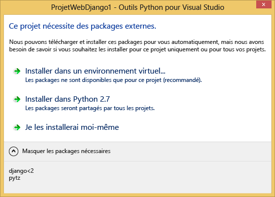

1.  Sélectionnez **Python 2.7** comme interpréteur de base.

  	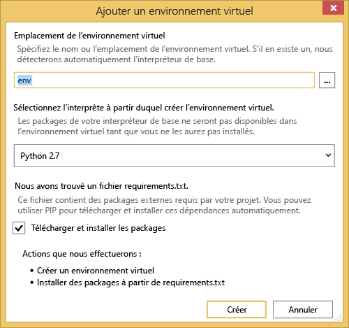

1.  Cliquez avec le bouton droit de la souris sur le nœud du projet et sélectionnez **Python**, **Django Sync DB**.

  	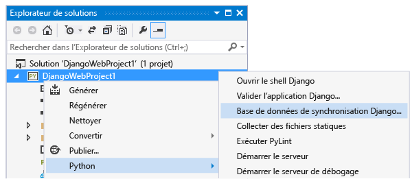

1.  Une console de gestion Django s’ouvre. Suivez les invites pour créer un utilisateur.

    Une base de données sqlite est créée dans le dossier du projet.

  	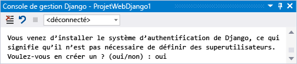

1.  Vérifiez que l’application fonctionne en appuyant sur <kbd>F5</kbd>.

1.  Cliquez sur **Log in** dans la barre de navigation en haut.

  	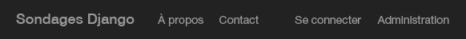

1.  Saisissez les informations d’identification de l’utilisateur que vous avez créé quand vous avez synchronisé la base de données.

  	

1.  Cliquez sur **Create Sample Polls**.

  	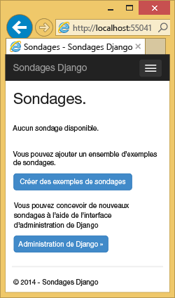

1.  Cliquez sur un sondage et votez.

  	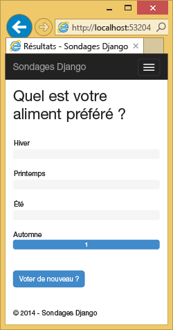

## Création d’une base de données MySQL

Pour la base de données, nous allons créer une base de données MySQL ClearDB hébergée sur Azure.

Vous pouvez également créer votre propre machine virtuelle s'exécutant dans Azure, puis installer et administrer MySQL vous-même.

Pour créer une base de données avec un plan gratuit, procédez comme suit :

1.  Connectez-vous au [portail Azure].

1.  En bas du volet de navigation, cliquez sur **NOUVEAU**. Ensuite, cliquez sur **Données + stockage** > **Azure Marketplace**.

  	<!-- -->

1.  Entrez « ** mysql ** » dans la zone de recherche, cliquez sur **Base de données MySQL**, puis sur **Créer**.

  	<!-- 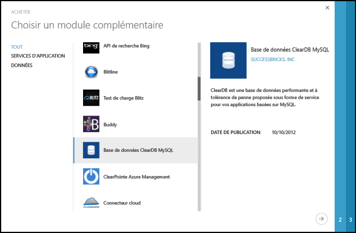 -->

1.  Configurez la nouvelle base de données MySQL en créant un nouveau groupe de ressources, puis sélectionnez l’emplacement approprié pour celui-ci.

  	<!-- 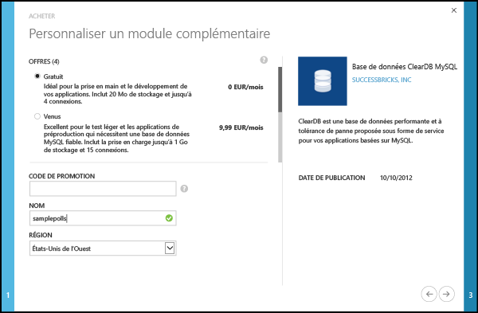 -->

1.  Une fois la base de données MySQL créée, cliquez sur **Propriétés** dans le panneau de la base de données.
2.  Utilisez le bouton de copie pour placer la valeur de **CONNECTIONSTRING** dans le Presse-papiers.

## Configurer le projet

Dans cette section, nous allons configurer notre application web pour utiliser la base de données MySQL que nous venons de créer. Nous allons également installer les packages Python supplémentaires requis pour utiliser des bases de données MySQL avec Django. Nous exécuterons ensuite l’application web en local.

1.  Dans Visual Studio, ouvrez **settings.py** à partir du dossier *ProjectName*. Collez temporairement la chaîne de connexion dans l’éditeur. Celle-ci se présente au format suivant :

        Database=<NAME>;Data Source=<HOST>;User Id=<USER>;Password=<PASSWORD>

    Modifiez le **MOTEUR** de base de données par défaut pour utiliser MySQL, puis définissez les valeurs **NOM**, **UTILISATEUR**, **MOT DE PASSE** et **HÔTE** à partir de **CONNECTIONSTRING**.

        DATABASES = {
            'default': {
                'ENGINE': 'django.db.backends.mysql',
                'NAME': '<Database>',
                'USER': '<User Id>',
                'PASSWORD': '<Password>',
                'HOST': '<Data Source>',
                'PORT': '',
            }
        }

1.  Dans l’Explorateur de solutions, sous **Environnements Python**, cliquez avec le bouton droit sur l’environnement virtuel et sélectionnez **Installer le package Python**.

1. Installez le package `mysql-python` en utilisant **easy_install**.

  	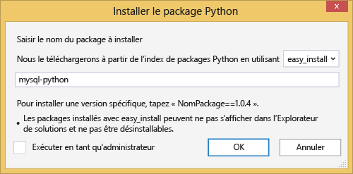

1.  Cliquez avec le bouton droit de la souris sur le nœud du projet et sélectionnez **Python**, **Django Sync DB**.

    Les tables de la base de données MySQL que nous avons créée dans la section précédente sont alors elles-aussi créées. Suivez les invites pour créer un utilisateur, qui ne doit pas forcément correspondre à l’utilisateur inclus dans la base de données sqlite que nous avons créée dans la première section.

  	

1.  Exécutez l’application avec `F5`. Les sondages créés à l’aide de la fonction **Create Sample Polls** et les données soumises par vote sont sérialisés dans la base de données MySQL.

## Publication de l’application web dans Azure App Service

Le Kit de développement logiciel (SDK) Azure .NET offre un moyen simple de déployer votre application web dans Azure App Service.

1.  Dans l’**Explorateur de solutions**, cliquez avec le bouton droit sur le nœud du projet et sélectionnez **Publier**.

  	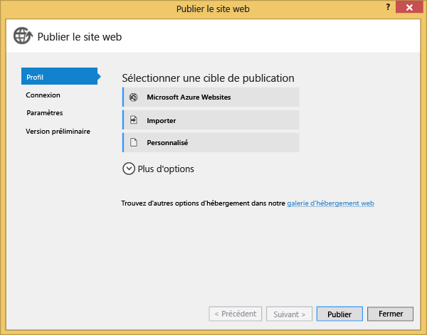

1.  Cliquez sur **Microsoft Azure Web Apps**.

1.  Cliquez sur **Nouveau** pour créer une application web.

1.  Renseignez les champs suivants et cliquez sur **Créer**.
	-	**Nom de l’application web**
	-	**Plan App Service**
	-	**Groupe de ressources**
	-	**Région**
	-	Dans **Serveur de base de données**, conservez **Aucune base de données**.

  	<!-- 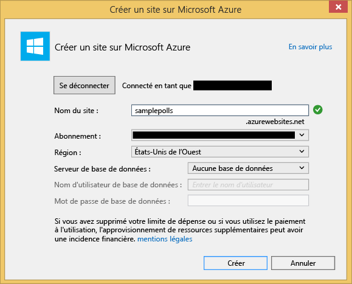 -->

1.  Acceptez toutes les valeurs par défaut et cliquez sur **Publier**.

1.  Votre navigateur web ouvre automatiquement l’application web publiée. L’application doit fonctionner comme prévu et utiliser la base de données **MySQL** hébergée sur Azure.

    Félicitations !

  	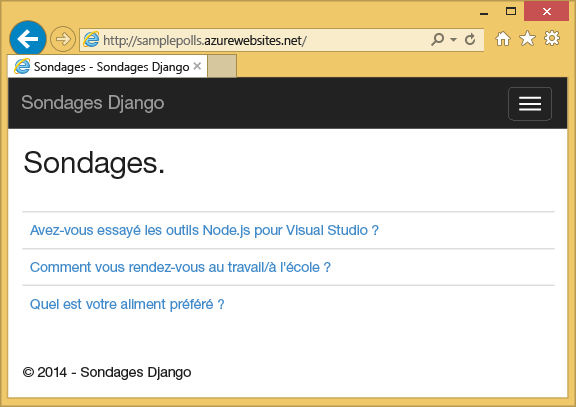

## Étapes suivantes

Suivez ces liens pour en savoir plus sur Python Tools pour Visual Studio, Django et MySQL.

- [Documentation relative à Python Tools for Visual Studio]
  - [Projets web]
  - [Projets de service cloud]
  - [Débogage à distance sur Microsoft Azure]
- [Documentation Django]
- [MySQL]

## Changements apportés
* Pour obtenir un guide présentant les modifications apportées dans le cadre de la transition entre Sites Web et App Service, consultez la page [Azure App Service et les services Azure existants](http://go.microsoft.com/fwlink/?LinkId=529714).
* Pour obtenir un guide présentant les modifications apportées dans le cadre de la transition entre l’ancien et le nouveau portail, consultez la page [Références sur la navigation dans le portail Azure](http://go.microsoft.com/fwlink/?LinkId=529715).

<!--Link references-->
[Centre de développement Python]: /develop/python/
[Azure Cloud Services]: ../cloud-services-python-ptvs.md

<!--External Link references-->
[portail Azure]: https://portal.azure.com
[Python Tools pour Visual Studio]: http://aka.ms/ptvs
[Python Tools 2.1 pour Visual Studio]: http://go.microsoft.com/fwlink/?LinkId=517189
[Python Tools 2.1 pour Visual Studio Samples VSIX]: http://go.microsoft.com/fwlink/?LinkId=517189
[Outils du Kit de développement logiciel (SDK) Azure pour Visual Studio 2013]: http://go.microsoft.com/fwlink/?LinkId=323510
[Outils du Kit de développement logiciel (SDK) Azure pour Visual Studio 2012]: http://go.microsoft.com/fwlink/?LinkId=323511
[Python 2.7 32 bits]: http://go.microsoft.com/fwlink/?LinkId=517190
[Documentation relative à Python Tools for Visual Studio]: http://pytools.codeplex.com/documentation
[Débogage à distance sur Microsoft Azure]: http://pytools.codeplex.com/wikipage?title=Features%20Azure%20Remote%20Debugging
[Projets web]: http://pytools.codeplex.com/wikipage?title=Features%20Web%20Project
[Projets de service cloud]: http://pytools.codeplex.com/wikipage?title=Features%20Cloud%20Project
[Documentation Django]: https://www.djangoproject.com/
[MySQL]: http://www.mysql.com/
 

<!---HONumber=62-->