# <a name="create-a-net-webjob-in-azure-app-service"></a>Créer une tâche web .NET dans Azure App Service
Ce didacticiel montre comment écrire du code pour une simple application ASP.NET MVC 5 à plusieurs niveaux utilisant le [kit de développement logiciel (SDK) WebJobs](websites-dotnet-webjobs-sdk.md).

[!INCLUDE [app-service-web-webjobs-corenote](../../includes/app-service-web-webjobs-corenote.md)]

L’objectif du [kit de développement logiciel (SDK) WebJobs](websites-webjobs-resources.md) consiste à simplifier le code que vous écrivez pour les tâches web courantes, telles que le traitement d’image, le traitement de la file d’attente, l’agrégation RSS, la maintenance des fichiers et l’envoi des messages électroniques. Le kit de développement logiciel (SDK) WebJobs dispose de fonctionnalités intégrées fonctionnant avec le stockage Azure et Service Bus et servant à planifier des tâches, à gérer des erreurs et à nombreux autres scénarios courants. En outre, il est évolutif et il existe un [référentiel open source contenant les extensions](https://github.com/Azure/azure-webjobs-sdk-extensions/wiki/Binding-Extensions-Overview).

L'exemple d'application concerne un panneau d'affichage publicitaire. Les utilisateurs peuvent télécharger des images pour les annonces ; un processus principal convertit les images en miniatures. La page de liste des annonces affiche des miniatures et la page de détails des annonces affiche les images en taille réelle. Voici une capture d'écran :

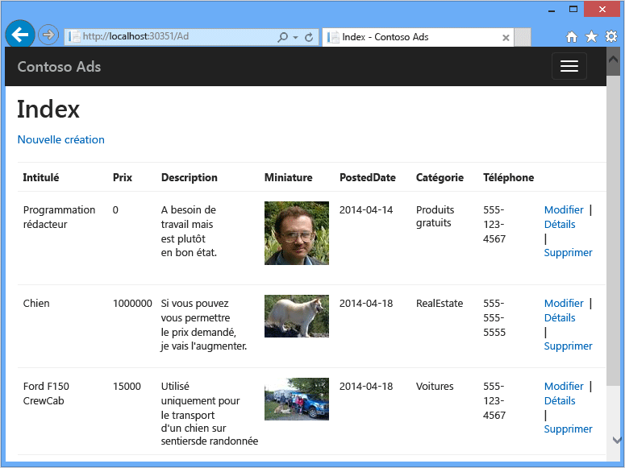

Cet exemple d’application fonctionne avec des [files d’attente Azure](http://www.asp.net/aspnet/overview/developing-apps-with-windows-azure/building-real-world-cloud-apps-with-windows-azure/queue-centric-work-pattern) et [objets blob Azure](http://www.asp.net/aspnet/overview/developing-apps-with-windows-azure/building-real-world-cloud-apps-with-windows-azure/unstructured-blob-storage). Ce didacticiel montre comment déployer l’application sur [Azure App Service](http://go.microsoft.com/fwlink/?LinkId=529714) et sur la [base de données SQL Azure](http://msdn.microsoft.com/library/azure/ee336279).

## <a id="prerequisites"></a>Configuration requise
Ce didacticiel suppose que vous savez utiliser les projets [ASP.NET MVC 5](http://www.asp.net/mvc/tutorials/mvc-5/introduction/getting-started) dans Visual Studio.

Ce didacticiel a été rédigé à l’origine pour Visual Studio 2013, mais peut être utilisé avec des versions ultérieures de Visual Studio. Si vous utilisez Visual Studio 2015 ou 2017, notez qu’avant d’exécuter l’application localement, vous devez modifier la partie `Data Source` de la chaîne de connexion SQL Server LocalDB dans les fichiers Web.config et App.config de `Data Source=(localdb)\v11.0` à `Data Source=(LocalDb)\MSSQLLocalDB`.

> [!NOTE]
> <a name="note"></a>Pour suivre ce didacticiel, vous avez besoin d’un compte Azure :
>
> * Vous pouvez [ouvrir un compte Azure gratuitement](https://azure.microsoft.com/pricing/free-trial/?WT.mc_id=A261C142F) : vous obtenez alors des crédits dont vous pouvez vous servir pour tester les services Azure payants et, même lorsqu’ils sont épuisés, vous pouvez conserver le compte et utiliser les services Azure gratuits, notamment Sites Web. Votre carte de crédit ne sera pas débitée tant que vous n'aurez pas explicitement modifié vos paramètres pour demander à l'être.
> * Vous pouvez [activer le crédit Azure mensuel pour Visual Studio](https://azure.microsoft.com/pricing/member-offers/msdn-benefits-details/?WT.mc_id=A261C142F) : votre abonnement vous donne droit chaque mois à des crédits dont vous pouvez vous servir pour les services Azure payants.
>
> Si vous voulez vous familiariser avec Azure App Service avant d’ouvrir un compte Azure, accédez à la page [Essayer App Service](https://azure.microsoft.com/try/app-service/), où vous pourrez créer immédiatement une application web temporaire dans App Service. Aucune carte de crédit n’est requise ; vous ne prenez aucun engagement.
>
>

## <a id="learn"></a>Contenu
Ce didacticiel explique comment effectuer les tâches suivantes :

* Activer votre ordinateur pour le développement Azure en installant le Kit de développement logiciel (SDK) Azure (uniquement pour les utilisateurs de Visual Studio 2013 et 2015).
* création du projet d'application console qui se déploie automatiquement comme une tâche web Azure lorsque vous déployez le projet web associé ;
* test d'un serveur principal de Kit de développement logiciel (SDK) WebJobs localement sur l'ordinateur de développement ;
* publication d’une application avec un serveur principal de tâches web dans une application web d’App Service ;
* téléchargement et enregistrement de fichiers dans le service Blob Azure ;
* utilisation du Kit de développement logiciel (SDK) Azure WebJobs avec des files d'attente et des objets blob Azure Storage.

## <a id="contosoads"></a>Architecture de l’application
L'exemple d'application utilise le [modèle de travail centré sur les files d'attente](http://www.asp.net/aspnet/overview/developing-apps-with-windows-azure/building-real-world-cloud-apps-with-windows-azure/queue-centric-work-pattern) pour décharger le travail de création de vignettes exigeant en ressources vers un processus principal.

L'application stocke les publicités dans une base de données SQL et utilise Entity Framework Code First pour créer les tables et accéder aux données. Pour chaque publicité, la base de données stocke deux URL, une pour l’image à taille réelle et l’autre pour la miniature.

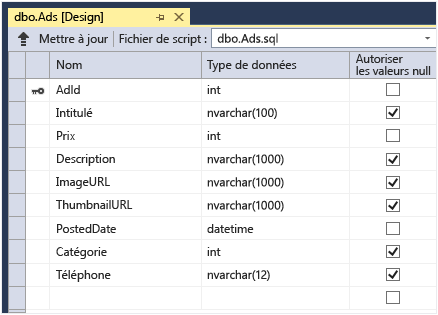

Lorsqu’un utilisateur charge une image, l’application web la stocke dans un [objet blob Azure](http://www.asp.net/aspnet/overview/developing-apps-with-windows-azure/building-real-world-cloud-apps-with-windows-azure/unstructured-blob-storage)et stocke les informations publicitaires dans la base de données avec une URL pointant vers l’objet blob. En même temps, il écrit un message dans une file d'attente Azure. Dans un processus principal s’exécutant en tant qu’Azure WebJob, le Kit de développement logiciel (SDK) WebJobs interroge la file d’attente sur la présence de nouveaux messages. Lorsqu'un nouveau message arrive, la tâche web crée une vignette pour cette image et met à jour le champ de la base de données des URL des vignettes pour cette publicité. Le schéma suivant montre l'interaction des parties de l'application :


[!INCLUDE [install-sdk](../../includes/install-sdk-2017-2015-2013.md)]  
Les instructions du didacticiel s’appliquent au Kit de développement logiciel (SDK) Azure pour .NET 2.7.1 ou pour une version ultérieure.

## <a id="storage"></a>Création d'un compte de stockage Azure
Un compte de stockage Azure fournit des ressources pour stocker les données de file d'attente et d'objet blob dans le cloud. Le Kit de développement logiciel (SDK) WebJobs l'utilise également pour enregistrer les données de journalisation du tableau de bord.

Dans une application réelle, vous créez généralement des comptes distincts pour les données d’application et de journalisation, et des comptes distincts pour les données de test et de production. Pour ce didacticiel, vous allez utiliser un seul compte.

1. Ouvrez la fenêtre **Explorateur de serveurs** dans Visual Studio.
2. Cliquez avec le bouton droit sur le nœud **Azure**, puis cliquez sur **Se connecter à un abonnement Microsoft Azure...**.
   
   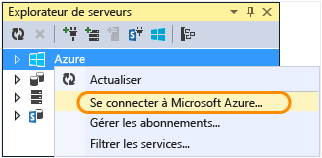

3. Connectez-vous à l'aide de vos informations d'identification Azure.
4. Cliquez avec le bouton droit sur **Stockage** sous le nœud Azure, puis cliquez sur **Créer un compte de stockage**.
   
   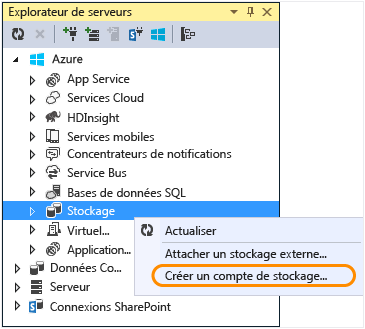
   
5. Dans la boîte de dialogue **Créer un compte de stockage** , entrez un nom correspondant au compte de stockage.

    Le nom doit être unique (aucun autre compte de stockage Azure ne doit avoir le même nom). Si le nom que vous entrez est déjà utilisé, vous aurez la possibilité de le modifier.

    L’URL permettant d’accéder à votre compte de stockage est *{nom}*.core.windows.net.
6. Choisissez la région la proche de vous dans la liste déroulante **Région ou groupe d’affinités** .

    Ce paramètre spécifie le centre de données Azure qui hébergera votre compte de stockage. Pour ce didacticiel, votre choix ne fera pas une grande différence. Toutefois, dans le cas d’une application web de production, vous souhaitez que votre serveur web et votre compte de stockage soient situés dans la même région afin de minimiser la latence et les frais d’acheminement des données. Le centre de données de l’application web (que vous créerez par la suite) doit être aussi proche que possible des navigateurs qui accèdent à l’application afin de réduire la latence.
7. Dans la liste déroulante **Réplication**, sélectionnez **Redondant en local**.

    Lorsque la géo-réplication est activée pour un compte de stockage, le contenu stocké est répliqué dans un centre de données secondaire pour activer le basculement vers cet emplacement en cas de sinistre majeur à l'emplacement principal. La géo-réplication peut engendrer des coûts supplémentaires. Dans le cas des comptes test et de développement, vous êtes en général peu enclin à payer pour la géo-réplication. Pour plus d’informations, consultez [Création, gestion ou suppression d’un compte de stockage](../storage/common/storage-create-storage-account.md).
8. Cliquez sur **Create**.

    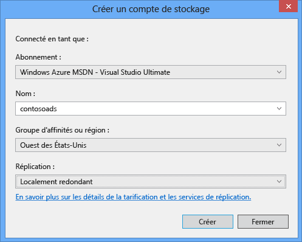

## <a id="download"></a>Télécharger l’application
1. Téléchargez et décompressez la [solution terminée](http://code.msdn.microsoft.com/Simple-Azure-Website-with-b4391eeb).
2. Démarrez Visual Studio.
3. Dans le menu **Fichier**, sélectionnez **Ouvrir > Projet/Solution**, accédez à l’emplacement où vous avez téléchargé la solution, puis ouvrez le fichier de la solution.
4. Appuyez sur Ctrl+Maj+B pour générer la solution.

    Par défaut, Visual Studio restaure automatiquement le contenu du package NuGet, qui n'était pas inclus dans le fichier *.zip* . Si les packages ne sont pas restaurés, installez-les manuellement en ouvrant la boîte de dialogue **Gérer les packages NuGet pour la solution** et en cliquant sur le bouton **Restaurer** en haut à droite.
5. Dans l'**Explorateur de solutions**, vérifiez que **ContosoAdsWeb** est sélectionné comme projet de démarrage.

## <a id="configurestorage"></a>Configurer l’application pour utiliser votre compte de stockage
1. Ouvrez le fichier d'application *Web.config* dans le projet ContosoAdsWeb.

    Ce fichier contient des chaînes de connexion SQL et de stockage Azure pour utiliser des objets blob et des files d'attente.

    La chaîne de connexion SQL pointe vers une base de données [SQL Server Express LocalDB](http://msdn.microsoft.com/library/hh510202.aspx) .

    La chaîne de connexion de stockage est un exemple qui comporte des espaces réservés pour la clé d’accès et le nom du compte stockage. Vous allez le remplacer par une chaîne de connexion qui a le nom et la clé de votre compte de stockage.  

    ```
    <connectionStrings>
        <add name="ContosoAdsContext" connectionString="Data Source=(localdb)\v11.0; Initial Catalog=ContosoAds; Integrated Security=True; MultipleActiveResultSets=True;" providerName="System.Data.SqlClient" />
        <add name="AzureWebJobsStorage" connectionString="DefaultEndpointsProtocol=https;AccountName=[accountname];AccountKey=[accesskey]"/>
    </connectionStrings>
    ```
    La chaîne de connexion de stockage est nommée AzureWebJobsStorage, car il s'agit du nom que le Kit de développement logiciel (SDK) WebJobs utilise par défaut. Nous utilisons ce nom ici pour qu’il ne vous reste plus qu’à définir une seule valeur de chaîne de connexion dans l’environnement Azure.
2. Dans l’**Explorateur de serveurs**, cliquez avec le bouton droit sur votre compte de stockage sous le nœud **Stockage**, puis cliquez sur **Propriétés**.

    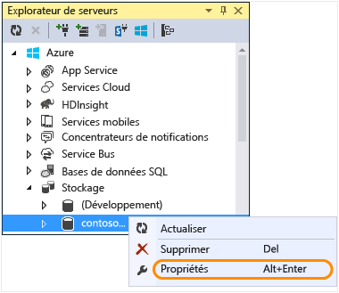
3. Dans la fenêtre **Propriétés**, cliquez sur **Clés de compte de stockage**, puis cliquez sur le bouton de sélection.

    
4. Copiez la **chaîne de connexion**.

    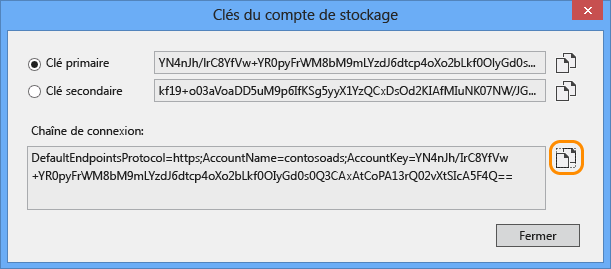
5. Remplacez la chaîne de connexion de stockage dans le fichier *Web.config* par celle que vous venez de copier. Veillez à sélectionner tout ce qui se trouve entre les guillemets, mais sans inclure les guillemets, avant le collage.
6. Ouvrez le fichier *App.config* dans le projet ContosoAdsWebJob.

    Ce fichier comporte deux chaînes de connexion : une pour les données de l'application et une pour la journalisation. Vous pouvez utiliser des comptes de stockage distincts pour les données et la journalisation de l’application, ainsi qu’utiliser [plusieurs comptes de stockage pour les données](https://github.com/Azure/azure-webjobs-sdk/blob/master/test/Microsoft.Azure.WebJobs.Host.EndToEndTests/MultipleStorageAccountsEndToEndTests.cs). Pour ce didacticiel, vous allez utiliser un seul compte de stockage. Les chaînes de connexion comportent des espaces réservés pour les clés de compte de stockage.

    ```
    <configuration>
        <connectionStrings>
            <add name="AzureWebJobsDashboard" connectionString="DefaultEndpointsProtocol=https;AccountName=[accountname];AccountKey=[accesskey]"/>
            <add name="AzureWebJobsStorage" connectionString="DefaultEndpointsProtocol=https;AccountName=[accountname];AccountKey=[accesskey]"/>
            <add name="ContosoAdsContext" connectionString="Data Source=(localdb)\v11.0; Initial Catalog=ContosoAds; Integrated Security=True; MultipleActiveResultSets=True;"/>
    </connectionStrings>
        <startup>
            <supportedRuntime version="v4.0" sku=".NETFramework,Version=v4.5" />
    </startup>
    </configuration>

    ```

    Par défaut, le Kit de développement logiciel (SDK) WebJobs recherche les chaînes de connexion AzureWebJobsStorage et AzureWebJobsDashboard. Vous pouvez également [stocker la chaîne de connexion comme vous le souhaitez et la transmettre explicitement à l’objet `JobHost`](websites-dotnet-webjobs-sdk-storage-queues-how-to.md#config).
7. Remplacez les chaînes de connexion de stockage par la chaîne de connexion que vous avez copiée précédemment.
8. Enregistrez vos modifications.

## <a id="run"></a>Exécuter l’application localement
1. Pour démarrer le programme web frontal de l'application, appuyez sur Ctrl+F5.

    Le navigateur par défaut ouvre la page d'accueil. Le projet web s'exécute, car vous l'avez défini comme projet de démarrage.

    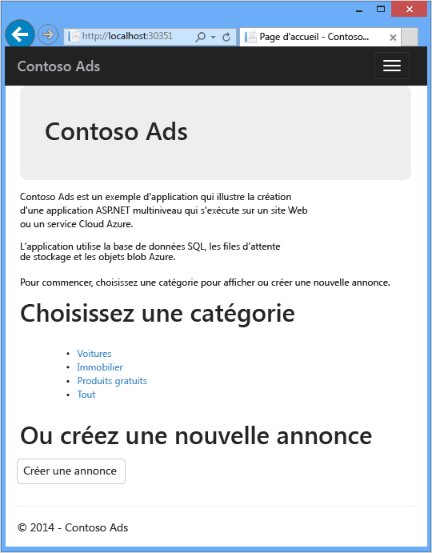
2. Pour démarrer la tâche web principale de l'application, cliquez avec le bouton droit sur le projet ContosoAdsWebJob dans l'**Explorateur de solutions**, puis sur **Débogage** > **Démarrer une nouvelle instance**.

    Une fenêtre d'application console s'ouvre et affiche des messages de journalisation indiquant que l'objet JobHost du Kit de développement logiciel (SDK) WebJobs a commencé à s'exécuter.

    
3. Dans votre navigateur, cliquez sur **Créer une publicité**.
4. Entrez des données de test, sélectionnez une image à télécharger, puis cliquez sur **Créer**.

    

    L'application ouvre la page Index, mais n'affiche pas de vignette pour la nouvelle publicité, car le processus n'a pas encore eu lieu.

    Entre-temps, après une brève attente, un message dans la fenêtre d'application console indique qu'un message en file d'attente a été reçu et traité.

    
5. Lorsque ces messages s'affichent dans la fenêtre d'application console, actualisez la page Index pour afficher la vignette.

    
6. Cliquez sur l'option **Détails** de votre publicité pour afficher l'image intégrale.

    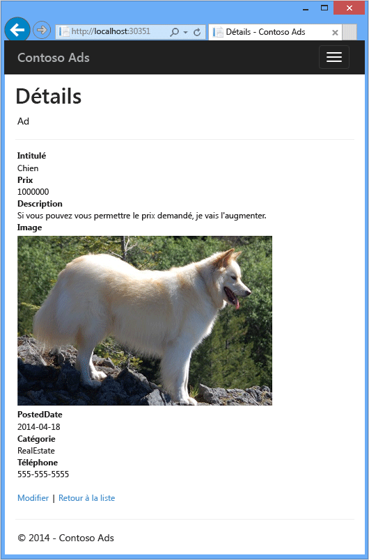

Vous avez exécuté l'application sur votre ordinateur local. Elle utilise une base de données SQL Server sur votre ordinateur, mais travaille sur des files d'attente et des objets blob dans le cloud. Dans la section suivante, vous allez exécuter l'application dans le cloud en utilisant une base de données du cloud ainsi que des objets blob et des files d'attente du cloud.  

## <a id="runincloud"></a>Exécuter l’application dans le cloud
Pour exécuter l'application dans le cloud, procédez comme suit :

* Procédez au déploiement dans Web Apps. Visual Studio crée automatiquement une application web dans App Service et une instance Base de données SQL.
* Configurez l’application pour l’utilisation de votre base de données SQL et de votre compte de stockage Azure.

Après avoir créé quelques publicités dans le cloud, vous afficherez le tableau de bord du Kit de développement logiciel (SDK) WebJobs pour voir les fonctions de surveillance enrichies qu'il offre.

### <a name="deploy-to-web-apps"></a>Déployer dans Web Apps

1. Fermez le navigateur et la fenêtre d'application console.
2. Suivez les étapes de la section [Publier sur Azure avec SQL Database](https://docs.microsoft.com/azure/app-service-web/app-service-web-tutorial-dotnet-sqldatabase#publish-to-azure-with-sql-database).
3. Une fois les étapes de déploiement accomplies, effectuez les tâches restantes décrites dans cet article.

### <a name="configure-the-web-app-to-use-your-azure-sql-database-and-storage-account"></a>Configurer l’application pour l’utilisation de votre base de données SQL et de votre compte de stockage Azure
Par sécurité, il est conseillé [d'éviter de placer des informations sensibles (par exemple, des chaînes de connexion) dans des fichiers stockés dans des référentiels de code source](http://www.asp.net/aspnet/overview/developing-apps-with-windows-azure/building-real-world-cloud-apps-with-windows-azure/source-control#secrets). Vous pouvez définir une chaîne de connexion et d’autres paramètres dans l’environnement Azure. Les API de configuration ASP.NET sélectionnent automatiquement ces valeurs quand l’application s’exécute dans Azure. Vous pouvez définir ces valeurs dans Azure à l’aide de l’**Explorateur de serveurs**, du portail Azure, de Windows PowerShell ou de l’interface de ligne de commande interplateforme. Pour plus d’informations, consultez [Fonctionnement des chaînes d’application et des chaînes de connexion](https://azure.microsoft.com/blog/2013/07/17/windows-azure-web-sites-how-application-strings-and-connection-strings-work/).

Dans cette section, vous utilisez l’ **Explorateur de serveurs** pour définir des valeurs de chaînes de connexion dans Azure.

1. Dans l’**Explorateur de serveurs**, cliquez avec le bouton droit sur votre application web sous **Azure > App Service {votre groupe de ressources}**, puis cliquez sur **Afficher les paramètres**.

    La fenêtre **Application web Azure** s’ouvre dans l’onglet **Configuration**.
2. Modifiez le nom de la chaîne de connexion par défaut en le remplaçant par le nom que vous avez choisi lors de la configuration de la base de données SQL dans le cadre de l’article [Publier sur Azure avec SQL Database](https://docs.microsoft.com/azure/app-service-web/app-service-web-tutorial-dotnet-sqldatabase#publish-to-azure-with-sql-database).

    Azure a automatiquement créé cette chaîne de connexion lorsque vous avez créé l’application web avec une base de données associée ; il présente donc déjà la valeur de chaîne de connexion adéquate. Vous remplacez simplement le nom par celui que votre code recherche.
3. Ajoutez deux chaînes de connexion nommées AzureWebJobsStorage et AzureWebJobsDashboard. Définissez le type de base de données sur **Personnalisé** et définissez la valeur de la chaîne de connexion sur la valeur que vous avez utilisée auparavant pour les fichiers *Web.config* et *App.config*. Veillez à inclure la chaîne de connexion complète, pas uniquement la clé d’accès, ainsi qu’à ne pas inclure les guillemets.

    Le Kit de développement logiciel (SDK) WebJobs utilise ces chaînes de connexion : une pour les données de l'application et une pour la journalisation. Comme nous l’avons vu précédemment, le code du programme web frontal utilise aussi la chaîne pour les données de l’application.
4. Cliquez sur **Save**.

    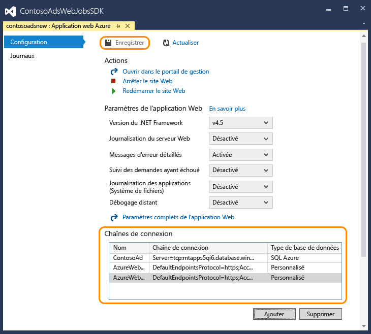
5. Dans l’**Explorateur de serveurs**, cliquez avec le bouton droit sur l’application web, puis cliquez sur **Arrêter**.
6. Une fois l’application web arrêtée, cliquez de nouveau sur cette dernière avec le bouton droit, puis cliquez sur **Démarrer**.

   La tâche web démarre automatiquement lorsque vous publiez, mais elle s'arrête lorsque vous modifiez la configuration. Pour la redémarrer, vous pouvez soit redémarrer l’application web, soit redémarrer la tâche web dans le [portail Azure](http://go.microsoft.com/fwlink/?LinkId=529715). Il est généralement recommandé de redémarrer l’application web après une modification de la configuration.
7. Actualisez la fenêtre du navigateur contenant l’URL de l’application web dans sa barre d’adresse.

    La page d'accueil s'affiche.
8. Créez une publicité comme vous l’avez fait lorsque vous avez [exécuté l’application localement](https://docs.microsoft.com/azure/app-service-web/websites-dotnet-webjobs-sdk-get-started#a-idrunarun-the-application-locally).

   La page Index s'affiche d'abord sans vignette.
9. Actualisez la page après quelques secondes. La miniature s’affiche.

   Si elle n’apparaît pas, il se peut que vous deviez patienter environ une minute pour que la tâche web redémarre. Si, après un certain temps, vous ne voyez toujours pas la miniature lorsque vous actualisez la page, il se peut que la tâche web n’ait pas démarré automatiquement. Dans ce cas, accédez au panneau **App Services** dans le [portail Azure](https://portal.azure.com/), localisez votre application web, puis cliquez sur **Démarrer**.

### <a name="view-the-webjobs-sdk-dashboard"></a>Affichage du tableau de bord du Kit de développement logiciel (SDK) WebJobs
1. Dans le [portail Azure](https://portal.azure.com/), sélectionnez le panneau **App Services**, localisez votre application web, puis sélectionnez **Tâches web**.
3. Sélectionnez l’onglet **Journaux**.

    

    Un nouvel onglet ouvre le tableau de bord du Kit de développement logiciel (SDK) WebJobs dans le navigateur. Le tableau de bord indique que la tâche web est en cours d'exécution et affiche la liste des fonctions de votre code que le SDK a déclenchées.
4. Cliquez sur une des fonctions pour afficher des informations sur son exécution.

    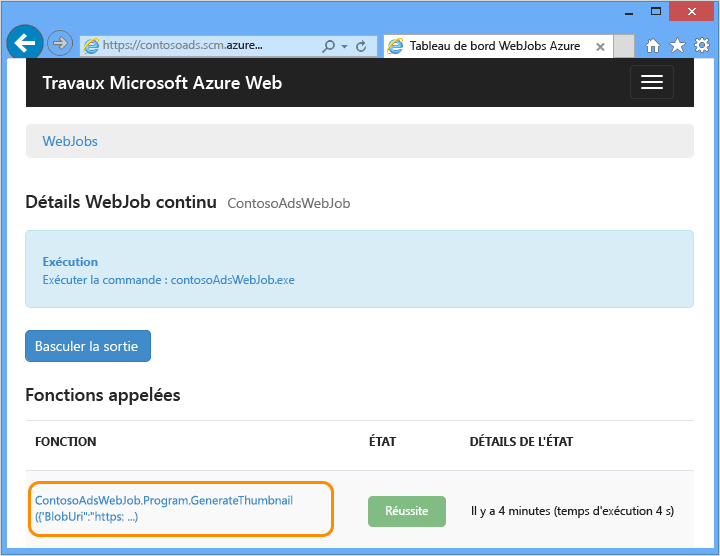

    

    Le bouton **Rappeler la fonction** de cette page commande à l'infrastructure du SDK de rappeler la fonction et vous permet de modifier les données déjà transmises à la fonction.

> [!NOTE]
> Lorsque vous avez fini de tester, songez à supprimer l’application web, le compte de stockage et votre instance SQL Database. L’application web est gratuite, mais le compte de stockage et l’instance de base de données SQL augmentent les frais (quoique minimaux du fait de la petite taille). De même, si vous laissez l’application web s’exécuter, toute personne trouvant votre URL peut créer et afficher des publicités. 
>
>

### <a name="delete-your-web-app"></a>Supprimer votre application web
Dans le portail, accédez au panneau **App Services**, recherchez et sélectionnez votre application web, puis cliquez sur **Supprimer**. Si vous souhaitez empêcher temporairement l’accès à l’application web, cliquez plutôt sur **Arrêter** . Dans ce cas, les frais continuent à s'accumuler pour la base de données SQL et le compte de stockage.

### <a name="delete-your-storage-account"></a>Supprimer votre compte de stockage
Pour supprimer votre compte de stockage, voir [Supprimer un compte de stockage](https://docs.microsoft.com/azure/storage/storage-create-storage-account#delete-a-storage-account). 

### <a name="delete-your-database"></a>Supprimer de votre base de données
Pour supprimer votre base de données SQL, voir la documentation de l’[API REST Azure SQL Database](https://docs.microsoft.com/rest/api/sql/).

## <a id="create"></a>Créer l’application intégralement
Dans cette section, vous effectuerez les tâches suivantes :

* création d'une solution Visual Studio avec un projet web ;
* ajout d’un projet de bibliothèque de classes pour la couche d’accès aux données partagée par le programme frontal et le programme principal ;
* ajout d'un projet d'application console pour le programme principal, le déploiement de tâches web étant activé ;
* ajout de packages NuGet ;
* définition des références d'un projet ;
* copie des fichiers de code et de configuration de l'application téléchargée que vous avez utilisée dans la section précédente de ce didacticiel ;
* examen des parties du code qui fonctionnent avec les objets blob, les files d'attente et le Kit de développement logiciel (SDK) WebJobs Azure.

### <a name="create-a-visual-studio-solution-with-a-web-project-and-class-library-project"></a>Création d'une solution Visual Studio avec un projet web et un projet de bibliothèque de classes
1. Dans Visual Studio, choisissez **Fichier** > **Nouveau** > **Projet**.
2. Dans la boîte de dialogue **Nouveau projet**, choisissez **Visual C#** > **Web** > **Application web ASP.NET (.NET Framework)**.
3. Nommez le projet ContosoAdsWeb, la solution ContosoAdsWebJobsSDK (modifiez le nom de la solution si vous la placez dans le même dossier que la solution téléchargée) et cliquez sur **OK**.

    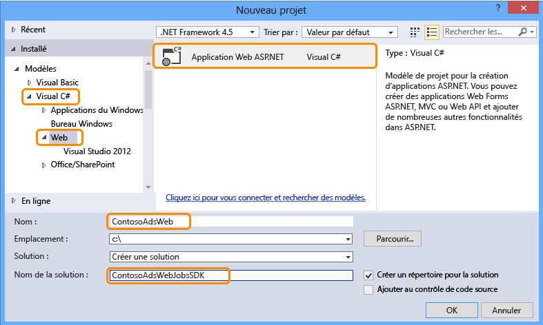
4. Dans la boîte de dialogue **Nouvelle application web ASP.NET**, choisissez le modèle MVC, puis sélectionnez **Modifier l’authentification**.

    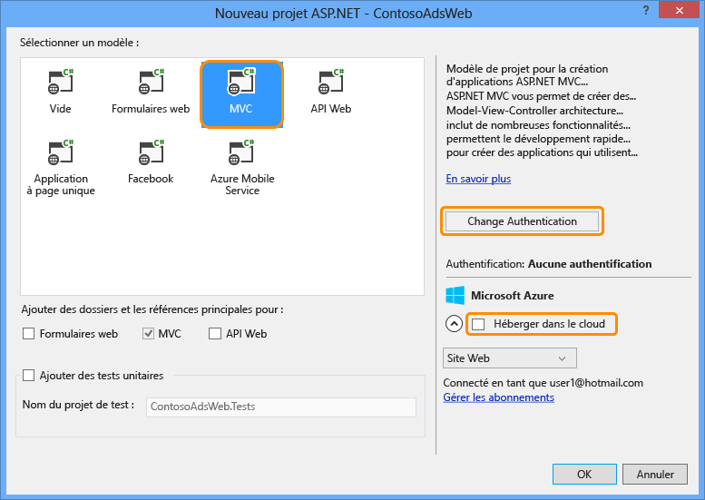
5. Dans la boîte de dialogue **Modifier l'authentification**, choisissez **Aucune authentification** et cliquez sur **OK**.

    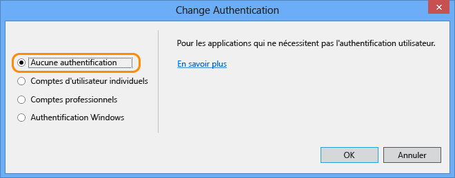
6. Dans la boîte de dialogue **Nouvelle application web ASP.NET**, cliquez sur **OK**.

    Visual Studio crée la solution et le projet web.
7. Dans l'**Explorateur de solutions**, cliquez avec le bouton droit sur la solution (et non sur le projet) et choisissez **Ajouter** > **Nouveau projet**.
8. Dans la boîte de dialogue **Ajouter un nouveau projet**, choisissez le modèle **Visual C#** > **Bureau classique Windows** > **Bibliothèque de classes (.NET Framework)**.  
9. Nommez le projet *ContosoAdsCommon*, puis cliquez sur **OK**.

    Ce projet contient le contexte Entity Framework et le modèle de données que le programme frontal et le programme principal vont utiliser. Vous pouvez également définir les classes associées à Entity Framework dans le projet web et faire référence à ce projet de tâche web. Mais dans ce cas, ce dernier aura une référence inutile aux assemblys web.

### <a name="add-a-console-application-project-that-has-webjobs-deployment-enabled"></a>Ajout d'un projet d'application console dont le déploiement de tâches web est activé
1. Cliquez avec le bouton droit sur le projet web (et non sur la solution ou le projet de bibliothèque de classes), puis cliquez sur **Ajouter** > **Nouveau projet de tâche web Azure**.

    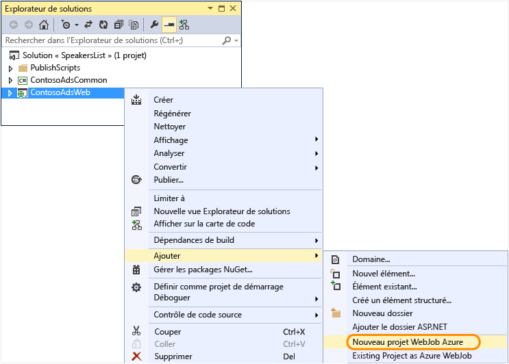
2. Dans la boîte de dialogue **Ajouter une tâche web Azure**, entrez ContosoAdsWebJob pour le **Nom du projet** et le **Nom de la tâche web**. Laissez **Mode d'exécution de la tâche web** sur **Exécuter en continu**.
3. Cliquez sur **OK**.

   Visual Studio crée une application console configurée pour se déployer comme une tâche web lorsque vous déployez le projet web. Pour cela, il a effectué les tâches suivantes après la création du projet :

   * ajout d'un fichier *webjob-publish-settings.json* dans le dossier des propriétés du projet de tâche web ;
   * ajout d'un fichier *webjobs-list.json* dans le dossier des propriétés du projet web ;
   * installation du package NuGet Microsoft.Web.WebJobs.Publish dans le projet de tâche web.

   Pour plus d’informations sur ces modifications, consultez la rubrique [Déployer des tâches web à l’aide de Visual Studio](websites-dotnet-deploy-webjobs.md).

### <a name="add-nuget-packages"></a>Ajout de packages NuGet
Le nouveau modèle de projet pour un projet de tâche web installe automatiquement le package NuGet [Microsoft.Azure.WebJobs](http://www.nuget.org/packages/Microsoft.Azure.WebJobs) du Kit de développement logiciel (SDK) WebJobs et ses dépendances.

L’une des dépendances du Kit de développement logiciel WebJobs installée automatiquement dans le projet WebJob est la bibliothèque cliente de stockage Azure (SCL, Storage Client Library). Toutefois, vous devez l’ajouter au projet web pour qu’elle fonctionne avec les objets blob et les files d’attente.

1. Ouvrez la boîte de dialogue **Gérer les packages NuGet** pour la solution.
2. Dans le volet de gauche, sélectionnez **Packages installés**.
3. Recherchez le package *Azure Storage* et cliquez sur **Gérer**.
4. Dans la boîte de dialogue **Sélectionner les projets**, activez la case à cocher **ContosoAdsWeb**, puis cliquez sur **OK**.

    Ces trois projets ont recours à Entity Framework pour utiliser les données de la base de données SQL.
5. Dans le volet gauche, sélectionnez **En ligne**.
6. Recherchez le package NuGet *EntityFramework* et installez-le dans les trois projets.

### <a name="set-project-references"></a>Définition des références de projet
Les projets web et de tâches web utilisent la base de données SQL ; les deux nécessitent une référence au projet ContosoAdsCommon.

1. Dans le projet ContosoAdsWeb, définissez une référence au projet ContosoAdsCommon. Cliquez avec le bouton droit sur le projet ContosoAdsWeb, puis cliquez sur **Ajouter** > **Référence**. 
2. Dans la boîte de dialogue **Gestionnaire de références**, sélectionnez **Projets** > **Solution** > **ContosoAdsCommon**, puis cliquez sur **OK**.
   
    Le projet web nécessite des références pour utiliser des images et accéder aux chaînes de connexion.

4. Dans le projet ContosoAdsWebJob, définissez une référence à `System.Drawing` et `System.Configuration`.

### <a name="add-code-and-configuration-files"></a>Ajout de fichiers de code et de configuration
Ce didacticiel n'explique pas comment [créer des contrôleurs et des vues MVC à l'aide de la structure](http://www.asp.net/mvc/tutorials/mvc-5/introduction/getting-started), comment [écrire du code Entity Framework qui fonctionne avec les bases de données SQL Server](http://www.asp.net/mvc/tutorials/getting-started-with-ef-using-mvc), [ni les bases de la programmation asynchrone dans ASP.NET 4.5](http://www.asp.net/aspnet/overview/developing-apps-with-windows-azure/building-real-world-cloud-apps-with-windows-azure/web-development-best-practices#async). Il ne reste donc qu’à copier les fichiers de code et de configuration de la solution téléchargée dans la nouvelle solution. Ensuite, les sections suivantes montrent et expliquent les éléments essentiels de ce code.

Pour ajouter des fichiers à un projet ou à un dossier, cliquez avec le bouton droit sur le projet ou le dossier, puis cliquez sur **Ajouter** > **Élément existant**. Sélectionnez les fichiers et cliquez sur **Ajouter**. Si un message vous demande si vous souhaitez remplacer les fichiers existants, cliquez sur **Oui**.

1. Dans le projet ContosoAdsCommon, supprimez le fichier *Class1.cs* et ajoutez à la place les fichiers suivants du projet téléchargé.

   * *Ad.cs*
   * *ContosoAdscontext.cs*
   * *BlobInformation.cs*
2. Dans le projet ContosoAdsWeb, ajoutez les fichiers suivants du projet téléchargé.

   * *Web.config*
   * *Global.asax.cs*  
   * Dans le dossier *Controllers* : *AdController.cs*
   * Dans le dossier *Views\Shared* : fichier *_Layout.cshtml*.
   * Dans le dossier *Views\Home* : *Index.cshtml*
   * Dans le dossier *Views\Ad* (à créer) : cinq fichiers *.cshtml*
3. Dans le projet ContosoAdsWebJob, ajoutez les fichiers suivants du projet téléchargé.

   * *App.config* (indiquez le type de fichier **Tous les fichiers**)
   * *Program.cs*
   * *Functions.cs*

Vous pouvez maintenant générer, exécuter et déployer l'application en suivant les instructions fournies précédemment dans ce didacticiel. Toutefois, avant cela, arrêtez la tâche web toujours en cours d’exécution dans la première application web dans laquelle vous l’avez déployée. Dans le cas contraire, cette tâche web traite les messages de file d’attente créés localement ou par l’application en cours d’exécution dans une nouvelle application web, car ils utilisent tous le même compte de stockage.

## <a id="code"></a>Vérifier le code de l’application
Les sections suivantes présentent le code utilisé avec le Kit de développement logiciel (SDK) WebJobs et des objets blob et des files d'attente Azure.

> [!NOTE]
> Pour le code spécifique au kit de développement logiciel (SDK) WebJobs, accédez aux sections [Program.cs et Functions.cs](#programcs) .
>
>

### <a name="contosoadscommon---adcs"></a>ContosoAdsCommon - Ad.cs
Le fichier Ad.cs définit une énumération des catégories de publicité et une classe d'entité POCO pour les informations de publicité.

        public enum Category
        {
            Cars,
            [Display(Name="Real Estate")]
            RealEstate,
            [Display(Name = "Free Stuff")]
            FreeStuff
        }

        public class Ad
        {
            public int AdId { get; set; }

            [StringLength(100)]
            public string Title { get; set; }

            public int Price { get; set; }

            [StringLength(1000)]
            [DataType(DataType.MultilineText)]
            public string Description { get; set; }

            [StringLength(1000)]
            [DisplayName("Full-size Image")]
            public string ImageURL { get; set; }

            [StringLength(1000)]
            [DisplayName("Thumbnail")]
            public string ThumbnailURL { get; set; }

            [DataType(DataType.Date)]
            [DisplayFormat(DataFormatString = "{0:yyyy-MM-dd}", ApplyFormatInEditMode = true)]
            public DateTime PostedDate { get; set; }

            public Category? Category { get; set; }
            [StringLength(12)]
            public string Phone { get; set; }
        }

### <a name="contosoadscommon---contosoadscontextcs"></a>ContosoAdsCommon - ContosoAdsContext.cs
La classe ContosoAdsContext spécifie que la classe Ad est utilisée dans une collection DbSet, qui est stockée par Entity Framework dans une base de données SQL.

        public class ContosoAdsContext : DbContext
        {
            public ContosoAdsContext() : base("name=ContosoAdsContext")
            {
            }
            public ContosoAdsContext(string connString)
                : base(connString)
            {
            }
            public System.Data.Entity.DbSet<Ad> Ads { get; set; }
        }

La classe a deux constructeurs. Le premier est utilisé par le projet web et spécifie le nom d'une chaîne de connexion stockée dans le fichier Web.config de l'environnement d'exécution Azure. Le second vous permet de passer la chaîne de connexion existante. Le projet de rôle de travail, qui ne comporte pas de fichier Web.config. nécessite cette opération. Vous avez vu précédemment où est stockée cette chaîne de connexion, et vous allez voir comme le code la récupère quand il instancie la classe DbContext.

### <a name="contosoadscommon---blobinformationcs"></a>ContosoAdsCommon - BlobInformation.cs
La classe `BlobInformation` permet de stocker les informations d’un objet blob d’image dans un message de file d’attente.

        public class BlobInformation
        {
            public Uri BlobUri { get; set; }

            public string BlobName
            {
                get
                {
                    return BlobUri.Segments[BlobUri.Segments.Length - 1];
                }
            }
            public string BlobNameWithoutExtension
            {
                get
                {
                    return Path.GetFileNameWithoutExtension(BlobName);
                }
            }
            public int AdId { get; set; }
        }


### <a name="contosoadsweb---globalasaxcs"></a>ContosoAdsWeb - Global.asax.cs
Le code appelé par la méthode `Application_Start` crée un conteneur d’objets blob *images* et une file d’attente *images*, s’ils n’existent pas déjà. Cela garantit que, lorsque vous commencez à utiliser un nouveau compte de stockage, le conteneur d'objets blob et la file d'attente nécessaires sont créés automatiquement.

Le code a accès au compte de stockage en utilisant la chaîne de connexion du fichier *Web.config* ou l'environnement d'exécution Azure.

        var storageAccount = CloudStorageAccount.Parse
            (ConfigurationManager.ConnectionStrings["AzureWebJobsStorage"].ToString());

Il obtient ensuite une référence au conteneur d’objets blob *images*, crée le conteneur s’il n’existe pas, et définit les autorisations d’accès au nouveau conteneur. Par défaut, les nouveaux conteneurs ne donnent accès aux objets blob qu’aux clients disposant d’informations d’identification de compte de stockage. L’application web a besoin que les objets blob soient publics pour afficher des images en utilisant des URL qui pointent vers les objets blob de ces images.

        var blobClient = storageAccount.CreateCloudBlobClient();
        var imagesBlobContainer = blobClient.GetContainerReference("images");
        if (imagesBlobContainer.CreateIfNotExists())
        {
            imagesBlobContainer.SetPermissions(
                new BlobContainerPermissions
                {
                    PublicAccess = BlobContainerPublicAccessType.Blob
                });
        }

Du code similaire obtient une référence à la file d’attente *thumbnailrequest* et crée une nouvelle file d’attente. Dans ce cas, aucune modification des autorisations n'est nécessaire.

        CloudQueueClient queueClient = storageAccount.CreateCloudQueueClient();
        var imagesQueue = queueClient.GetQueueReference("thumbnailrequest");
        imagesQueue.CreateIfNotExists();

### <a name="contosoadsweb---layoutcshtml"></a>ContosoAdsWeb - _Layout.cshtml
Le fichier *_Layout.cshtml* définit le nom de l’application dans l’en-tête et le pied de page, puis crée une entrée de menu « Ads ».

### <a name="contosoadsweb---viewshomeindexcshtml"></a>ContosoAdsWeb - Views\Home\Index.cshtml
Le fichier *Views\Home\Index.cshtml* affiche les liens de catégorie sur la page d'accueil. Les liens transmettent la valeur entière de l’énumération `Category` d’une variable querystring à la page Ads Index.

        <li>@Html.ActionLink("Cars", "Index", "Ad", new { category = (int)Category.Cars }, null)</li>
        <li>@Html.ActionLink("Real estate", "Index", "Ad", new { category = (int)Category.RealEstate }, null)</li>
        <li>@Html.ActionLink("Free stuff", "Index", "Ad", new { category = (int)Category.FreeStuff }, null)</li>
        <li>@Html.ActionLink("All", "Index", "Ad", null, null)</li>

### <a name="contosoadsweb---adcontrollercs"></a>ContosoAdsWeb - AdController.cs
Dans le fichier *AdController.cs*, le constructeur appelle la méthode `InitializeStorage` pour créer les objets de la bibliothèque cliente Azure Storage, qui fournissent une API pour les objets blob et les files d’attente.

Le code obtient ensuite une référence au conteneur d’objets blob *images* comme vu précédemment dans *Global.asax.cs*. Ce faisant, il définit une [stratégie de nouvelles tentatives](http://www.asp.net/aspnet/overview/developing-apps-with-windows-azure/building-real-world-cloud-apps-with-windows-azure/transient-fault-handling) par défaut appropriée pour une application web. La stratégie de nouvelles tentatives d'interruption exponentielle par défaut peut suspendre l'application web pendant plus d'une minute en cas de tentatives répétées pour une erreur temporaire. La stratégie de nouvelle tentative spécifiée ici laisse trois secondes après chaque nouvelle tentative, jusqu’à trois.

        var blobClient = storageAccount.CreateCloudBlobClient();
        blobClient.DefaultRequestOptions.RetryPolicy = new LinearRetry(TimeSpan.FromSeconds(3), 3);
        imagesBlobContainer = blobClient.GetContainerReference("images");

Un code similaire obtient une référence à la file d'attente *images* .

        CloudQueueClient queueClient = storageAccount.CreateCloudQueueClient();
        queueClient.DefaultRequestOptions.RetryPolicy = new LinearRetry(TimeSpan.FromSeconds(3), 3);
        imagesQueue = queueClient.GetQueueReference("blobnamerequest");

La plupart du code du contrôleur permet généralement d'utiliser un modèle de données Entity Framework en utilisant une classe DbContext. La méthode HttpPost `Create` est une exception, car elle télécharge un fichier et l’enregistre dans le stockage d’objets blob. Le classeur de modèles fournit un objet [HttpPostedFileBase](http://msdn.microsoft.com/library/system.web.httppostedfilebase.aspx) à la méthode.

        [HttpPost]
        [ValidateAntiForgeryToken]
        public async Task<ActionResult> Create(
            [Bind(Include = "Title,Price,Description,Category,Phone")] Ad ad,
            HttpPostedFileBase imageFile)

Si l'utilisateur a sélectionné un fichier à télécharger, le code met à jour le fichier, l'enregistre dans un objet blob et met à jour l'enregistrement de base de données AD avec une URL qui pointe vers l'objet blob.

        if (imageFile != null && imageFile.ContentLength != 0)
        {
            blob = await UploadAndSaveBlobAsync(imageFile);
            ad.ImageURL = blob.Uri.ToString();
        }

Le code qui procède au téléchargement se trouve dans la méthode `UploadAndSaveBlobAsync` . Il crée un nom GUID pour l'objet blob, télécharge et enregistre le fichier, et renvoie une référence vers l'objet blob enregistré.

        private async Task<CloudBlockBlob> UploadAndSaveBlobAsync(HttpPostedFileBase imageFile)
        {
            string blobName = Guid.NewGuid().ToString() + Path.GetExtension(imageFile.FileName);
            CloudBlockBlob imageBlob = imagesBlobContainer.GetBlockBlobReference(blobName);
            using (var fileStream = imageFile.InputStream)
            {
                await imageBlob.UploadFromStreamAsync(fileStream);
            }
            return imageBlob;
        }

Une fois que la méthode HttpPost `Create` a téléchargé un objet blob et mis à jour la base de données, elle crée un message de file d’attente pour informer ce processus d’arrière-plan qu’une image est prête à être convertie en vignette.

        BlobInformation blobInfo = new BlobInformation() { AdId = ad.AdId, BlobUri = new Uri(ad.ImageURL) };
        var queueMessage = new CloudQueueMessage(JsonConvert.SerializeObject(blobInfo));
        await thumbnailRequestQueue.AddMessageAsync(queueMessage);

Le code de la méthode HttpPost `Edit` est similaire, mais si l’utilisateur sélectionne un nouveau fichier image, les objets blob qui existent pour cette publicité doivent être supprimés.

        if (imageFile != null && imageFile.ContentLength != 0)
        {
            await DeleteAdBlobsAsync(ad);
            imageBlob = await UploadAndSaveBlobAsync(imageFile);
            ad.ImageURL = imageBlob.Uri.ToString();
        }

Voici le code qui supprime les objets blob lorsque vous supprimez une publicité :

        private async Task DeleteAdBlobsAsync(Ad ad)
        {
            if (!string.IsNullOrWhiteSpace(ad.ImageURL))
            {
                Uri blobUri = new Uri(ad.ImageURL);
                await DeleteAdBlobAsync(blobUri);
            }
            if (!string.IsNullOrWhiteSpace(ad.ThumbnailURL))
            {
                Uri blobUri = new Uri(ad.ThumbnailURL);
                await DeleteAdBlobAsync(blobUri);
            }
        }
        private static async Task DeleteAdBlobAsync(Uri blobUri)
        {
            string blobName = blobUri.Segments[blobUri.Segments.Length - 1];
            CloudBlockBlob blobToDelete = imagesBlobContainer.GetBlockBlobReference(blobName);
            await blobToDelete.DeleteAsync();
        }

### <a name="contosoadsweb---viewsadindexcshtml-and-detailscshtml"></a>ContosoAdsWeb - Views\Ad\Index.cshtml et Details.cshtml
Le fichier *Index.cshtml* affiche des vignettes avec les autres données de publicité :

        

Le fichier *Details.cshtml* affiche l'image intégrale :

        

### <a name="contosoadsweb---viewsadcreatecshtml-and-editcshtml"></a>ContosoAdsWeb - Views\Ad\Create.cshtml et Edit.cshtml
Les fichiers *Create.cshtml* et *Edit.cshtml* spécifient l’encodage de formulaire qui permet au contrôleur d’obtenir l’objet `HttpPostedFileBase`.

        @using (Html.BeginForm("Create", "Ad", FormMethod.Post, new { enctype = "multipart/form-data" }))

Un élément `<input>` indique au navigateur de fournir une boîte de dialogue de sélection de fichier.

        <input type="file" name="imageFile" accept="image/*" class="form-control fileupload" />

### <a id="programcs"></a>ContosoAdsWebJob - Program.cs
Lorsque la tâche web démarre, la méthode `Main` appelle la méthode `JobHost.RunAndBlock` du Kit de développement logiciel (SDK) WebJobs pour commencer l’exécution des fonctions déclenchées sur le thread actuel.

        static void Main(string[] args)
        {
            JobHost host = new JobHost();
            host.RunAndBlock();
        }

### <a id="generatethumbnail"></a>ContosoAdsWebJob - Functions.cs - Méthode GenerateThumbnail
Le Kit de développement logiciel (SDK) WebJobs appelle cette méthode lorsqu'un message de file d'attente est reçu. Cette méthode crée une vignette et place son URL dans la base de données.

        public static void GenerateThumbnail(
        [QueueTrigger("thumbnailrequest")] BlobInformation blobInfo,
        [Blob("images/{BlobName}", FileAccess.Read)] Stream input,
        [Blob("images/{BlobNameWithoutExtension}_thumbnail.jpg")] CloudBlockBlob outputBlob)
        {
            using (Stream output = outputBlob.OpenWrite())
            {
                ConvertImageToThumbnailJPG(input, output);
                outputBlob.Properties.ContentType = "image/jpeg";
            }

            // Entity Framework context class is not thread-safe, so it must
            // be instantiated and disposed within the function.
            using (ContosoAdsContext db = new ContosoAdsContext())
            {
                var id = blobInfo.AdId;
                Ad ad = db.Ads.Find(id);
                if (ad == null)
                {
                    throw new Exception(String.Format("AdId {0} not found, can't create thumbnail", id.ToString()));
                }
                ad.ThumbnailURL = outputBlob.Uri.ToString();
                db.SaveChanges();
            }
        }

* L’attribut `QueueTrigger` demande au Kit de développement logiciel (SDK) WebJobs d’appeler cette méthode lorsqu’un nouveau message est reçu dans la file d’attente thumbnailrequest.

        [QueueTrigger("thumbnailrequest")] BlobInformation blobInfo,

    L’objet `BlobInformation` dans le message de file d’attente est automatiquement désérialisé dans le paramètre `blobInfo`. Lorsque la méthode est terminée, le message de file d'attente est supprimé. Si la méthode échoue avant de se terminer, le message de file d'attente n'est pas supprimé ; après un bail de 10 minutes, il est libéré pour être à nouveau sélectionné et traité. Cette séquence ne se répète pas indéfiniment si un message provoque toujours une exception. Après 5 tentatives ayant échoué de traitement d'un message, celui-ci est déplacé dans la file d'attente nommée {queuename}-poison. Vous pouvez configurer le nombre maximal de tentatives.
* Les deux attributs `Blob` fournissent des objets qui sont liés aux objets blob : un pour l’objet blob d’image existant et un pour le nouvel objet blob miniature créé par la méthode.

        [Blob("images/{BlobName}", FileAccess.Read)] Stream input,
        [Blob("images/{BlobNameWithoutExtension}_thumbnail.jpg")] CloudBlockBlob outputBlob)

    Les noms des objets blob proviennent des propriétés de l’objet `BlobInformation` reçu dans le message de file d’attente ((`BlobName` et `BlobNameWithoutExtension`). Pour profiter de toutes les fonctionnalités de la bibliothèque cliente de stockage, vous pouvez utiliser des objets blob à l’aide de la classe `CloudBlockBlob`. Si vous voulez réutiliser du code écrit pour des objets `Stream`, optez pour la classe `Stream`.

Pour plus d’informations sur l’écriture de fonctions utilisant des attributs du Kit de développement logiciel (SDK) WebJobs, voir les ressources suivantes :

* [Utilisation du stockage de file d’attente Microsoft Azure avec le Kit de développement logiciel (SDK) WebJobs](websites-dotnet-webjobs-sdk-storage-queues-how-to.md)
* [Utilisation du stockage d’objets blob Azure avec le Kit de développement logiciel (SDK) WebJobs](websites-dotnet-webjobs-sdk-storage-blobs-how-to.md)
* [Utilisation du stockage de tables Microsoft Azure avec le Kit de développement logiciel (SDK) WebJobs](websites-dotnet-webjobs-sdk-storage-tables-how-to.md)
* [Utilisation de Microsoft Azure Service Bus avec le Kit de développement logiciel (SDK) WebJobs](websites-dotnet-webjobs-sdk-service-bus.md)

> [!NOTE]
> * Si votre application web s'exécute sur plusieurs machines virtuelles, plusieurs WebJobs seront exécutés simultanément et, dans certains cas, cela peut entraîner le traitement multiple des mêmes données. Cela n'est pas un problème si vous utilisez la file d'attente, le blob et les déclencheurs Service Bus intégrés. Le Kit de développement logiciel (SDK) garantit que vos fonctions ne seront traitées qu'une seule fois pour chaque message ou objet blob.
> * Pour plus d’informations sur la façon d’implémenter l’arrêt approprié, consultez la rubrique [Arrêt approprié](websites-dotnet-webjobs-sdk-storage-queues-how-to.md#graceful).
> * Le code de la méthode `ConvertImageToThumbnailJPG` (non représenté) utilise des classes dans l’espace de noms `System.Drawing` pour plus de simplicité. Cependant, les classes de cet espace de noms ont été conçues pour être utilisées avec Windows Forms. Elles ne sont pas prises en charge dans un service Windows ou ASP.NET. Pour plus d’informations sur les options de traitement d’images, consultez les rubriques [Génération d’images dynamiques](http://www.hanselman.com/blog/BackToBasicsDynamicImageGenerationASPNETControllersRoutingIHttpHandlersAndRunAllManagedModulesForAllRequests.aspx) et [Redimensionnement d’images approfondi](http://www.hanselminutes.com/313/deep-inside-image-resizing-and-scaling-with-aspnet-and-iis-with-imageresizingnet-author-na).
>
>

## <a name="next-steps"></a>Étapes suivantes
Dans ce didacticiel, nous avons vu une simple application multiniveau qui utilise le Kit de développement logiciel (SDK) WebJobs pour le traitement principal. Cette section propose des suggestions pour en savoir plus sur les applications à plusieurs niveaux ASP.NET et WebJobs.

### <a name="missing-features"></a>Fonctionnalités manquantes
L'application est intentionnellement simple pour un didacticiel de prise en main. Dans une application réelle, vous implémenteriez l’[injection de dépendances](http://www.asp.net/mvc/tutorials/hands-on-labs/aspnet-mvc-4-dependency-injection) et les [modèles de référentiel et d’élément de travail](http://www.asp.net/mvc/tutorials/getting-started-with-ef-using-mvc/advanced-entity-framework-scenarios-for-an-mvc-web-application#repo), et vous utiliseriez [une interface pour la connexion](http://www.asp.net/aspnet/overview/developing-apps-with-windows-azure/building-real-world-cloud-apps-with-windows-azure/monitoring-and-telemetry#log), les [migrations Code First EF](http://www.asp.net/mvc/tutorials/getting-started-with-ef-using-mvc/migrations-and-deployment-with-the-entity-framework-in-an-asp-net-mvc-application) pour gérer les changements de modèles de données et la [résilience des connexions EF](http://www.asp.net/mvc/tutorials/getting-started-with-ef-using-mvc/connection-resiliency-and-command-interception-with-the-entity-framework-in-an-asp-net-mvc-application) pour gérer les erreurs réseau temporaires.

### <a name="scaling-webjobs"></a>Mise à l’échelle de WebJobs
Les tâches web s’exécutent dans le contexte d’une application web et ne sont pas évolutives séparément. Par exemple, si vous disposez d’une instance d’application web Standard, vous n’avez qu’une seule instance en cours d’exécution du processus en arrière-plan. Cette dernière utilise certaines ressources du serveur (unité centrale, mémoire, etc.) qui seraient autrement disponibles pour distribuer du contenu web.

Si le trafic varie au cours de la journée ou de la semaine et si le traitement principal dont vous avez besoin peut attendre, vous pouvez planifier l'exécution de vos tâches web aux heures de faible trafic. Si la charge est encore trop élevée pour cette solution, vous pouvez exécuter le serveur principal comme un WebJob dans une application web distincte dédiée à cet effet. Vous pouvez ensuite faire évoluer votre application web principale indépendamment de votre application web frontale.

Pour plus d’informations, consultez [Mise à l’échelle WebJobs](websites-webjobs-resources.md#scale).

### <a name="avoiding-web-app-timeout-shut-downs"></a>Éviter les arrêts dus à l’expiration des applications web
Pour vous assurer que vos WebJobs sont toujours en cours d’exécution sur toutes les instances de votre application web, vous devez activer la fonctionnalité [AlwaysOn](http://weblogs.asp.net/scottgu/archive/2014/01/16/windows-azure-staging-publishing-support-for-web-sites-monitoring-improvements-hyper-v-recovery-manager-ga-and-pci-compliance.aspx) .

### <a name="using-the-webjobs-sdk-outside-of-webjobs"></a>Utilisation du Kit de développement logiciel (SDK) WebJobs en dehors de WebJobs
Un programme qui utilise le Kit SDK WebJobs ne doit pas obligatoirement s’exécuter dans Azure dans une tâche web. Il peut s'exécuter localement, ou dans d'autres environnements tels qu'un rôle de travail de service cloud ou un service Windows. Toutefois, vous ne pouvez accéder au tableau de bord du Kit de développement logiciel (SDK) WebJobs que par le biais d’une application web Azure. Pour utiliser le tableau de bord, vous devez connecter l’application web au compte de stockage que vous utilisez en définissant la chaîne de connexion AzureWebJobsDashboard sous l’onglet **Configurer** du portail Classic. Vous pouvez ensuite accéder au tableau de bord à l’aide de l’URL suivante :

https://{nom_d’application_web}.scm.azurewebsites.net/azurejobs/#/functions

Pour plus d'informations, consultez le billet de blog [Récupération d'un tableau de bord pour un développement local avec le Kit de développement logiciel (SDK) WebJobs](http://blogs.msdn.com/b/jmstall/archive/2014/01/27/getting-a-dashboard-for-local-development-with-the-webjobs-sdk.aspx)(notez cependant qu'il affiche un ancien nom de chaîne de connexion).

### <a name="more-webjobs-documentation"></a>Plus de documentation relative à WebJobs
Pour plus d’informations, consultez [Ressources de documentation relatives à Azure WebJobs](http://go.microsoft.com/fwlink/?LinkId=390226).

