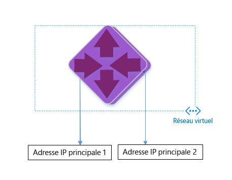
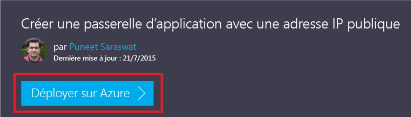
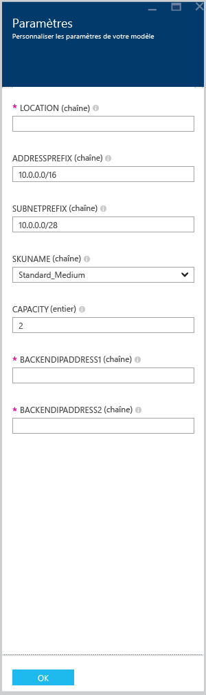

<properties 
   pageTitle="Créer une passerelle Application Gateway à l’aide des modèles Azure Resource Manager | Microsoft Azure"
   description="Cette page fournit des instructions pour la création d’une passerelle Azure Application Gateway à l’aide d’Azure Resource Manager"
   documentationCenter="na"
   services="application-gateway"
   authors="joaoma"
   manager="jdial"
   editor="tysonn"/>
<tags 
   ms.service="application-gateway"
   ms.devlang="na"
   ms.topic="hero-article" 
   ms.tgt_pltfrm="na"
   ms.workload="infrastructure-services" 
   ms.date="11/10/2015"
   ms.author="joaoma"/>

# Créer une passerelle Application Gateway à l’aide du modèle ARM

Une passerelle Application Gateway est un équilibreur de charge de couche 7. Elle assure le basculement, l’exécution des requêtes HTTP de routage des performances entre serveurs locaux ou dans le cloud. Une passerelle Application Gateway offre les fonctionnalités de livraison d’applications suivantes : équilibrage de charge HTTP, affinité de session basée sur les cookies et déchargement SSL.

> [AZURE.SELECTOR]
- [Azure Classic PowerShell](application-gateway-create-gateway.md)
- [Azure Resource Manager PowerShell](application-gateway-create-gateway-arm.md)
- [Azure Resource Manager template](application-gateway-create-gateway-arm-template.md)

 

Vous découvrirez comment télécharger et modifier un modèle ARM existant à partir de GitHub, et déployer le modèle à partir de GitHub, PowerShell et l'interface de ligne de commande Azure.

Si vous déployez simplement le modèle ARM directement à partir de GitHub, sans rien modifier, passez à la section Déployer un modèle à partir de github.

## Scénario

Dans ce scénario, vous allez créer :

- Une passerelle Application Gateway avec 2 instances.
- Un réseau virtuel nommé VirtualNetwork1 avec un bloc CIDR réservé de 10.0.0.0/16.
- Un sous-réseau appelé Appgatewaysubnet utilisant 10.0.0.0/28 comme bloc CIDR.
- L’installation de 2 adresses IP terminales précédemment configurées pour les serveurs web pour lesquels vous souhaitez équilibrer la charge du trafic. Dans cet exemple de modèle, l’adresse IP terminale utilisée sera 10.0.1.10 et 10.0.1.11.

>[AZURE.NOTE]Ce sont les paramètres de ce modèle. Vous pouvez modifier les règles, l’écouteur et le protocole SSL en ouvrant azuredeploy.json pour personnaliser le modèle.

## Télécharger et comprendre le modèle ARM

Vous pouvez télécharger le modèle ARM existant pour créer un réseau virtuel et deux sous-réseaux sur GitHub, apporter les modifications souhaitées, puis le réutiliser. Pour ce faire, procédez comme suit :

1. Accédez à https://raw.githubusercontent.com/azure/azure-quickstart-templates/master/101-create-application-gateway/.
2. Cliquez sur **azuredeploy.json**, puis sur **RAW**.
3. Enregistrez le fichier dans un dossier local sur votre ordinateur.
4. Si vous connaissez déjà les modèles ARM, passez à l’étape 7.
5. Ouvrez le fichier que vous venez d’enregistrer et consultez le contenu sous **parameters** à la ligne 5. Les paramètres de modèle ARM fournissent un espace réservé pour les valeurs à remplir lors du déploiement.

	| Paramètre | Description |
	|---|---|
	| **emplacement** | Région Azure où sera créée la passerelle Application Gateway |
	| **VirtualNetwork1** | Nom du nouveau réseau virtuel |
	| **addressPrefix** | Espace d’adressage du réseau virtuel, au format CIDR |
	| **ApplicationGatewaysubnet** | Nom du sous-réseau de la passerelle Application Gateway |
	| **subnetPrefix** | Bloc CIDR du sous-réseau de la passerelle Application Gateway |
	| **skuname** | Taille de l’instance SKU |
	| **capacité** | Nombre d'instances |
	| **backendaddress1** | Adresse IP du premier serveur web |
	| **backendaddress2** | Adresse IP du deuxième serveur web |
	

>[AZURE.IMPORTANT]Les modèles ARM de GitHub sont susceptibles d’évoluer. Vérifiez le modèle avant de l’utiliser.
	
6. Vérifiez le contenu sous **resources** et notez les éléments suivants :

	- **type**. Type de ressource créée par le modèle. Dans ce cas, **Microsoft.Network/applicationGateways**, qui représente une passerelle Application Gateway.
	- **name**. Nom de la ressource. Remarquez l’utilisation de **[parameters(’applicationGatewayName’)]**, ce qui signifie que le nom sera fourni par l’utilisateur ou par un fichier de paramètres au cours du déploiement.
	- **properties**. Liste des propriétés de la ressource. Ce modèle utilise le réseau virtuel et une adresse IP publique lors de la création de la passerelle Application Gateway.

7. Revenez à https://raw.githubusercontent.com/azure/azure-quickstart-templates/master/101-create-application-gateway/azuredeploy.json.
8. Cliquez sur **azuredeploy-paremeters.json**, puis cliquez sur **RAW**.
9. Enregistrez le fichier dans un dossier local sur votre ordinateur.
10. Ouvrez le fichier que vous venez d’enregistrer et modifiez les valeurs des paramètres. Utilisez les valeurs ci-dessous pour déployer la passerelle Application Gateway décrite dans notre scénario.

		{
		  "$schema": "http://schema.management.azure.com/schemas/2015-01-01/deploymentParameters.json#",
		{
    	"location" : {
        "value" : "West US"
    	},
    	"addressPrefix": {
        "value": "10.0.0.0/16"
    	},
    	"subnetPrefix": {
        "value": "10.0.0.0/24"
    	},
    	"skuName": {
        "value": "Standard_Small"
    	},
    	"capacity": {
        "value": 2
    	},
    	"backendIpAddress1": {
        "value": "10.0.1.10"
    	},
    	"backendIpAddress2": {
        "value": "10.0.1.11"
    	}
		}

11. Enregistrez le fichier. Vous pouvez tester le modèle Json et le modèle de paramètres à l’aide des outils de validation json en ligne comme [JSlint.com](http://www.jslint.com/)
 
## Déployer le modèle ARM à l’aide de PowerShell

1. Si vous n’avez jamais utilisé Azure PowerShell, voir [Installation et configuration d’Azure PowerShell](powershell-install-configure.md) et suivre les instructions jusqu’à la fin pour vous connecter à Azure et sélectionner votre abonnement.

### Étape 1 :

		Login-AzureRmAccount

### Étape 2 :

Vérifiez les abonnements associés au compte

		get-AzureRmSubscription 

Vous devez indiquer vos informations d’identification. 

### Étape 3 

Parmi vos abonnements Azure, choisissez celui que vous souhaitez utiliser. 

		Select-AzureRmSubscription -Subscriptionid "GUID of subscription"

### Étape 4

	
Si nécessaire, créez un groupe de ressources à l’aide de l’applet de commande `New-AzureResourceGroup`. Dans l’exemple ci-dessous, vous allez créer un groupe de ressources appelé AppgatewayRG dans l’Est des États-Unis :

	 New-AzureRmResourceGroup -Name AppgatewayRG -Location "East US"
		VERBOSE: 5:38:49 PM - Created resource group 'AppgatewayRG' in location 'eastus'

		ResourceGroupName : AppgatewayRG
		Location          : eastus
		ProvisioningState : Succeeded
		Tags              :
		Permissions       :
	                 Actions  NotActions
	                 =======  ==========
	                  *

		ResourceId        : /subscriptions/xxxxxxxxxxxxxxxxxxxxxxxxxxxxxx/resourceGroups/AppgatewayRG

4. Exécutez l’applet de commande New-AzureRmResourceGroupDeployment pour déployer le nouveau réseau virtuel à l’aide du modèle et des fichiers de paramètres que vous avez téléchargés et modifiés plus haut.

		New-AzureRmResourceGroupDeployment -Name TestAppgatewayDeployment -ResourceGroupName AppgatewayRG `
 		   -TemplateFile C:\ARM\azuredeploy.json -TemplateParameterFile C:\ARM\azuredeploy-parameters.json

La sortie générée par la ligne de commande est la suivante :

		DeploymentName    : testappgatewaydeployment
		ResourceGroupName : appgatewayRG
		ProvisioningState : Succeeded
		Timestamp         : 9/19/2015 1:49:41 AM
		Mode              : Incremental
		TemplateLink      :
		Parameters        :
                   Name             Type                       Value
                   ===============  =========================  ==========
                   location         String                     East US
                   addressPrefix    String                     10.0.0.0/16
                   subnetPrefix     String                     10.0.0.0/24
                   skuName          String                     Standard_Small
                   capacity         Int                        2
                   backendIpAddress1  String                     10.0.1.10
                   backendIpAddress2  String                     10.0.1.11
					
		Outputs           :

## Déployer le modèle ARM à l'aide de l'interface de ligne de commande Azure

Pour déployer le modèle ARM que vous avez téléchargé à l’aide de l’interface de ligne de commande Azure, suivez les étapes ci-dessous.

1. Si vous n'avez jamais utilisé l'interface de ligne de commande Azure, consultez [Installer et configurer l'interface de ligne de commande Azure](xplat-cli-install.md) et suivez les instructions jusqu'à l'étape où vous sélectionnez votre compte et votre abonnement Azure.
2. Exécutez la commande **azure config mode** pour passer en mode Resource Manager, comme illustré ci-dessous.

		azure config mode arm

Voici le résultat attendu pour la commande ci-dessus :

		info:	New mode is arm

3. Au besoin, exécutez l’applet de commande **azure group create** pour créer un groupe de ressources, comme illustré ci-dessous. Observez le résultat de la commande. La liste affichée après le résultat présente les différents paramètres utilisés. Pour plus d’informations sur les groupes de ressources, consultez [Présentation d’Azure Resource Manager](resource-group-overview.md).

		azure group create -n appgatewayRG -l eastus

**-n (ou --name)**. Nom du nouveau groupe de ressources. Pour notre scénario, *appgatewayRG*.

**-l (ou --location)**. Région Azure où le nouveau groupe de ressources sera créé. Pour notre scénario, *Eastus*.

4. Exécutez l’applet de commande **azure group deployment create** pour déployer le nouveau réseau virtuel à l’aide du modèle et des fichiers de paramètres que vous avez téléchargés et modifiés plus haut. La liste affichée après le résultat présente les différents paramètres utilisés.

		azure group deployment create -g appgatewayRG -n TestAppgatewayDeployment -f C:\ARM\azuredeploy.json -e C:\ARM\azuredeploy-parameters.json

Voici le résultat attendu pour la commande ci-dessus :

		azure group deployment create -g appgatewayRG -n TestAppgatewayDeployment -f C:\ARM\azuredeploy.json -e C:\ARM\azuredeploy-parameters.json
		info:    Executing command group deployment create
		+ Initializing template configurations and parameters
		+ Creating a deployment
		info:    Created template deployment "TestAppgatewayDeployment"
		+ Waiting for deployment to complete
		data:    DeploymentName     : TestAppgatewayDeployment
		data:    ResourceGroupName  : appgatewayRG
		data:    ProvisioningState  : Succeeded
		data:    Timestamp          : 2015-09-21T20:50:27.5129912Z
		data:    Mode               : Incremental
		data:    Name               Type    Value
		data:    -----------------  ------  --------------
		data:    location           String  East US
		data:    addressPrefix      String  10.0.0.0/16
		data:    subnetPrefix       String  10.0.0.0/24	
		data:    skuName            String  Standard_Small
		data:    capacity           Int     2
		data:    backendIpAddress1  String  10.0.1.10
		data:    backendIpAddress2  String  10.0.1.11
		info:    group deployment create command OK

**-g (ou --resource-group)**. Nom du groupe de ressources dans lequel sera créé le réseau virtuel.

**-f (ou --template-file)**. Chemin d'accès à votre fichier de modèle ARM.

**-e (ou --parameters-file)**. Chemin d'accès à votre fichier de paramètres ARM.

## Déployer le modèle ARM en cliquant pour déployer

Cliquer pour déployer est une autre manière d’utiliser les modèles ARM. C’est un moyen facile d’utiliser des modèles avec le portail Azure.

### Étape 1 
Le lien [Cliquez pour déployer la passerelle Application Gateway](https://azure.microsoft.com/documentation/templates/101-application-gateway-public-ip/) vous redirige vers la page de modèle du portail pour la passerelle Application Gateway.

### Étape 2 

Cliquez sur « Déployer dans Azure ».

### Étape 3

Remplissez les paramètres du modèle de déploiement sur le portail, puis cliquez sur OK.

### Étape 4

Sélectionnez « Mentions légales » et cliquez sur « Acheter ».

### Étape 5

Dans le volet « Déploiement personnalisé », cliquez sur « Créer ».

 
## Étapes suivantes

Si vous souhaitez configurer le déchargement SSL, consultez [Configuration de la passerelle Application Gateway pour le déchargement SSL](application-gateway-ssl.md).

Si vous souhaitez configurer une passerelle Application Gateway à utiliser avec l’équilibreur de charge interne, consultez [Création d’une passerelle Application Gateway avec un équilibrage de charge interne (ILB)](application-gateway-ilb.md).

Si vous souhaitez plus d'informations sur les options d'équilibrage de charge en général, consultez :

- [Équilibrage de charge Azure](https://azure.microsoft.com/documentation/services/load-balancer/)
- [Azure Traffic Manager](https://azure.microsoft.com/documentation/services/traffic-manager/)

<!---HONumber=AcomDC_0107_2016-->