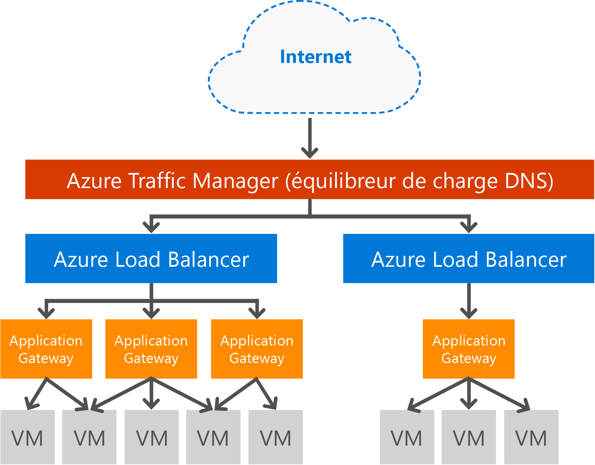

# Vue d’ensemble de la passerelle Application Gateway

## Présentation de la passerelle Application Gateway

Microsoft Azure Application Gateway intègre Application Delivery Controller (ADC) en tant que service, offrant diverses fonctionnalités d’équilibrage de charge de couche 7 pour votre application. Il permet aux clients d’optimiser la productivité de la batterie de serveurs web en déchargeant une terminaison SSL gourmande en ressources du processeur vers la passerelle Application Gateway. Il fournit également d’autres fonctionnalités de routage de couche 7, notamment la distribution en tourniquet (round robin) du trafic entrant, l’affinité de session basée sur les cookies, le routage basé sur le chemin d’accès de l’URL et la possibilité d’héberger plusieurs sites web derrière une seule passerelle Application Gateway. La passerelle Application Gateway inclut également un pare-feu d’applications web (WAF) qui protège votre application contre la plupart de 10 vulnérabilités web OWASP les plus courantes. La passerelle Application Gateway peut être configurée en tant que passerelle internet, passerelle interne uniquement ou une combinaison des deux. La passerelle Application Gateway est une solution Azure entièrement gérée, hautement évolutive et hautement disponible. Elle fournit un ensemble complet de fonctionnalités de diagnostics et de journalisation pour une meilleure gérabilité. La passerelle Application Gateway est compatible avec les machines virtuelles, les services de cloud et les applications web internes ou externes.

La passerelle Application Gateway est une appliance virtuelle dédiée pour votre application et se compose de plusieurs instances Worker, à des fins d’évolutivité et de haute disponibilité. Quand vous créez une passerelle Application Gateway, un point de terminaison (VIP public ou IP ILB interne) est associé et utilisé pour le trafic réseau en entrée. Ce point de terminaison VIP ou IP ILB est fourni par l’équilibreur de charge Azure fonctionnant au niveau du transport (TCP/UDP) et via l’équilibrage de la charge de tout le trafic réseau entrant pour les instances Worker de la passerelle Application Gateway. La passerelle Application Gateway achemine ensuite le trafic HTTP/HTTPS en fonction de sa configuration, qu’il s’agisse d’une machine virtuelle, d’un service cloud ou d’une adresse IP interne ou externe. Pour connaître le contrat SLA et les prix appliqués, consultez les pages [SLA](https://azure.microsoft.com/support/legal/sla/) et [Prix appliqués](https://azure.microsoft.com/pricing/details/application-gateway/).

## Caractéristiques

La passerelle Application Gateway prend actuellement en charge la remise d’application de couche 7 avec les fonctionnalités suivantes :

* **[Pare-feu d’applications web (version préliminaire)](application-gateway-webapplicationfirewall-overview.md)** - Le pare-feu d’applications web (WAF, Web Application Firewall) d’Azure Application Gateway protège les applications web des attaques basées sur le web courantes comme l’injection de code SQL, les attaques de script de site à site et les piratages de session.
* **Équilibrage de charge HTTP** - La passerelle Application Gateway fournit un équilibrage de charge de type tourniquet (round robin). L’équilibrage de charge s’effectue à la couche 7 et est utilisé pour le trafic HTTP(S) uniquement.
* **Affinité de session basée sur les cookies** : cette fonctionnalité est utile lorsque vous souhaitez conserver une session utilisateur sur le même serveur principal. En utilisant des cookies gérés de passerelle, la passerelle Application Gateway peut par la suite diriger le trafic pour traitement à partir d’une session utilisateur vers le même serveur principal. Cette fonctionnalité est importante lorsqu’un l’état de la session est enregistré localement sur le serveur principal pour une session utilisateur.
* **[Déchargement SSL (Secure Sockets Layer)](application-gateway-ssl-arm.md)** : cette fonctionnalité supprime la tâche coûteuse de déchiffrement du trafic HTTPS de vos serveurs web. En arrêtant la connexion SSL au niveau de la passerelle Application Gateway et en transmettant la requête non chiffrée au serveur web, ce dernier n’est plus chargé du déchiffrement.  La passerelle Application Gateway chiffre de nouveau la réponse avant de la renvoyer au client. Cette fonctionnalité est utile lorsque le serveur principal se trouve dans le même réseau virtuel sécurisé que la passerelle Application Gateway dans Azure.
* **[End to End SSL](application-gateway-backend-ssl.md)** (SSL de bout en bout) - La passerelle Application Gateway prend en charge le chiffrement de bout en bout du trafic. Pour cela, la passerelle Application Gateway arrête la connexion SSL au niveau de la passerelle d’application. La passerelle applique ensuite les règles de routage au trafic, chiffre à nouveau le paquet puis transfère le paquet au serveur principal approprié selon les règles de routage définies. Toute réponse du serveur web passe par le même processus vers l’utilisateur final.
* **[Routage du contenu en fonction de l’URL](application-gateway-url-route-overview.md)** : cette fonctionnalité offre la possibilité d’utiliser différents serveurs principaux pour plusieurs trafics. Le trafic d’un CDN ou d’un dossier sur le serveur web peut être acheminé vers un autre serveur principal, ce qui réduit la charge inutile sur les serveurs principaux qui n’ont pas besoin d’un contenu spécifique.
* **[Routage multi-sites](application-gateway-multi-site-overview.md)** : la passerelle Application Gateway permet de consolider jusqu’à 20 sites web sur une passerelle unique.
* **[Prise en charge de WebSocket](application-gateway-websocket.md)** : une autre fonctionnalité intéressante de la passerelle Application Gateway est la prise en charge native de WebSocket.
* **[Analyse du fonctionnement](application-gateway-probe-overview.md)** - la passerelle Application Gateway fournit par défaut une analyse du fonctionnement des ressources principales et intègre des sondes personnalisées pour surveiller des scénarios plus spécifiques.
* **[Diagnostics avancés](application-gateway-diagnostics.md)** - Application Gateway fournit des journaux de diagnostic et d’accès complets. Les journaux de pare-feu sont disponibles pour les ressources de passerelle d’application avec WAF activé.

## Avantages

Application Gateway est utile pour :

* Les applications pour lesquelles les requêtes provenant d’une même session utilisateur/client doivent atteindre la même machine virtuelle back-end. Exemples d’applications : panier d’achat et serveurs de messagerie.
* Les applications qui veulent libérer les batteries de serveurs web de la surcharge de terminaison SSL.
* Les applications, telles qu’un réseau de distribution de contenu, qui exigent le routage ou l’équilibrage de charge sur différents serveurs principaux des multiples requêtes HTTP sur une même connexion TCP de longue durée.
* Applications prenant en charge le trafic websocket
* Protection des applications web des attaques basées sur le web courantes comme l’injection de code SQL, les attaques de script de site à site et les piratages de session.

L’équilibrage de charge Application Gateway sous forme de service géré par Azure permet la mise en service d’un équilibreur de charge de couche 7 derrière l’équilibreur de charge logiciel Azure. Traffic Manager peut être utilisé pour conclure le scénario, comme illustré dans l’image suivante, dans lequel il fournit la redirection et la disponibilité du trafic vers plusieurs ressources de passerelle d’application dans différentes régions, tandis que la passerelle d’application offre l’équilibrage de charge de couche 7 entre régions. Vous trouverez un exemple de ce scénario dans : [Utilisation des services d’équilibrage de charge dans le cloud Azure](../traffic-manager/traffic-manager-load-balancing-azure.md)

[!INCLUDE [load-balancer-compare-tm-ag-lb-include.md](../../includes/load-balancer-compare-tm-ag-lb-include.md)]

## Instances et tailles de passerelle

Application Gateway est actuellement disponible en&3; tailles : **Petit**, **Moyen** et **Grand**. Les instances de petite taille sont conçues pour les scénarios de développement et de test.

Il existe actuellement deux références SKU de passerelle Application Gateway : **WAF** et **Standard**.

Vous pouvez créer jusqu’à 50 passerelles d’application par abonnement et chacune peut contenir jusqu’à 10 instances. Chaque passerelle Application Gateway peut contenir 20 écouteurs HTTP. Pour obtenir la liste complète des limites de la passerelle Application Gateway, consultez la page [Application Gateway limits](../azure-subscription-service-limits.md?toc=%2fazure%2fapplication-gateway%2ftoc.json#application-gateway-limits) (Limites de la passerelle Application Gateway).

Le tableau suivant présente un débit moyen de performances pour chaque instance d’application Gateway avec le déchargement SSL activé :

| Réponse de la page principale | Petite | Moyenne | Grande |
| --- | --- | --- | --- |
| 6K |7,5 Mbits/s |13 Mbits/s |50 Mbits/s |
| 100K |35 Mbits/s |100 Mbits/s |200 Mbits/s |

> [!NOTE]
> Ces valeurs sont des valeurs approximatives pour un débit de passerelle d’application. Le débit réel dépend de divers détails d’environnement, tels que la taille de page moyenne, l’emplacement des instances de serveur principal et le temps de traitement d’une page par le serveur. Pour des calculs de performance exacts, vous devez exécuter vos propres tests. Ces valeurs sont fournies uniquement pour vous donner des conseils de planification de la capacité.

## Surveillance de l’intégrité

Azure Application Gateway surveille automatiquement l’intégrité des instances de serveur principal par le biais de sondes d’intégrité de base ou personnalisées. L’utilisation de sondes d’intégrité permet de s’assurer que seuls des hôtes intègres répondent au trafic. Pour plus d’informations, consultez [Vue d’ensemble de l’analyse d’intégrité Application Gateway](application-gateway-probe-overview.md).

## Configuration et gestion

Le point de terminaison de la passerelle Application Gateway peut être une adresse IP publique, une adresse IP privée ou les deux. La passerelle Application Gateway est configurée à l’intérieur d’un réseau virtuel dans son propre sous-réseau. Le sous-réseau créé ou utilisé pour la passerelle Application Gateway ne peut pas contenir d’autres types de ressources. Les seules ressources autorisées dans le sous-réseau sont d’autres passerelles Application Gateway. Pour sécuriser vos ressources principales, les serveurs principaux peuvent figurer dans un sous-réseau différent sur le même réseau virtuel que la passerelle d’application. Ce sous-réseau supplémentaire n’est pas requis pour les applications principales car, tant que la passerelle d’application peut atteindre l’adresse IP, elle peut fournir des fonctionnalités ADC pour les serveurs principaux.

Vous pouvez créer et gérer une passerelle Application Gateway à l’aide des API REST, des applets de commande PowerShell, de la ligne de commande Azure ou du [portail Azure](https://portal.azure.com/).

## Étapes suivantes

À présent que vous êtes familiarisé avec Application Gateway, vous pouvez [créer une passerelle d’application Application Gateway](application-gateway-create-gateway-portal.md) ou [créer une passerelle Application Gateway pour le déchargement SSL](application-gateway-ssl-arm.md) de manière à équilibrer les charges des connexions HTTPS.

Pour savoir comment créer une passerelle d’application avec le routage de contenu basé sur une URL, consultez [Créer une passerelle d’application à l’aide du routage en fonction de l’URL](application-gateway-create-url-route-arm-ps.md) .

