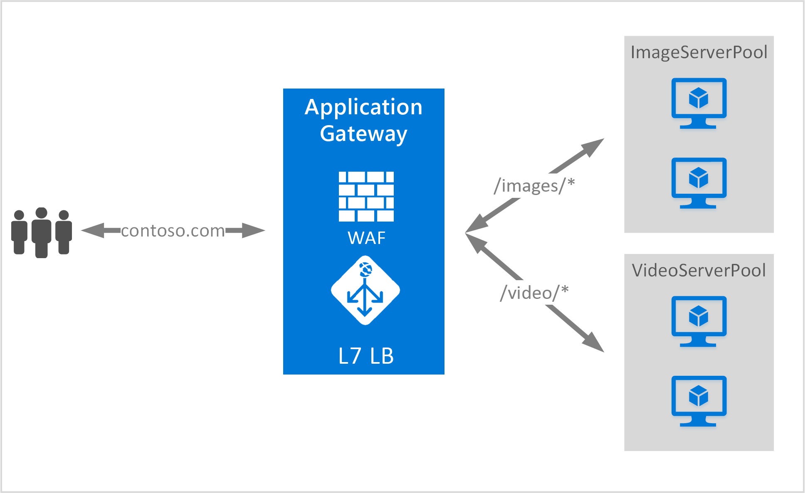

<properties
   pageTitle="Présentation du routage de contenu basé sur URL | Microsoft Azure"
   description="Cette page fournit une présentation du routage de contenu basé sur l’URL Application Gateway, de la configuration de l’élément UrlPathMap et de la règle PathBasedRouting."
   documentationCenter="na"
   services="application-gateway"
   authors="georgewallace"
   manager="carmonm"
   editor="tysonn"/>
<tags
   ms.service="application-gateway"
   ms.devlang="na"
   ms.topic="article"
   ms.tgt_pltfrm="na"
   ms.workload="infrastructure-services"
   ms.date="08/18/2016"
   ms.author="gwallace"/>

# Présentation du routage basé sur le chemin d’accès de l’URL

Le routage basé sur le chemin d’accès de l’URL vous permet d’acheminer le trafic vers des pools de serveurs principaux en fonction des chemins d’accès de l’URL de la demande. L’un des scénarios consiste à acheminer les demandes pour différents types de contenu vers des pools de serveurs principaux différents. Dans l’exemple suivant, Application Gateway achemine le trafic pour contoso.com à partir de trois pools de serveurs principaux, par exemple : VideoServerPool, ImageServerPool et DefaultServerPool.

Les demandes adressées à http://contoso.com/video* sont acheminées vers VideoServerPool et les demandes adressées à http://contoso.com/images* sont acheminées vers ImageServerPool. DefaultServerPool est sélectionné si aucun des modèles de chemin d’accès ne correspond.

## Élément de configuration UrlPathMap

L’élément UrlPathMap est utilisé pour spécifier les modèles de chemin d’accès vers les mappages de pools de serveurs principaux. Ci-dessous, voici l’extrait de l’élément urlPathMap provenant du fichier de modèle.

	"urlPathMaps": [
	{
    "name": "<urlPathMapName>",
    "id": "/subscriptions/<subscriptionId>/../microsoft.network/applicationGateways/<gatewayName>/ urlPathMaps/<urlPathMapName>",
    "properties": {
        "defaultBackendAddressPool": {
            "id": "/subscriptions/<subscriptionId>/../microsoft.network/applicationGateways/<gatewayName>/backendAddressPools/<poolName>"
        },
        "defaultBackendHttpSettings": {
            "id": "/subscriptions/<subscriptionId>/../microsoft.network/applicationGateways/<gatewayName>/backendHttpSettingsList/<settingsName>"
        },
        "pathRules": [
            {
                "paths": [
                    <pathPattern>
                ],
                "backendAddressPool": {
                    "id": "/subscriptions/<subscriptionId>/../microsoft.network/applicationGateways/<gatewayName>/backendAddressPools/<poolName2>"
                },
                "backendHttpsettings": {
                    "id": "/subscriptions/<subscriptionId>/../microsoft.network/applicationGateways/<gatewayName>/backendHttpsettingsList/<settingsName2>"
                },

            },

        ],

    }
	}
	

>[AZURE.NOTE] PathPattern : ce paramètre est une liste de modèles de chemin d’accès à utiliser pour la correspondance. Chaque modèle doit commencer par le signe « * » et le seul endroit où un astérisque * est autorisé est à la fin après un signe « / ». La chaîne transmise à l’outil de correspondance de chemin d’accès n’inclut pas de texte après le premier signe ? ou #. De plus, ces caractères ne sont pas autorisés ici.

Pour plus d’informations, vous pouvez consulter un [modèle Resource Manager utilisant le routage basé sur URL](https://azure.microsoft.com/documentation/templates/201-application-gateway-url-path-based-routing).

## Règle PathBasedRouting

La règle RequestRoutingRule de type PathBasedRouting est utilisée pour lier un écouteur à un élément urlPathMap. Toutes les demandes qui sont reçues par cet écouteur sont acheminées en fonction de la stratégie spécifiée dans l’élément urlPathMap. Exemple de la règle PathBasedRouting :

	"requestRoutingRules": [
  	{

    "name": "<ruleName>",
    "id": "/subscriptions/<subscriptionId>/../microsoft.network/applicationGateways/<gatewayName>/requestRoutingRules/<ruleName>",
    "properties": {
        "ruleType": "PathBasedRouting",
        "httpListener": {
            "id": "/subscriptions/<subscriptionId>/../microsoft.network/applicationGateways/<gatewayName>/httpListeners/<listenerName>"
        },
        "urlPathMap": {
            "id": "/subscriptions/<subscriptionId>/../microsoft.network/applicationGateways/<gatewayName>/ urlPathMaps/<urlPathMapName>"
        },

    }
	
## Étapes suivantes 

Après vous être familiarisé avec le routage de contenu basé sur URL, accédez à la section [Créer une passerelle d’application à l’aide du routage basé sur URL](application-gateway-create-url-route-portal.md) pour créer une passerelle d’application avec les règles de routage URL.

<!---HONumber=AcomDC_0824_2016-->