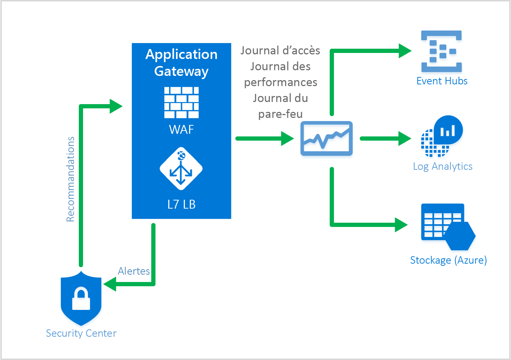

# <a name="web-application-firewall-waf"></a>Pare-feu d’applications web (WAF)

Le pare-feu d’applications Web (WAF) est une fonctionnalité de passerelle d’application qui protège vos applications web de manière centralisée contre les vulnérabilités et exploits courants. 

Le pare-feu d’applications web suit les règles des [Ensembles de règles de base OWASP](https://www.owasp.org/index.php/Category:OWASP_ModSecurity_Core_Rule_Set_Project) 3.0 ou 2.2.9. Les applications Web sont de plus en plus la cible d’attaques malveillantes qui exploitent des vulnérabilités connues. Les types d’attaques les plus courantes sont l’injection de code SQL, les attaques de script site à site, entre autres. Empêcher ces attaques dans le code d’application peut se révéler difficile et nécessiter une maintenance rigoureuse, des mises à jour correctives ainsi que la surveillance au niveau de plusieurs couches de la topologie de l’application. Un pare-feu d’applications web centralisé facilite grandement la gestion de la sécurité et offre une meilleure garantie de protection aux administrateurs de l’application contre les menaces ou les intrusions. Une solution WAF peut également réagir plus rapidement à une menace de sécurité en exécutant la mise à jour corrective d’une vulnérabilité connue dans un emplacement central plutôt que de sécuriser individuellement chacune des applications web. Les passerelles d’application existantes peuvent être facilement converties en une passerelle d’application avec un pare-feu d’applications web.


Application Gateway fonctionne comme un Application Delivery Controller (ADC) et offre une terminaison SSL, une affinité de session basée sur les cookies, une distribution de charge par tourniquet (round robin), un routage basé sur le contenu, la possibilité d’héberger plusieurs sites web et des améliorations de sécurité. Les améliorations de sécurité offertes par la passerelle Application Gateway incluent la gestion des stratégies SSL ainsi que prise en charge du chiffrement SSL de bout en bout. La sécurité de l’application est désormais renforcée par l’intégration directe du pare-feu d’applications web (WAF) à l’offre ADC. Vous bénéficiez ainsi d’un emplacement central facile à configurer, capable de gérer et protéger vos applications web contre les vulnérabilités web courantes.

## <a name="benefits"></a>Avantages

Voici les principaux avantages liés à Application Gateway et au pare-feu d’applications web :

### <a name="protection"></a>Protection

* Protection de votre application web contre les vulnérabilités et les attaques web sans modification du code principal.

* Protection simultanée de plusieurs applications web derrière une passerelle d’application. La passerelle d’application peut héberger jusqu’à 20 sites web derrière une passerelle unique, protégeant ainsi tous ces sites contre les attaques web avec le pare-feu d’applications web.

### <a name="monitoring"></a>Surveillance

* Analysez les attaques contre votre application web à l’aide d’un journal WAF en temps réel. Ce journal est intégré à [Azure Monitor](../monitoring-and-diagnostics/monitoring-overview.md) pour effectuer le suivi des journaux et alertes WAF et analyser facilement les tendances.

* WAF sera bientôt intégré à Azure Security Center. Azure Security Center vous offre un aperçu central de l’état de sécurité de toutes vos ressources Azure.

### <a name="customization"></a>Personnalisation

* Possibilité de personnaliser des règles et groupes de règles WAF pour les besoins de votre application et éliminer les faux positifs.

## <a name="features"></a>Caractéristiques

Le pare-feu d’applications web est préconfiguré avec CRS 3.0 par défaut. Vous pouvez aussi d’utiliser la version 2.2.9. CRS 3.0 permet une réduction des faux positifs au-delà de la version 2.2.9. Il est possible de [personnaliser des règles en fonction de vos besoins](application-gateway-customize-waf-rules-portal.md). Le pare-feu d’applications web protège notamment des vulnérabilités web courantes suivantes :

* Protection contre les injections de code SQL
* Protection de l’exécution de script de site à site
* Protection contre les attaques web courante comme l’injection de commande, les dissimulations de requêtes HTTP, la séparation de réponse HTTP et les attaques RFI (Remote File Inclusion)
* Protection contre les violations de protocole HTTP
* Protection contre les anomalies de protocole HTTP comme un agent-utilisateur hôte manquant et les en-têtes Accept
* Protection contre les robots, les crawlers et les scanneurs
* Détection des erreurs de configuration d’application courantes (par exemple, Apache, IIS, etc.)

Pour une liste plus détaillée des règles et de leurs protections, consultez les [ensembles de règles de base](#core-rule-sets).

### <a name="core-rule-sets"></a>Ensembles de règles de base

Application Gateway prend en charge les ensembles de règles CRS 3.0 et CRS 2.2.9. Ces ensembles de règles de base sont des ensembles de règles qui protègent vos applications web des activités malveillantes.

#### <a name="owasp30"></a>OWASP_3.0

L’ensemble de règles de base 3.0 fourni dispose de 13 groupes de règles comme indiqué dans le tableau suivant. Chacun de ces groupes de règles contient plusieurs règles, qui peuvent être désactivées.

|RuleGroup|Description|
|---|---|
|**[REQUEST-910-IP-REPUTATION](application-gateway-crs-rulegroups-rules.md#crs910)**|Contient des règles de protection contre les expéditeurs de courrier indésirable ou les activités malveillantes connues.|
|**[REQUEST-911-METHOD-ENFORCEMENT](application-gateway-crs-rulegroups-rules.md#crs911)**|Contient des règles de verrouillage des méthodes (PUT, PATCH< ..)|
|**[REQUEST-912-DOS-PROTECTION](application-gateway-crs-rulegroups-rules.md#crs912)**| Contient des règles de protection contre les attaques par déni de service (DoS).|
|**[REQUEST-913-SCANNER-DETECTION](application-gateway-crs-rulegroups-rules.md#crs913)**| Contient des règles de protection contre les scanneurs de port et d’environnement.|
|**[REQUEST-920-PROTOCOL-ENFORCEMENT](application-gateway-crs-rulegroups-rules.md#crs920)**|Contient des règles de protection contre les problèmes de protocole et d’encodage.|
|**[REQUEST-921-PROTOCOL-ATTACK](application-gateway-crs-rulegroups-rules.md#crs921)**|Contient des règles de protection contre les attaques par injection d’en-tête, dissimulation de requête et fractionnement de réponse|
|**[REQUEST-930-APPLICATION-ATTACK-LFI](application-gateway-crs-rulegroups-rules.md#crs930)**|Contient des règles de protection contre les attaques par fichier et chemin d’accès.|
|**[REQUEST-931-APPLICATION-ATTACK-RFI](application-gateway-crs-rulegroups-rules.md#crs931)**|Contient des règles de protection contre les attaques par inclusion de fichier distant (RFI)|
|**[REQUEST-932-APPLICATION-ATTACK-RCE](application-gateway-crs-rulegroups-rules.md#crs932)**|Contient des règles de protection contre les attaques par exécution de code à distance.|
|**[REQUEST-933-APPLICATION-ATTACK-PHP](application-gateway-crs-rulegroups-rules.md#crs933)**|Contient des règles de protection contre les attaques par injection de code PHP.|
|**[REQUEST-941-APPLICATION-ATTACK-XSS](application-gateway-crs-rulegroups-rules.md#crs941)**|Contient des règles de protection de l’exécution de script de site à site.|
|**[REQUEST-942-APPLICATION-ATTACK-SQLI](application-gateway-crs-rulegroups-rules.md#crs942)**|Contient des règles de protection contre les attaques par injection de code SQL.|
|**[REQUEST-943-APPLICATION-ATTACK-SESSION-FIXATION](application-gateway-crs-rulegroups-rules.md#crs943)**|Contient des règles de protection contre les attaques par fixation de session.|

#### <a name="owasp229"></a>OWASP_2.2.9

L’ensemble de règles de base 2.2.9 fourni dispose de 10 groupes de règles comme indiqué dans le tableau suivant. Chacun de ces groupes de règles contient plusieurs règles, qui peuvent être désactivées.

|RuleGroup|Description|
|---|---|
|**[crs_20_protocol_violations](application-gateway-crs-rulegroups-rules.md#crs20)**|Contient des règles de protection contre les violations de protocole (caractères non valides, GET avec un corps de requête, etc..)|
|**[crs_21_protocol_anomalies](application-gateway-crs-rulegroups-rules.md#crs21)**|Contient des règles de protection contre les informations d’en-tête incorrectes.|
|**[crs_23_request_limits](application-gateway-crs-rulegroups-rules.md#crs23)**|Contient des règles de protection contre les arguments ou les fichiers qui dépassent les limites.|
|**[crs_30_http_policy](application-gateway-crs-rulegroups-rules.md#crs30)**|Contient des règles de protection contre les types de fichiers, les en-têtes et les méthodes restreints. |
|**[crs_35_bad_robots](application-gateway-crs-rulegroups-rules.md#crs35)**|Contient des règles de protection contre les analyseurs et les scanneurs de sites web.|
|**[crs_40_generic_attacks](application-gateway-crs-rulegroups-rules.md#crs40)**|Contient des règles de protection contre les attaques génériques (par fixation de session, inclusion de fichier distant, injection de code PHP etc.).|
|**[crs_41_sql_injection_attacks](application-gateway-crs-rulegroups-rules.md#crs41sql)**|Contient des règles de protection contre les attaques par injection de code SQL.|
|**[crs_41_xss_attacks](application-gateway-crs-rulegroups-rules.md#crs41xss)**|Contient des règles de protection de l’exécution de script de site à site.|
|**[crs_42_tight_security](application-gateway-crs-rulegroups-rules.md#crs42)**|Contient une règle de protection contre les attaques par traversée de chemin|
|**[crs_45_trojans](application-gateway-crs-rulegroups-rules.md#crs45)**|Contient des règles de protection contre les chevaux de Troie.|

### <a name="waf-modes"></a>Modes WAF

Application Gateway WAF peut être configuré pour s’exécuter dans les deux modes suivants :

* **Mode de détection** – Lorsqu’il est configuré pour s’exécuter en mode de détection, Application Gateway WAF surveille et consigne toutes les alertes de menaces dans un fichier journal. L’enregistrement des diagnostics pour la passerelle Application Gateway doit être activé à l’aide de la section **Diagnostics**. Vous devez également vérifier que le journal WAF est sélectionné et activé. Le pare-feu d’applications web exécuté en mode de détection ne bloque pas les requêtes entrantes.
* **Mode de prévention** – Lorsqu’il est configuré pour s’exécuter en mode de prévention, la passerelle Application Gateway bloque de façon active les intrusions et les et attaques détectées par les règles définies. L’attaquant reçoit une exception d’accès non autorisé de type 403 et la connexion prend fin. Le mode de prévention continue de consigner ce type d’attaques dans les journaux WAF.

### <a name="application-gateway-waf-reports"></a>Surveillance du pare-feu d’applications web

Il est important de surveiller l’état de votre passerelle d’application. La journalisation et l’intégration à Azure Monitor, Azure Security Center (à venir), et Log Analytics permet de surveiller l’état de votre pare-feu d’applications web et des applications qu’il protège.



#### <a name="azure-monitor"></a>Azure Monitor

Chaque journal de passerelle d’application est intégré à [Azure Monitor](../monitoring-and-diagnostics/monitoring-overview.md).  Cela vous permet d’effectuer le suivi des informations de diagnostic, y compris des alertes et des journaux WAF.  Cette fonctionnalité est proposée dans la ressource Application Gateway sous l’onglet **Diagnostics** du portail ou directement via le service Azure Monitor. Pour en savoir plus sur l’activation des journaux de diagnostic pour la passerelle d’application, rendez-vous sur la page [Diagnostics Application Gateway](application-gateway-diagnostics.md)

#### <a name="azure-security-center"></a>Centre de sécurité Azure

[Azure Security Center](../security-center/security-center-intro.md) vous aide à prévenir, détecter et résoudre les menaces grâce à une visibilité et un contrôle accrus de la sécurité de vos ressources Azure. Désormais, Application Gateway [s’intègre à Azure Security Center](application-gateway-integration-security-center.md). Le service Azure Security Center analyse votre environnement pour détecter les applications web non protégées. Il peut à présent recommander à Application Gateway WAF de protéger ces ressources vulnérables. Vous pouvez créer des instances Application Gateway WAF directement à partir d’Azure Security Center.  Ces instances WAF sont intégrées à Azure Security Center et renverront des alertes et des informations d’intégrité à Azure Security Center à des fins de création de rapports.


#### <a name="logging"></a>Journalisation

Application Gateway WAF fournit des rapports détaillés sur chaque menace détectée. La journalisation est intégrée aux journaux Azure Diagnostics et les alertes sont enregistrées au format json. Ces journaux peuvent être intégrés à [Log Analytics](../log-analytics/log-analytics-azure-networking-analytics.md).


```json
{
  "resourceId": "/SUBSCRIPTIONS/{subscriptionId}/RESOURCEGROUPS/{resourceGroupId}/PROVIDERS/MICROSOFT.NETWORK/APPLICATIONGATEWAYS/{appGatewayName}",
  "operationName": "ApplicationGatewayFirewall",
  "time": "2017-03-20T15:52:09.1494499Z",
  "category": "ApplicationGatewayFirewallLog",
  "properties": {
    "instanceId": "ApplicationGatewayRole_IN_0",
    "clientIp": "104.210.252.3",
    "clientPort": "4835",
    "requestUri": "/?a=%3Cscript%3Ealert(%22Hello%22);%3C/script%3E",
    "ruleSetType": "OWASP",
    "ruleSetVersion": "3.0",
    "ruleId": "941320",
    "message": "Possible XSS Attack Detected - HTML Tag Handler",
    "action": "Blocked",
    "site": "Global",
    "details": {
      "message": "Warning. Pattern match \"<(a|abbr|acronym|address|applet|area|audioscope|b|base|basefront|bdo|bgsound|big|blackface|blink|blockquote|body|bq|br|button|caption|center|cite|code|col|colgroup|comment|dd|del|dfn|dir|div|dl|dt|em|embed|fieldset|fn|font|form|frame|frameset|h1|head|h ...\" at ARGS:a.",
      "data": "Matched Data: <script> found within ARGS:a: <script>alert(\\x22hello\\x22);</script>",
      "file": "rules/REQUEST-941-APPLICATION-ATTACK-XSS.conf",
      "line": "865"
    }
  }
} 

```

## <a name="application-gateway-waf-sku-pricing"></a>Tarification de la référence SKU Application Gateway WAF

Le pare-feu d’applications web est disponible sous une nouvelle référence WAF. Cette référence est disponible uniquement dans le modèle d’approvisionnement Azure Resource Manager et non sous le modèle de déploiement classique. Par ailleurs, la référence WAF est proposée uniquement dans les instances de passerelle d’application de moyenne et grande taille. Toutes les limites relatives à la passerelle d’application s’appliquent également à la référence WAF. La tarification est basée sur les frais d’instance de passerelle par heure et les frais de traitement des données. La tarification par heure de la passerelle pour la référence WAF diffère des frais de référence Standard et est accessible sur [Détails de tarification Application Gateway](https://azure.microsoft.com/pricing/details/application-gateway/). Les frais de traitement des données restent inchangés. Il n’existe aucun frais par règle ou groupe de règles. Vous pouvez protéger plusieurs applications web derrière le même pare-feu d’applications web sans frais supplémentaires pour la prise en charge de plusieurs applications. 

La facturation relative au pare-feu d’applications web démarre à compter du 5/5/2017. Jusque-là les passerelles de référence SKU WAF sont facturées au tarif standard.

## <a name="next-steps"></a>Étapes suivantes

Après avoir découvert les fonctionnalités de WAF, consultez la rubrique sur la [configuration du pare-feu d’applications web sur la passerelle Application Gateway](application-gateway-web-application-firewall-portal.md).

