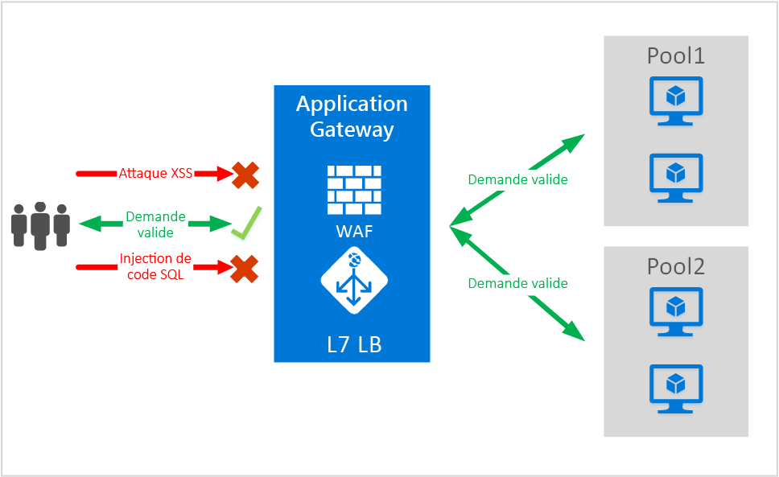
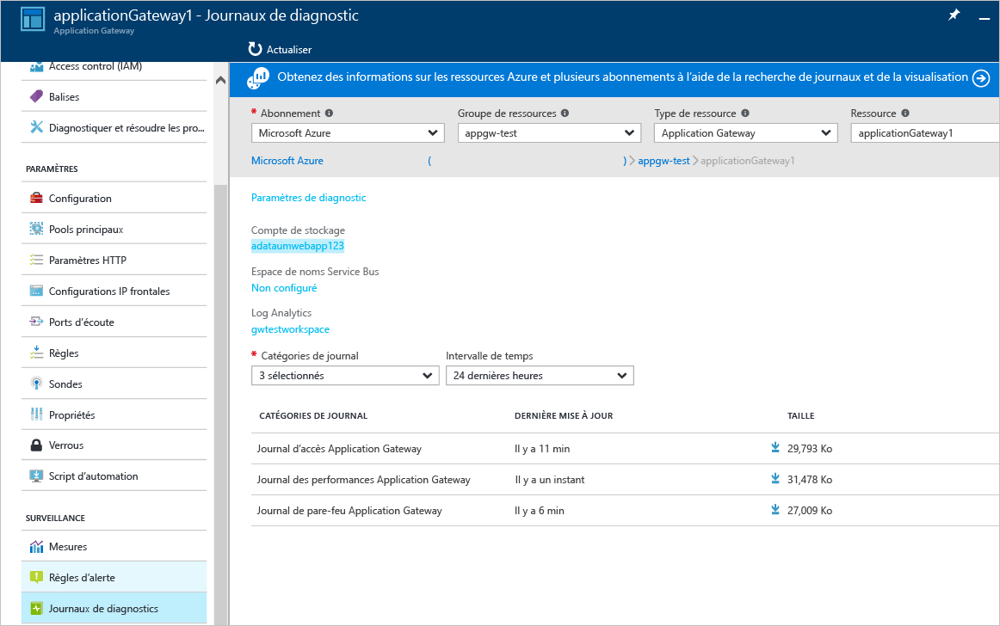

# <a name="application-gateway-web-application-firewall-preview"></a>Pare-feu d’applications web sur Application Gateway (version préliminaire)

Le pare-feu d’applications web (WAF) est une fonction de passerelle d’application azure qui offre une protection pour les applications web qui utilisent la passerelle d’application pour les fonctions de contrôle de remise d’application (ADC) standard. Le pare-feu d’applications web le fait en les protégeant contre la plupart des 10 plus courantes vulnérabilités web de l’OWASP. Les applications Web sont de plus en plus la cible d’attaques malveillantes qui exploitent des vulnérabilités connues. Les types d’attaques les plus courantes sont l’injection de code SQL, les attaques de script site à site, entre autres. Empêcher ces attaques dans le code d’application peut se révéler difficile et nécessiter une maintenance rigoureuse, des mises à jour correctives ainsi que la surveillance au niveau de plusieurs couches de la topologie de l’application. Un pare-feu d’applications web centralisé pour protéger contre les attaques web facilite grandement la gestion de la sécurité et offre une meilleure garantie de protection de l’application contre les menaces d’intrusion. Une solution WAF peut également réagir plus rapidement à une menace de sécurité en exécutant la mise à jour corrective d’une vulnérabilité connue dans un emplacement central plutôt que de sécuriser individuellement chacune des applications web. Les passerelles d’application existantes peuvent être facilement converties en une passerelle d’application avec un pare-feu d’applications web.



Application Gateway fonctionne comme un Application Delivery Controller (ADC) et offre une terminaison SSL, une affinité de session basée sur les cookies, une distribution de charge par tourniquet (round robin), un routage basé sur le contenu, la possibilité d’héberger plusieurs sites web et des améliorations de sécurité. Les améliorations de sécurité offertes par la passerelle Application Gateway incluent la gestion des stratégies SSL ainsi que prise en charge du chiffrement SSL de bout en bout. Nous renforçons les fonctions de sécurité d’application de notre service en intégrant le système WAF (pare-feu d’applications web) directement dans l’ADC. Vous bénéficiez ainsi d’un emplacement central facile à configurer, capable de gérer et protéger vos applications web contre les vulnérabilités web courantes.

La configuration WAF au niveau de la passerelle d’application vous offre plusieurs avantages :

* Protection de votre application web contre les vulnérabilités et les attaques web sans modification du code principal.
* Protection simultanée de plusieurs applications web derrière une passerelle d’application. La passerelle d’application peut héberger jusqu’à 20 sites web derrière une passerelle unique, protégeant ainsi tous ces sites contre les attaques web.
* Surveillance de votre application web contre les attaques à l’aide de rapports en temps réel générées par les journaux WAF de la passerelle d’application.
* Certains contrôles de conformité nécessitent que tous les points de terminaison qui accèdent à Internet soient protégés par une solution WAF. En utilisant une passerelle d’application avec WAF activé, vous pouvez remplir ces exigences de conformité.

## <a name="overview"></a>Vue d'ensemble

La fonctionnalité Application Gateway WAF, fournie dans une nouvelle référence SKU (référence SKU WAF), est préconfigurée avec l’ensemble de règles ModSecurity et OWASP pour offrir une protection de base contre la plupart des 10 vulnérabilités web OWASP les plus courantes.

* Protection contre les injections de code SQL
* Protection de l’exécution de script de site à site
* Protection contre les attaques web courante comme l’injection de commande, les dissimulations de requêtes HTTP, la séparation de réponse HTTP et les attaques RFI (Remote File Inclusion)
* Protection contre les violations de protocole HTTP
* Protection contre les anomalies de protocole HTTP comme un agent-utilisateur hôte manquant et les en-têtes Accept
* Protection contre les robots, les crawlers et les scanneurs
* Détection des erreurs de configuration d’application courantes (par exemple, Apache, IIS, etc.)

## <a name="waf-modes"></a>Modes WAF

Application Gateway WAF peut être configuré pour s’exécuter dans les deux modes suivants :

* **Mode de détection** – Lorsqu’il est configuré pour s’exécuter en mode de détection, Application Gateway WAF surveille et consigne toutes les alertes de menaces dans un fichier journal. Vous devez vous assurer que l’enregistrement des diagnostics pour la passerelle Application Gateway est activé dans la section Diagnostics. Vous devez également vérifier que le journal WAF est sélectionné et activé.
* **Mode de prévention** – Lorsqu’il est configuré pour s’exécuter en mode de prévention, la passerelle Application Gateway bloque de façon active les intrusions et les et attaques détectées par les règles définies. L’attaquant reçoit une exception d’accès non autorisé de type 403 et la connexion prend fin. Le mode de prévention continue de consigner ce type d’attaques dans les journaux WAF.

## <a name="application-gateway-waf-reports"></a>Rapports Application Gateway WAF

Application Gateway WAF fournit des rapports détaillés sur chaque menace détectée. La journalisation est intégrée aux journaux Azure Diagnostics et les alertes sont enregistrées au format json.



```json
{
    "resourceId": "/SUBSCRIPTIONS/<subscriptionId>/RESOURCEGROUPS/<resourceGroupName>/PROVIDERS/MICROSOFT.NETWORK/APPLICATIONGATEWAYS/<applicationGatewayName>",
    "operationName": "ApplicationGatewayFirewall",
    "time": "2016-09-20T00:40:04.9138513Z",
    "category": "ApplicationGatewayFirewallLog",
    "properties":     {
        "instanceId":"ApplicationGatewayRole_IN_0",
        "clientIp":"108.41.16.164",
        "clientPort":1815,
        "requestUri":"/wavsep/active/RXSS-Detection-Evaluation-POST/",
        "ruleId":"OWASP_973336",
        "message":"XSS Filter - Category 1: Script Tag Vector",
        "action":"Logged",
        "site":"Global",
        "message":"XSS Filter - Category 1: Script Tag Vector",
        "details":{"message":" Warning. Pattern match "(?i)(<script","file":"/owasp_crs/base_rules/modsecurity_crs_41_xss_attacks.conf","line":"14"}}
}
```

## <a name="application-gateway-waf-sku-pricing"></a>Tarification de la référence SKU Application Gateway WAF

La version préliminaire n’engendre aucun frais supplémentaire pour l’utilisation d’Application Gateway WAF. Vous continuez à être facturé pour les frais SKU de base existants. Nous vous communiquerons les frais WAF de la référence SKU lors de la mise à la disposition générale. Les clients qui ont choisi de déployer Application Gateway dans la référence SKU WAF commenceront à payer les frais de la référence SKU WAF uniquement après l’annonce de la mise à la disposition générale.

## <a name="next-steps"></a>Étapes suivantes

Après avoir découvert les fonctionnalités de WAF, consultez la section [Configuration du pare-feu d’applications web sur la passerelle Application Gateway](application-gateway-web-application-firewall-portal.md).


<!--HONumber=Nov16_HO3-->


