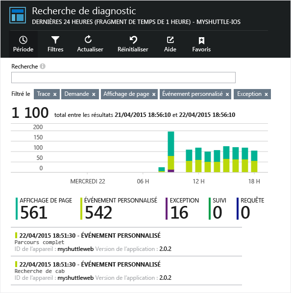
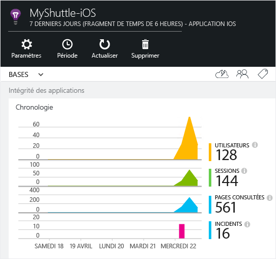
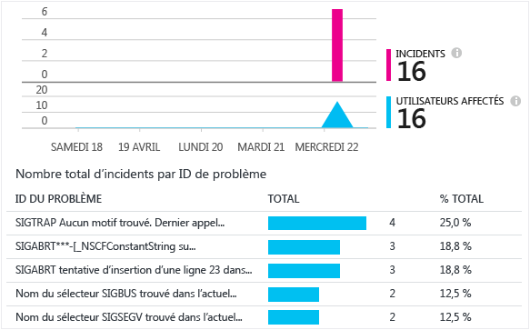

<properties
    pageTitle="Application Insights pour les applications Android | Microsoft Azure"
	description="Analysez l'utilisation et les performances de votre application Android avec Application Insights."
	services="application-insights"
	documentationCenter="android"
	authors="alancameronwills"
	manager="ronmart"/>

<tags
    ms.service="application-insights"
	ms.workload="mobile"
	ms.tgt_pltfrm="mobile-android"
	ms.devlang="na"
	ms.topic="get-started-article"
	ms.date="04/28/2015"
	ms.author="awills"/>

# Application Insights pour les applications Android

Visual Studio Application Insights vous permet d'analyser l’utilisation, les événements et les incidents de votre application mobile.

## Configuration requise

Vous devez avoir :

* Un abonnement à [Microsoft Azure](http://azure.com). Vous vous connectez avec un compte Microsoft, que vous pouvez avoir pour Windows, XBox Live ou d'autres services cloud de Microsoft.
* Android Studio
* Version 9.0 ou ultérieure du Kit de développement logiciel (SDK) Android.

## Création d’une ressource Application Insights dans Azure

Dans le [portail Azure][portal], créez une ressource Application Insights. Choisissez l'option Android.


Dans le panneau qui s’ouvre, vous trouverez des données relatives à l’utilisation et aux performances de votre application. Vous devriez trouver une vignette sur l'écran d'accueil pour accéder à ces informations, la prochaine fois que vous vous connecterez à Azure. Sinon, cliquez sur Parcourir.

## Installez le plug-in Application Insights dans Android Studio

(Si vous ne l’avez pas encore fait.)

1.  Démarrez Studio Android et configurez les plug-ins.

    

2.  Sélectionnez et installez le plug-in Application Insights Android Studio.

    

## <a name="sdk"></a>Installation du Kit de développement logiciel (SDK) dans votre application


1.  Sélectionnez **Outils** > **Intégrer le Kit de développement logiciel (SDK) Application Insights**.

    

3.  Créez un composant de votre abonnement

    

    Utilisez la clé d'instrumentation que vous avez obtenue de votre ressource Application Insights.

4.  Synchronisez Gradle pour télécharger le Kit de développement logiciel (SDK) et l’intégrer à votre projet

    

    (Des informations supplémentaires sont disponibles sur la [page d’utilisation](http://go.microsoft.com/fwlink/?LinkID=533220).)

À ce stade, la référence suivante a été ajoutée aux modules build.gradle, et des autorisations pour `INTERNET` et `ACCESS_NETWORK_STATE`, ainsi qu’une balise de métadonnées contenant la clé d'instrumentation du composant ont été ajoutées aux `AndroidManifest.xml` des modules

```java

    dependencies {
    compile 'com.microsoft.azure:applicationinsights-android:+'
    }
```

```xml

    <manifest>
    <uses-permission android:name="android.permission.INTERNET" />
    <uses-permission android:name="android.permission.ACCESS_NETWORK_STATE" />

    <application>
        <meta-data
            android:name="com.microsoft.applicationinsights.instrumentationKey"
            android:value="${AI_INSTRUMENTATION_KEY}" />
    </application>
    </manifest>
```

#### Facultatif : configurez la clé d'instrumentation dans le code

Il est également possible de configurer la clé d'instrumentation dans le code. Elle remplacera celle qui a été configurée dans `AndroidManifest.xml`

```java

    ApplicationInsights.setup(this, "<YOUR-IKEY-GOES-HERE>");
    ApplicationInsights.start();
```


## Utilisez le Kit de développement logiciel (SDK)

Initialisez le Kit de développement logiciel et lancez le suivi télémétrique.

Ajoutez l’importation suivante à votre activité racine d’applications :

```java

     import com.microsoft.applicationinsights.library.ApplicationInsights;
```

Et ajoutez la ligne suivante au rappel `onCreate` de l’activité :

```java

    ApplicationInsights.setup(this.getApplicationContext(), this.getApplication());
    ApplicationInsights.start();
```

Dès lors que `ApplicationInsights.start()` est appelé, le Kit de développement logiciel (SDK) démarre l’activité de suivi du cycle de vie Android et les exceptions non gérées.

> [AZURE.NOTE]Les événements du cycle de vie de l’application ne sont collectés que dans la version 15 ou ultérieure du Kit de développement logiciel (SDK) Android (Ice Cream Sandwich+).

De plus, les événements personnalisés, les suivis, les métriques et les exceptions gérées peuvent être collectés. Utilisez l’une des [API Application Insights][api] pour envoyer des données de télémétrie.

* TrackEvent(eventName) pour d'autres actions utilisateur
* TrackTrace(logEvent) pour la [journalisation des diagnostics][diagnostic]
* TrackException(exception) dans des clauses Catch
* TrackMetric(name, value) dans une tâche en arrière-plan pour envoyer des rapports de métriques réguliers qui ne sont pas liés à des événements spécifiques

Le code suivant est un exemple d'initialisation et de collecte télémétrique manuelle :

```java

    public class MyActivity extends Activity {

      @Override
      protected void onCreate(Bundle savedInstanceState) {

        ApplicationInsights.setup(this);
        //... other initialization code ...//
        ApplicationInsights.start();

        // track telemetry data
        TelemetryClient client = TelemetryClient.getInstance();
        HashMap<String, String> properties = new HashMap<String, String>();
        properties.put("property1", "my custom property");
        client.trackEvent("sample event", properties);
        client.trackTrace("sample trace");
        client.trackMetric("sample metric", 3);
        client.trackHandledException(new Exception("sample exception"));
      }
    }
```

## <a name="run"></a> Exécution de votre projet

Exécutez votre application (MAJ + F10 sous Windows, CTRL + R sous OS X) pour générer la télémétrie.

## Afficher vos données dans Application Insights

Revenez à http://portal.azure.com et accédez à vos ressources Application Insights.

Cliquez sur **Rechercher** pour ouvrir [Recherche de diagnostic][diagnostic] : les premiers événements y apparaissent. Si vous ne voyez rien, attendez une minute ou deux et cliquez sur **Actualiser**.



Lorsque votre application est utilisée, les données s’affichent dans le panneau Vue d’ensemble.



Cliquez sur n’importe quel graphique pour obtenir plus de détails. Par exemple, pour les incidents :




## <a name="usage"></a>Étapes suivantes

[Suivi de l'utilisation de votre application][track]

[Recherche de diagnostic][diagnostic]

[Metrics Explorer][metrics]

[Résolution des problèmes][qna]


<!--Link references-->

[api]: app-insights-api-custom-events-metrics.md
[diagnostic]: app-insights-diagnostic-search.md
[metrics]: app-insights-metrics-explorer.md
[portal]: http://portal.azure.com/
[qna]: app-insights-troubleshoot-faq.md
[track]: app-insights-api-custom-events-metrics.md

<!---HONumber=August15_HO9-->