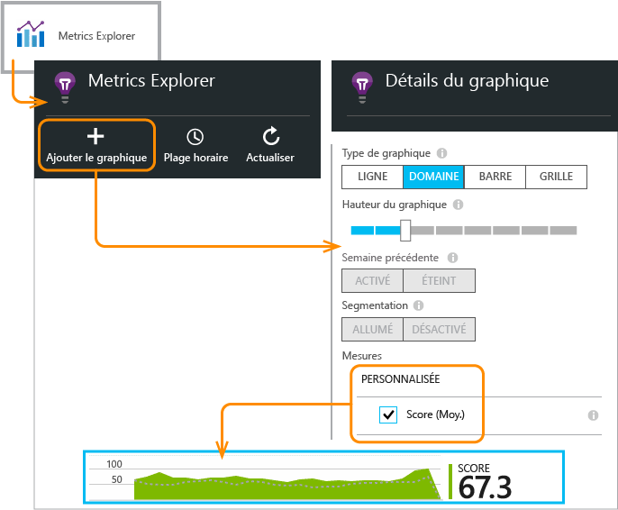

<properties 
	pageTitle="API Application Insights pour les événements et les mesures personnalisés" 
	description="Insérez quelques lignes de code dans votre application de périphérique ou de bureau, votre page web ou votre service pour suivre l'utilisation et diagnostiquer les problèmes." 
	services="application-insights"
    documentationCenter="" 
	authors="alancameronwills" 
	manager="douge"/>
 
<tags 
	ms.service="application-insights" 
	ms.workload="tbd" 
	ms.tgt_pltfrm="ibiza" 
	ms.devlang="multiple" 
	ms.topic="article" 
	ms.date="11/18/2015" 
	ms.author="awills"/>

# API Application Insights pour les événements et les mesures personnalisés 

*Application Insights est à l'état de version préliminaire.*

Insérez quelques lignes de code dans votre application pour découvrir ce qu’en font les utilisateurs ou pour faciliter le diagnostic des problèmes. Vous pouvez envoyer la télémétrie depuis des applications de périphérique et de bureau, des clients web et des serveurs web.

Les collecteurs de données d’Application Insights utilisent cette API pour envoyer la télémétrie standard telle que des affichages de page et des rapports d’exceptions, mais vous pouvez également l’utiliser pour envoyer votre propre télémétrie personnalisée.

## API summary

L’API est uniforme sur toutes les plateformes, à l’exception de quelques petites variations.

Méthode | Utilisé pour
---|---
[`TrackPageView`](#page-views) | Pages, écrans, panneaux ou formes
[`TrackEvent`](#track-event) | Actions de l’utilisateur et autres événements. Utilisé pour suivre le comportement de l’utilisateur ou pour analyser les performances.
[`TrackMetric`](#track-metric) | Mesures de performances telles que la longueur des files d’attente non liées à des événements spécifiques
[`TrackException`](#track-exception)|Exceptions de journal pour des diagnostics. Effectuez un suivi lorsqu’ils se produisent par rapport à d’autres événements et examinez les arborescences des appels de procédure.
[`TrackRequest`](#track-request)| Notez la fréquence et la durée des requêtes du serveur pour l’analyse des performances.
[`TrackTrace`](#track-trace)|Messages du journal de diagnostic Vous pouvez également capturer des journaux tiers.
[`TrackDependency`](#track-dependency)|Consignez la durée et la fréquence des appels vers les composants externes dont dépend votre application.

Vous pouvez [associer des propriétés et des mesures](#properties) à la plupart de ces appels de télémétrie.


## <a name="prep"></a>Avant de commencer

Si vous ne l'avez pas encore fait :

* Ajoutez le Kit de développement logiciel (SDK) Application Insights à votre projet :
 * [Projet ASP.NET][greenbrown]
 * [Projet Windows][windows]
 * [Projet Java][java] 
 * [JavaScript dans chaque page web][client]   

* Ajoutez au code de votre périphérique ou de votre serveur web :

    *C# :* `using Microsoft.ApplicationInsights;`

    *VB :* `Imports Microsoft.ApplicationInsights`

    *Java :* `import com.microsoft.applicationinsights.TelemetryClient;`

## Construction d’un TelemetryClient

Construisez une instance de TelemetryClient (sauf en JavaScript dans les pages web) :

*C# :*

    private TelemetryClient telemetry = new TelemetryClient();

*VB :*

    Private Dim telemetry As New TelemetryClient

*Java*

    private TelemetryClient telemetry = new TelemetryClient();

TelemetryClient est thread-safe.

Nous vous recommandons d’utiliser une instance de `TelemetryClient` pour chaque module de votre application. Par exemple, vous pouvez avoir une instance de `TelemetryClient` dans votre service web pour signaler les requêtes http entrantes et un autre instance dans une classe d’intergiciels pour signaler les événements de logique métier. Vous pouvez définir des propriétés telles que `TelemetryClient.Context.User.Id` pour assurer le suivi des utilisateurs et des sessions ou `TelemetryClient.Context.Device.Id` pour identifier l’ordinateur. Cette information est associée à tous les événements envoyés par l'instance.


## Suivi des événements

Dans Application Insights, un *événement personnalisé* est un point de données que vous pouvez afficher à la fois dans [Metrics Explorer][metrics] en tant que nombre agrégé et dans [Recherche de diagnostic][diagnostic] en tant qu’occurrences individuelles. (Il n’est pas lié à des « événements » de type MVC ou autres.)

Insérez des appels TrackEvent dans votre code pour compter la fréquence à laquelle les utilisateurs choisissent une fonctionnalité particulière, la fréquence à laquelle ils atteignent des objectifs particuliers ou à laquelle ils commettent éventuellement des types d’erreurs particuliers.

Par exemple, dans une application de jeu, envoyez un événement chaque fois qu'un utilisateur gagne le jeu :

*JavaScript*

    appInsights.trackEvent("WinGame");

*C#*
    
    telemetry.TrackEvent("WinGame");

*VB*


    telemetry.TrackEvent("WinGame")

*Java*

    telemetry.trackEvent("WinGame");

Ici, « WinGame » est le nom qui apparaît dans le portail Application Insights. Cliquez sur la vignette Événements personnalisés dans le panneau Vue d’ensemble :


Le graphique est regroupé par nom d’événement, pour que vous puissiez voir les contributions correspondantes des événements les plus importants. Pour contrôler ce processus, sélectionnez le graphique et utilisez le contrôle de regroupement.


Dans la liste sous le graphique, sélectionnez un nom d'événement. Cliquez pour voir les occurrences individuelles de l'événement.


Cliquez sur n'importe quelle occurrence pour afficher plus d’informations.


## Suivi des mesures

Utilisez TrackMetric pour envoyer des mesures qui ne sont pas associées à des événements particuliers. Par exemple, vous pouvez analyser la longueur d’une file d'attente à des intervalles réguliers.

Les mesures sont affichées sous forme de graphiques statistiques dans Metrics Explorer, mais contrairement aux événements, vous ne pouvez pas rechercher des occurrences individuelles dans Recherche de diagnostic.

Les valeurs de mesures doivent être > = 0 pour s'afficher correctement.


*JavaScript*

    appInsights.trackMetric("Queue", queue.Length);

*C#*

    telemetry.TrackMetric("Queue", queue.Length);

*VB*

    telemetry.TrackMetric("Queue", queue.Length)

*Java*

    telemetry.trackMetric("Queue", queue.Length);

En fait, vous pouvez procéder ainsi dans un thread d'arrière-plan :

*C#*

    private void Run() {
     var appInsights = new TelemetryClient();
     while (true) {
      Thread.Sleep(60000);
      appInsights.TrackMetric("Queue", queue.Length);
     }
    }


Pour afficher les résultats, ouvrez Metrics Explorer et ajoutez un nouveau graphique. Définissez-le pour afficher votre mesure.



Il existe certaines [limites au nombre de mesures](#limits) que vous pouvez utiliser.

## Affichages de page

Dans un périphérique ou une application de page web, la télémétrie d'affichage de page est envoyée par défaut lorsque chaque écran ou page est chargé. Mais vous pouvez modifier cela pour suivre les affichages de page à différents moments. Par exemple, dans une application qui affiche les onglets ou les panneaux, vous pouvez effectuer le suivi d'une « page » chaque fois que l'utilisateur ouvre un nouveau panneau.


Les données d’utilisateur et de session sont envoyées en tant que propriétés avec les affichages de page, de façon à ce que les graphiques d’utilisateur et de session soient actifs s’il existe une télémétrie de l’affichage de page.

#### Affichages de pages personnalisées

*JavaScript*

    appInsights.trackPageView("tab1");

*C#*

    telemetry.TrackPageView("GameReviewPage");

*VB*

    telemetry.TrackPageView("GameReviewPage")


Si vous avez plusieurs onglets dans différentes pages HTML, vous pouvez aussi spécifier l'URL :

    appInsights.trackPageView("tab1", "http://fabrikam.com/page1.htm");


## Suivi des requêtes

Utilisé par le Kit de développement logiciel (SDK) du serveur pour consigner les requêtes HTTP.

Vous pouvez également l'appeler vous-même si vous souhaitez simuler des requêtes dans le cas où le module du service web n’est pas en cours d'exécution.

*C#*

    // At start of processing this request:

    // Operation Id and Name are attached to all telemetry and help you identify
    // telemetry associated with one request:
    telemetry.Context.Operation.Id = Guid.NewGuid().ToString();
    telemetry.Context.Operation.Name = requestName;
    
    var stopwatch = System.Diagnostics.Stopwatch.StartNew();

    // ... process the request ...

    stopwatch.Stop();
    telemetryClient.TrackRequest(requestName, DateTime.Now,
       stopwatch.Elapsed, 
       "200", true);  // Response code, success


## Suivi des exceptions

Envoyez des exceptions à Application Insights : pour [les compter][metrics] comme indication de la fréquence d'un problème, et pour [examiner des occurrences individuelles][diagnostic]. Les rapports incluent des arborescences des appels de procédure.

*C#*

    try
    {
        ...
    }
    catch (Exception ex)
    {
       telemetry.TrackException(ex);
    }

*JavaScript*

    try
    {
       ...
    }
    catch (ex)
    {
       appInsights.trackException(ex);
    }

Les Kits de développement logiciel (SDK) interceptent de nombreuses exceptions automatiquement, ce qui vous évite ainsi d’avoir toujours à appeler TrackException explicitement.

* ASP.NET : [écriture d'un code pour intercepter les exceptions](app-insights-asp-net-exceptions.md)
* J2EE : [les exceptions sont interceptées automatiquement](app-insights-java-get-started.md#exceptions-and-request-failures)
* Applications Windows : [les incidents sont détectés automatiquement](app-insights-windows-crashes.md)
* JavaScript : détection automatique. Si vous souhaitez désactiver la collecte automatique, ajoutez une ligne dans l'extrait de code que vous insérez dans vos pages web :

    ```
    ({
      instrumentationKey: "your key"
      , disableExceptionTracking: true
    })
    ```


## Suivi de traces 

Utilisez ceci pour diagnostiquer des problèmes en envoyant une « piste de navigation » à Application Insights. Vous pouvez envoyer des blocs de données de diagnostic et les inspecter dans [Recherche de diagnostic][diagnostic].

 

[Les adaptateurs de journaux][trace] utilisent cette API pour envoyer des journaux tiers au portail.


*C#*

    telemetry.TrackTrace(message, SeverityLevel.Warning, properties);

La limite de taille sur `message` est plus importante que la limite des propriétés. Vous pouvez effectuer une recherche dans le contenu du message, mais (contrairement aux valeurs de propriété), vous ne pouvez pas les filtrer.

## Suivi des dépendances

Utilisez cet appel pour suivre les temps de réponse et les taux de réussite des appels vers un bloc de code externe. Les résultats s'affichent dans les graphiques de dépendance sur le portail.

```C#

            var success = false;
            var startTime = DateTime.UtcNow;
            var timer = System.Diagnostics.Stopwatch.StartNew();
            try
            {
                success = dependency.Call();
            }
            finally
            {
                timer.Stop();
                telemetry.TrackDependency("myDependency", "myCall", startTime, timer.Elapsed, success);
            }
```

N’oubliez pas que les Kits de développement logiciel (SDK) de serveur incluent un [module de dépendance](app-insights-dependencies.md) qui détecte certains appels de dépendance et en effectue le suivi automatiquement. C'est notamment le cas des bases de données et des API REST. Vous devez installer un agent sur votre serveur pour que le module fonctionne. Vous utiliserez cet appel si vous souhaitez effectuer le suivi des appels qui ne sont pas interceptés par le système de suivi automatisé, ou si vous ne souhaitez pas installer l'agent.

Pour désactiver le module de suivi des dépendances standard, modifiez le fichier [ApplicationInsights.config](app-insights-configuration-with-applicationinsights-config.md) et supprimez la référence à `DependencyCollector.DependencyTrackingTelemetryModule`.


## Vidage des données

Normalement, le Kit de développement logiciel (SDK) envoie des données à des moments choisis pour minimiser l'impact sur l'utilisateur. Toutefois, dans certains cas vous pouvez vider la mémoire tampon - par exemple, si vous utilisez le Kit de développement logiciel (SDK) dans une application qui s'arrête.

*C#*

    telemetry.Flush();

    // Allow some time for flushing before shutdown.
    System.Threading.Thread.Sleep(1000);

Notez que la fonction est asynchrone pour les canaux en mémoire, mais synchrone si vous choisissez d'utiliser le [canal persistant](app-insights-windows-desktop.md#persistence-channel).


## Utilisateurs authentifiés

Dans une application Web, les utilisateurs sont identifiés par des cookies par défaut. Un utilisateur peut être compté plusieurs fois s’il accède à votre application à partir d’un autre ordinateur ou navigateur, ou s’il supprime des cookies.

Mais si les utilisateurs se connectent à votre application, vous pouvez obtenir un nombre plus précis en définissant l’ID de l’utilisateur authentifié dans le code du navigateur :

*JavaScript*

```JS
    // Called when my app has identified the user.
    function Authenticated(signInId) {
      var validatedId = signInId.replace(/[,;=| ]+/g, "_");
      appInsights.setAuthenticatedUserContext(validatedId);
      ...
    }
```

Dans une application MVC Web ASP.NET, par exemple :

*Razor*

        @if (Request.IsAuthenticated)
        {
            <script>
                appInsights.setAuthenticatedUserContext("@User.Identity.Name".replace(/[,;=| ]+/g, "_"));
            </script>
        }

Il n’est pas nécessaire d’utiliser le nom de connexion réel de l’utilisateur. Il doit uniquement s’agir d’un ID unique pour cet utilisateur. Il ne doit pas inclure d'espaces ni l'un des caractères suivants : `,;=|`.

L’ID d’utilisateur est également défini dans un cookie de session et envoyé au serveur. Si le Kit de développement logiciel (SDK) de serveur est installé, l’ID d’utilisateur authentifié est envoyé dans le cadre des propriétés de contexte de télémétrie client et serveur, afin que vous puissiez filtrer et rechercher sur celui-ci.

Si votre application regroupe les utilisateurs par comptes, vous pouvez également fournir un identificateur pour ce compte (avec les mêmes restrictions de caractères).


      appInsights.setAuthenticatedUserContext(validatedId, accountId);

Dans [Metrics Explorer](app-insights-metrics-explorer.md), vous pouvez créer un graphique qui compte les **Utilisateurs authentifiés** et les **Comptes d'utilisateurs**.

Vous pouvez également [rechercher][diagnostic] les points de données client avec des comptes et des noms d'utilisateurs spécifiques.

## <a name="properties"></a>Filtrez, recherchez et segmentez vos données avec des propriétés

Vous pouvez associer des propriétés et des mesures à vos événements (et également à des mesures, des affichages de page, des exceptions et d'autres données de télémétrie).

Les **propriétés** sont des valeurs de chaîne que vous pouvez utiliser pour filtrer votre télémétrie dans les rapports d'utilisation. Par exemple, si votre application fournit plusieurs jeux, vous pouvez attacher le nom du jeu à chaque événement pour vous permettre de savoir quels sont les jeux les plus populaires.

Il existe une limite d'environ 1 Ko sur la longueur de chaîne. (Si vous souhaitez envoyer d’importants blocs de données, utilisez le paramètre de message de [TrackTrace](#track-trace).)

Les **mesures** sont des valeurs numériques qui peuvent être représentées sous forme graphique. Par exemple, observez s'il existe une augmentation progressive des scores atteints par vos joueurs. Les graphiques peuvent être segmentés par les propriétés envoyées avec l'événement pour vous permettre d’obtenir des graphiques distincts ou empilés pour différents jeux.

Les valeurs de mesures doivent être > = 0 pour s'afficher correctement.


Il existe certaines [limites au nombre de propriétés, de valeurs de propriété et de mesures](#limits) que vous pouvez utiliser.


*JavaScript*

    appInsights.trackEvent
      ("WinGame",
         // String properties:
         {Game: currentGame.name, Difficulty: currentGame.difficulty},
         // Numeric metrics:
         {Score: currentGame.score, Opponents: currentGame.opponentCount}
         );

    appInsights.trackPageView
        ("page name", "http://fabrikam.com/pageurl.html",
          // String properties:
         {Game: currentGame.name, Difficulty: currentGame.difficulty},
         // Numeric metrics:
         {Score: currentGame.score, Opponents: currentGame.opponentCount}
         );
          

*C#*

    // Set up some properties and metrics:
    var properties = new Dictionary <string, string> 
       {{"game", currentGame.Name}, {"difficulty", currentGame.Difficulty}};
    var metrics = new Dictionary <string, double>
       {{"Score", currentGame.Score}, {"Opponents", currentGame.OpponentCount}};

    // Send the event:
    telemetry.TrackEvent("WinGame", properties, metrics);


*VB*

    ' Set up some properties:
    Dim properties = New Dictionary (Of String, String)
    properties.Add("game", currentGame.Name)
    properties.Add("difficulty", currentGame.Difficulty)

    Dim metrics = New Dictionary (Of String, Double)
    metrics.Add("Score", currentGame.Score)
    metrics.Add("Opponents", currentGame.OpponentCount)

    ' Send the event:
    telemetry.TrackEvent("WinGame", properties, metrics)


*Java*
    
    Map<String, String> properties = new HashMap<String, String>();
    properties.put("game", currentGame.getName());
    properties.put("difficulty", currentGame.getDifficulty());
    
    Map<String, Double> metrics = new HashMap<String, Double>();
    metrics.put("Score", currentGame.getScore());
    metrics.put("Opponents", currentGame.getOpponentCount());
    
    telemetry.trackEvent("WinGame", properties, metrics);


> [AZURE.NOTE]Veillez à ne pas journaliser des informations personnelles dans les propriétés.

**Si vous avez utilisé des mesures**, ouvrez Metrics Explorer et sélectionnez la mesure à partir du groupe personnalisé :


*Si votre mesure n'apparaît pas, ou si l'en-tête personnalisé n'y figure pas, fermez le panneau de sélection et réessayez ultérieurement. L’agrégation des mesures via le pipeline peut parfois prendre une heure.*

**Si vous avez utilisé des propriétés et des mesures**, segmentez la mesure par la propriété :


Dans **Recherche de diagnostic**, vous pouvez afficher les propriétés et les mesures des occurrences individuelles d’un événement.


Utilisez le champ de recherche pour voir les occurrences de l'événement présentant une valeur de propriété particulière.


[En savoir plus sur les expressions de recherche][diagnostic].

#### Autre façon de définir des propriétés et des mesures

Si cela est plus pratique, vous pouvez collecter les paramètres d'un événement dans un objet séparé :

    var event = new EventTelemetry();

    event.Name = "WinGame";
    event.Metrics["processingTime"] = stopwatch.Elapsed.TotalMilliseconds;
    event.Properties["game"] = currentGame.Name;
    event.Properties["difficulty"] = currentGame.Difficulty;
    event.Metrics["Score"] = currentGame.Score;
    event.Metrics["Opponents"] = currentGame.Opponents.Length;

    telemetry.TrackEvent(event);


#### <a name="timed"></a> Événements de durée

Vous avez parfois besoin d’obtenir une représentation graphique de la durée nécessaire à la réalisation d’une action. Par exemple, vous souhaitez savoir de combien de temps les utilisateurs ont besoin pour évaluer leurs choix dans un jeu. Il s'agit d'un exemple intéressant de l'utilisation du paramètre de mesure.


*C#*

    var stopwatch = System.Diagnostics.Stopwatch.StartNew();

    // ... perform the timed action ...

    stopwatch.Stop();

    var metrics = new Dictionary <string, double>
       {{"processingTime", stopwatch.Elapsed.TotalMilliseconds}};

    // Set up some properties:
    var properties = new Dictionary <string, string> 
       {{"signalSource", currentSignalSource.Name}};

    // Send the event:
    telemetry.TrackEvent("SignalProcessed", properties, metrics);


## <a name="defaults"></a>Propriétés par défaut pour la télémétrie personnalisée

Si vous souhaitez définir des valeurs de propriété par défaut pour certains des événements personnalisés que vous écrivez, vous pouvez les définir dans un TelemetryClient. Ils sont associés à chaque élément de télémétrie envoyée à partir de ce client.

*C#*

    using Microsoft.ApplicationInsights.DataContracts;

    var gameTelemetry = new TelemetryClient();
    gameTelemetry.Context.Properties["Game"] = currentGame.Name;
    // Now all telemetry will automatically be sent with the context property:
    gameTelemetry.TrackEvent("WinGame");
    
*VB*

    Dim gameTelemetry = New TelemetryClient()
    gameTelemetry.Context.Properties("Game") = currentGame.Name
    ' Now all telemetry will automatically be sent with the context property:
    gameTelemetry.TrackEvent("WinGame")

*Java*

    import com.microsoft.applicationinsights.TelemetryClient;
    import com.microsoft.applicationinsights.TelemetryContext;
    ...


    TelemetryClient gameTelemetry = new TelemetryClient();
    TelemetryContext context = gameTelemetry.getContext();
    context.getProperties().put("Game", currentGame.Name);
    
    gameTelemetry.TrackEvent("WinGame");


    
Les appels de télémétrie individuels peuvent remplacer les valeurs par défaut dans leurs dictionnaires de propriété.

**Pour les clients Web JavaScript**, [utilisez des initialiseurs de télémétrie JavaScript](#js-initializer).

**Pour ajouter des propriétés à la télémétrie complète**, notamment des données de modules de collection standard, [créez un initialiseur de télémétrie](app-insights-api-filtering-sampling.md#add-properties).


## Échantillonnage, filtrage et traitement de la télémétrie 

Vous pouvez écrire du code pour traiter votre télémétrie avant de l’envoyer à partir du Kit de développement logiciel (SDK). Le traitement inclut les données envoyées par les modules de télémétrie standard, telles que la collection de requêtes HTTP et la collection de dépendances.

* [Ajoutez des propriétés](app-insights-api-filtering-sampling.md#add-properties) à la télémétrie. Par exemple, des numéros de version ou des valeurs calculées à partir d'autres propriétés.
* L'[échantillonnage](app-insights-api-filtering-sampling.md#sampling) réduit le volume des données envoyées à partir de votre application au portail, sans affecter les mesures affichées, ni votre capacité à diagnostiquer les problèmes en naviguant entre des éléments connexes, tels que les exceptions, les requêtes et les affichages de page.
* Le [filtrage](app-insights-api-filtering-sampling.md#filtering) réduit également le volume. Vous contrôlez ce qui est envoyé ou rejeté, mais vous devez tenir compte de l’impact sur vos critères. Suivant la façon dont vous ignorez les éléments, vous risquez de ne plus pouvoir naviguer entre des éléments connexes.

[En savoir plus](app-insights-api-filtering-sampling.md)


## Désactivation de la télémétrie

Pour **arrêter et démarrer dynamiquement** la collecte et la transmission de la télémétrie :

*C#*

```C#

    using  Microsoft.ApplicationInsights.Extensibility;

    TelemetryConfiguration.Active.DisableTelemetry = true;
```

Pour **désactiver les collecteurs standard sélectionnés** (par exemple, les compteurs de performances, les requêtes HTTP ou les dépendances), supprimez ou commentez les lignes correspondantes dans [ApplicationInsights.config][config]. Par exemple, vous pouvez faire cela si vous souhaitez envoyer vos propres données TrackRequest.

## <a name="debug"></a>Mode Développeur :

Pendant le débogage, il est utile d'avoir votre télémétrie envoyée par le pipeline afin que vous puissiez voir immédiatement les résultats. Vous obtenez également des messages supplémentaires qui vous permettent de suivre tout problème relatif à la télémétrie. Désactivez-les lors de la production, car ils peuvent ralentir votre application.


*C#*
    
    TelemetryConfiguration.Active.TelemetryChannel.DeveloperMode = true;

*VB*

    TelemetryConfiguration.Active.TelemetryChannel.DeveloperMode = True


## <a name="ikey"></a> Définir la clé d'instrumentation pour la télémétrie personnalisée sélectionnée

*C#*
    
    var telemetry = new TelemetryClient();
    telemetry.Context.InstrumentationKey = "---my key---";
    // ...


## <a name="dynamic-ikey"></a>Clé d'instrumentation dynamique

Pour éviter de mélanger la télémétrie fournie par les environnements de développement, de test et de production, vous pouvez [créer des ressources Application Insights distinctes][create] et modifier leurs clés en fonction de l’environnement.

Au lieu de récupérer la clé d'instrumentation à partir du fichier de configuration, vous pouvez la définir dans votre code. Définissez la clé dans une méthode d'initialisation, par exemple global.aspx.cs dans un service ASP.NET :

*C#*

    protected void Application_Start()
    {
      Microsoft.ApplicationInsights.Extensibility.
        TelemetryConfiguration.Active.InstrumentationKey = 
          // - for example -
          WebConfigurationManager.Settings["ikey"];
      ...

*JavaScript*

    appInsights.config.instrumentationKey = myKey; 


Dans les pages web, vous pouvez la définir depuis l'état du serveur web au lieu de la coder littéralement dans le script. Par exemple, dans une page web générée dans une application ASP.NET :

*JavaScript dans Razor*

    <script type="text/javascript">
    // Standard Application Insights web page script:
    var appInsights = window.appInsights || function(config){ ...
    // Modify this part:
    }({instrumentationKey:  
      // Generate from server property:
      @Microsoft.ApplicationInsights.Extensibility.
         TelemetryConfiguration.Active.InstrumentationKey"
    }) // ...


## TelemetryContext

TelemetryClient a une propriété de contexte contenant un certain nombre de valeurs qui sont envoyées avec toutes les données de télémétrie. Elles sont normalement définies par les modules de télémétrie standard, mais vous pouvez également les définir vous-même. Par exemple :

    telemetryClient.Context.Operation.Name = "MyOperationName";

Si vous définissez une de ces valeurs vous-même, supprimez la ligne appropriée dans [ApplicationInsights.config][config], de sorte que vos valeurs et les valeurs standard ne se mélangent pas.

* **Composant** : identifie l'application et sa version
* **Périphérique** : données du périphérique sur lequel l'application est en cours d'exécution (dans les applications web, il s’agit du serveur ou du périphérique client à partir duquel la télémétrie est envoyée)
* **Clé d’instrumentation** : identifie la ressource d'Application Insights dans Azure où apparaît la télémétrie. Elle est généralement récupérée dans ApplicationInsights.config
* **Emplacement** : identifie l'emplacement géographique du périphérique.
* **Opération** : dans les applications web, il s’agit de la requête HTTP actuelle. Dans d'autres types d'application, vous pouvez définir celle-ci sur les événements regroupés.
 * **ID** : une valeur générée qui met en relation différents événements de manière à ce que vous trouviez les « Éléments associés » lorsque vous inspectez un événement dans la Recherche de diagnostic.
 * **Nom** : un identificateur, généralement l'URL de la requête HTTP. 
 * **SyntheticSource** : si elle est non nulle ou vide, cette chaîne indique que la source de la requête a été identifiée en tant que robot ou test web. Par défaut, celle-ci sera exclue des calculs dans Metrics Explorer.
* **Propriétés** : ce sont les propriétés qui sont envoyées avec toutes les données de télémétrie. Elles peuvent être remplacées dans les appels Track* individuels.
* **Session** : identifie la session de l’utilisateur. L'ID est définie sur une valeur générée qui est modifiée lorsque l'utilisateur n'a pas été actif pendant un certain temps.
* **Utilisateur** : informations utilisateur. 


## Limites

Il existe certaines limites au nombre de mesures et d’événements par application.

1. Jusqu'à 500 points de données de télémétrie par seconde par clé d'instrumentation (autrement dit, par application). Cela inclut la télémétrie standard envoyée par les modules du Kit de développement logiciel (SDK) et les événements personnalisés, les mesures et autre données de télémétrie envoyées par votre code.
1.	Un maximum de 200 noms de mesure uniques et de 200 noms de propriété unique pour votre application. Les mesures comprennent l'envoi de données via TrackMetric ainsi que des mesures sur d’autres types de données tels que des événements. Les noms de mesure et de propriété sont globaux pour chaque clé d'instrumentation et ne s’étendent pas au type de données.
2.	Les propriétés peuvent être utilisées pour le filtrage et le regroupement uniquement lorsqu’il y a moins de 100 valeurs uniques pour chaque propriété. Lorsque les valeurs uniques dépassent 100, la propriété peut toujours être utilisée pour effectuer une recherche et un filtrage, mais elle ne peut plus être utilisée pour des filtres.
3.	Les propriétés standard telles que le nom de la requête et l'URL de la page sont limitées à 1 000 valeurs uniques par semaine. Au-delà de 1 000 valeurs uniques, les valeurs supplémentaires sont marquées comme « Autres valeurs ». La valeur d'origine peut toujours être utilisée pour une recherche de texte intégrale et pour le filtrage.

* *Q : combien de temps sont conservées les données ?*

    Consultez [Rétention de données et confidentialité][data].


## Documents de référence

* [Référence ASP.NET](https://msdn.microsoft.com/library/dn817570.aspx)
* [Référence Java](http://dl.windowsazure.com/applicationinsights/javadoc/)
* [Référence JavaScript](https://github.com/Microsoft/ApplicationInsights-JS/blob/master/API-reference.md)
* [Kit de développement logiciel Android](https://github.com/Microsoft/ApplicationInsights-Android)
* [Kit de développement logiciel (SDK) iOS](https://github.com/Microsoft/ApplicationInsights-iOS)


## Code du Kit de développement logiciel (SDK)

* [Kit de développement logiciel (SDK) principal ASP.NET](https://github.com/Microsoft/ApplicationInsights-dotnet)
* [ASP.NET 5](https://github.com/Microsoft/ApplicationInsights-aspnet5)
* [Kit de développement logiciel Android](https://github.com/Microsoft/ApplicationInsights-Android)
* [Kit de développement logiciel (SDK) Java](https://github.com/Microsoft/ApplicationInsights-Java)
* [Kit de développement logiciel (SDK) JavaScript](https://github.com/Microsoft/ApplicationInsights-JS)
* [Kit de développement logiciel (SDK) iOS](https://github.com/Microsoft/ApplicationInsights-iOS)
* [Toutes les plateformes](https://github.com/Microsoft?utf8=%E2%9C%93&query=applicationInsights)

## Questions

* *Quelles exceptions peuvent être lancées par les appels Track\_() ?*
    
    Aucun. Vous n’avez pas besoin de les inclure dans des clauses try-catch. Si le Kit de développement logiciel (SDK) rencontre des problèmes, il enregistrera des messages que vous pourrez consulter dans la sortie de la console de débogage et, si les messages aboutissent, dans la recherche de diagnostic.


* *Existe-t-il une API REST ?*

    Oui, mais nous ne l’avons pas encore publiée.

## <a name="next"></a>Étapes suivantes


[Recherche d'événements et de journaux][diagnostic]

[Exemples et procédures pas à pas](app-insights-code-samples.md)

[Résolution des problèmes][qna]


<!--Link references-->

[client]: app-insights-javascript.md
[config]: app-insights-configuration-with-applicationinsights-config.md
[create]: app-insights-create-new-resource.md
[data]: app-insights-data-retention-privacy.md
[diagnostic]: app-insights-diagnostic-search.md
[exceptions]: app-insights-asp-net-exceptions.md
[greenbrown]: app-insights-start-monitoring-app-health-usage.md
[java]: app-insights-java-get-started.md
[metrics]: app-insights-metrics-explorer.md
[qna]: app-insights-troubleshoot-faq.md
[trace]: app-insights-search-diagnostic-logs.md
[windows]: app-insights-windows-get-started.md

 

<!---HONumber=AcomDC_1125_2015-->