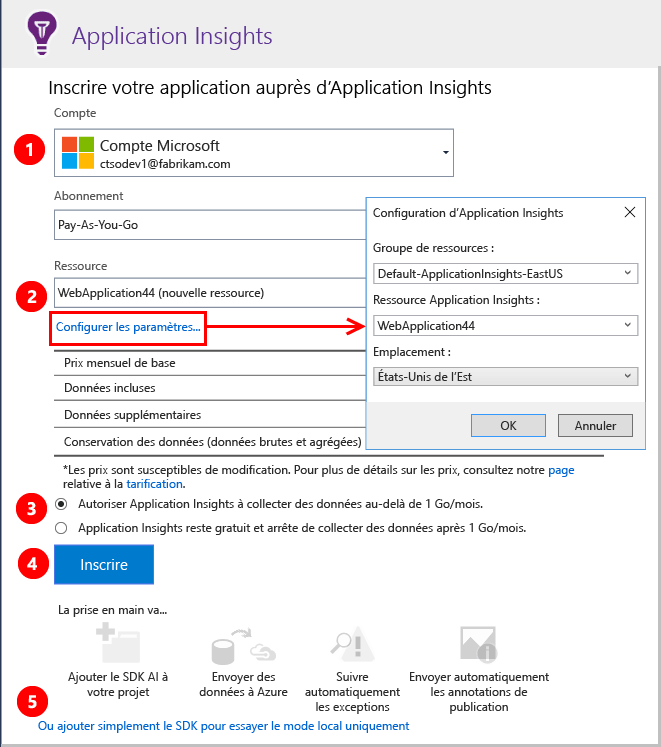
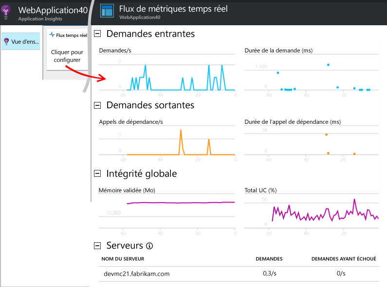
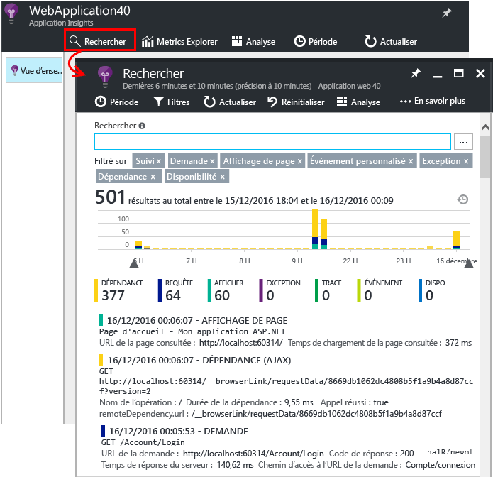
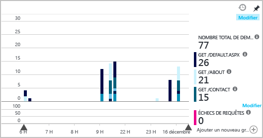

# <a name="set-up-application-insights-for-your-aspnet-website"></a>Configurer Application Insights pour votre site web ASP.NET
[Azure Application Insights](app-insights-overview.md) surveille votre application en direct pour vous aider à [détecter et diagnostiquer les problèmes de performances et les exceptions](app-insights-detect-triage-diagnose.md). Il vous permet également de [découvrir comment votre application est utilisée](app-insights-overview-usage.md). Il fonctionne pour la fonctionnalité Web Apps d’Azure App Service, ainsi que pour les applications hébergées sur vos propres serveurs locaux IIS ou sur les machines virtuelles dans le cloud.

## <a name="before-you-start"></a>Avant de commencer
Ce dont vous avez besoin :

* Visual Studio 2013 Update 3 ou version ultérieure. Il est préférable d’utiliser une version ultérieure.
* Un abonnement à [Microsoft Azure](http://azure.com). Si votre équipe ou votre organisation dispose d’un abonnement Azure, le propriétaire peut vous y ajouter à l’aide de votre [compte Microsoft](http://live.com).

Vous pouvez consulter d’autres rubriques selon les aspects qui vous intéressent :

* [Instrumentation d’une application web au moment de l’exécution](app-insights-monitor-performance-live-website-now.md)
* [Services cloud Azure](app-insights-cloudservices.md)

## <a name="ide"></a> Étape 1 : ajout du Kit de développement logiciel (SDK) Application Insights

Cliquez avec le bouton droit sur le projet dans l’Explorateur de solutions et sélectionnez **Ajouter**, **Application Insights Telemetry...** ou **Configurer Application Insights**.


(Dans Visual Studio 2015, il existe également une option pour ajouter Application Insights dans la boîte de dialogue Nouveau projet.)

Passez à la page de configuration d’Application Insights :



1. Sélectionnez le compte et l’abonnement que vous utilisez pour accéder à Azure.
2. Sélectionnez la ressource Azure où vous souhaitez afficher les données de votre application. Généralement, une ressource distincte est créée pour chaque application. Si vous souhaitez définir le groupe de ressources ou l’emplacement où vos données sont stockées, cliquez sur **Configurer les paramètres**. Les groupes de ressources sont utilisés pour contrôler l’accès aux données. Par exemple, si vous possédez plusieurs applications qui font partie du même système, vous pourrez placer leurs données Application Insights dans le même groupe de ressources.
3. Application Insights est gratuit jusqu’à un certain volume de données de télémétrie. Vous pouvez imposer une limite de volume pour éviter les frais. Une fois la ressource créée, vous pouvez modifier votre sélection dans le portail en ouvrant **Fonctionnalités + tarifs**, **Gestion des données**, **Limite quotidienne de volume**.
4. Cliquez sur **Inscrire** pour configurer Application Insights pour votre application web. Les données de télémétrie seront envoyées au [portail Azure](https://portal.azure.com), pendant le débogage et une fois que vous aurez publié votre application.
5. Vous pouvez également ajouter simplement le Kit de développement logiciel (SDK) Application Insights à votre application. Dans ce cas, vous serez en mesure de voir les données de télémétrie dans Visual Studio pendant le débogage. Plus tard, vous pouvez revenir à cette page de configuration, ou vous pouvez attendre d’avoir déployé votre application et [activer les données de télémétrie au moment de l’exécution](app-insights-monitor-performance-live-website-now.md).


## <a name="run"></a> Étape 2 : exécution de votre application
Exécutez votre application en appuyant sur F5. Ouvrez différentes pages pour générer des données de télémétrie.

Un décompte des événements consignés s’affiche dans Visual Studio.


## <a name="step-3-see-your-telemetry-in-visual-studio-or-application-insights"></a>Étape 3 : affichage des données de télémétrie dans Visual Studio ou Application Insights
Vous pouvez voir vos données de télémétrie dans Visual Studio ou sur le portail web Application Insights.

**Dans Visual Studio**, ouvrez la fenêtre Application Insights. Cliquez sur le bouton **Application Insights** ou cliquez avec le bouton droit sur votre projet dans l’Explorateur de solutions, sélectionnez **Application Insights**, puis cliquez sur **Rechercher parmi la télémétrie active**.

Dans la fenêtre de recherche de Visual Studio Application Insights, affichez **les données de la session de débogage** pour consulter les données de télémétrie générées côté serveur de votre application. Faites des essais avec les filtres, puis cliquez sur n’importe quel événement pour afficher plus de détails.


> [!NOTE]
> Si aucune donnée n’apparaît, assurez-vous que l’intervalle de temps est correct, puis cliquez sur l’icône de recherche.

[En savoir plus sur les outils Application Insights dans Visual Studio](app-insights-visual-studio.md).

<a name="monitor"></a>
### <a name="the-application-insights-web-portal"></a>Le portail web Application Insights
Vous pouvez également afficher les données de télémétrie **dans le portail web Application Insights**, à moins que vous n’ayez choisi d’installer le Kit de développement logiciel (SDK) uniquement. Le portail offre plus de graphiques, d’outils d’analyse et de tableaux de bord que Visual Studio.

Ouvrez votre ressource Application Insights. Connectez-vous au [portail Azure](https://portal.azure.com/) et recherchez les éléments appropriés, ou cliquez sur le projet dans Visual Studio pour y accéder.


> [!NOTE]
> Si vous obtenez une erreur d’accès : Avez-vous plus d’un jeu d’informations d’identification Microsoft et êtes-vous connecté avec un jeu incorrect ? Dans le portail, déconnectez-vous et reconnectez-vous.

Lorsque le portail s’ouvre, il affiche les données de télémétrie de votre application.


Cliquez sur n'importe quelle mosaïque ou n’importe quel graphique pour afficher plus de détails.

### <a name="more-details-in-the-application-insights-web-portal"></a>Plus d’informations sur le portail web Application Insights
Voici quelques exemples des informations complémentaires fournies par le portail.

* Le [**Flux de métriques temps réel** ](app-insights-live-stream.md) (Live Metrics Stream) affiche les données de télémétrie presque instantanément.

    

    Ouvrez Live Metrics Stream pendant l’exécution de votre application pour leur permettre de se connecter.

    Live Metrics Stream affiche uniquement les données de télémétrie pendant une minute après leur envoi. Pour des investigations plus historiques, utilisez la Search, Metrics Explorer, et Analytics. Les données peuvent y apparaître au bout de quelques minutes seulement.

* La [**recherche**](app-insights-diagnostic-search.md) présente les événements individuels tels que les requêtes, les exceptions et les affichages de pages. Vous pouvez filtrer par type d’événement, correspondance de terme et valeurs de propriété. Cliquez sur n’importe quel événement pour afficher ses propriétés et les événements connexes.

    

 * En mode de développement, vous pouvez éventuellement voir un grand nombre d’événements de dépendance (AJAX). Il s’agit des synchronisations entre le navigateur et l’émulateur de serveur. Pour les masquer, cliquez sur le filtre **Dépendance**.
* [**Les mesures agrégées**](app-insights-metrics-explorer.md) telles que les taux de requêtes et d’échec apparaissent dans les graphiques. Cliquez sur un graphique pour ouvrir un panneau plus détaillé. Cliquez sur la balise **Modifier** de n’importe quel graphique pour définir des filtres et la taille.

    

[En savoir plus sur l’utilisation d’Application Insights dans le portail Azure](app-insights-dashboards.md).

## <a name="step-4-publish-your-app"></a>Étape 4 : publication de votre application
Publiez votre application sur votre serveur IIS ou sur Azure. Vérifiez [Live Metrics Stream (Flux continu de mesures)](app-insights-metrics-explorer.md#live-metrics-stream) pour vous assurer que tout fonctionne correctement.

Vos données de télémétrie s’affichent dans le portail Application Insights, où vous pouvez surveiller les mesures, effectuer une recherche dans vos données de télémétrie et configurer les [tableaux de bord](app-insights-dashboards.md). Vous pouvez également utiliser la puissante [langue de requête Analytics](app-insights-analytics.md) pour analyser l’utilisation et les performances ou rechercher des événements spécifiques.

Vous pouvez également continuer à analyser vos données de télémétrie dans [Visual Studio](app-insights-visual-studio.md) à l’aide d’outils comme la recherche de diagnostic et les [tendances](app-insights-visual-studio-trends.md).

> [!NOTE]
> Si votre application envoie tellement de données de télémétrie qu’elle approche de la [limite](app-insights-pricing.md#limits-summary), l’[échantillonnage](app-insights-sampling.md) automatique s’active. L’échantillonnage réduit la quantité de données de télémétrie envoyées depuis votre application, tout en conservant les données liées au diagnostic.
>
>

## <a name="land"></a> Quelle est la fonction de la commande « Ajouter Application Insights » ?
Application Insights envoie les données de télémétrie de votre application au portail Application Insights (qui est hébergé dans Azure).


La commande assure donc trois fonctions :

1. Elle ajoute le package NuGet du Kit de développement logiciel (SDK) Web Application Insights à votre projet. Pour le visualiser dans Visual Studio, cliquez avec le bouton droit sur votre projet et choisissez **Gérer les packages NuGet**.
2. Elle crée une ressource Application Insights dans [le portail Azure](https://portal.azure.com/). Il s’agit de l’endroit où s’affichent vos données. Elle récupère la *clé d’instrumentation*, qui identifie la ressource.
3. Elle insère la clé d’instrumentation dans `ApplicationInsights.config`pour permettre au Kit de développement logiciel (SDK) d’envoyer les données de télémétrie au portail.

Si vous le souhaitez, vous pouvez effectuer ces étapes manuellement pour [ASP.NET 4](app-insights-windows-services.md) ou [ASP.NET Core](https://github.com/Microsoft/ApplicationInsights-aspnetcore/wiki/Getting-Started).

### <a name="upgrade-to-future-sdk-versions"></a>Mettre à niveau vers les versions ultérieures du Kit de développement logiciel (SDK)
Pour passer à la [nouvelle version du Kit de développement logiciel (SDK)](https://github.com/Microsoft/ApplicationInsights-dotnet-server/releases), ouvrez une nouvelle fois le **gestionnaire de package NuGet** et filtrez les packages qui ont été installés. Sélectionnez **Microsoft.ApplicationInsights.Web** et choisissez **Mettre à niveau**.

Si vous avez apporté des personnalisations à ApplicationInsights.config, conservez-en une copie avant d’effectuer la mise à niveau. Fusionnez ensuite vos modifications dans la nouvelle version.

## <a name="add-more-telemetry"></a>Ajouter des télémétries
Vous trouverez ci-après les autres types de données de télémétrie que vous pouvez ajouter.
### <a name="dependencies-exceptions-and-performance-counters"></a>Dépendances, exceptions et compteurs de performances

[Installez Status Monitor](http://go.microsoft.com/fwlink/?LinkId=506648) sur chaque machine de serveur IIS pour obtenir des données de télémétrie supplémentaires concernant vos applications web. Si le programme est déjà installé, vous n’avez rien à faire. (Vous avez peut-être déjà utilisé Status Monitor pour surveiller une application au moment de l’exécution.)

En tirant parti de Status Monitor en plus du Kit de développement logiciel (SDK) utilisé pour la génération, vous obtenez un ensemble plus complet de données de télémétrie qui inclut :

* [Compteurs de performances](app-insights-performance-counters.md) : processeur, mémoire, disque et autres compteurs de performances relatifs à votre application.
* [Exceptions](app-insights-asp-net-exceptions.md) : autres données de télémétrie détaillées pour certaines exceptions.
* [Dépendances](app-insights-asp-net-dependencies.md) : incluent les valeurs de retour.

### <a name="webpages-and-single-page-apps"></a>Pages Web et applications de page unique
1. [Ajoutez l’extrait de code JavaScript](app-insights-javascript.md) à vos pages web pour afficher les données sur le nombre de pages consultées, les temps de chargement, les exceptions du navigateur, les performances des appels AJAX ainsi que le nombre d’utilisateurs et de sessions. Elles s’affichent dans les panneaux Navigateur et Utilisation.
2. [Encodez des événements personnalisés](app-insights-api-custom-events-metrics.md) pour calculer le nombre, le temps ou mesurer les actions de l’utilisateur.


### <a name="diagnostic-code"></a>Code de diagnostic
Vous avez un problème ? Si vous souhaitez insérer du code dans votre application pour vous aider à la diagnostiquer, vous disposez de plusieurs options :

* [Capturer les suivis des journaux](app-insights-asp-net-trace-logs.md) : si vous utilisez déjà Log4N, NLog ou System.Diagnostics.Trace pour consigner des événements de suivi, la sortie peut être envoyée à Application Insights. Vous pouvez alors la mettre en corrélation avec des demandes, y effectuer des recherches et l’analyser.
* [Événements et mesures personnalisés](app-insights-api-custom-events-metrics.md) : utilisez TrackEvent() et TrackMetric() dans le serveur ou le code de page web.
* [Ajoutez des balises aux données de télémétrie pour des propriétés supplémentaires](app-insights-api-filtering-sampling.md#add-properties).

Utilisez [Search](app-insights-diagnostic-search.md) pour rechercher et mettre en corrélation des événements spécifiques, et [Analytics](app-insights-analytics.md) pour effectuer des requêtes plus puissantes.

## <a name="alerts"></a>Alertes
Soyez le premier à savoir si votre application rencontre des problèmes.

* [Tests de disponibilité](app-insights-monitor-web-app-availability.md) : créez des tests pour vous assurer que votre site est visible sur le web.
* [Diagnostics intelligents](app-insights-proactive-diagnostics.md) : ces tests s’exécutent automatiquement, sans que vous n’ayez rien à faire pour les configurer. Ils vous indiquent si votre application affiche un taux inhabituel de demandes ayant échoué.
* [Alertes de métriques](app-insights-alerts.md) : définissez des alertes qui vous avertissent si une métrique dépasse un seuil. Vous pouvez définir des mesures personnalisées que vous codez dans votre application.

Par défaut, les notifications d’alerte sont envoyées au propriétaire de l’abonnement Azure.


## <a name="version-and-release-tracking"></a>Suivi de la version
Pour vérifier la version de l’application, assurez-vous que `buildinfo.config` est généré par votre processus Microsoft Build Engine. Dans votre fichier .csproj, ajoutez :  

```XML

    <PropertyGroup>
      <GenerateBuildInfoConfigFile>true</GenerateBuildInfoConfigFile>    <IncludeServerNameInBuildInfo>true</IncludeServerNameInBuildInfo>
    </PropertyGroup>
```

Quand il détient les informations de version, le module web Application Insights ajoute automatiquement la **version de l’application** en tant que propriété à chaque élément de télémétrie. Cela vous permet de filtrer par version lorsque vous effectuez des [recherches de diagnostic](app-insights-diagnostic-search.md) ou que vous [explorez les métriques](app-insights-metrics-explorer.md).

Toutefois, notez que le numéro de version de build est uniquement généré par Microsoft Build Engine, et non par la build de développement dans Visual Studio.

### <a name="release-annotations"></a>Annotations de version
Si vous utilisez Visual Studio Team Services, vous pouvez [obtenir un marqueur d’annotation](app-insights-annotations.md) ajouté à vos graphiques lorsque vous publiez une nouvelle version. L’illustration suivante montre l’aspect de ce marqueur.


## <a name="video"></a>Vidéo

> [!VIDEO https://channel9.msdn.com/events/Connect/2016/100/player]

## <a name="next-steps"></a>Étapes suivantes
**[Utilisation d’Application Insights dans Visual Studio](app-insights-visual-studio.md)**<br/>Inclut des informations sur le débogage avec la télémétrie, la recherche de diagnostic et l’accès au code.

**[Utilisation du portail Application Insights](app-insights-dashboards.md)**<br/> Inclut des informations sur les tableaux de bord, les puissants outils de diagnostic et d’analyse, les alertes, le mappage direct des dépendances de votre application et l’exportation des données de télémétrie.

