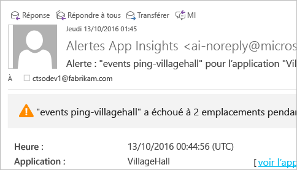

# <a name="set-up-application-insights-for-aspnet"></a>Configurer Application Insights pour ASP.NET
[Visual Studio Application Insights](app-insights-overview.md) surveille vos applications en direct pour vous aider à [détecter et diagnostiquer les problèmes de performances et les exceptions](app-insights-detect-triage-diagnose.md), mais aussi [découvrir comment votre application est utilisée](app-insights-overview-usage.md).  Il fonctionne pour les applications hébergées sur vos propres serveurs locaux IIS ou sur les machines virtuelles dans le cloud, ainsi que les applications web Azure.

## <a name="before-you-start"></a>Avant de commencer
Ce dont vous avez besoin :

* Visual Studio 2013 Update 3 ou version ultérieure. Il est préférable d’utiliser une version ultérieure.
* Un abonnement à [Microsoft Azure](http://azure.com). Si votre équipe ou votre organisation dispose d’un abonnement Azure, le propriétaire peut vous y ajouter à l’aide de votre [compte Microsoft](http://live.com). 

Vous pouvez consulter d’autres articles selon les aspects qui vous intéressent :

* [Instrumentation d’une application web au moment de l’exécution](app-insights-monitor-performance-live-website-now.md)
* [Azure Cloud Services](app-insights-cloudservices.md)

## <a name="a-nameidea-1-add-application-insights-sdk"></a><a name="ide"></a> 1. Ajouter le kit de développement logiciel (SDK) Application Insights
### <a name="if-its-a-new-project"></a>S'il s'agit d'un nouveau projet...
Assurez-vous qu’Application Insights est sélectionné lorsque vous créez un projet dans Visual Studio. 


### <a name="-or-if-its-an-existing-project"></a>... ou s'il s'agit d'un projet existant
Cliquez avec le bouton droit sur le projet dans l’Explorateur de solutions et sélectionnez **Ajouter Application Insights Telemetry** ou **Configurer Application Insights**.


* Projet ASP.NET Core ? - [Suivez ces instructions pour corriger quelques lignes de code](https://github.com/Microsoft/ApplicationInsights-aspnetcore/wiki/Getting-Started#add-application-insights-instrumentation-code-to-startupcs). 

## <a name="a-nameruna-2-run-your-app"></a><a name="run"></a> 2. Exécutez l'application.
Exécutez votre application à l'aide de la touche F5 et essayez-la : ouvrez différentes pages pour générer des données de télémétrie.

Un décompte des événements consignés s’affiche dans Visual Studio. 


## <a name="3-see-your-telemetry"></a>3. Affichez vos données de télémétrie...
### <a name="-in-visual-studio"></a>... dans Visual Studio
Ouvrez la fenêtre Application Insights dans Visual Studio. Pour cela, cliquez sur le bouton Application Insights, ou cliquez avec le bouton droit sur votre projet dans l’Explorateur de solutions :


Cette vue affiche la télémétrie générée du côté serveur de votre application. Faites des essais avec les filtres, puis cliquez sur n’importe quel événement pour afficher plus de détails.

[En savoir plus sur les outils Application Insights dans Visual Studio](app-insights-visual-studio.md).

<a name="monitor"></a> 

### <a name="-in-the-portal"></a>... dans le portail
Vous pouvez également afficher les données de télémétrie dans le portail web Application Insights à moins que vous n’ayez choisi *Installer le Kit de développement logiciel (SDK) uniquement* . 

Le portail offre plus de graphiques, d’outils d’analyse et de tableaux de bord que Visual Studio. 

Ouvrez votre ressource Application Insights dans le [portail Azure](https://portal.azure.com/).


Lorsque le portail s’ouvre, il affiche les données de télémétrie de votre application : 

* La première télémétrie apparaît dans [Live Metrics Stream (Flux continu de mesures)](app-insights-metrics-explorer.md#live-metrics-stream).
* Les événements individuels apparaissent sous **Recherche** (1). Les données peuvent apparaître au bout de quelques minutes seulement. Cliquez sur n’importe quel événement pour afficher ses propriétés. 
* Les métriques agrégées apparaissent dans les graphiques (2). L’affichage des données à cet endroit peut prendre une minute ou deux. Cliquez sur un graphique pour ouvrir un panneau plus détaillé.

[En savoir plus sur l’utilisation d’Application Insights dans le portail Azure](app-insights-dashboards.md).

## <a name="4-publish-your-app"></a>4. Publier votre application
Publiez votre application sur votre serveur IIS ou sur Azure. Vérifiez [Live Metrics Stream (Flux continu de mesures)](app-insights-metrics-explorer.md#live-metrics-stream) pour vous assurer que tout fonctionne correctement.

Votre télémétrie s’affiche dans le portail Application Insights, où vous pouvez surveiller les mesures, effectuer une recherche dans votre télémétrie et configurer les [tableaux de bord](app-insights-dashboards.md). Vous pouvez également utiliser la puissante [langue de requête Analytics](app-insights-analytics.md) pour analyser l’utilisation et les performances ou rechercher des événements spécifiques. 

Vous pouvez également continuer à analyser vos données de télémétrie dans [Visual Studio](app-insights-visual-studio.md) à l’aide d’outils comme la recherche de diagnostic et les [tendances](app-insights-visual-studio-trends.md).

> [!NOTE]
> Si votre application envoie tellement de données de télémétrie qu’elle approche de la [limite](app-insights-pricing.md#limits-summary), l’[échantillonnage](app-insights-sampling.md) automatique s’active. L’échantillonnage réduit la quantité de données de télémétrie envoyées depuis votre application, tout en conservant les données liées au diagnostic.
> 
> 

## <a name="a-namelanda-what-did-add-application-insights-do"></a><a name="land"></a> Quelle est la fonction de la commande « Ajouter Application Insights » ?
Application Insights envoie les données de télémétrie de votre application au portail Application Insights (qui est hébergé dans Microsoft Azure) :


La commande assure donc trois fonctions :

1. Elle ajoute le package NuGet du Kit de développement logiciel (SDK) web Application Insights à votre projet. Pour le visualiser dans Visual Studio, cliquez avec le bouton droit sur votre projet et choisissez Gérer les packages NuGet.
2. Créez une ressource Application Insights dans le [portail Azure](https://portal.azure.com/). Il s’agit de l’endroit où s’afficheront vos données. Elle récupère la *clé d’instrumentation* , qui identifie la ressource.
3. Elle insère la clé d’instrumentation dans `ApplicationInsights.config`pour permettre au Kit de développement logiciel (SDK) d’envoyer les données de télémétrie au portail.

Si vous le souhaitez, vous pouvez effectuer ces étapes manuellement pour [ASP.NET 4](app-insights-windows-services.md) ou [ASP.NET Core](https://github.com/Microsoft/ApplicationInsights-aspnetcore/wiki/Getting-Started).

### <a name="to-upgrade-to-future-sdk-versions"></a>Pour passer aux versions ultérieures du Kit de développement logiciel (SDK)
Pour passer à la [nouvelle version du Kit de développement logiciel (SDK)](https://github.com/Microsoft/ApplicationInsights-dotnet-server/releases), ouvrez une nouvelle fois le gestionnaire de package NuGet et filtrez les packages qui ont été installés. Sélectionnez Microsoft.ApplicationInsights.Web et choisissez Mettre à niveau.

Si vous avez apporté des personnalisations à ApplicationInsights.config, conservez-en une copie avant d’effectuer la mise à niveau et fusionnez ensuite vos modifications dans la nouvelle version.

## <a name="add-more-telemetry"></a>Ajouter des télémétries
### <a name="web-pages-and-singlepage-apps"></a>Pages Web et applications de page unique
1. [Ajoutez l’extrait de code JavaScript](app-insights-javascript.md) à vos pages web pour égayer les panneaux Navigateur et Utilisation avec des données sur le nombre de pages consultées, les temps de chargement, les exceptions du navigateur, les performances des appels AJAX ainsi que le nombre d’utilisateurs et de sessions.
2. [Encodez des événements personnalisés](app-insights-api-custom-events-metrics.md) pour calculer le nombre, le temps ou mesurer les actions de l’utilisateur.

### <a name="dependencies-exceptions-and-performance-counters"></a>Dépendances, exceptions et compteurs de performance
[Installez Status Monitor](app-insights-monitor-performance-live-website-now.md) sur chacun des ordinateurs de votre serveur pour obtenir des données de télémétrie supplémentaires concernant votre application. Voici ce que vous obtenez :

* [Compteurs de performance](app-insights-performance-counters.md) - 
  Processeur, mémoire, disque et autres compteurs de performances relatives à votre application. 
* [Exceptions](app-insights-asp-net-exceptions.md) - autres données de télémétrie détaillées pour certaines exceptions.
* [Dépendances](app-insights-asp-net-dependencies.md) - appels aux services d’API REST ou SQL. Déterminez si les réponses lentes de composants externes sont à l’origine des problèmes de performances de votre application. (Si votre application s’exécute sur .NET 4.6, vous n’avez pas besoin de Status Monitor pour obtenir ces données de télémétrie.)

### <a name="diagnostic-code"></a>Code de diagnostic
Vous avez un problème ? Si vous souhaitez insérer du code dans votre application pour vous aider à la diagnostiquer, vous disposez de plusieurs options :

* [Capturer les suivis des journaux](app-insights-asp-net-trace-logs.md) : Si vous utilisez déjà Log4N, NLog ou System.Diagnostics.Trace pour consigner des événements de suivi, la sortie peut être envoyée à Application Insights afin de pouvoir la mettre en corrélation avec des demandes, y effectuer des recherche et l’analyser. 
* [Événements et mesures personnalisés](app-insights-api-custom-events-metrics.md) : utilisez TrackEvent() et TrackMetric() dans le serveur ou le code de page web.
* [Télémétrie de balise avec des propriétés supplémentaires](app-insights-api-filtering-sampling.md#add-properties)

Utilisez [Search](app-insights-diagnostic-search.md) pour rechercher et mettre en corrélation des événements spécifiques, et [Analytics](app-insights-analytics.md) pour effectuer des requêtes plus puissantes.

## <a name="alerts"></a>Alertes
Soyez le premier à savoir si votre application rencontre des problèmes. (N’attendez pas que vos utilisateurs vous le disent !) 

* [Créez des tests web](app-insights-monitor-web-app-availability.md) pour vous assurer que votre site est visible sur le web.
* [Diagnostics proactifs](app-insights-proactive-diagnostics.md) exécutés automatiquement (si votre application gère une quantité minimale de trafic). Aucune action n’est nécessaire pour les configurer. Ils vous indiquent si votre application affiche un taux inhabituel de demandes ayant échoué.
* [Définissez des alertes de métriques](app-insights-alerts.md) qui vous avertissent si une métrique dépasse un seuil. Vous pouvez définir des mesures personnalisées que vous codez dans votre application.

Par défaut, les notifications d’alerte sont envoyées au propriétaire de l’abonnement Azure. 



## <a name="version-and-release-tracking"></a>Suivi de la version
### <a name="track-application-version"></a>Suivi de la version de l'application
Assurez-vous que `buildinfo.config` est généré par votre processus MSBuild. Dans votre fichier .csproj, ajoutez :  

```XML

    <PropertyGroup>
      <GenerateBuildInfoConfigFile>true</GenerateBuildInfoConfigFile>    <IncludeServerNameInBuildInfo>true</IncludeServerNameInBuildInfo>
    </PropertyGroup> 
```

Quand il détient les informations de version, le module web Application Insights ajoute automatiquement la **version de l’application** en tant que propriété à chaque élément de télémétrie. Cela vous permet de filtrer par version pendant l’exécution de [recherches de diagnostic](app-insights-diagnostic-search.md) ou l’[exploration de métriques](app-insights-metrics-explorer.md). 

Toutefois, notez que le numéro de version de build est uniquement généré par MS Build, et non par la build de développement dans Visual Studio.

### <a name="release-annotations"></a>Annotations de version
Si vous utilisez Visual Studio Team Services, vous pouvez [obtenir un marqueur d’annotation](app-insights-annotations.md) ajouté à vos graphiques lorsque vous publiez une nouvelle version.


## <a name="next-steps"></a>Étapes suivantes
|  |
| --- | --- |
| **[Utilisation d’Application Insights dans Visual Studio](app-insights-visual-studio.md)**<br/>Débogage avec la télémétrie, recherche de diagnostic, accès au code. |
| **[Utilisation du portail Application Insights](app-insights-dashboards.md)**<br/>Tableaux de bord, puissants outils de diagnostic et d’analyse, alertes, mappage direct des dépendances de votre application et exportation des données de télémétrie. |
| **[Ajouter des données](app-insights-asp-net-more.md)**<br/>Analysez l’utilisation, la disponibilité, les dépendances et les exceptions. Intégrer des traces à partir des frameworks de journalisation. Écrire des données de télémétrie personnalisées. |


<!--HONumber=Nov16_HO2-->


