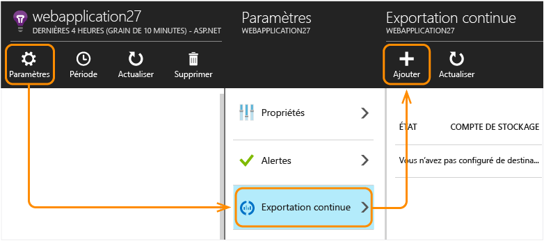
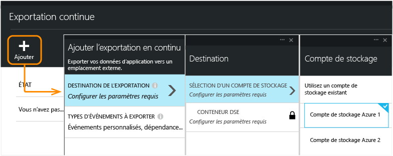
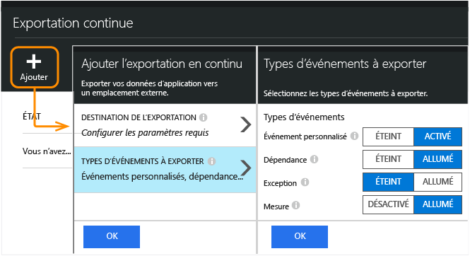
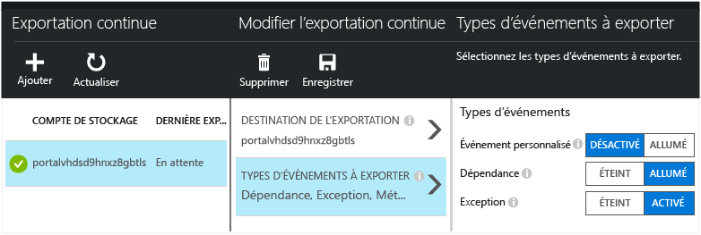
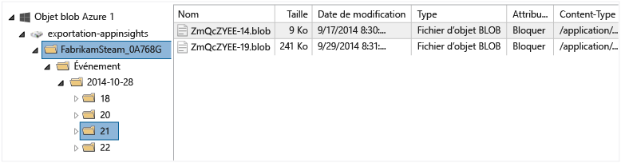
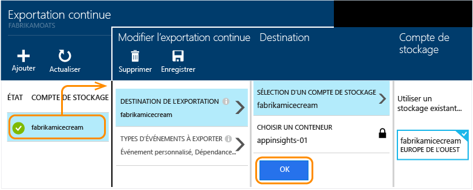

<properties 
	pageTitle="Exportation continue de télémétrie depuis Application Insights" 
	description="Exportez les données de diagnostic et les données d’utilisation dans le stockage Microsoft Azure et téléchargez-les à partir de là." 
	services="application-insights" 
    documentationCenter=""
	authors="alancameronwills" 
	manager="douge"/>

<tags 
	ms.service="application-insights" 
	ms.workload="tbd" 
	ms.tgt_pltfrm="ibiza" 
	ms.devlang="na" 
	ms.topic="article" 
	ms.date="03/01/2016" 
	ms.author="awills"/>
 
# Exporter la télémétrie depuis Application Insights

Vous souhaitez effectuer une analyse personnalisée de votre télémétrie ? Ou peut-être voulez-vous recevoir une alerte par courrier électronique pour les événements présentant des propriétés spécifiques ? L’exportation continue est idéale dans ce cas. Les événements que vous voyez dans le portail Application Insights peuvent être exportés vers le stockage Microsoft Azure au format JSON. À partir de là, vous pouvez télécharger vos données et écrire le code pour pouvoir les traiter.

L’exportation continue est disponible pendant la période d’essai gratuite et sur les [plans de tarification Standard et Premium](https://azure.microsoft.com/pricing/details/application-insights/).

>[AZURE.NOTE] Si vous cherchez à [explorer vos données dans Power BI](http://blogs.msdn.com/b/powerbi/archive/2015/11/04/explore-your-application-insights-data-with-power-bi.aspx), vous pouvez le faire sans utiliser l’exportation continue.
>
>Et si vous souhaitez uniquement effectuer une [exportation unique](app-insights-metrics-explorer.md#export-to-excel) de ce que vous voyez sur un panneau de mesures ou de recherche, cliquez sur Exporter en haut du panneau.

## Créer un compte de stockage

Si vous ne disposez pas d'un compte de stockage classique, créez-en un maintenant.

1. Créez un compte de stockage « classique » dans votre abonnement sur le [portail Azure](https://portal.azure.com).

    

2. Créez un conteneur.

    

##  Configuration de l’exportation continue

Dans le panneau Vue d’ensemble de votre application dans le portail Application Insights, ouvrez Exportation continue :

Ajoutez une exportation, puis choisissez le [compte de stockage Azure](../storage/storage-introduction.md) dans lequel vous souhaitez placer les données :

Choisissez les types d’événement que vous souhaitez exporter :

Une fois que vous avez créé l’exportation, elle démarre. (Vous n’obtenez que les données qui arrivent après la création de l’exportation.)

Il peut y avoir un délai d'environ une heure avant que les données n'apparaissent dans l'objet blob.

Si vous souhaitez modifier les types d’événement plus tard, modifiez simplement l’exportation :

Pour arrêter le flux de données, cliquez sur Désactiver. Lorsque vous cliquez de nouveau sur Activer, le flux de données redémarre avec de nouvelles données. Vous n’obtiendrez pas les données qui sont arrivées sur le portail alors que l’exportation était désactivée.

Pour arrêter définitivement le flux de données, supprimez l’exportation. Cette opération ne supprime pas vos données du stockage.

#### Impossible d’ajouter ou de modifier une exportation ?

* Pour ajouter ou modifier des exportations, vous devez disposer de droits d’accès de propriétaire, de collaborateur ou de collaborateur Application Insights. [En savoir plus sur les rôles][roles].

##  Quels sont les événements que vous obtenez ?

Les données exportées sont les données de télémétrie brutes que nous recevons de votre application. Toutefois, nous ajoutons les données d’emplacement que nous calculons à partir de l’adresse IP du client.

Les autres mesures calculées ne sont pas incluses. Par exemple, nous n’exportons pas l’utilisation moyenne du processeur, mais nous exportons la télémétrie brute à partir de laquelle la moyenne est calculée.

Les données incluent également les résultats de n’importe quel [test web de disponibilité](app-insights-monitor-web-app-availability.md) que vous avez configuré.

> [AZURE.NOTE] **Échantillonnage.** Si votre application envoie des données en grand nombre et si vous utilisez le Kit de développement logiciel Application Insights pour ASP.NET version 2.0.0-beta3 ou ultérieure, la fonctionnalité d’échantillonnage adaptatif peut fonctionner et transmettre uniquement un pourcentage de vos données de télémétrie. [En savoir plus sur l'échantillonnage.](app-insights-sampling.md)

##  Inspection des données

Vous pouvez inspecter le stockage directement sur le portail. Cliquez sur **Parcourir**, sélectionnez votre compte de stockage, puis ouvrez **Conteneurs**.

Pour examiner le stockage Azure dans Visual Studio, ouvrez **Afficher**, **Cloud Explorer**. (Si vous n’avez pas cette commande, vous devez installer le Kit de développement logiciel (SDK) Azure : ouvrez la boîte de dialogue **Nouveau projet**, développez Visual C#/Cloud et sélectionnez **Obtenir Microsoft Azure SDK pour .NET**.)

Lorsque vous ouvrez votre magasin d’objets blob, vous voyez un conteneur avec un ensemble de fichiers blob. L'URI de chaque fichier est dérivé du nom de votre ressource Application Insights, sa clé d'instrumentation, le type/la date/l'heure de télémétrie. (Le nom de la ressource est tout en minuscules et la clé d'instrumentation omet les tirets.)

La date et l’heure sont au format UTC et correspondent au moment où la télémétrie a été placée dans le magasin, et pas au moment où elle a été générée. Par conséquent, si vous écrivez du code pour télécharger les données, il peut parcourir les données de façon linéaire.

##  Format de données

* Chaque objet blob est un fichier texte qui contient plusieurs lignes séparées par des \\n.
* Chaque ligne est un document JSON sans mise en forme. Si vous souhaitez l'examiner, ouvrez-le dans Visual Studio et choisissez Modifier, Options avancées, Formater le fichier :

Les durées sont exprimées en nombre de cycles, où 10 000 cycles = 1 ms. Par exemple, ces valeurs indiquent une durée de 10 ms pour envoyer une demande à partir du navigateur, 30 ms pour la recevoir et 1,8 s pour traiter la page dans le navigateur :

	"sendRequest": {"value": 10000.0},
	"receiveRequest": {"value": 30000.0},
	"clientProcess": {"value": 17970000.0}

[Référence de modèle de données détaillé pour les valeurs et types de propriétés.](app-insights-export-data-model.md)

## Traitement des données

À petite échelle, vous pouvez écrire du code pour décomposer vos données, les lire dans une feuille de calcul et ainsi de suite. Par exemple :

    private IEnumerable<T> DeserializeMany<T>(string folderName)
    {
      var files = Directory.EnumerateFiles(folderName, "*.blob", SearchOption.AllDirectories);
      foreach (var file in files)
      {
         using (var fileReader = File.OpenText(file))
         {
            string fileContent = fileReader.ReadToEnd();
            IEnumerable<string> entities = fileContent.Split('\n').Where(s => !string.IsNullOrWhiteSpace(s));
            foreach (var entity in entities)
            {
                yield return JsonConvert.DeserializeObject<T>(entity);
            }
         }
      }
    }

Pour un exemple de code plus long, consultez [utilisation d’un rôle de travail][exportasa].

## Supprimer les anciennes données
Notez que vous êtes responsable de la gestion de votre capacité de stockage et de la suppression des anciennes données si nécessaire.

## Si vous régénérez votre clé de stockage...

Si vous modifiez la clé de votre stockage, l’exportation continue cesse de fonctionner. Vous voyez alors une notification dans votre compte Azure.

Ouvrez le panneau Exportation continue et modifiez votre exportation. Modifiez la destination de l’exportation, mais laissez le même stockage sélectionné. Cliquez sur OK pour confirmer.

L’exportation continue redémarre.

## Exemples d’exportation

* [Exportation vers SQL à l’aide d’un rôle de travail][exportcode]
* [Exporter vers SQL à l’aide de Stream Analytics][exportasa]
* [Exporter vers Power BI à l’aide de Stream Analytics](app-insights-export-power-bi.md)
 * Notez que ce n’est pas la méthode standard pour utiliser Power BI. Il existe [un adaptateur](http://blogs.msdn.com/b/powerbi/archive/2015/11/04/explore-your-application-insights-data-with-power-bi.aspx) ne nécessitant pas l’exportation continue.

À plus grande échelle, envisagez d’utiliser des clusters [HDInsight](https://azure.microsoft.com/services/hdinsight/) - Hadoop dans le cloud. HDInsight offre de nombreuses technologies pour gérer et analyser les données volumineuses.

## Questions et réponses

* *Je veux simplement télécharger un graphique.*  
 
    Oui, vous pouvez le faire. En haut du panneau, cliquez sur [Exporter les données](app-insights-metrics-explorer.md#export-to-excel).

* *J’ai configuré une exportation, mais il n’y a pas de données dans mon magasin.*

    Application Insights a-t-il reçu de la télémétrie de votre application depuis que vous avez configuré l’exportation ? Vous recevrez uniquement les nouvelles données.

* *J’ai essayé de configurer une exportation, mais l’accès lui a été refusé.*

    Si le compte appartient à votre organisation, vous devez être membre du groupe des propriétaires ou des collaborateurs.

* *Puis-je exporter directement vers mon propre magasin local ?*

    Non. Pour le moment, notre moteur d’exportation fonctionne uniquement avec le stockage Azure.

* *Existe-t-il une limite à la quantité de données qu’il est possible de placer dans mon magasin ?*

    Non. Nous transmettons les données jusqu’à ce que vous supprimiez l’exportation. Nous arrêtons si nous atteignons les limites extérieures du stockage d’objets blob, mais ceci représente un volume très important. C’est à vous de contrôler la quantité de stockage vous utilisez.

* *Combien d’objets blob devrais-je voir dans le stockage ?*

 * Pour chaque type de données que vous avez choisi d'exporter un objet blob est créé toutes les minutes (si les données sont disponibles).
 * En outre, pour les applications avec un trafic élevé, des unités de partition supplémentaires sont allouées. Dans ce cas, chaque unité crée un objet blob toutes les minutes.

* *J’ai régénéré la clé de mon espace de stockage ou modifié le nom du conteneur et l’exportation ne fonctionne plus.*

    Modifiez l’exportation et ouvrez le panneau de destination d’exportation. Conservez le même stockage que celui sélectionné auparavant, puis cliquez sur OK pour confirmer. L’exportation redémarre. Si la modification a eu lieu dans les derniers jours, vous ne perdrez pas de données.

* *Est-il possible de suspendre l’exportation ?*

    Oui. Cliquez sur Désactiver.

## Exemples de code

* [Diffusion d’Application Insights vers Power BI](app-insights-export-power-bi.md)
* [Analyse de JSON exporté à l’aide d’un rôle de travail][exportcode]
* [Exporter vers SQL à l’aide de Stream Analytics][exportasa]

* [Référence de modèle de données détaillé pour les valeurs et types de propriétés.](app-insights-export-data-model.md)

<!--Link references-->

[exportcode]: app-insights-code-sample-export-telemetry-sql-database.md
[exportasa]: app-insights-code-sample-export-sql-stream-analytics.md
[roles]: app-insights-resources-roles-access-control.md

 

<!---HONumber=AcomDC_0302_2016-->