<properties
	pageTitle="Prise en main de Visual Studio Application Insights | Microsoft Azure"
	description="Analysez l’utilisation, la disponibilité et les performances de votre application web locale ou Microsoft Azure avec Visual Studio Application Insights."
	services="application-insights"
    documentationCenter=""
	authors="alancameronwills"
	manager="douge"/>

<tags
	ms.service="application-insights"
	ms.workload="tbd"
	ms.tgt_pltfrm="ibiza"
	ms.devlang="na"
	ms.topic="hero-article"
	ms.date="11/17/2015"
	ms.author="awills"/>

# Prise en main de Visual Studio Application Insights

*Application Insights est à l'état de version préliminaire.*

Détecter et résoudre les problèmes et améliorer en permanence vos applications. Diagnostiquer rapidement les problèmes dans votre application en ligne. Comprendre comment vos utilisateurs l’utilisent.

La configuration est très facile et les résultats sont visibles après quelques minutes.

Pour l’instant, nous prenons en charge les applications iOS, Android et Windows, les applications web J2EE et ASP.NET, ainsi que les services WCF. Les applications web peuvent s’exécuter sur Azure ou sur vos propres serveurs locaux. Notre Kit de développement logiciel (SDK) JavaScript s’exécute sur n’importe quelle page web.

## Prise en main

Commencez par choisir certains points d’entrée du diagramme suivant dans l’ordre de votre choix. Suivez le chemin d’accès qui vous convient.

Application Insights fonctionne par l’ajout d’un kit de développement logiciel (SDK) à votre application, qui envoie la télémétrie au [portail Azure](http://portal.azure.com). Il existe différents Kits de développement logiciel (SDK) pour les nombreuses combinaisons de plateformes, de langages et d’IDE pris en charge.

Vous aurez besoin d’un compte [Microsoft Azure](http://azure.com). Vous disposez peut-être déjà d’un accès à un compte de groupe par le biais de votre entreprise, à moins que vous préfériez obtenir un compte de paiement à l’utilisation. Application Insights a un niveau Gratuit, vous n’avez donc pas besoin de payer tant que votre application n’est pas populaire. Consultez la [page de tarification](https://azure.microsoft.com/pricing/details/application-insights/).

Ce que vous voulez | Ce que vous devez faire | Ce que vous obtenez
---|---|---
 <a href="app-insights-start-monitoring-app-health-usage.md">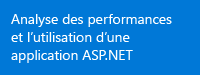</a> | <a href="app-insights-start-monitoring-app-health-usage.md">Ajouter le kit de développement logiciel (SDK) Application Insights à votre projet web</a>    | 
<a href="app-insights-monitor-performance-live-website-now.md">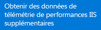</a> <a href="app-insights-monitor-performance-live-website-now.md">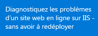</a>|<a href="app-insights-monitor-performance-live-website-now.md">Installer Status Monitor sur votre serveur IIS</a>    | <a href="app-insights-monitor-performance-live-website-now.md">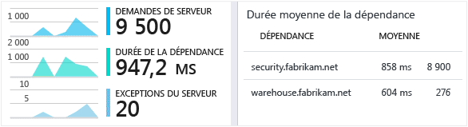</a>
<a href="insights-perf-analytics.md">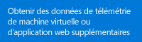</a>|<a href="insights-perf-analytics.md">Activer Insights dans votre application web ou sur votre machine virtuelle Azure</a>    | 
<a href="app-insights-java-get-started.md">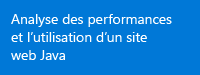</a>|<a href="app-insights-java-get-started.md">Ajouter le kit de développement logiciel (SDK) à votre projet Java</a>  | <a href="app-insights-java-get-started.md">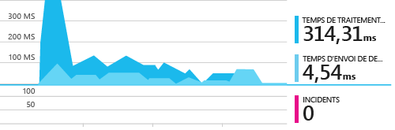</a>
|<a href="app-insights-web-track-usage.md">Insérer le script Application Insights dans vos pages web</a>  | <a href="app-insights-web-track-usage.md">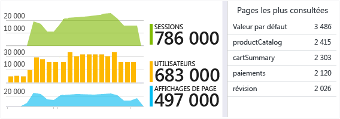</a>
<a href="app-insights-monitor-web-app-availability.md">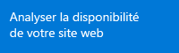</a>|<a href="app-insights-monitor-web-app-availability.md">Créer des tests web</a>  | <a href="app-insights-monitor-web-app-availability.md">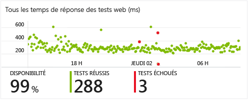</a>
<a href="app-insights-platforms.md">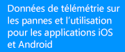</a>|<a href="http://hockeyapp.net">Utiliser HockeyApp</a>  | <a href="http://hockeyapp.net">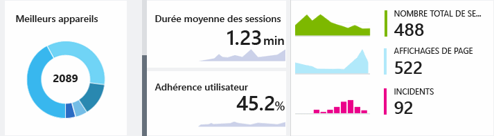</a>

## Support et commentaires

* Questions et problèmes :
 * [Résolution des problèmes][qna]
 * [Forum MSDN](https://social.msdn.microsoft.com/Forums/vstudio/fr-FR/home?forum=ApplicationInsights)
 * [Stackoverflow](http://stackoverflow.com/questions/tagged/ms-application-insights)
* Bogues :
 * [Connect](https://connect.microsoft.com/VisualStudio/Feedback/LoadSubmitFeedbackForm?FormID=6076)
* Suggestions
 * [User Voice](http://visualstudio.uservoice.com/forums/121579-visual-studio/category/77108-application-insights)
* Exemples de code
 * [Exemples de code](app-insights-code-samples.md)

## Vidéos

> [AZURE.VIDEO 218]

> [AZURE.VIDEO usage-monitoring-application-insights]

> [AZURE.VIDEO performance-monitoring-application-insights]

<!--Link references-->

[qna]: app-insights-troubleshoot-faq.md

<!---HONumber=AcomDC_1125_2015-->