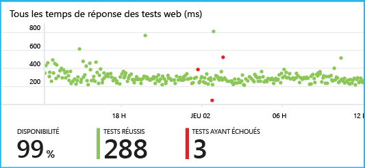

<properties 
	pageTitle="Prise en main d’Application Insights avec Java dans Eclipse" 
	description="Le plug-in Eclipse permet d’ajouter la surveillance des performances et de l’utilisation de votre site web Java avec Application Insights" 
	services="application-insights" 
    documentationCenter="java"
	authors="alancameronwills" 
	manager="douge"/>

<tags 
	ms.service="application-insights" 
	ms.workload="tbd" 
	ms.tgt_pltfrm="ibiza" 
	ms.devlang="na" 
	ms.topic="article" 
	ms.date="02/19/2016" 
	ms.author="awills"/>
 
# Prise en main d’Application Insights avec Java dans Eclipse

Le Kit de développement logiciel (SDK) Application Insights envoie la télémétrie de votre application web Java afin que vous puissiez en analyser les performances et l’utilisation. Le plug-in Eclipse pour Application Insights installe automatiquement le Kit de développement logiciel (SDK) dans votre projet pour pouvoir bénéficier de la télémétrie de base, plus une API avec laquelle vous pouvez écrire des éléments de télémétrie personnalisés.

## Composants requis

Actuellement, le plug-in fonctionne pour les projets Web dynamiques dans Eclipse. ([Ajout d’Application Insights à d’autres types de projets Java][java].)

Vous devez disposer des éléments suivants :

* Oracle JRE 1.6 ou version ultérieure
* Un abonnement [Microsoft Azure](https://azure.microsoft.com/). (Vous pouvez commencer par l’[essai gratuit](https://azure.microsoft.com/pricing/free-trial/).)
* [IDE Eclipse pour développeurs Java EE](http://www.eclipse.org/downloads/), Indigo ou version ultérieure.
* Windows 7 ou version ultérieure ou Windows Server 2008 ou version ultérieure

## Installer le Kit de développement logiciel (SDK) sur Eclipse (opération unique)

Vous ne devez effectuer cette opération qu’une seule fois par machine. Cette étape installe un kit de ressources qui peut ensuite ajouter le Kit de développement logiciel (SDK) pour chaque projet web dynamique.

1. Dans Eclipse, cliquez sur Aide, Installer un nouveau logiciel.

    

2. Le Kit de développement logiciel (SDK) se trouve dans http://dl.windowsazure.com/eclipse, sous Azure Toolkit.
3. Désactivez l’option **Contacter tous les sites de mise à jour...**.

    

Suivez les étapes restantes pour chaque projet Java.

## Créer une ressource Application Insights dans Azure

1. Connectez-vous au [portail Azure](https://portal.azure.com).
2. 

## Ajout de Application Insights à votre projet

1. Ajoutez Application Insights à partir du menu contextuel de votre projet Web Java.

    

2. Collez la clé d’instrumentation que vous avez obtenue sur le portail Azure.

    

La clé est envoyée avec chaque élément de télémétrie et indique à Application Insights de l’afficher dans votre ressource.

## Exécuter l’application et consulter les mesures

Exécutez votre application.

Revenez à votre ressource Application Insights dans Microsoft Azure.

Les données des demandes HTTP apparaissent dans le panneau Vue d’ensemble. (Si elles n’y sont pas, attendez quelques secondes et cliquez sur Actualiser).

 

Cliquez sur un des graphiques pour afficher des mesures plus détaillées.

[En savoir plus sur les mesures.][metrics]

 

Lorsque vous affichez les propriétés d’une demande, vous voyez les événements de télémétrie associés, par exemple les demandes et les exceptions.
 

## Télémétrie côté client

Dans le panneau Démarrage rapide, cliquez sur Obtenir le code pour analyser mes pages web :

Insérez l'extrait de code dans l’en-tête de vos fichiers HTML.

#### Affichage des données côté client

Ouvrez et utilisez vos pages web mises à jour. Attendez une minute ou deux, puis revenez dans Application Insights et ouvrez le panneau d'utilisation. (Dans le panneau Vue d'ensemble, faites défiler vers le bas et cliquez sur Utilisation.)

Les mesures liées au nombre de consultations de la page, à l’utilisateur et à la session s’affichent dans le panneau d’utilisation :

[En savoir plus sur la configuration de la télémétrie côté client.][usage]

## Publication de votre application

Publiez maintenant votre application sur le serveur, laissez le temps aux usagers de l’utiliser, puis observez les données de télémétrie qui s’affichent sur le portail.

* Assurez-vous que votre pare-feu autorise votre application à envoyer les données de télémétrie vers ces ports :

 * dc.services.VisualStudio.com:443
 * dc.services.visualstudio.com:80
 * f5.services.visualstudio.com:443
 * f5.services.visualstudio.com:80

* Sur les serveurs Windows, installez :

 * [Redistribuable Microsoft Visual C++](http://www.microsoft.com/download/details.aspx?id=40784)

    (Cette opération active les compteurs de performances.)

## Exceptions et échecs de requêtes

Les exceptions non gérées sont collectées automatiquement :

Pour collecter les données concernant d’autres exceptions, vous disposez de deux options :

* [Insérez des appels à TrackException dans votre code](app-insights-api-custom-events-metrics.md#track-exception). 
* [Installez l’agent Java sur votre serveur](app-insights-java-agent.md). Vous spécifiez les méthodes que vous souhaitez surveiller.

## Surveiller les appels de méthode et les dépendances externes

[Installez l’agent Java](app-insights-java-agent.md) pour journaliser les méthodes internes spécifiées et les appels effectués via JDBC, avec des données de minutage.

## Compteurs de performances

Dans le panneau Vue d'ensemble, faites défiler vers le bas et cliquez sur la vignette **Serveurs**. Vous verrez un ensemble de compteurs de performances.

### Personnaliser la collecte des compteurs de performances

Pour désactiver la collecte du jeu standard de compteurs de performances, ajoutez le code suivant sous le nœud racine du fichier ApplicationInsights.xml :

    <PerformanceCounters>
       <UseBuiltIn>False</UseBuiltIn>
    </PerformanceCounters>

### Collecter des compteurs de performances supplémentaires

Vous pouvez spécifier d'autres compteurs de performances à collecter.

#### Compteurs JMX (exposés par la machine virtuelle Java)

    <PerformanceCounters>
      <Jmx>
        <Add objectName="java.lang:type=ClassLoading" attribute="TotalLoadedClassCount" displayName="Loaded Class Count"/>
        <Add objectName="java.lang:type=Memory" attribute="HeapMemoryUsage.used" displayName="Heap Memory Usage-used" type="composite"/>
      </Jmx>
    </PerformanceCounters>

*	`displayName` : nom affiché sur le portail Application Insights.
*	`objectName` : nom de l'objet JMX.
*	`attribute`  attribut du nom d'objet JMX à récupérer
*	`type` (facultatif) : type d'attribut d'objet JMX :
 *	Par défaut : un type simple, comme int ou long.
 *	`composite` : les données du compteur de performances sont au format « Attribute.Data »
 *	`tabular` : les données du compteur de performances sont au format ligne de tableau

#### Compteurs de performances Windows

Chaque [compteur de performances Windows](https://msdn.microsoft.com/library/windows/desktop/aa373083.aspx) est un membre d'une catégorie (de la même façon qu'un champ est un membre d'une classe). Les catégories peuvent être globales ou peuvent avoir des instances numérotées ou nommées.

    <PerformanceCounters>
      <Windows>
        <Add displayName="Process User Time" categoryName="Process" counterName="%User Time" instanceName="__SELF__" />
        <Add displayName="Bytes Printed per Second" categoryName="Print Queue" counterName="Bytes Printed/sec" instanceName="Fax" />
      </Windows>
    </PerformanceCounters>

*	displayName : nom affiché sur le portail Application Insights.
*	categoryName : catégorie du compteur de performances (objet de performances) à laquelle ce compteur de performances est associé.
*	counterName : nom du compteur de performances.
*	instanceName : nom de l'instance de catégorie de compteur de performances ou une chaîne vide ("") si la catégorie contient une seule instance. Si categoryName est Process et que le compteur de performance que vous souhaitez collecter vient du processus en cours de la JVM sur laquelle votre application s'exécute, spécifiez `"__SELF__"`.

Les compteurs de performances sont visibles en tant que mesures personnalisées dans [Metrics Explorer][metrics].

### Compteurs de performances Unix

* [Installez collectd avec le plug-in Application Insights](app-insights-java-collectd.md) pour obtenir une grande variété de données sur le système et le réseau.

## Tests web de disponibilité

Application Insights peut tester votre site web à intervalles réguliers pour vérifier qu’il fonctionne et répond correctement. Pour exécuter la [configuration][availability], faites défiler la liste vers le bas pour cliquer sur Disponibilité.

Vous obtenez des graphiques du temps de réponse, ainsi que des notifications par courrier électronique si votre site ne fonctionne plus.

[En savoir plus sur les tests de disponibilité web.][availability]

## Journaux de diagnostic

Si vous utilisez Logback ou Log4J (v1.2 ou v2.0) pour le suivi, vous pouvez faire en sorte que vos journaux de suivi soient envoyés automatiquement à Application Insights, où vous pouvez les explorer et effectuer des recherches.

[En savoir plus sur les journaux de diagnostic][javalogs]

## Télémétrie personnalisée 

Insérez quelques lignes de code dans votre application web Java pour découvrir ce qu’en font les utilisateurs ou pour faciliter le diagnostic des problèmes.

Vous pouvez insérer le code dans le JavaScript de la page web et dans le Java côté serveur.

[En savoir plus sur la télémétrie personnalisée][track]

## Étapes suivantes

#### Détecter et diagnostiquer les problèmes

* [Ajoutez la télémétrie de client web][usage] pour obtenir la télémétrie des performances du client web.
* [Configurez les tests web][availability] pour vous assurer que votre application est bien active.
* [Recherchez les événements et les journaux][diagnostic] pour diagnostiquer les problèmes.
* [Capturez le suivi Log4J ou Logback.][javalogs]

#### Suivi de l'utilisation

* [Ajoutez la télémétrie de client web][usage] pour surveiller les affichages de page et autres mesures utilisateur de base.
* [Suivez des événements et des mesures personnalisés][track] pour en savoir plus sur la façon dont votre application est utilisée, à la fois sur le client et sur le serveur.

<!--Link references-->

[availability]: app-insights-monitor-web-app-availability.md
[diagnostic]: app-insights-diagnostic-search.md
[java]: app-insights-java-get-started.md
[javalogs]: app-insights-java-trace-logs.md
[metrics]: app-insights-metrics-explorer.md
[track]: app-insights-api-custom-events-metrics.md
[usage]: app-insights-web-track-usage.md

 

<!---HONumber=AcomDC_0224_2016-->