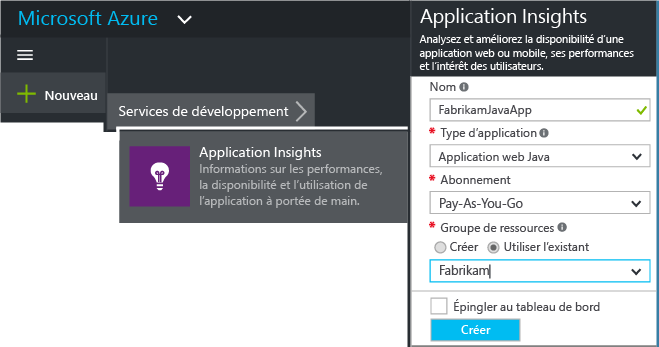
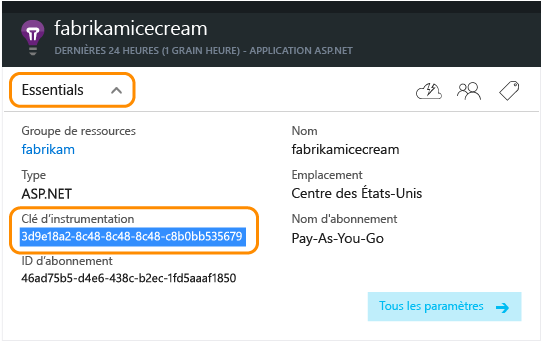
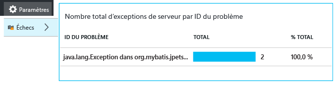
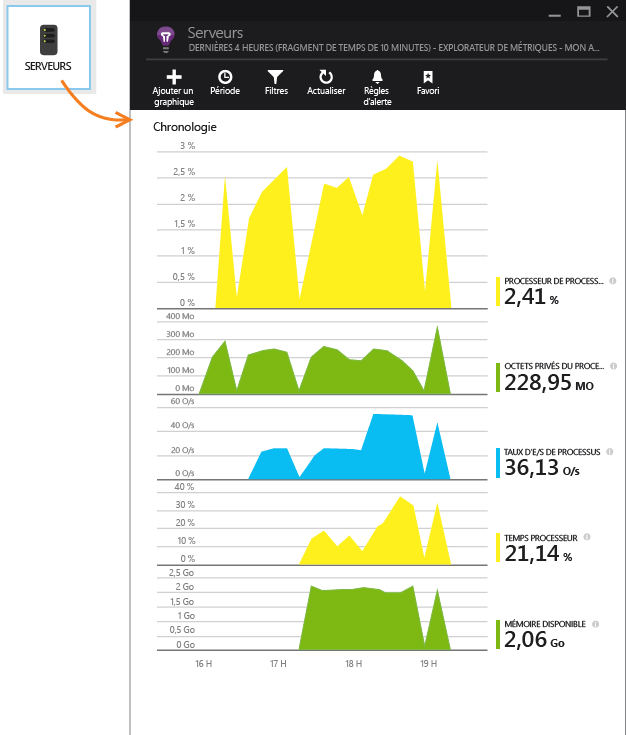
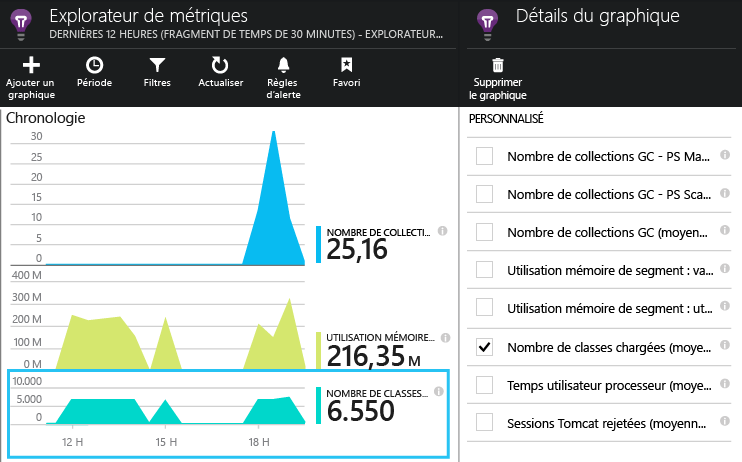

# Prise en main d'Application Insights dans un projet web Java
*Application Insights est à l'état de version préliminaire.*

[!INCLUDE [app-insights-selector-get-started](../../includes/app-insights-selector-get-started.md)]

[Application Insights](https://azure.microsoft.com/services/application-insights/) est un service d’analyse extensible qui vous permet de comprendre les performances et l’utilisation de votre application en direct. Utilisez-le pour [détecter et diagnostiquer les problèmes de performances et les exceptions](app-insights-detect-triage-diagnose.md), ainsi que pour [écrire du code][api] afin de suivre ce que font les utilisateurs avec votre application.

Application Insights prend en charge les applications Java exécutées sur Linux, Unix ou Windows.

Ce dont vous avez besoin :

* Oracle JRE 1.6 ou version ultérieure ou Zoulou JRE 1.6 ou version ultérieure
* Un abonnement à [Microsoft Azure](https://azure.microsoft.com/). (Vous pouvez commencer par l'[essai gratuit](https://azure.microsoft.com/pricing/free-trial/).)

*Si vous disposez d’une application web déjà active, vous pouvez suivre la procédure alternative destinée à [ajouter le Kit de développement logiciel (SDK) au moment de l’exécution dans le serveur web](app-insights-java-live.md). Cette alternative évite la régénération du code, mais ne vous permet pas d’écrire du code pour effectuer le suivi de l’activité des utilisateurs.*

## 1\. Obtenir une clé d'instrumentation Application Insights
1. Connectez-vous au [portail Microsoft Azure](https://portal.azure.com).
2. Créez une ressource Application Insights. Définissez le type d’application sur Application web Java.
   
    
3. Obtenez la clé d'instrumentation de la nouvelle ressource. Vous devrez la coller rapidement dans le code de votre projet.
   
    

## 2\. Ajoutez le Kit de développement logiciel (SDK) Application Insights pour Java à votre projet
*Choisissez la méthode adaptée à votre projet.*

#### Si vous utilisez Eclipse pour créer un projet Maven ou un projet web dynamique...
Utilisez le [Kit de développement logiciel (SDK) Application Insights pour plug-in Java][eclipse].

#### Si vous utilisez Maven...
Si votre projet est déjà configuré pour être assemblé avec Maven, fusionnez le code suivant dans votre fichier pom.xml.

Actualisez ensuite les dépendances du projet pour télécharger les fichiers binaires.

    <repositories>
       <repository>
          <id>central</id>
          <name>Central</name>
          <url>http://repo1.maven.org/maven2</url>
       </repository>
    </repositories>

    <dependencies>
      <dependency>
        <groupId>com.microsoft.azure</groupId>
        <artifactId>applicationinsights-web</artifactId>
        <!-- or applicationinsights-core for bare API -->
        <version>[1.0,)</version>
      </dependency>
    </dependencies>

* *Des erreurs de validation de build ou de somme de contrôle ?* Essayez d’utiliser une version spécifique, telle que : `<version>1.0.n</version>`. Vous trouverez la version la plus récente dans les [notes de publication du Kit de développement logiciel (SDK)](https://github.com/Microsoft/ApplicationInsights-Java#release-notes) ou dans nos [artefacts Maven](http://search.maven.org/#search%7Cga%7C1%7Capplicationinsights).
* *Besoin de mettre à jour vers un nouveau Kit de développement logiciel (SDK) ?* Actualisez les dépendances de votre projet.

#### Si vous utilisez Gradle...
Si votre projet est déjà configuré pour être assemblé avec Gradle, fusionnez le code suivant dans votre fichier build.gradle.xml.

Actualisez ensuite les dépendances du projet pour télécharger les fichiers binaires.

    repositories {
      mavenCentral()
    }

    dependencies {
      compile group: 'com.microsoft.azure', name: 'applicationinsights-web', version: '1.+'
      // or applicationinsights-core for bare API
    }

* *Erreurs de validation de build ou de somme de contrôle ? Essayez d’utiliser une version spécifique, telle que :* `version:'1.0.n'`. *Vous trouverez la version la plus récente dans les [notes de publication du kit de développement logiciel (SDK)](https://github.com/Microsoft/ApplicationInsights-Java#release-notes).*
* *Pour effecteur la mise à jour vers un nouveau kit de développement logiciel (SDK)*
* Actualisez les dépendances de votre projet.

#### Sinon...
Ajouter manuellement le Kit de développement logiciel :

1. Téléchargez le [Kit de développement logiciel (SDK) Application Insights pour Java](https://aka.ms/aijavasdk).
2. Décompressez les fichiers binaires du fichier zip et ajoutez-les à votre projet.

### Questions...
* *Quelle est la relation entre les composants `-core` et `-web` du fichier zip ?*
* `applicationinsights-core` vous fournit l’API seule. Ce composant est toujours requis.
* `applicationinsights-web` fournit des mesures qui permettent d’effectuer le suivi du nombre de requêtes HTTP et des temps de réponse. Vous pouvez omettre ce composant si vous ne souhaitez pas recueillir automatiquement ces données de télémétrie. Par exemple, si vous préférez écrire vos propres mesures.
* *Pour mettre à jour le Kit de développement logiciel lorsque nous publions des modifications*
* Téléchargez le dernier [Kit de développement logiciel Application Insights pour Java](https://aka.ms/qqkaq6) et remplacez les anciens Kits.
* Les modifications sont décrites dans le [notes de publication du kit de développement logiciel (SDK)](https://github.com/Microsoft/ApplicationInsights-Java#release-notes).

## 3\. Ajouter un fichier .xml Application Insights
Ajoutez ApplicationInsights.xml dans le dossier de ressources de votre projet, ou vérifiez qu’il est ajouté au chemin de la classe du déploiement de votre projet. Copiez-y le code XML suivant.

Remplacez la clé d'instrumentation que avez obtenue sur le portail Azure.

    <?xml version="1.0" encoding="utf-8"?>
    <ApplicationInsights xmlns="http://schemas.microsoft.com/ApplicationInsights/2013/Settings" schemaVersion="2014-05-30">

      <!-- The key from the portal: -->

      <InstrumentationKey>** Your instrumentation key **</InstrumentationKey>

      <!-- HTTP request component (not required for bare API) -->

      <TelemetryModules>
        <Add type="com.microsoft.applicationinsights.web.extensibility.modules.WebRequestTrackingTelemetryModule"/>
        <Add type="com.microsoft.applicationinsights.web.extensibility.modules.WebSessionTrackingTelemetryModule"/>
        <Add type="com.microsoft.applicationinsights.web.extensibility.modules.WebUserTrackingTelemetryModule"/>
      </TelemetryModules>

      <!-- Events correlation (not required for bare API) -->
      <!-- These initializers add context data to each event -->

      <TelemetryInitializers>
        <Add   type="com.microsoft.applicationinsights.web.extensibility.initializers.WebOperationIdTelemetryInitializer"/>
        <Add type="com.microsoft.applicationinsights.web.extensibility.initializers.WebOperationNameTelemetryInitializer"/>
        <Add type="com.microsoft.applicationinsights.web.extensibility.initializers.WebSessionTelemetryInitializer"/>
        <Add type="com.microsoft.applicationinsights.web.extensibility.initializers.WebUserTelemetryInitializer"/>
        <Add type="com.microsoft.applicationinsights.web.extensibility.initializers.WebUserAgentTelemetryInitializer"/>

      </TelemetryInitializers>
    </ApplicationInsights>

* La clé d'instrumentation est envoyée avec chaque élément de télémétrie et indique à Application Insights de l'afficher dans votre ressource.
* Le composant de demande HTTP est facultatif. Il envoie automatiquement la télémétrie concernant les demandes et les temps de réponse au portail.
* La corrélation des événements est un complément au composant de demande HTTP. Il assigne un identificateur à chaque demande reçue par le serveur et l'ajoute comme propriété de chaque élément de télémétrie en tant que propriété « Operation.Id ». Il vous permet de mettre en corrélation la télémétrie associée à chaque demande en définissant un filtre dans [recherche de diagnostic][diagnostic].
* La clé Application Insights peut être transmise de manière dynamique à partir du Portail Azure sous la forme d’une propriété système (-DAPPLICATION\_INSIGHTS\_IKEY=votre\_iKey). Si aucune propriété n’est définie, la variable d’environnement (APPLICATION\_INSIGHTS\_IKEY) est recherchée dans les paramètres d’application Azure. Si aucune de ces deux propriétés n’est définie, la clé InstrumentationKey par défaut est utilisée à partir d’ApplicationInsights.xml. Cette séquence vous aide à gérer dynamiquement divers éléments InstrumentationKeys pour différents environnements.

### Autres méthodes pour définir la clé d’instrumentation
Le kit de développement logiciel (SDK) d’Application Insights recherche la clé dans cet ordre :

1. Propriété système : -DAPPLICATION\_INSIGHTS\_IKEY=votre\_ikey
2. Variable d’environnement : APPLICATION\_INSIGHTS\_IKEY
3. Fichier de configuration : ApplicationInsights.xml

Vous pouvez également [définir la clé dans le code](app-insights-api-custom-events-metrics.md#ikey) :

    telemetryClient.InstrumentationKey = "...";

## 4\. Ajouter un filtre HTTP
La dernière étape de la configuration permet au composant de demande HTTP de consigner toutes les demandes web. (Non requis si vous voulez juste l'API seule.)

Recherchez et ouvrez le fichier web.xml dans votre projet et fusionnez le code suivant sous le nœud de l'application web, où vos filtres d'application sont configurés.

Pour obtenir des résultats plus précis, le filtre doit être mappé avant tous les autres filtres.

    <filter>
      <filter-name>ApplicationInsightsWebFilter</filter-name>
      <filter-class>
        com.microsoft.applicationinsights.web.internal.WebRequestTrackingFilter
      </filter-class>
    </filter>
    <filter-mapping>
       <filter-name>ApplicationInsightsWebFilter</filter-name>
       <url-pattern>/*</url-pattern>
    </filter-mapping>

#### Si vous utilisez Spring Web MVC 3.1 ou une version ultérieure
Modifiez ces éléments pour inclure le package Application Insights :

    <context:component-scan base-package=" com.springapp.mvc, com.microsoft.applicationinsights.web.spring"/>

    <mvc:interceptors>
        <mvc:interceptor>
            <mvc:mapping path="/**"/>
            <bean class="com.microsoft.applicationinsights.web.spring.RequestNameHandlerInterceptorAdapter" />
        </mvc:interceptor>
    </mvc:interceptors>

#### Si vous utilisez Struts 2
Ajoutez cet élément au fichier de configuration Struts (généralement struts.xml ou struts-default.xml) :

     <interceptors>
       <interceptor name="ApplicationInsightsRequestNameInterceptor" class="com.microsoft.applicationinsights.web.struts.RequestNameInterceptor" />
     </interceptors>
     <default-interceptor-ref name="ApplicationInsightsRequestNameInterceptor" />

(Si vous avez défini des intercepteurs dans une pile par défaut, l'intercepteur peut simplement être ajouté à cette pile).

## 5\. Exécuter votre application
Exécutez-le en mode débogage sur votre ordinateur de développement, ou publiez-le sur votre serveur.

## 6\. Voir votre télémétrie dans Application Insights
Revenez à votre ressource Application Insights sur le [portail Microsoft Azure](https://portal.azure.com).

Les données des demandes HTTP apparaissent dans le panneau Vue d’ensemble. (Si elles n’y sont pas, attendez quelques secondes et cliquez sur Actualiser).

[En savoir plus sur les mesures.][metrics]

Cliquez sur un des graphiques pour afficher des métriques agrégées plus détaillées.

> Application Insights repose sur l’hypothèse que le format des requêtes HTTP pour les applications MVC est le suivant : `VERB controller/action`. Par exemple, `GET Home/Product/f9anuh81`, `GET Home/Product/2dffwrf5` et `GET Home/Product/sdf96vws` sont regroupés dans `GET Home/Product`. Ceci permet l'agrégation correcte des demandes, par exemple le nombre de demandes et le temps moyen d'exécution des demandes.
> 
> 

### Données d’instance
Cliquez sur un type de demande spécifique pour afficher les instances individuelles.

Deux types de données s’affichent dans Application Insights : des données agrégées, stockées et affichées sous forme de moyennes, de nombres et de sommes ; et les données d’instance : des rapports individuels des requêtes HTTP, des exceptions, les vues de page ou des événements personnalisés.

Lorsque vous affichez les propriétés d’une demande, vous voyez les événements de télémétrie associés, par exemple les demandes et les exceptions.

### Analytics : un puissant langage de requête
En accumulant toujours plus de données, vous pouvez exécuter des requêtes à la fois pour agréger les données et pour rechercher des instances individuelles. [Analytics]() est un outil puissant qui permet non seulement de comprendre les performances et l’utilisation, mais également d’effectuer des diagnostics.

## 7\. Installer votre application sur le serveur
Publiez maintenant votre application sur le serveur, laissez le temps aux usagers de l’utiliser, puis observez les données de télémétrie qui s’affichent sur le portail.

* Assurez-vous que votre pare-feu autorise votre application à envoyer les données de télémétrie vers ces ports :
* dc.services.VisualStudio.com:443
* f5.services.visualstudio.com:443
* Sur les serveurs Windows, installez :
* [Redistribuable Microsoft Visual C++](http://www.microsoft.com/download/details.aspx?id=40784)
  
    (Cette opération active les compteurs de performances.)

## Exceptions et échecs de requêtes
Les exceptions non gérées sont collectées automatiquement :

Pour collecter les données concernant d’autres exceptions, vous disposez de deux options :

* [Insérez des appels à TrackException() dans votre code][apiexceptions].
* [Installez l’agent Java sur votre serveur](app-insights-java-agent.md). Vous spécifiez les méthodes que vous souhaitez surveiller.

## Surveiller les appels de méthode et les dépendances externes
[Installez l’agent Java](app-insights-java-agent.md) pour journaliser les méthodes internes spécifiées et les appels effectués via JDBC, avec des données de minutage.

## Compteurs de performances
Ouvrez **Paramètres**, **Serveurs** afin d’afficher une gamme de compteurs de performances.

### Personnaliser la collecte des compteurs de performances
Pour désactiver la collecte du jeu standard de compteurs de performances, ajoutez le code suivant sous le nœud racine du fichier ApplicationInsights.xml :

    <PerformanceCounters>
       <UseBuiltIn>False</UseBuiltIn>
    </PerformanceCounters>

### Collecter des compteurs de performances supplémentaires
Vous pouvez spécifier d'autres compteurs de performances à collecter.

#### Compteurs JMX (exposés par la machine virtuelle Java)
    <PerformanceCounters>
      <Jmx>
        <Add objectName="java.lang:type=ClassLoading" attribute="TotalLoadedClassCount" displayName="Loaded Class Count"/>
        <Add objectName="java.lang:type=Memory" attribute="HeapMemoryUsage.used" displayName="Heap Memory Usage-used" type="composite"/>
      </Jmx>
    </PerformanceCounters>

* `displayName` : nom affiché sur le portail Application Insights.
* `objectName` : nom de l'objet JMX.
* `attribute`  attribut du nom d'objet JMX à récupérer
* `type` (facultatif) : type d'attribut d'objet JMX :
  * Par défaut : un type simple, comme int ou long.
  * `composite` : les données du compteur de performances sont au format « Attribute.Data »
  * `tabular` : les données du compteur de performances sont au format ligne de tableau

#### Compteurs de performances Windows
Chaque [compteur de performances Windows](https://msdn.microsoft.com/library/windows/desktop/aa373083.aspx) est un membre d'une catégorie (de la même façon qu'un champ est un membre d'une classe). Les catégories peuvent être globales ou peuvent avoir des instances numérotées ou nommées.

    <PerformanceCounters>
      <Windows>
        <Add displayName="Process User Time" categoryName="Process" counterName="%User Time" instanceName="__SELF__" />
        <Add displayName="Bytes Printed per Second" categoryName="Print Queue" counterName="Bytes Printed/sec" instanceName="Fax" />
      </Windows>
    </PerformanceCounters>

* displayName : nom affiché sur le portail Application Insights.
* categoryName : catégorie du compteur de performances (objet de performances) à laquelle ce compteur de performances est associé.
* counterName : nom du compteur de performances.
* instanceName : nom de l'instance de catégorie de compteur de performances ou une chaîne vide ("") si la catégorie contient une seule instance. Si categoryName est Process et que le compteur de performance que vous souhaitez collecter vient du processus en cours de la JVM sur laquelle votre application s'exécute, spécifiez `"__SELF__"`.

Les compteurs de performances sont visibles en tant que mesures personnalisées dans [Metrics Explorer][metrics].

### Compteurs de performances Unix
* [Installez collectd avec le plug-in Application Insights](app-insights-java-collectd.md) pour obtenir une grande variété de données sur le système et le réseau.

## Obtenir des données utilisateur et de session
Vous envoyez des données de télémétrie depuis votre serveur web. Vous pouvez désormais ajouter plus de surveillance pour obtenir une vue à 360 degrés de votre application :

* [Ajoutez la télémétrie à vos pages web][usage] pour surveiller les affichages de pages et les mesures relatives à l’utilisateur.
* [Configurez les tests web][availability] pour vous assurer que votre application est bien active.

## Capture le suivi des journaux
Vous pouvez utiliser Application Insights pour traiter les journaux Log4J, Logback ou autres frameworks de journalisation. Vous pouvez mettre en corrélation les journaux avec les demandes HTTP et autres informations de télémétrie. [Découvrez comment][javalogs].

## Envoyer votre propre télémétrie
Maintenant que vous avez installé le Kit de développement logiciel (SDK), vous pouvez utiliser l'API pour envoyer votre propre télémétrie.

* [Suivez des événements et des mesures personnalisés][api] pour savoir ce que les utilisateurs font avec votre application.
* [Recherchez les événements et les journaux][diagnostic] pour diagnostiquer les problèmes.

## Tests web de disponibilité
Application Insights peut tester votre site web à intervalles réguliers pour vérifier qu’il fonctionne et répond correctement. [Pour configurer][availability], cliquez sur Tests web.

Vous obtenez des graphiques du temps de réponse, ainsi que des notifications par courrier électronique si votre site ne fonctionne plus.

[En savoir plus sur les tests de disponibilité web.][availability]

## Des questions ? Des problèmes ?
[Résolution des problèmes Java](app-insights-java-troubleshoot.md)

## Étapes suivantes
Pour plus d’informations, consultez le [Centre pour développeurs Java](/develop/java/).

<!--Link references-->

[api]: app-insights-api-custom-events-metrics.md
[apiexceptions]: app-insights-api-custom-events-metrics.md#track-exception
[availability]: app-insights-monitor-web-app-availability.md
[diagnostic]: app-insights-diagnostic-search.md
[eclipse]: app-insights-java-eclipse.md
[javalogs]: app-insights-java-trace-logs.md
[metrics]: app-insights-metrics-explorer.md
[usage]: app-insights-web-track-usage.md

<!---HONumber=AcomDC_0817_2016-->