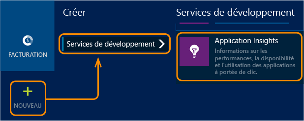

<properties 
	pageTitle="Prise en main d'Application Insights dans un projet web Java" 
	description="Surveiller les performances et l'utilisation de votre site web Java avec Application Insights" 
	services="application-insights" 
    documentationCenter="java"
	authors="alancameronwills" 
	manager="ronmart"/>

<tags 
	ms.service="application-insights" 
	ms.workload="tbd" 
	ms.tgt_pltfrm="ibiza" 
	ms.devlang="na" 
	ms.topic="article" 
	ms.date="04/26/2015" 
	ms.author="awills"/>
 
# Prise en main d'Application Insights dans un projet web Java

*Application Insights est à l'état de version préliminaire.*

[AZURE.INCLUDE [app-insights-selector-get-started](../../includes/app-insights-selector-get-started.md)]

En ajoutant Visual Studio Application Insights à votre projet, vous pouvez détecter et diagnostiquer les problèmes de performances et les exceptions.

En outre, vous pouvez configurer des [tests web][availability] pour surveiller la disponibilité de votre application et insérer du [code dans vos pages web][track] pour comprendre les différents types d'utilisation.

Vous devez disposer des éléments suivants :

* Oracle JRE 1.6 ou version ultérieure ou Zoulou JRE 1.6 ou version ultérieure
* Un abonnement [Microsoft Azure](http://azure.microsoft.com/). (Vous pouvez commencer par l'[essai gratuit](http://azure.microsoft.com/pricing/free-trial/).)

## 1. Obtenir une clé d'instrumentation Application Insights

1. Connectez-vous au [portail Microsoft Azure](https://portal.azure.com).
2. Créer une ressource Application Insights dans Azure

    
3. Définissez le type d'application sur application web Java.

    
4. Obtenez la clé d'instrumentation de la nouvelle ressource. Vous devrez la coller rapidement dans le code de votre projet.

    

## 2. Ajoutez le Kit de développement logiciel (SDK) Application Insights pour Java à votre projet

*Choisissez la méthode adaptée à votre projet.*

#### Si vous créez un projet web dynamique dans Eclipse...

Utilisez le [Kit de développement logiciel (SDK) Application Insights pour plug-in Java][eclipse].

#### Si vous utilisez Maven...

Si votre projet est déjà configuré pour être assemblé avec Maven, fusionnez l'extrait de code suivant dans votre fichier pom.xml.

Actualisez ensuite les dépendances du projet pour télécharger les fichiers binaires.

    <repositories>
       <repository>
          <id>central</id>
          <name>Central</name>
          <url>http://repo1.maven.org/maven2</url>
       </repository>
    </repositories>

    <dependencies>
      <dependency>
        <groupId>com.microsoft.azure</groupId>
        <artifactId>applicationinsights-web</artifactId>
        <!-- or applicationinsights-core for bare API -->
        <version>[0.9,)</version>
      </dependency>
    </dependencies>

* *Erreurs de validation de build ou de somme de contrôle ? Essayez d'utiliser une version spécifique :* `<version>0.9.3</version>`

#### Si vous utilisez Gradle...

Si votre projet est déjà configuré pour être assemblé avec Gradle, fusionnez l'extrait de code suivant dans votre fichier build.gradle.xml.

Actualisez ensuite les dépendances du projet pour télécharger les fichiers binaires.

    repositories {
      mavenCentral()
    }

    dependencies {
      compile group: 'com.microsoft.azure', name: 'applicationinsights-web', version: '0.9.+'
      // or applicationinsights-core for bare API
    }

* *Erreurs de validation de build ou de somme de contrôle ? Essayez d'utiliser une version spécifique :* `version:'0.9.3'`

#### Sinon...

Ajouter manuellement le Kit de développement logiciel :

1. Téléchargez les [bibliothèques Azure pour Java](http://dl.msopentech.com/lib/PackageForWindowsAzureLibrariesForJava.html)
2. Décompressez les fichiers binaires suivants du fichier zip et ajoutez-les à votre projet :
 * applicationinsights-core
 * applicationinsights-web
 * commons-codec
 * commons-io
 * commons-lang
 * commons-logging
 * guava
 * httpclient
 * httpcore
 * jsr305

*Quelle est la relation entre les composants `-core` et `-web` ?*

`applicationinsights-core` vous fournit l'API système sans aucune télémétrie automatique. `applicationinsights-web` vous offre des mesures de suivi du nombre de demandes HTTP et des temps de réponse.

## 3. Ajouter un fichier xml Application Insights

Ajoutez ApplicationInsights.xml au dossier de ressources de votre projet. Copiez-y le code XML suivant.

Remplacez la clé d'instrumentation que avez obtenue sur le portail Azure.

    <?xml version="1.0" encoding="utf-8"?>
    <ApplicationInsights xmlns="http://schemas.microsoft.com/ApplicationInsights/2013/Settings" schemaVersion="2014-05-30">

      <!-- The key from the portal: -->

      <InstrumentationKey>** Your instrumentation key **</InstrumentationKey>

      <!-- HTTP request component (not required for bare API) -->

      <TelemetryModules>
        <Add type="com.microsoft.applicationinsights.web.extensibility.modules.WebRequestTrackingTelemetryModule"/>
        <Add type="com.microsoft.applicationinsights.web.extensibility.modules.WebSessionTrackingTelemetryModule"/>
        <Add type="com.microsoft.applicationinsights.web.extensibility.modules.WebUserTrackingTelemetryModule"/>
      </TelemetryModules>

      <!-- Events correlation (not required for bare API) -->
      <!-- These initializers add context data to each event -->

      <TelemetryInitializers>
        <Add   type="com.microsoft.applicationinsights.web.extensibility.initializers.WebOperationIdTelemetryInitializer"/>
        <Add type="com.microsoft.applicationinsights.web.extensibility.initializers.WebOperationNameTelemetryInitializer"/>
        <Add type="com.microsoft.applicationinsights.web.extensibility.initializers.WebSessionTelemetryInitializer"/>
        <Add type="com.microsoft.applicationinsights.web.extensibility.initializers.WebUserTelemetryInitializer"/>
        <Add type="com.microsoft.applicationinsights.web.extensibility.initializers.WebUserAgentTelemetryInitializer"/>

      </TelemetryInitializers>
    </ApplicationInsights>

* La clé d'instrumentation est envoyée avec chaque élément de télémétrie et indique à Application Insights de l'afficher dans votre ressource.
* Le composant de demande HTTP est facultatif. Il envoie automatiquement la télémétrie concernant les demandes et les temps de réponse au portail.
* La corrélation des événements est un complément au composant de demande HTTP. Il assigne un identificateur à chaque demande reçue par le serveur et l'ajoute comme propriété de chaque élément de télémétrie en tant que propriété « Operation.Id ». Il vous permet de mettre en corrélation la télémétrie associée à chaque demande en définissant un filtre dans [recherche de diagnostic][diagnostic].

## 4. Ajouter un filtre HTTP

La dernière étape de la configuration permet au composant de demande HTTP de consigner toutes les demandes web. (Non requis si vous voulez juste l'API seule.)

Recherchez et ouvrez le fichier web.xml dans votre projet et fusionnez l'extrait de code suivant sous le nœud de l'application web, où vos filtres d'application sont configurés.

Pour obtenir des résultats plus précis, le filtre doit être mappé avant tous les autres filtres.

    <filter>
      <filter-name>ApplicationInsightsWebFilter</filter-name>
      <filter-class>
        com.microsoft.applicationinsights.web.internal.WebRequestTrackingFilter
      </filter-class>
    </filter>
    <filter-mapping>
       <filter-name>ApplicationInsightsWebFilter</filter-name>
       <url-pattern>/*</url-pattern>
    </filter-mapping>

#### Si vous utilisez MVC 3.1 ou version ultérieure

Modifiez ces éléments pour inclure le package Application Insights :

    <context:component-scan base-package=" com.springapp.mvc, com.microsoft.applicationinsights.web.spring"/>

    <mvc:interceptors>
        <mvc:interceptor>
            <mvc:mapping path="/**"/>
            <bean class="com.microsoft.applicationinsights.web.spring.RequestNameHandlerInterceptorAdapter" />
        </mvc:interceptor>
    </mvc:interceptors>

#### Si vous utilisez Struts 2

Ajoutez cet élément au fichier de configuration Struts (généralement struts.xml ou struts-default.xml) :

     <interceptors>
       <interceptor name="ApplicationInsightsRequestNameInterceptor" class="com.microsoft.applicationinsights.web.struts.RequestNameInterceptor" />
     </interceptors>
     <default-interceptor-ref name="ApplicationInsightsRequestNameInterceptor" />

(Si vous avez défini des intercepteurs dans une pile par défaut, l'intercepteur peut simplement être ajouté à cette pile).

## 5. Voir votre télémétrie dans Application Insights

Exécutez votre application.

Revenez à votre ressource Application Insights dans Microsoft Azure.

Les données des demandes HTTP apparaissent dans le panneau Vue d'ensemble. (Si elles n'y sont pas, attendez quelques secondes et puis cliquez sur Actualiser).

 

Cliquez sur n'importe quel graphique pour afficher des mesures plus détaillées.

 

Et lorsque vous affichez les propriétés d'une demande, vous voyez les événements de télémétrie associés, par exemple les demandes et les exceptions.
 

[En savoir plus sur les mesures.][metrics]

#### Calcul du nom de l'adresse intelligente

Application Insights part du principe que le format des demandes HTTP pour les applications MVC est : `VERB controller/action`

Par exemple, `GET Home/Product/f9anuh81`, `GET Home/Product/2dffwrf5` et `GET Home/Product/sdf96vws` seront regroupés dans `GET Home/Product`.

Ceci permet l'agrégation correcte des demandes, par exemple le nombre de demandes et le temps moyen d'exécution des demandes.

## 5. Compteurs de performances

Cliquez sur la vignette des serveurs et vous verrez un ensemble de compteurs de performances.

### Personnalisation de la collecte des compteurs de performances

Pour désactiver la collecte du jeu standard de compteurs de performances, ajoutez l'extrait de code suivant sous le nœud racine du fichier ApplicationInsights.xml :

    <PerformanceCounters>
       <UseBuiltIn>False</UseBuiltIn>
    </PerformanceCounters>

### Collecte de compteurs de performances supplémentaires

Vous pouvez spécifier d'autres compteurs de performances à collecter.

#### Compteurs JMX (exposés par la machine virtuelle Java)

    <PerformanceCounters>
      <Jmx>
        <Add objectName="java.lang:type=ClassLoading" attribute="TotalLoadedClassCount" displayName="Loaded Class Count"/>
        <Add objectName="java.lang:type=Memory" attribute="HeapMemoryUsage.used" displayName="Heap Memory Usage-used" type="composite"/>
      </Jmx>
    </PerformanceCounters>

*	`displayName` : nom affiché sur le portail Application Insights.
*	`objectName` : nom de l'objet JMX.
*	`attribute`  attribut du nom d'objet JMX à récupérer
*	`type` (facultatif) : type d'attribut d'objet JMX :
 *	Par défaut : un type simple, comme int ou long.
 *	`composite` : les données du compteur de performances sont au format « Attribute.Data »
 *	`tabular` : les données du compteur de performances sont au format ligne de tableau

#### Compteurs de performances Windows (64 bits) 

Chaque [compteur de performances Windows](https://msdn.microsoft.com/library/windows/desktop/aa373083.aspx) est un membre d'une catégorie (de la même façon qu'un champ est un membre d'une classe). Les catégories peuvent être globales ou peuvent avoir des instances numérotées ou nommées.

    <PerformanceCounters>
      <Windows>
        <Add displayName="Process User Time" categoryName="Process" counterName="%User Time" instanceName="__SELF__" />
        <Add displayName="Bytes Printed per Second" categoryName="Print Queue" counterName="Bytes Printed/sec" instanceName="Fax" />
      </Windows>
    </PerformanceCounters>

*	displayName : nom affiché sur le portail Application Insights
*	categoryName : catégorie du compteur de performances (objet de performances) à laquelle ce compteur de performances est associé
*	counterName : nom du compteur de performances
*	instanceName : nom de l'instance de catégorie de compteur de performances ou une chaîne vide ("") si la catégorie contient une seule instance. Si categoryName est Process et que le compteur de performance que vous souhaitez collecter vient du processus en cours de la JVM sur laquelle votre application s'exécute, spécifiez `"__SELF__"`.

Les compteurs de performances sont visibles en tant que mesures personnalisées dans [Metrics Explorer][metrics].

## 6. Capture le suivi des journaux

Vous pouvez utiliser Application Insights pour traiter les journaux Log4J, Logback ou autres frameworks de journalisation. Vous pouvez mettre en corrélation les journaux avec les demandes HTTP et autres informations de télémétrie. [Découvrez comment][javalogs].

## 7. Envoyer votre propre télémétrie

Maintenant que vous avez installé le Kit de développement logiciel (SDK), vous pouvez utiliser l'API pour envoyer votre propre télémétrie.

* [Suivez des événements et des mesures personnalisés][track] pour savoir ce que les utilisateurs font avec votre application.
* [Recherchez les événements et les journaux][diagnostic] pour diagnostiquer les problèmes.

En outre, vous pouvez ajouter d'autres fonctionnalités d'Application Insights à votre application :

* [Ajoutez la télémétrie de client web][usage] pour surveiller les affichages de page et autres mesures utilisateur de base.
* [Configurez les tests web][availability] pour vous assurer que votre application est bien active.

## Des questions ? Des problèmes ?

[Résolution des problèmes Java](app-insights-java-troubleshoot.md)

<!--Link references-->

[availability]: app-insights-monitor-web-app-availability.md
[diagnostic]: app-insights-diagnostic-search.md
[eclipse]: app-insights-java-eclipse.md
[javalogs]: app-insights-java-trace-logs.md
[metrics]: app-insights-metrics-explorer.md
[track]: app-insights-custom-events-metrics-api.md
[usage]: app-insights-web-track-usage.md

<!--HONumber=54--> 