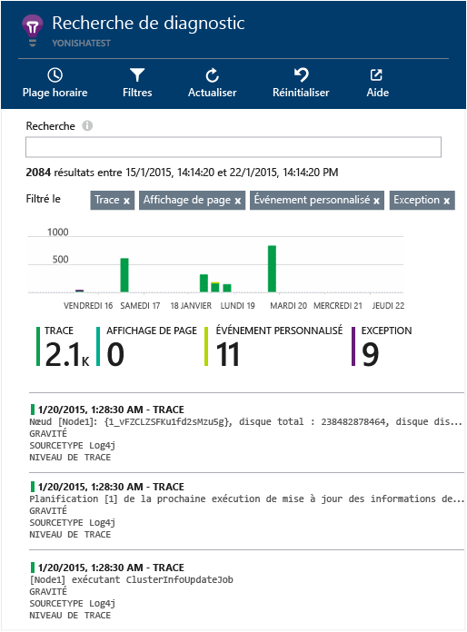

# <a name="explore-java-trace-logs-in-application-insights"></a>Exploration du suivi des journaux Java dans Application Insights
Si vous utilisez Logback ou Log4J (v1.2 ou v2.0) pour le suivi, vous pouvez faire en sorte que vos journaux de suivi soient envoyés automatiquement à Application Insights, où vous pouvez les explorer et effectuer des recherches.

## <a name="install-the-java-sdk"></a>Installer le Kit de développement logiciel (SDK) Java

Installez le [kit de développement logiciel (SDK) Application Insights pour Java][java], si ce n’est pas déjà fait.

(Si vous ne voulez pas suivre les demandes HTTP, vous pouvez omettre la majeure partie du fichier de configuration .xml, mais vous devez inclure au moins l’élément `InstrumentationKey`. Vous devez également appeler `new TelemetryClient()` pour initialiser le Kit de développement logiciel [SDK].)


## <a name="add-logging-libraries-to-your-project"></a>Ajouter des bibliothèques de journalisation à votre projet
*Choisissez la méthode adaptée à votre projet.*

#### <a name="if-youre-using-maven"></a>Si vous utilisez Maven...
Si votre projet est déjà configuré pour être assemblé avec Maven, fusionnez les extraits de code suivants dans votre fichier pom.xml.

Actualisez ensuite les dépendances du projet pour télécharger les fichiers binaires.

*Logback*

```XML

    <dependencies>
       <dependency>
          <groupId>com.microsoft.azure</groupId>
          <artifactId>applicationinsights-logging-logback</artifactId>
          <version>[1.0,)</version>
       </dependency>
    </dependencies>
```

*Log4J v2.0*

```XML

    <dependencies>
       <dependency>
          <groupId>com.microsoft.azure</groupId>
          <artifactId>applicationinsights-logging-log4j2</artifactId>
          <version>[1.0,)</version>
       </dependency>
    </dependencies>
```

*Log4J v1.2*

```XML

    <dependencies>
       <dependency>
          <groupId>com.microsoft.azure</groupId>
          <artifactId>applicationinsights-logging-log4j1_2</artifactId>
          <version>[1.0,)</version>
       </dependency>
    </dependencies>
```

#### <a name="if-youre-using-gradle"></a>Si vous utilisez Gradle...
Si votre projet est déjà configuré pour utiliser Gradle, ajoutez une des lignes suivantes au groupe `dependencies` dans votre fichier build.gradle :

Actualisez ensuite les dépendances du projet pour télécharger les fichiers binaires.

**Logback**

```

    compile group: 'com.microsoft.azure', name: 'applicationinsights-logging-logback', version: '1.0.+'
```

**Log4J v2.0**

```
    compile group: 'com.microsoft.azure', name: 'applicationinsights-logging-log4j2', version: '1.0.+'
```

**Log4J v1.2**

```
    compile group: 'com.microsoft.azure', name: 'applicationinsights-logging-log4j1_2', version: '1.0.+'
```

#### <a name="otherwise-"></a>Sinon...
Téléchargez et décompressez l’appender approprié, puis ajoutez la bibliothèque qui convient à votre projet :

| Enregistreur | Télécharger | Bibliothèque |
| --- | --- | --- |
| Logback |[Kit de développement logiciel (SDK) avec appender Logback](https://aka.ms/xt62a4) |applicationinsights-logging-logback |
| Log4J v2.0 |[Kit de développement logiciel (SDK) avec appender Log4J v2](https://aka.ms/qypznq) |applicationinsights-logging-log4j2 |
| Log4J v1.2 |[Kit de développement logiciel (SDK) avec appender Log4J v1.2](https://aka.ms/ky9cbo) |applicationinsights-logging-log4j1_2 |

## <a name="add-the-appender-to-your-logging-framework"></a>Ajouter l’appender à votre infrastructure de journalisation
Pour recevoir le suivi, fusionnez l’extrait de code approprié dans le fichier de configuration Log4J ou Logback : 

*Logback*

```XML

    <appender name="aiAppender" 
      class="com.microsoft.applicationinsights.logback.ApplicationInsightsAppender">
    </appender>
    <root level="trace">
      <appender-ref ref="aiAppender" />
    </root>
```

*Log4J v2.0*

```XML

    <Configuration packages="com.microsoft.applicationinsights.Log4j">
      <Appenders>
        <ApplicationInsightsAppender name="aiAppender" />
      </Appenders>
      <Loggers>
        <Root level="trace">
          <AppenderRef ref="aiAppender"/>
        </Root>
      </Loggers>
    </Configuration>
```

*Log4J v1.2*

```XML

    <appender name="aiAppender" 
         class="com.microsoft.applicationinsights.log4j.v1_2.ApplicationInsightsAppender">
    </appender>
    <root>
      <priority value ="trace" />
      <appender-ref ref="aiAppender" />
    </root>
```

Les appenders Application Insights peuvent être référencés par n’importe quel enregistreur configuré et pas nécessairement par l’enregistreur racine (comme indiqué dans les exemples de code ci-dessus).

## <a name="explore-your-traces-in-the-application-insights-portal"></a>Explorer le suivi dans le portail Application Insights
Maintenant que vous avez configuré votre projet pour qu’il envoie le suivi à Application Insights, vous pouvez rechercher et consulter ce suivi dans le portail Application Insights, dans le panneau [Recherche][diagnostic].



## <a name="next-steps"></a>Étapes suivantes
[Recherche de diagnostic][diagnostic]

<!--Link references-->

[diagnostic]: app-insights-diagnostic-search.md
[java]: app-insights-java-get-started.md


<!--HONumber=Dec16_HO2-->


