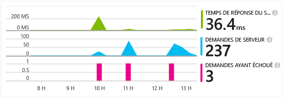
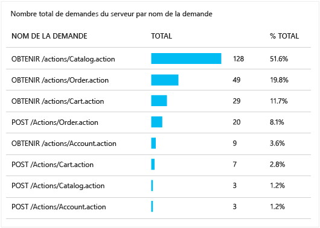
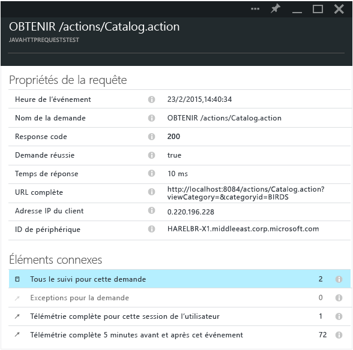

<properties 
	pageTitle="Suivre les demandes HTTP dans une application web Java" 
	description="Application Insights vous permet de mesurer les performances de votre application web Java" 
	services="application-insights" 
    documentationCenter=""
	authors="alancameronwills" 
	manager="keboyd"/>

<tags 
	ms.service="application-insights" 
	ms.workload="tbd" 
	ms.tgt_pltfrm="ibiza" 
	ms.devlang="na" 
	ms.topic="article" 
	ms.date="05/26/2015" 
	ms.author="awills"/>
 
# Suivre les demandes HTTP dans une application web Java

Si vous exécutez une application web Java, vous pouvez afficher dans le portail Application Insights des informations sur les demandes HTTP envoyées à votre application, comme les ressources demandées, les demandes ayant échoué et les temps de réponse.

Installez le [kit de développement logiciel (SDK) Application Insights pour Java][java], si ce n'est pas déjà fait.

## Ajouter les fichiers binaires à votre projet

*Choisissez la méthode adaptée à votre projet.*

### Si vous utilisez Maven...

Si votre projet est déjà configuré pour être assemblé avec Maven, fusionnez l'extrait de code suivant dans votre fichier pom.xml.

Actualisez ensuite les dépendances du projet pour télécharger les fichiers binaires.

    <dependencies>
      <dependency>
        <groupId>com.microsoft.azure</groupId>
        <artifactId>applicationinsights-web</artifactId>
        <version>[0.9,)</version>
      </dependency>
    </dependencies>

### Si vous utilisez Gradle...

Si votre projet est déjà configuré pour être assemblé avec Gradle, fusionnez l'extrait de code suivant dans votre fichier build.gradle.xml.

Actualisez ensuite les dépendances du projet pour télécharger les fichiers binaires.

    dependencies {
      compile group: 'com.microsoft.azure', name: 'applicationinsights-web', version: '0.9.+'
    }

## Ajouter le filtre HTTP Application Insights à votre projet

Recherchez et ouvrez le fichier web.xml dans votre projet et fusionnez l'extrait de code suivant sous le nœud de l'application web, où vos filtres d'application sont configurés.

Pour obtenir des résultats plus précis, le filtre doit être mappé avant tous les autres filtres.

    <filter>
      <filter-name>ApplicationInsightsWebFilter</filter-name>
      <filter-class>
        com.microsoft.applicationinsights.web.internal.WebRequestTrackingFilter
      </filter-class>
    </filter>
    <filter-mapping>
       <filter-name>ApplicationInsightsWebFilter</filter-name>
       <url-pattern>/*</url-pattern>
    </filter-mapping>

## Ajouter les modules HTTP à votre projet

Recherchez et ouvrez le fichier ApplicationInsights.xml dans votre projet et fusionnez l'extrait de code suivant sous l'élément <TelemetryModules>.

S'il n'y a aucun élément <TelemetryModules> dans ce fichier, ajoutez-en un sous l'élément <ApplicationInsights>.

    <TelemetryModules>
      <Add type="com.microsoft.applicationinsights.web.extensibility.modules.WebRequestTrackingTelemetryModule"/>
      <Add type="com.microsoft.applicationinsights.web.extensibility.modules.WebSessionTrackingTelemetryModule"/>
      <Add type="com.microsoft.applicationinsights.web.extensibility.modules.WebUserTrackingTelemetryModule"/>
    </TelemetryModules>

## Ajouter des initialiseurs de télémétrie pour la corrélation des événements

Avec la corrélation des événements, vous pouvez associer une demande HTTP et tous les événements de télémétrie qui ont été envoyés au cours du traitement de la demande à l'aide d'une propriété d'ID d'opération associée à chacun de ces événements de télémétrie. Ceci permet d'explorer une demande HTTP en même temps que tous les événements qui ont été appelés depuis cette demande, ce qui facilite le diagnostic et la résolution des problèmes.

Recherchez et ouvrez le fichier ApplicationInsights.xml dans votre projet et fusionnez l'extrait de code suivant sous l'élément <TelemetryInitializers>.

S'il n'y a aucun élément < TelemetryInitializers> dans ce fichier, ajoutez-en un sous l'élément <ApplicationInsights>.

    <TelemetryInitializers>
     <Add  type="com.microsoft.applicationinsights.web.extensibility.initializers.WebOperationIdTelemetryInitializer"/>
     <Add type="com.microsoft.applicationinsights.web.extensibility.initializers.WebOperationNameTelemetryInitializer"/>
     <Add type="com.microsoft.applicationinsights.web.extensibility.initializers.WebSessionTelemetryInitializer"/>
     <Add type="com.microsoft.applicationinsights.web.extensibility.initializers.WebUserTelemetryInitializer"/>
     <Add type="com.microsoft.applicationinsights.web.extensibility.initializers.WebUserAgentTelemetryInitializer"/>
    </TelemetryInitializers>

## Voir les informations sur les demandes dans Application Insights

Exécutez votre application.

Revenez à votre ressource Application Insights dans Microsoft Azure.

Les données des demandes HTTP apparaissent dans le panneau Vue d’ensemble. (Si elles n’y sont pas, attendez quelques secondes et cliquez sur Actualiser).

 

Cliquez sur un des graphiques pour afficher des mesures plus détaillées.

[En savoir plus sur les mesures.][metrics]

 

Lorsque vous affichez les propriétés d’une demande, vous voyez les événements de télémétrie associés, par exemple les demandes et les exceptions.
 

## Étapes suivantes

* [Rechercher les événements et les journaux][diagnostic] pour diagnostiquer les problèmes.
* [Capturer le suivi Log4J ou Logback][javalogs]

<!--Link references-->

[diagnostic]: app-insights-diagnostic-search.md
[java]: app-insights-java-get-started.md
[javalogs]: app-insights-java-trace-logs.md
[metrics]: app-insights-metrics-explorer.md

 

<!---HONumber=July15_HO3-->