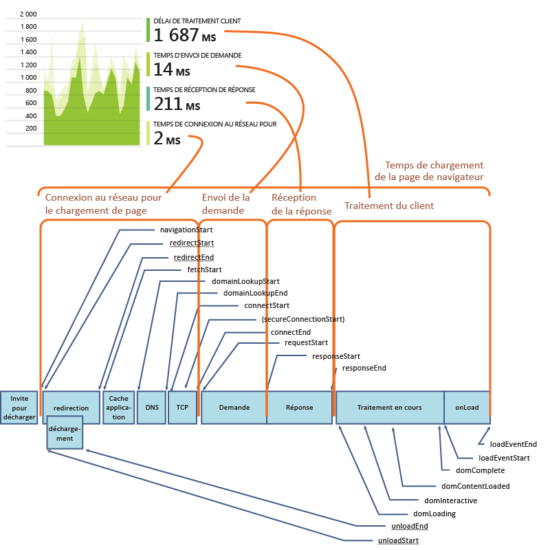
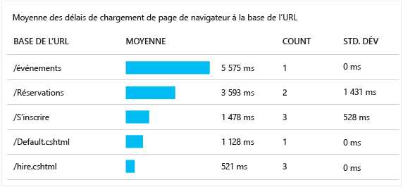
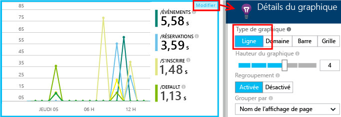
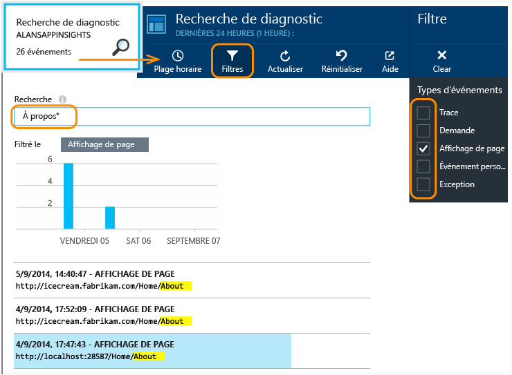

<properties
	pageTitle="Application Insights pour les applications Web JavaScript | Microsoft Azure"
	description="Obtention des décomptes de sessions et d’affichages de pages, des données de client web et suivi des modèles d’utilisation. Détection des problèmes de performances et des exceptions dans les pages Web JavaScript."
	services="application-insights"
    documentationCenter=""
	authors="alancameronwills"
	manager="douge"/>

<tags
	ms.service="application-insights"
	ms.workload="tbd"
	ms.tgt_pltfrm="ibiza"
	ms.devlang="na"
	ms.topic="get-started-article"
	ms.date="05/18/2016"
	ms.author="awills"/>

# Application Insights pour les pages web

[AZURE.INCLUDE [app-insights-selector-get-started-dotnet](../../includes/app-insights-selector-get-started-dotnet.md)]

Apprenez-en plus sur les performances et l’utilisation de votre page web ou de votre application. Ajoutez Visual Studio Application Insights à votre script de page pour obtenir le minutage des chargements de page et des appels AJAX, le nombre d’exceptions du navigateur et d’échecs d’AJAX et leurs détails, ainsi que le nombre d’utilisateurs et de sessions. Toutes ces données peuvent être segmentées par page, par version de système d’exploitation ou de navigateur client, par emplacement géographique et en fonction d’autres aspects. Vous pouvez également définir des alertes en cas de dépassement d’un certain nombre d’échecs ou de ralentissement du chargement des pages.

Vous pouvez utiliser Application Insights avec toutes les pages web ; il vous suffit pour cela d’ajouter un court extrait de code JavaScript. Si votre service web est [Java](app-insights-java-get-started.md) ou [ASP.NET](app-insights-asp-net.md), vous pouvez intégrer les données de télémétrie de votre serveur et de vos clients.

Vous devrez vous abonner à [Microsoft Azure](https://azure.com). Si votre équipe dispose d’un abonnement d’organisation, demandez à son propriétaire d’y ajouter votre compte Microsoft. Il existe un niveau de tarification gratuit, ce qui fait que le développement et l’utilisation à petite échelle ne coûtent rien.

## Configurer Application Insights pour votre page web

Application Insights est peut-être déjà configuré. Si votre application est un nouveau projet ASP.NET et vous avez choisi d’ajouter Application Insights dans la boîte de dialogue Nouveau projet de Visual Studio, le script a été ajouté à ce moment-là et vous n’avez rien à faire.

Si ce n’est pas le cas, vous devez ajouter un extrait de code à vos pages web en procédant comme suit.

### Ouverture d’une ressource Application Insights

La ressource Application Insights est l’endroit où les données de performance et d’utilisation de votre page s’affichent.

Connectez-vous au [portail Azure](https://portal.azure.com).

Si vous avez déjà défini la surveillance pour le côté serveur de votre application, vous aurez déjà une ressource :

Si vous n'en avez pas, créez-la.

*Vous avez déjà des questions ?* [Plus d’informations sur la création d’une ressource](app-insights-create-new-resource.md).

### Ajoutez le script du Kit de développement logiciel (SDK) à votre application ou vos pages web

Dans Démarrage rapide, récupérez le script pour les pages Web :

Insérez-le juste avant la balise `<head>` de chaque page que vous voulez suivre. Si votre site Web possède une page maître, vous pouvez y placer le script. Par exemple :

* Dans un projet ASP.NET MVC, vous devez placer le script dans `View\Shared\_Layout.cshtml`.
* Dans un site SharePoint, dans le panneau de configuration, ouvrez [Paramètres du site/Page maître](app-insights-sharepoint.md).

Le script contient la clé d’instrumentation qui dirige les données vers votre ressource Application Insights.

([Explication approfondie du script.](http://apmtips.com/blog/2015/03/18/javascript-snippet-explained/))

*(Si vous utilisez une infrastructure de page web connue, cherchez des adaptateurs Application Insights. Par exemple, il existe [un module AngularJS](http://ngmodules.org/modules/angular-appinsights).)*

## Configuration détaillée

Bien que vous puissiez définir plusieurs [paramètres](https://github.com/Microsoft/ApplicationInsights-JS/blob/master/API-reference.md#config), vous ne devriez pas avoir besoin de le faire dans la plupart des cas. Par exemple, vous pouvez limiter le nombre d’appels Ajax signalés par affichage de page ou désactiver leur signalement (pour réduire le trafic), ou encore définir le mode débogage pour que les données de télémétrie transitent rapidement à travers le pipeline sans être traitées par lot.

Pour définir ces paramètres, recherchez cette ligne dans l’extrait de code et ajoutez des éléments séparés par des virgules à la suite de celle-ci :

    })({
      instrumentationKey: "..."
      // Insert here
    });

Les [paramètres disponibles](https://github.com/Microsoft/ApplicationInsights-JS/blob/master/API-reference.md#config) incluent :

    // Send telemetry immediately without batching.
    // Remember to remove this when no longer required, as it
    // can affect browser performance.
    enableDebug: true,

    // Don't log browser exceptions.
    disableExceptionTracking: true,

    // Don't log ajax calls.
    disableAjaxTracking: boolean,

    // Limit number of Ajax calls logged, to reduce traffic.
    maxAjaxCallsPerView: 10, // default is 500

    // Time page load up to execution of first trackPageView().
    overridePageViewDuration: boolean,

    // Set these dynamically for an authenticated user.
    appUserId: string,
    accountId: string,

## Exécution de votre application

Exécutez votre application web, utilisez-la un certain temps pour générer de la télémétrie et attendez quelques secondes. Vous pouvez l’exécuter en appuyant sur la touche **F5** de votre machine de développement, ou la publier et laisser les utilisateurs s’en servir.

Si vous souhaitez vérifier la télémétrie qu’une application web envoie à Application Insights, utilisez les outils de débogage de votre navigateur (**F12** sur de nombreux navigateurs). Les données sont envoyées à dc.services.visualstudio.com.

## Exploration de vos données de performances dans les navigateurs

Ouvrez le panneau Navigateurs pour afficher la synthèse des données de performances issues des navigateurs des utilisateurs.

*Pas de données pour le moment ? Cliquez sur **Actualiser** en haut de la page. Toujours rien ? Consultez la rubrique [Résolution des problèmes](app-insights-troubleshoot-faq.md).*

Le panneau Navigateurs est un [panneau Metrics Explorer](app-insights-metrics-explorer.md) présentant des filtres et des graphiques prédéfinis. Si vous le souhaitez, vous pouvez modifier l’intervalle de temps, les filtres et la configuration des graphiques, puis enregistrer le résultat en tant que favori. Cliquez sur **Paramètres par défaut** pour revenir à la configuration d’origine du panneau.

## Performances de chargement des pages

Dans la partie supérieure se trouve un graphique segmenté illustrant le temps de chargement des pages. La hauteur totale du graphique représente la durée moyenne nécessaire pour charger et afficher les pages de votre application dans les navigateurs de vos utilisateurs. La durée est mesurée entre le moment où le navigateur envoie la requête HTTP initiale et le moment où tous les événements de chargement synchrones ont été traités, y compris la mise en page et l’exécution des scripts. Elle n’inclut pas les tâches asynchrones telles que le chargement des composants web à partir des appels AJAX.

Le graphique segmente le temps de chargement total des pages suivant les [durées standard définies par le consortium W3C](http://www.w3.org/TR/navigation-timing/#processing-model).

Notez que la durée de *connexion réseau* est souvent plus faible que prévue, car il s’agit d’une moyenne de toutes les demandes du navigateur au serveur. De nombreuses requêtes individuelles ont un temps de connexion de 0, car il existe déjà une connexion active au serveur.

### Le chargement est lent ?

Les pages qui mettent du temps à se charger constituent une source de mécontentement majeure pour vos utilisateurs. Si le graphique indique des chargements de page lents, il est facile de faire des recherches pour diagnostiquer le problème.

Le graphique illustre la moyenne de tous les chargements de page dans votre application. Pour voir si le problème est limité à certaines pages, regardez plus bas dans le panneau, où vous trouverez une grille segmentée par URL de page :

Observez le nombre d’affichages de page et l’écart type. Si le nombre de pages est très faible, alors le problème n’a pas un impact important sur les utilisateurs. Un écart type élevé (comparable à la moyenne elle-même) indique une variation considérable entre les mesures individuelles.

**Zoomez sur une URL et un affichage de page.** Cliquez sur n’importe quel nom de page pour afficher un panneau de graphiques de navigateur filtrés en fonction de cette URL, puis sur une instance d’un affichage de page.

Cliquez sur `...` pour obtenir une liste complète des propriétés de cet événement ou examinez les appels Ajax et les événements associés. S’ils sont synchrones, les appels Ajax lents ont un impact sur le temps de chargement de l’ensemble de la page. Les événements associés incluent les requêtes de serveur pour la même URL (si vous avez configuré Application Insights sur votre serveur web).

**Historique des performances de la page.** Dans le panneau Navigateurs, convertissez la grille Temps de chargement de la page consultée en graphique en courbes pour voir s’il y a des pics à des moments spécifiques :

**Segmentation en fonction d’autres aspects.** Vos pages mettent peut-être plus de temps à se charger sur un navigateur ou un système d’exploitation spécifiques, ou encore selon l’emplacement géographique de l’utilisateur ? Ajoutez un nouveau graphique et faites des essais avec l’option **Grouper par**.

## Performances AJAX

Assurez-vous que tous les appels AJAX dans vos pages web fonctionnent correctement. Ils sont souvent utilisés pour remplir des parties de votre page de façon asynchrone. Même si l’ensemble de la page se charge rapidement, vos utilisateurs pourraient être frustrés d’avoir à attendre que les données apparaissent dans des parties vides de la page.

Les appels AJAX effectués à partir de votre page web sont affichés dans le panneau Navigateurs en tant que dépendances.

Vous trouverez des graphiques récapitulatifs dans la partie supérieure du panneau :

et des grilles détaillées plus bas :

Cliquez sur n’importe quelle ligne pour obtenir des détails spécifiques.

> [AZURE.NOTE] Si vous supprimez le filtre Navigateurs du panneau, les dépendances de serveur et AJAX figureront dans ces graphiques. Cliquez sur Paramètres par défaut pour reconfigurer le filtre.

**Pour explorer les appels Ajax ayant échoué**, faites défiler l’écran jusqu’à la grille Échecs de dépendance, puis cliquez sur une ligne afin d’afficher des instances spécifiques.

Cliquez sur `...` pour obtenir les données de télémétrie complètes d’un appel Ajax.

### Aucun appel Ajax n’est signalé ?

Les appels AJAX incluent tous les appels HTTP effectués à partir du script de votre page web. S’ils ne sont pas signalés, vérifiez que l’extrait de code ne définit pas les [paramètres](https://github.com/Microsoft/ApplicationInsights-JS/blob/master/API-reference.md#config) `disableAjaxTracking` ou `maxAjaxCallsPerView`.

## Exceptions du navigateur

Le panneau Navigateurs présente un graphique récapitulatif des exceptions, ainsi qu’une grille des types d’exception plus bas.

Si les exceptions de navigateur ne sont pas signalées, vérifiez que l’extrait de code ne définit pas le [paramètre](https://github.com/Microsoft/ApplicationInsights-JS/blob/master/API-reference.md#config) `disableExceptionTracking`.

## Inspection des événements d’affichage de page individuels

La télémétrie de l'affichage de page est généralement analysée par Application Insights, et vous ne consultez que des rapports cumulés, avec une moyenne entre tous les utilisateurs. Toutefois, à des fins de débogage, vous pouvez également consulter des événements d'affichage de page individuels.

Dans le volet Recherche de diagnostic, définissez Filtres sur Affichage de page.

Sélectionnez n'importe quel événement pour afficher plus de détails. Dans la page des détails, cliquez sur «... » pour voir davantage de détails.

> [AZURE.NOTE] Si vous utilisez [Rechercher](app-insights-diagnostic-search.md), notez que vous devez faire correspondre les mots entiers : « à propo » et « propos » ne correspondent pas à « À propos », contrairement à « À propo* ». En outre, un terme de recherche ne peut pas commencer par un caractère générique. Par exemple, effectuer une recherche sur « *oncernan » ne correspondra pas à « Concernant ».

> [En savoir plus sur la recherche de diagnostic](app-insights-diagnostic-search.md)

### Propriétés d'affichage de la page

* **Durée d’affichage de la page** 

 * Par défaut, le temps nécessaire au chargement de la page, depuis la requête du client jusqu’à son chargement complet (y compris les fichiers auxiliaires, mais à l’exception des tâches asynchrones telles que les appels Ajax).
 * Si vous définissez `overridePageViewDuration` dans la [configuration de la page](#detailed-configuration), il s’agit de l’intervalle entre la requête du client et l’exécution du premier `trackPageView`. Si vous avez déplacé trackPageView de sa position habituelle après l'initialisation du script, il affiche une autre valeur.
 * Si `overridePageViewDuration` est défini et qu’un argument Duration est fourni dans l’appel `trackPageView()`, la valeur d’argument sera utilisée à la place. 

## Compteurs de page personnalisés

Par défaut, un compteur de page est activé chaque fois qu'une nouvelle page est chargée dans le navigateur client. Mais vous pouvez vouloir consulter d'autres affichages de page. Par exemple, si une page affiche son contenu dans des onglets, il se peut que vous désiriez compter une page lorsque l'utilisateur passe d'un onglet à l'autre. Ou il se peut que le code JavaScript dans une page charge du nouveau contenu sans modifier l'URL du navigateur.

Insérez par exemple l'appel JavaScript suivant à l'emplacement approprié dans votre code client :

    appInsights.trackPageView(myPageName);

Le nom d'une page peut contenir les mêmes caractères qu'une URL, mais tout ce qui se trouve après « # » ou « ? » sera ignoré.

## Suivi de l’utilisation

Vous souhaitez savoir ce que vos utilisateurs font avec votre application ?

* [En savoir plus sur le suivi de l’utilisation](app-insights-web-track-usage.md)
* [En savoir plus sur les événements personnalisés et les API de métriques](app-insights-api-custom-events-metrics.md).

####  Vidéo : suivi de l’utilisation

> [AZURE.VIDEO tracking-usage-with-application-insights]

## Étapes suivantes

* [Suivi de l'utilisation](app-insights-web-track-usage.md)
* [Mesures et événements personnalisés](app-insights-api-custom-events-metrics.md)
* [Développer-mesurer-apprendre](app-insights-overview-usage.md)

<!---HONumber=AcomDC_0525_2016-->