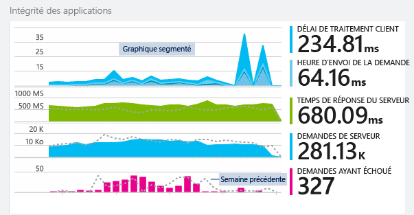
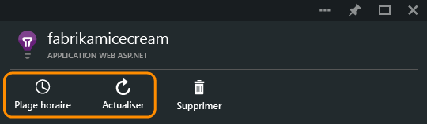
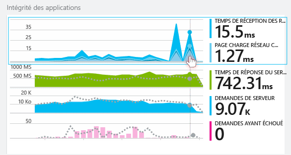
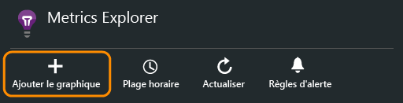
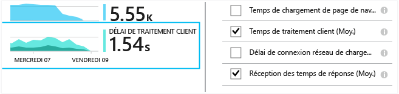
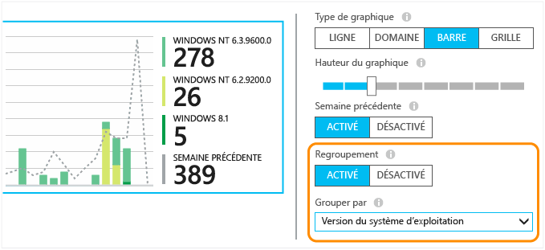
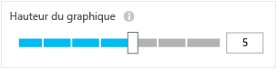
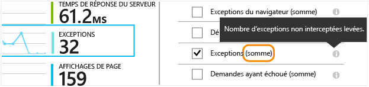
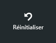

# Exploration des mesures dans Application Insights
Les mesures dans [Application Insights][start] sont des mesures et le nombre des événements envoyés par la télémétrie de votre application. Elles vous permettent de détecter les problèmes de performances et de constater les tendances dans l'utilisation de votre application. Il existe un large éventail de mesures standard et vous pouvez également créer vos propres mesures personnalisées et vos propres événements personnalisés.

Les mesures et le nombre des événements sont affichés dans des graphiques présentant les valeurs agrégées, comme la somme, la moyenne ou le décompte.

Voici un exemple de jeu de graphiques :

Tous les graphiques de mesures se trouvent dans le portail Application Insights. Dans la plupart des cas, ils peuvent être personnalisés, et vous pouvez ajouter plusieurs graphiques dans le panneau. Dans le volet d’aperçu, cliquez pour accéder aux graphiques plus détaillés (ayant des titres tels que « Server responses »), ou cliquez sur **Metrics Explorer** pour ouvrir un nouveau panneau où vous pouvez créer des graphiques personnalisés.

## Période
Vous pouvez modifier l’intervalle de temps sur lequel portent les graphiques et les grilles dans n’importe quel panneau.

Si vous attendez des données qui ne sont pas encore affichées, cliquez sur Actualiser. Les graphiques s’actualisent régulièrement, mais plus les intervalles de temps sur lesquels ils portent sont étendus, plus les intervalles d’actualisation sont longs. Dans la version finale, les données peuvent mettre un certain temps pour passer du pipeline d'analyse au graphique.

Pour faire un zoom sur une partie d’un graphique, placez le curseur dessus :

Cliquez sur le bouton d’annulation du zoom pour restaurer l’état initial.

## Valeurs de granularité et de point
Pointez votre souris sur le graphique pour afficher les valeurs des mesures à ce stade.

La valeur de la mesure à un moment donné est agrégée à l'intervalle d'échantillonnage précédent.

L’intervalle d’échantillonnage, ou « granularité », s’affiche en haut du panneau.

Vous pouvez ajuster le niveau de granularité dans le panneau Période :

Les niveaux de granularité disponibles dépendent de la période que vous sélectionnez. Les niveaux de granularité explicites sont des alternatives à la granularité « automatique » pour la période.

## Modification des graphiques et des grilles
Pour ajouter un nouveau graphique au panneau :

Sélectionnez **Modifier** sur un graphique nouveau ou existant pour modifier ce qui est affiché :

Vous pouvez afficher plusieurs mesures dans un graphique, bien qu'il existe des restrictions sur les combinaisons affichables. Dès que vous sélectionnez une mesure, certaines autres sont désactivées.

Si vous avez ajouté des [mesures personnalisées][track] au code de votre application (appels à TrackMetric et TrackEvent), elles sont répertoriées ici.

## Segmenter vos données
Vous pouvez fractionner une mesure par propriété, par exemple, pour comparer des affichages de page sur des clients avec différents systèmes d’exploitation.

Sélectionnez un graphique ou une grille, basculez vers le regroupement et choisissez une propriété de regroupement :

> [!NOTE]
> Lorsque vous utilisez le regroupement, les types de graphiques en aires et à barres fournissent un affichage empilé. Cet affichage convient pour la méthode d’agrégation Somme. Mais si le type d’agrégation est Moyenne, choisissez les types d’affichage en ligne ou en grille.
>
>

Si vous avez ajouté des [mesures personnalisées][track] au code de votre application et qu'elles incluent des valeurs de propriétés, vous pourrez sélectionner la propriété dans la liste.

Le graphique est trop petit pour les données segmentées ? Ajustez la hauteur :

## Types d’agrégation
La légende sur le côté affiche généralement par défaut la valeur agrégée sur la période couverte par le graphique. Si vous pointez sur le graphique, il affiche la valeur au niveau de ce point.

Chaque point de données du graphique est un agrégat des valeurs de données reçues dans l’intervalle d’échantillonnage précédent, encore appelé « granularité ». La granularité est indiquée en haut du panneau et varie en fonction de l’échelle de temps globale du graphique.

Les mesures sont agrégées de différentes façons :

* **Count** est un décompte des événements reçus dans l’intervalle d’échantillonnage. Il est utilisé pour des événements tels que les requêtes. Les variations dans la hauteur du graphique indiquent les variations de la vitesse à laquelle les événements se produisent. Mais notez que la valeur numérique change lorsque vous modifiez l’intervalle d’échantillonnage.
* **Sum** ajoute les valeurs de tous les points de données reçus pendant un intervalle d’échantillonnage ou la période du graphique.
* **Average** divise la somme par le nombre de points de données reçus durant l'intervalle.
* **Unique** est utilisé pour comptabiliser les nombres d'utilisateurs et de comptes. Sur l’intervalle d’échantillonnage ou sur la période du graphique, la figure indique le nombre d’utilisateurs différents dans cette période.
* **%** - versions en pourcentage de chaque agrégation utilisées uniquement avec des graphiques segmentés. Le total équivaut toujours à 100 %, et le graphique montre la contribution relative des différents composants d’un total.

    

### Modification du type d’agrégation

La méthode par défaut de chaque mesure s’affiche lorsque vous créez un graphique ou lorsque toutes les mesures sont désélectionnées :

## Filtrer vos données
Pour afficher uniquement les mesures d'un jeu de valeurs de propriété sélectionné :

Si vous ne sélectionnez aucune valeur pour une propriété particulière, c'est la même chose que si vous aviez sélectionné toutes les valeurs : il n'existe aucun filtre sur cette propriété.

Notez le nombre d'événements en même temps que chaque valeur de propriété. Lorsque vous sélectionnez les valeurs d'une propriété, le nombre est modifié, en même temps que les autres valeurs de la propriété.

Les filtres s’appliquent à tous les graphiques dans un panneau. Si vous souhaitez que différents filtres s’appliquent à différents graphiques, créez et enregistrez des panneaux de mesure différents. Si vous le souhaitez, vous pouvez épingler des graphiques à partir de différents panneaux au tableau de bord, afin de les afficher parallèlement.

### Supprimer le robot et tester le trafic web
Utilisez le filtre de **trafic réel ou synthétique** et activez l’option **réel**.

Vous pouvez également filtrer par **source du trafic synthétique**.

### Pour ajouter des propriétés à la liste de filtres
Vous souhaitez filtrer la télémétrie pour une catégorie de votre choix ? Par exemple, vous pouvez diviser vos utilisateurs en catégories différentes et segmenter vos données à l’aide de ces catégories.

[Créez votre propriété](app-insights-api-custom-events-metrics.md#properties). Définissez-la dans un [Initialiseur de télémétrie](app-insights-api-custom-events-metrics.md#defaults) pour qu'elle s'affiche dans toute la télémétrie, notamment la télémétrie standard envoyée par différents modules de kit de développement logiciel (SDK).

## Modifier le type de graphique
Notez que vous pouvez basculer entre les grilles et les graphiques :

## Enregistrer votre panneau de mesures
Une fois que vous avez créé des graphiques, enregistrez-les en tant que favoris. Si vous travaillez avec un compte professionnel, vous pouvez choisir de les partager avec d'autres membres de l'équipe.

Pour réafficher le panneau, **allez dans le panneau Vue d'ensemble** et ouvrez Favoris :

Si vous avez choisi une période relative lorsque vous avez enregistré, le panneau sera mis à jour avec les dernières mesures. Si vous avez choisi une période absolue, il affiche les mêmes données à chaque fois.

## Réinitialiser le panneau
Si vous modifiez un panneau, mais que vous souhaitez revenir à la configuration originale enregistrée, cliquez sur Réinitialiser.

## Live Metrics Stream : mesures instantanées pour une analyse détaillée
Live Metrics Stream indique les mesures de votre application à ce moment précis avec une latence en temps réel proche d’1 seconde. Cette fonctionnalité est très utile lorsque vous libérez une nouvelle build et souhaitez vous assurer que tout fonctionne comme prévu, ou examinez d’un incident en temps réel.

Contrairement à Metrics Explorer, Live Metrics Stream affiche un ensemble fixe de mesures. Les données persistent uniquement tant qu’elles se trouvent sur le graphique et sont ensuite ignorées.

### Échecs dynamiques

Si des échecs ou des exceptions sont enregistrés, le flux temps réel en sélectionne un échantillon. Cliquez sur **Pause** pour conserver un échantillon spécifique, puis sélectionnez un événement pour en afficher les détails.

Le flux de métriques temps réel est disponible avec la dernière version du [Kit de développement logiciel (SDK) Application Insights pour le web](https://www.nuget.org/packages/Microsoft.ApplicationInsights.Web/).

## Définir des alertes
Pour être averti par courrier électronique en cas de valeurs inhabituelles pour une métrique, ajoutez une alerte. Vous pouvez choisir d'envoyer le courrier électronique aux administrateurs de compte ou à des adresses de messagerie spécifiques.

[En savoir plus sur les alertes][alerts].

## Exporter vers Excel
Vous pouvez exporter les données de mesures affichées dans l’Explorateur de mesures vers un fichier Excel. Les données exportées incluent les données de tous les graphiques et de toutes les tables, comme indiqué dans le portail.

Les données de chaque graphique ou de chaque table sont exportées dans une feuille distincte dans le fichier Excel.

Vous voyez ce qui doit être exporté. Si vous voulez modifier la plage des données exportées, modifiez la plage de temps ou les filtres. Pour les tables, si la commande **charger davantage** est affichée, vous pouvez cliquer dessus avant de cliquer sur Exporter, pour pouvoir exporter des données supplémentaires.

*Pour le moment, Excel est uniquement compatible avec Internet Explorer et Chrome. Nous travaillons sur l’ajout de la prise en charge d’autres navigateurs.*

## Exportation continue
Si vous souhaitez mettre en place une exportation continue des données pour les traiter en externe, envisagez d’utiliser l [’Exportation continue](app-insights-export-telemetry.md).

### Power BI
Si vous souhaitez obtenir des vues enrichies de vos données, vous pouvez [exporter vers Power BI](http://blogs.msdn.com/b/powerbi/archive/2015/11/04/explore-your-application-insights-data-with-power-bi.aspx).

## Analyse
[Analyse](app-insights-analytics.md) est un moyen plus souple d’analyser vos données de télémétrie à l’aide d’un langage de requête puissant. Utilisez l’analyse si vous souhaitez combiner ou calculer les résultats à partir des mesures ou effectuer une exploration approfondie des performances récentes de votre application. En revanche, utilisez Metrics Explorer si vous souhaitez obtenir l’actualisation automatique, les graphiques sur le tableau de bord et les alertes.

## Résolution des problèmes
*Mon graphique ne contient aucune donnée.*

* Les filtres s’appliquent à tous les graphiques du panneau. Lorsque vous vous concentrez sur un graphique, vérifiez que vous n’avez pas défini un filtre qui exclut toutes les données d’un autre graphique.

    Si vous souhaitez définir des filtres différents sur différents graphiques, créez-les dans des panneaux différents, enregistrez-les sous forme de favoris distincts. Si vous le souhaitez, vous pouvez les épingler au tableau de bord afin de les afficher parallèlement.
* Si vous regroupez un graphique en fonction d’une propriété qui n’est pas définie dans la mesure, alors il n’y aura rien à afficher sur le graphique. Essayez de désélectionner l’option « regrouper par » ou choisissez une propriété de regroupement différente.
* Les données de performances (UC, taux d’E/S, etc.) sont disponibles pour les services web Java, les applications de bureau Windows, les [services et applications web IIS si vous installez le moniteur d’état](app-insights-monitor-performance-live-website-now.md) (Status monitor) et [Azure Cloud Services](app-insights-azure.md). Ces données ne sont pas disponibles pour les sites web Azure.

## Étapes suivantes
* [Surveillance de l’utilisation avec Application Insights](app-insights-overview-usage.md)
* [Utilisation de Diagnostic Search](app-insights-diagnostic-search.md)

<!--Link references-->

[alerts]: app-insights-alerts.md
[start]: app-insights-overview.md
[track]: app-insights-api-custom-events-metrics.md

<!--HONumber=Dec16_HO3-->

