<properties
	pageTitle="Diagnostic des problèmes de performances sur un site web IIS en cours d’exécution | Microsoft Azure"
	description="Analysez les performances d'un site web sans le redéployer. Utilisation autonome ou avec le Kit de développement logiciel (SDK) Application Insights pour obtenir des données de télémétrie relatives aux dépendances."
	services="application-insights"
    documentationCenter=".net"
	authors="alancameronwills"
	manager="douge"/>

<tags
	ms.service="application-insights"
	ms.workload="tbd"
	ms.tgt_pltfrm="ibiza"
	ms.devlang="na"
	ms.topic="get-started-article"
	ms.date="03/09/2016"
	ms.author="awills"/>

# Installation d’Application Insights Status Monitor pour surveiller les performances des sites web

*Application Insights est à l'état de version préliminaire.*

Le Status Monitor de Visual Studio Application Insights vous permet de diagnostiquer les problèmes liés aux exceptions et aux performances dans les applications ASP.NET.

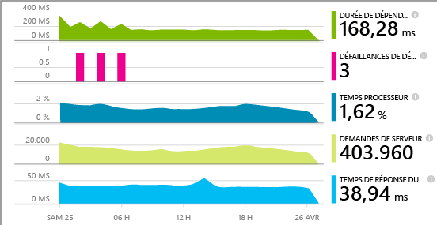

> [AZURE.TIP] Des articles distincts sont consacrés à l’instrumentation des [applications web J2EE en direct](app-insights-java-live.md) et les [services cloud Azure](app-insights-cloudservices.md).

Vous avez le choix entre trois façons d’appliquer Application Insights à vos applications web IIS :

* **En cours de création :** [ajoutez le kit de développement logiciel (SDK) Application Insights][greenbrown] au code de votre application web. Cela permet :
 * Ensemble de diagnostics standard et de données de télémétrie liées à l’utilisation.
 * L’[API Application Insights][api] si vous permet d’écrire votre propre télémétrie pour effectuer un suivi détaillé de l’utilisation ou pour diagnostiquer les problèmes.
* **En cours d’exécution :** utilisez Status Monitor pour l’associer à votre application web sur le serveur.
 * Surveillance des applications web déjà exécutées sans avoir à les générer ou les publier de nouveau.
 * Ensemble de diagnostics standard et de données de télémétrie liées à l’utilisation.
 * Diagnostics de dépendance : recherche des erreurs ou des faibles performances là où votre application utilise d’autres composants tels que des bases de données, des API REST ou d’autres services.
 * Résolution des problèmes à l’aide des données de télémétrie.
* **En cours d’exécution et de création :** compilez le Kit de développement logiciel (SDK) dans le code de votre application web et exécutez Status Monitor sur votre serveur web. Cette méthode associe les avantages des deux autres méthodes :
 * Ensemble de diagnostics standard et données de télémétrie liées à l’utilisation.
 * Diagnostics de dépendance.
 * L’API vous permet d’écrire une télémétrie personnalisée.
 * Résolution des problèmes à l’aide du Kit de développement logiciel (SDK) et de la télémétrie.

## Installez Application Insights Status Monitor

Cette opération nécessite un abonnement [Microsoft Azure](http://azure.com).

### Si votre application s’exécute sur votre serveur IIS

1. Sur votre serveur web IIS, connectez-vous avec vos informations d’identification d’administrateur.
2. Téléchargez et exécutez le [programme d’installation Status Monitor](http://go.microsoft.com/fwlink/?LinkId=506648).
4. Dans l'Assistant Installation, connectez-vous à Microsoft Azure.

    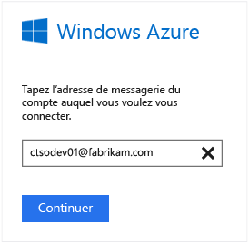

    *Erreurs de connexion Consultez la rubrique [Résolution des problèmes](#troubleshooting).*

5. Sélectionnez l’application web installée ou le site web à surveiller, puis configurez la ressource dans laquelle vous voulez afficher les résultats dans le portail Application Insights.

    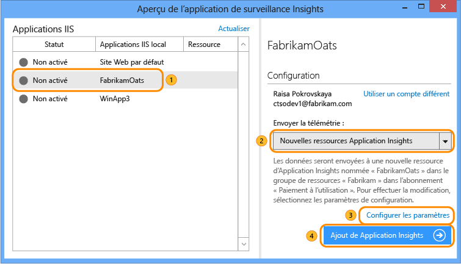

    Il est probable que vous choisirez de configurer une nouvelle ressource et un nouveau [groupe de ressources][roles].

    Vous pouvez aussi utiliser une ressource existante si vous avez déjà configuré des [tests web][availability] pour votre site ou une [surveillance du client web][client].

6. Redémarrez IIS.

    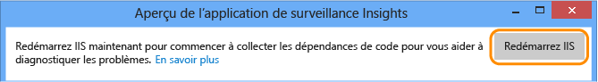

    Votre service web sera interrompu pendant une courte période.

6. Notez que ApplicationInsights.config est inséré dans les applications web que voulez surveiller.

    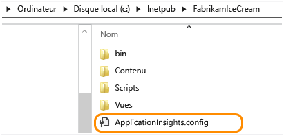

   web.config a également été légèrement modifié.

#### Vous voulez (re)configurer plus tard ?

Lorsque l'Assistant est terminé, vous pouvez reconfigurer l'agent à tout moment. Vous pouvez également reconfigurer si vous avez installé l'agent et avez rencontré des problèmes lors de la configuration initiale.

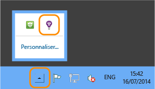

### Si votre application s’exécute en tant qu’application web Azure

Dans le panneau de configuration de votre application web Azure, ajoutez l’extension Application Insights.

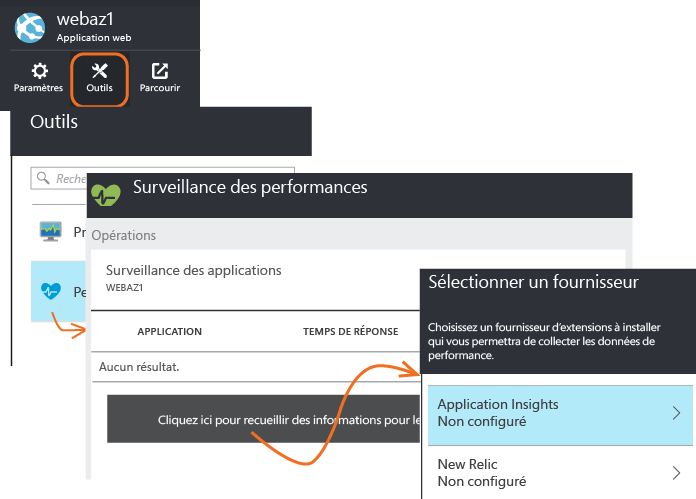

### S’il s’agit d’un projet services cloud Azure

[Ajoutez des scripts aux rôles web et de travail](app-insights-cloudservices.md).

## Affichage des données de télémétrie relatives aux performances

Connectez-vous au [portail Azure](https://portal.azure.com), accédez à Application Insights et ouvrez la ressource que vous avez créée.

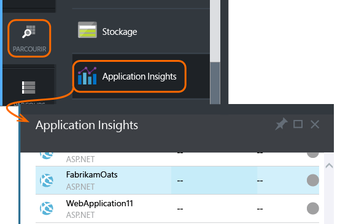

Ouvrez le panneau des performances pour afficher les données de demande, les données de temps de réponse, les dépendances et les autres données.

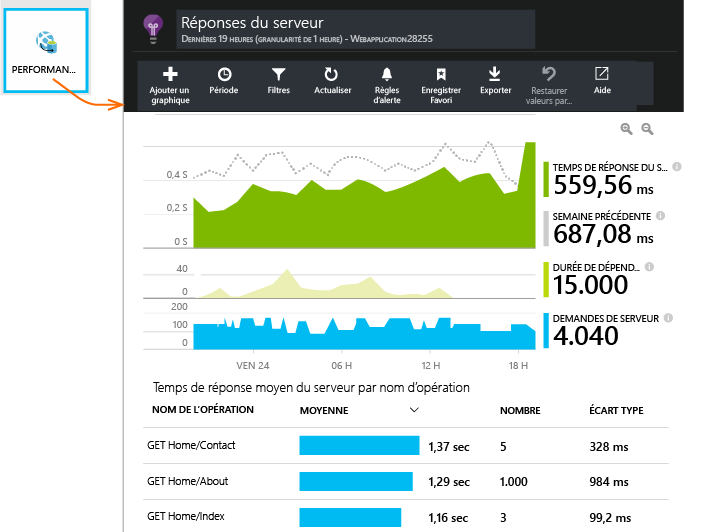

Cliquez pour ajuster les détails de l’affichage ou pour ajouter un graphique.

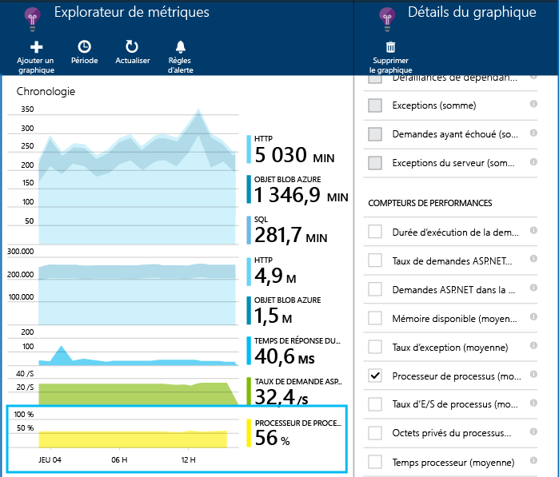

## Dépendances

Le graphique de la durée de la dépendance indique la durée comptabilisée pour les appels de votre application aux composants externes, tels que les bases de données, les API REST ou le stockage de blobs Azure.

Pour segmenter le graphique par appels à des dépendances différentes, sélectionnez Regroupement, puis choisissez Dépendance, Type de dépendance ou Performances de dépendance.

Vous pouvez également filtrer le graphique pour examiner un compartiment spécifique de dépendance, de type ou de performances. Cliquez sur Filtres.

## Compteurs de performances

(Ne concerne pas les applications web Azure.) Cliquez sur Serveurs sur le panneau de présentation pour voir les graphiques des compteurs de performance de serveur telles que l’utilisation de la mémoire et l’occupation du processeur.

Ajoutez un graphique ou cliquez sur n’importe quel graphique pour afficher son contenu.

Vous pouvez également [changer l’ensemble des compteurs de performances qui sont rapportées par le Kit de développement logiciel (SDK)](app-insights-configuration-with-applicationinsights-config.md#nuget-package-3).

## Exceptions

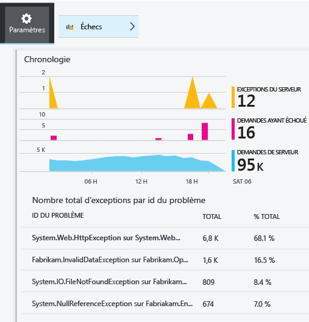

Vous pouvez accéder aux exceptions spécifiques (des sept derniers jours) et obtenir les arborescences des appels de procédure et des données de contexte.

## Échantillonnage

Si votre application envoie des données en grand nombre et si vous utilisez le kit de développement logiciel Application Insights pour ASP.NET version 2.0.0-beta3 ou ultérieure, la fonctionnalité d’échantillonnage adaptatif peut fonctionner et transmettre uniquement un pourcentage de vos données de télémétrie. [En savoir plus sur l’échantillonnage.](app-insights-sampling.md)

## Résolution de problèmes

### Erreurs de connexion

Vous devez ouvrir [certains ports sortants](app-insights-ip-addresses.md#outgoing-ports) dans le pare-feu de votre serveur pour permettre à Status Monitor de fonctionner.

### Vous n’obtenez aucune donnée de télémétrie ?

  * Utilisez votre site pour créer des données.
  * Attendez quelques minutes le temps que les données arrivent, puis cliquez sur **Actualiser**.
  * Ouvrez Recherche de diagnostic (vignette de recherche) pour afficher chaque événement. Les événements sont souvent visibles dans Recherche de diagnostic avant que les données agrégées n’apparaissent dans les graphiques.
  * Ouvrez Status Monitor et sélectionnez votre application dans le volet gauche. Vérifiez la présence de messages de diagnostic pour cette application dans la section « Notifications de configuration » :

  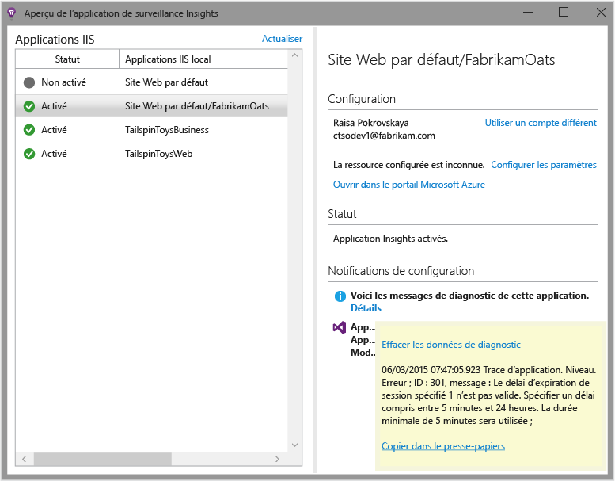

  * Vérifiez que le pare-feu de votre serveur autorise le trafic sortant sur les ports répertoriés ci-dessus.
  * Si un message relatif à des « autorisations insuffisantes » s’affiche sur le serveur, procédez comme suit :
    * Dans le Gestionnaire des services Internet, sélectionnez votre pool d’applications, ouvrez **Paramètres avancés** puis, sous **Modèle de processus**, notez l’identité.
    * Dans le panneau de configuration relatif à la gestion de l’ordinateur, ajoutez cette identité au groupe Utilisateurs de l’Analyseur de performances.
  * Si les services MMA/SCOM sont installés sur votre serveur, certaines versions peuvent entrer en conflit. Désinstallez à la fois SCOM et Moniteur d’état, puis réinstallez des versions les plus récentes.
  * Consultez la rubrique [Résolution des problèmes][qna].

## Configuration requise

Prise en charge du système d’exploitation pour Application Insights Status Monitor sur le serveur :

- Windows Server 2008
- Windows Server 2008 R2
- Windows Server 2012
- Windows Server 2012 R2

avec dernier Service Pack et .NET Framework 4.0 et 4.5

Windows 7, 8 et 8.1 côté client, avec également .NET Framework 4.0 et 4.5

Prise en charge d’IIS : IIS 7, 7.5, 8, 8.5 (IIS requis)

## Automation avec PowerShell

Vous pouvez démarrer et arrêter la surveillance à l’aide de PowerShell.

`Get-ApplicationInsightsMonitoringStatus [-Name appName]`

* `-Name` (Facultatif) Le nom d’une application web.
* Affiche l’état de la surveillance Application Insights pour chaque application web (ou l’application nommée) dans ce serveur IIS.

* Renvoie `ApplicationInsightsApplication` pour chaque application :
 * `SdkState==EnabledAfterDeployment` : l’application est surveillée et a été instrumentée au moment de l’exécution, par l’outil Status Monitor ou par `Start-ApplicationInsightsMonitoring`.
 * `SdkState==Disabled` : l’application n’est pas instrumentée pour Application Insights. Soit elle n’a jamais été instrumentée, soit la surveillance au moment de l’exécution a été désactivée avec l’outil Status Monitor ou avec `Stop-ApplicationInsightsMonitoring`.
 * `SdkState==EnabledByCodeInstrumentation` : l’application a été instrumentée en ajoutant le Kit de développement logiciel (SDK) au code source. Son Kit de développement logiciel (SDK) ne peut pas être mis à jour ou arrêté.
 * `SdkVersion` affiche la version en cours d’utilisation pour la surveillance de cette application.
 * `LatestAvailableSdkVersion` affiche la version actuellement disponible sur la galerie NuGet. Pour mettre à niveau l’application vers cette version, utilisez `Update-ApplicationInsightsMonitoring`.

`Start-ApplicationInsightsMonitoring -Name appName -InstrumentationKey 00000000-000-000-000-0000000`

* `-Name` Le nom de l’application dans le serveur IIS
* `-InstrumentationKey` L’ikey de la ressource Application Insights où vous souhaitez que les résultats soient affichés.

* Cette applet de commande affecte uniquement les applications qui ne sont pas déjà instrumentées, c’est-à-dire SdkState==NotInstrumented.

    L’applet de commande n’affecte pas une application qui est déjà instrumentée, que ce soit au moment de la création en ajoutant le Kit de développement logiciel (SDK) au code ou au moment de l’exécution via une utilisation préalable de cette applet de commande.

    La version du Kit de développement logiciel (SDK) utilisée pour instrumenter l’application est la version la plus récente téléchargée sur ce serveur.

    Pour télécharger la version la plus récente, utilisez Update-ApplicationInsightsVersion.

* Renvoie `ApplicationInsightsApplication` en cas de réussite. En cas d’échec, il consigne un suivi sur stderr.

    
          Name                      : Default Web Site/WebApp1
          InstrumentationKey        : 00000000-0000-0000-0000-000000000000
          ProfilerState             : ApplicationInsights
          SdkState                  : EnabledAfterDeployment
          SdkVersion                : 1.2.1
          LatestAvailableSdkVersion : 1.2.3

`Stop-ApplicationInsightsMonitoring [-Name appName | -All]`

* `-Name` Le nom d’une application dans le serveur IIS
* `-All` Arrête la surveillance de toutes les applications de ce serveur IIS pour lequel `SdkState==EnabledAfterDeployment`

* Arrête la surveillance des applications spécifiées et supprime l’instrumentation. Cela fonctionne uniquement pour les applications qui ont été instrumentées au moment de l’exécution avec l’outil Status Monitoring ou avec Start-ApplicationInsightsApplication. (`SdkState==EnabledAfterDeployment`)

* Renvoie ApplicationInsightsApplication.

`Update-ApplicationInsightsMonitoring -Name appName [-InstrumentationKey "0000000-0000-000-000-0000"`]

* `-Name` : le nom d’une application web dans le serveur IIS.
* `-InstrumentationKey` (Facultatif) Permet de modifier la ressource à laquelle la télémétrie de l’application est envoyée.
* Cette applet de commande :
 * Met à niveau l’application nommée vers la version la plus récente du Kit de développement logiciel (SDK) téléchargée sur cette machine. (Fonctionne uniquement si `SdkState==EnabledAfterDeployment`)
 * Si vous fournissez une clé d’instrumentation, l’application nommée est reconfigurée pour envoyer la télémétrie à la ressource avec cette clé. (Fonctionne si `SdkState != Disabled`)

`Update-ApplicationInsightsVersion`

* Télécharge la version la plus récente du Kit de développement logiciel (SDK) Application Insights sur le serveur.

## Modèle Azure

Si l’application web est dans Azure et que vous créez vos ressources à l’aide d’un modèle Azure Resource Manager, vous pouvez configurer Application Insights en ajoutant cela au nœud de ressources :

    {
      resources: [
        /* Create Application Insights resource */
        {
          "apiVersion": "2015-05-01",
          "type": "microsoft.insights/components",
          "name": "nameOfAIAppResource",
          "location": "centralus",
          "kind": "web",
          "properties": { "ApplicationId": "nameOfAIAppResource" },
          "dependsOn": [
            "[concat('Microsoft.Web/sites/', myWebAppName)]"
          ]
        }
       ]
     } 

* `nameOfAIAppResource`, un nom pour la ressource Application Insights
* `myWebAppName`, l’ID de l’application web

## Étapes suivantes

* [Créez des tests web][availability] pour vous assurer que votre site reste actif.
* [Recherchez les événements et les journaux][diagnostic] pour diagnostiquer les problèmes.
* [Ajoutez la télémétrie de client web][usage] pour afficher les exceptions à partir du code de la page web et vous permettre d’insérer un suivi des appels.
* [Ajoutez le kit de développement logiciel (SDK) Application Insights à votre code de service web][greenbrown] afin de pouvoir insérer un suivi des appels et des appels de journaux dans le code du serveur.

## Vidéo

#### Analyse des performances

[AZURE.VIDEO app-insights-performance-monitoring]

<!--Link references-->

[api]: app-insights-api-custom-events-metrics.md
[availability]: app-insights-monitor-web-app-availability.md
[client]: app-insights-javascript.md
[diagnostic]: app-insights-diagnostic-search.md
[greenbrown]: app-insights-asp-net.md
[qna]: app-insights-troubleshoot-faq.md
[roles]: app-insights-resources-roles-access-control.md
[usage]: app-insights-web-track-usage.md

<!---HONumber=AcomDC_0629_2016-->