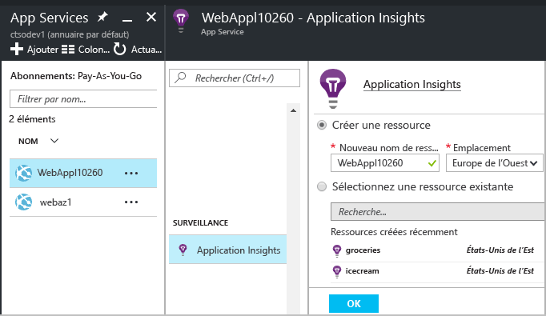
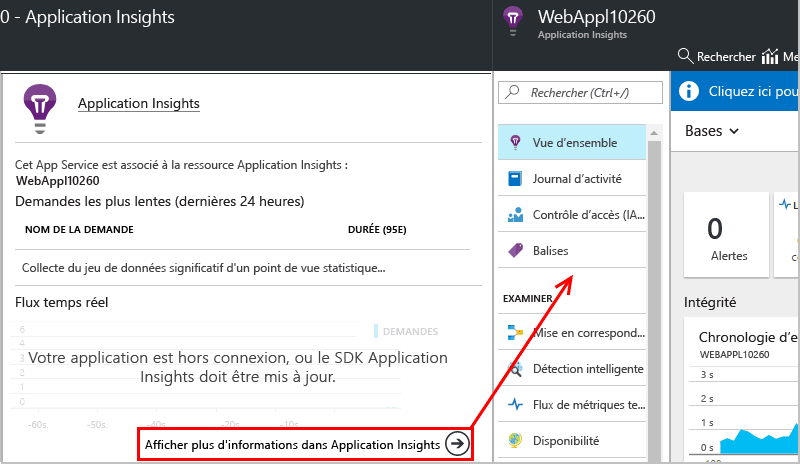

# Instrumenter des applications web lors de l’exécution avec Application Insights

Vous pouvez instrumenter une application web dynamique avec Azure Application Insights, sans avoir à modifier ou à redéployer votre code. Si vos applications sont hébergées sur un serveur IIS local, installez Status Monitor. S’il s’agit d’applications web Azure ou d’applications qui s’exécutent dans une machine virtuelle Azure, vous pouvez activer l’analyse Application Insights à partir du panneau de configuration Azure. (Des articles distincts sont également consacrés à l’instrumentation des [applications web J2EE actives](app-insights-java-live.md) et [d’Azure Cloud Services](app-insights-cloudservices.md).) Cette opération nécessite un abonnement [Microsoft Azure](http://azure.com) .

Vous avez le choix entre trois façons d’appliquer Application Insights à vos applications web .NET :

* **En cours de création :**[ajoutez le Kit de développement logiciel (SDK) Application Insights][greenbrown] au code de votre application web.
* **En cours d’exécution :** instrumentez votre application web sur le serveur, comme décrit ci-dessous, sans régénérer ni redéployer le code.
* **Les deux :** intégrez le Kit de développement logiciel (SDK) à votre code d’application web et appliquez également les extensions à l’exécution. Profitez des avantages des deux options.

Voici un résumé de ce que vous apporte chaque méthode :

|  | En cours de création | En cours d’exécution |
| --- | --- | --- |
| Requêtes et exceptions |Oui |Oui |
| [Exceptions plus détaillées](app-insights-asp-net-exceptions.md) | |Oui |
| [Diagnostics de dépendance](app-insights-asp-net-dependencies.md) |Sur .NET 4.6 +, mais moins détaillé |Oui, tous les détails : codes de résultat, texte de commande SQL, verbe HTTP|
| [Compteurs de performances système](app-insights-performance-counters.md) |Oui |Oui |
| [API pour la télémétrie personnalisée][api] |Oui |Non |
| [Intégration des journaux de suivi](app-insights-asp-net-trace-logs.md) |Oui |Non |
| [Mode Page et données utilisateur](app-insights-javascript.md) |Oui |Non |
| Nécessité de régénérer le code |Oui | Non |

## Surveiller une application web Azure active

Si votre application s’exécute en tant que service web Azure, voici comment activer la surveillance :

* Sélectionnez Application Insights sur le panneau de configuration de l’application dans Azure.

    
* Lorsque la page de résumé d’Application Insights s’ouvre, cliquez sur le lien en bas pour ouvrir la ressource Application Insights complète.

    

[Surveillance des applications de machine virtuelle et cloud](app-insights-azure.md).

### Activation de la surveillance côté client dans Azure

Si vous avez activé Application Insights dans Azure, vous pouvez ajouter la consultation de page et la télémétrie de l’utilisateur.

1. Cliquez sur Paramètres > Paramètres de l’application.
2.  Sous Paramètres de l’application, ajoutez une nouvelle paire clé/valeur : 
   
    Clé :`APPINSIGHTS_JAVASCRIPT_ENABLED` 
    
    Valeur: `true`
3. **Enregistrez** les paramètres et **Redémarrez** votre application.

Le Kit de développement logiciel (SDK) JavaScript Application Insights est maintenant injecté dans chaque page web.

## Surveiller une application web IIS active

Si votre application est hébergée sur un serveur IIS, activez Application Insights à l’aide de Status Monitor.

1. Sur votre serveur web IIS, connectez-vous avec vos informations d’identification d’administrateur.
2. Si Application Insights Status Monitor n’est pas encore installé, téléchargez et exécutez le [programme d’installation Status Monitor](http://go.microsoft.com/fwlink/?LinkId=506648) (ou exécutez [Web Platform Installer](https://www.microsoft.com/web/downloads/platform.aspx) et recherchez-y Application Insights Status Monitor).
3. Dans Status Monitor, sélectionnez l’application web installée ou le site Web à surveiller. Connectez-vous avec vos informations d’identification Azure.

    Configurez la ressource où vous souhaitez afficher les résultats dans le portail Application Insights. (En règle générale, il est préférable de créer une ressource. Sélectionnez une ressource existante si vous avez déjà configuré des [tests web][availability] ou une [Surveillance du client][client] pour cette application.) 

    

4. Redémarrez IIS.

    

    Votre service web sera interrompu pendant une courte période.

## Personnaliser les options de surveillance

L’activation d’Application Insights ajoute des DLL et ApplicationInsights.config à votre application web. Vous pouvez [modifier le fichier .config](app-insights-configuration-with-applicationinsights-config.md) pour changer certaines options.

## Lorsque vous republiez votre application, réactivez Application Insights

Avant de republier votre application, vous pouvez [ajouter Application Insights au code dans Visual Studio][greenbrown]. Vous obtiendrez des données de télémétrie plus détaillées et aurez la possibilité de personnaliser la télémétrie à l’aide de code.

Si vous souhaitez procéder à la republication sans ajouter Application Insights au code, sachez que le processus de déploiement peut supprimer les DLL et ApplicationInsights.config du site web publié. Par conséquent :

1. Si vous avez modifié le fichier ApplicationInsights.config, copiez-le avant de republier votre application.
2. Republiez votre application.
3. Réactivez la surveillance d’Application Insights. (Utilisez la méthode appropriée : le panneau de configuration de l’application web Azure ou Status Monitor sur un hôte IIS.)
4. Rétablissez les éventuelles modifications que vous avez effectuées dans le fichier .config.

## Résolution des problèmes de configuration d’exécution d’Application Insights

### Vous n’arrivez pas à vous connecter ? Vous n’obtenez aucune donnée de télémétrie ?

* Ouvrez [les ports sortants requis](app-insights-ip-addresses.md#outgoing-ports) dans le pare-feu de votre serveur pour permettre à Status Monitor de fonctionner.

* Ouvrez Status Monitor et sélectionnez votre application dans le volet gauche. Vérifiez la présence de messages de diagnostic pour cette application dans la section « Notifications de configuration » :

  
* Si un message relatif à des « autorisations insuffisantes » s’affiche sur le serveur, procédez comme suit :
  * Dans le Gestionnaire des services Internet, sélectionnez votre pool d’applications, ouvrez **Paramètres avancés** puis, sous **Modèle de processus**, notez l’identité.
  * Dans le panneau de configuration relatif à la gestion de l’ordinateur, ajoutez cette identité au groupe Utilisateurs de l’Analyseur de performances.
* Si des services MMA/SCOM (Systems Center Operations Manager) sont installés sur votre serveur, certaines versions peuvent entrer en conflit. Désinstallez à la fois SCOM et Moniteur d’état, puis réinstallez des versions les plus récentes.
* Consultez la rubrique [Résolution des problèmes][qna].

## Configuration requise
Prise en charge du système d’exploitation pour Application Insights Status Monitor sur le serveur :

* Windows Server 2008
* Windows Server 2008 R2
* Windows Server 2012
* Windows Server 2012 R2
* Windows Server 2016

avec le dernier Service Pack et .NET Framework 4.5

Windows 7, 8, 8.1 et 10 côté client, avec également .NET Framework 4.5

Prise en charge d’IIS : IIS 7, 7.5, 8, 8.5 (IIS requis)

## Automation avec PowerShell
Vous pouvez démarrer et arrêter la surveillance à l’aide de PowerShell sur votre serveur IIS.

Tout d’abord, importez le module Application Insights :

`Import-Module 'C:\Program Files\Microsoft Application Insights\Status Monitor\PowerShell\Microsoft.Diagnostics.Agent.StatusMonitor.PowerShell.dll'`

Identifiez les applications qui sont surveillées :

`Get-ApplicationInsightsMonitoringStatus [-Name appName]`

* `-Name` (Facultatif) Nom d’une application web.
* Affiche l’état de la surveillance Application Insights pour chaque application web (ou l’application nommée) dans ce serveur IIS.
* Retourne `ApplicationInsightsApplication` pour chaque application :

  * `SdkState==EnabledAfterDeployment` : l’application est surveillée et a été instrumentée lors de l’exécution par l’outil Status Monitor ou par `Start-ApplicationInsightsMonitoring`.
  * `SdkState==Disabled`: l’application n’est pas instrumentée pour Application Insights. Soit elle n’a jamais été instrumentée, soit la surveillance lors de l’exécution a été désactivée avec l’outil Status Monitor ou avec `Stop-ApplicationInsightsMonitoring`.
  * `SdkState==EnabledByCodeInstrumentation`: l’application a été instrumentée en ajoutant le Kit de développement logiciel (SDK) au code source. Son Kit de développement logiciel (SDK) ne peut pas être mis à jour ou arrêté.
  * `SdkVersion` affiche la version utilisée pour surveiller cette application.
  * `LatestAvailableSdkVersion`affiche la version actuellement disponible dans la galerie NuGet. Pour mettre à niveau l’application vers cette version, utilisez `Update-ApplicationInsightsMonitoring`.

`Start-ApplicationInsightsMonitoring -Name appName -InstrumentationKey 00000000-000-000-000-0000000`

* `-Name` Nom de l’application dans IIS
* `-InstrumentationKey` Ikey de la ressource Application Insights où vous souhaitez afficher les résultats.
* Cette applet de commande affecte uniquement les applications qui ne sont pas déjà instrumentées, c’est-à-dire SdkState==NotInstrumented.

    L’applet de commande n’affecte pas une application qui est déjà instrumentée, que ce soit au moment de la création en ajoutant le Kit de développement logiciel (SDK) au code ou au moment de l’exécution via une utilisation préalable de cette applet de commande.

    La version du Kit de développement logiciel (SDK) utilisée pour instrumenter l’application est la version la plus récente téléchargée sur ce serveur.

    Pour télécharger la version la plus récente, utilisez Update-ApplicationInsightsVersion.
* Retourne `ApplicationInsightsApplication` en cas de réussite. En cas d’échec, il consigne un suivi sur stderr.

          Name                      : Default Web Site/WebApp1
          InstrumentationKey        : 00000000-0000-0000-0000-000000000000
          ProfilerState             : ApplicationInsights
          SdkState                  : EnabledAfterDeployment
          SdkVersion                : 1.2.1
          LatestAvailableSdkVersion : 1.2.3

`Stop-ApplicationInsightsMonitoring [-Name appName | -All]`

* `-Name` Nom d’une application dans IIS
* `-All` Arrête la surveillance de toutes les applications de ce serveur IIS pour lequel `SdkState==EnabledAfterDeployment`
* Arrête la surveillance des applications spécifiées et supprime l’instrumentation. Cela ne fonctionne que pour les applications qui ont été instrumentées lors de l’exécution avec l’outil Status Monitor ou avec Start-ApplicationInsightsApplication. (`SdkState==EnabledAfterDeployment`)
* Renvoie ApplicationInsightsApplication.

`Update-ApplicationInsightsMonitoring -Name appName [-InstrumentationKey "0000000-0000-000-000-0000"`]

* `-Name` : nom d’une application web dans IIS.
* `-InstrumentationKey` (Facultatif.) Permet de modifier la ressource à laquelle la télémétrie de l’application est envoyée.
* Cette applet de commande :
  * Met à niveau l’application nommée vers la version la plus récente du Kit de développement logiciel (SDK) téléchargée sur cette machine. (Ne fonctionne que si `SdkState==EnabledAfterDeployment`)
  * Si vous fournissez une clé d’instrumentation, l’application nommée est reconfigurée pour envoyer la télémétrie à la ressource avec cette clé. (Fonctionne si `SdkState != Disabled`)

`Update-ApplicationInsightsVersion`

* Télécharge la version la plus récente du Kit de développement logiciel (SDK) Application Insights sur le serveur.

## Questions sur Status Monitor

### Qu’est-ce que Status Monitor ?

Il s’agit d’une application de bureau que vous installez sur votre serveur web IIS. Il vous permet d’instrumenter et de configurer des applications web. 

### Quand dois-je utiliser Status Monitor ?

* Vous pouvez l’utiliser pour instrumenter une application web qui s’exécute sur votre serveur IIS, même si elle est déjà en cours d’exécution.
* Vous pouvez également vous en servir pour activer la télémétrie supplémentaire pour les applications web qui ont été [générées avec le Kit de développement logiciel (SDK) Application Insights](app-insights-asp-net.md) au moment de la compilation. 

### Puis-je le fermer il après son exécution ?

Oui. Une fois qu’il a instrumenté les sites web que vous avez sélectionnés, vous pouvez le fermer.

Il ne collecte pas la télémétrie par lui-même. Il configure simplement les applications web et définit certaines autorisations.

### Que fait Status Monitor ?

Lorsque vous sélectionnez une application web que Status Monitor doit instrumenter :

* Celui-ci télécharge et place les assemblys Application Insights et le fichier .config dans le dossier de fichiers binaires de l’application web.
* Il modifie `web.config` pour ajouter le module de suivi HTTP Application Insights.
* Il active le profilage CLR pour collecter les appels de dépendance.

### Dois-je exécuter Status Monitor à chaque mise à jour d’une application ?

Cela n’est pas nécessaire si vous la redéployez de façon incrémentielle. 

Si vous sélectionnez l’option « Supprimer les fichiers existants » dans le processus de publication, vous devrez à nouveau exécuter Status Monitor pour configurer Application Insights.

### Quel type de télémétrie est collecté ?

Pour les applications que vous instrumentez uniquement au moment de l’exécution à l’aide de Status Monitor :

* Des requêtes HTTP
* Des appels de dépendances
* Exceptions
* Compteurs de performances

Pour les applications déjà instrumentées au moment de la compilation :

 * Des compteurs de processus.
 * Des appels de dépendances (.NET 4.5) ; des valeurs de retour dans des appels de dépendances (.NET 4.6).
 * Des valeurs d’arborescence des appels de procédure d’exception.

[En savoir plus](http://apmtips.com/blog/2016/11/18/how-application-insights-status-monitor-not-monitors-dependencies/)

## Vidéo

> [!VIDEO https://channel9.msdn.com/events/Connect/2016/100/player]

## Étapes suivantes

Affichez vos données de télémétrie :

* [Explorez les mesures](app-insights-metrics-explorer.md) pour surveiller les performances et l’utilisation
* [Effectuez des recherches dans les événements et les journaux][diagnostic] pour diagnostiquer les problèmes
* [Utilisez la fonctionnalité Analytics](app-insights-analytics.md) pour des requêtes plus élaborées
* [Créez des tableaux de bord](app-insights-dashboards.md)

Ajoutez des données de télémétrie :

* [Créez des tests web][availability] pour vous assurer que votre site reste actif.
* [Ajoutez la télémétrie de client web][usage] pour afficher les exceptions à partir du code de la page web et vous permettre d’insérer un suivi des appels.
* [Ajoutez le Kit de développement logiciel (SDK) Application Insights à votre code][greenbrown] afin de pouvoir insérer un suivi et des appels de journaux

<!--Link references-->

[api]: app-insights-api-custom-events-metrics.md
[availability]: app-insights-monitor-web-app-availability.md
[client]: app-insights-javascript.md
[diagnostic]: app-insights-diagnostic-search.md
[greenbrown]: app-insights-asp-net.md
[qna]: app-insights-troubleshoot-faq.md
[roles]: app-insights-resources-roles-access-control.md
[usage]: app-insights-javascript.md
